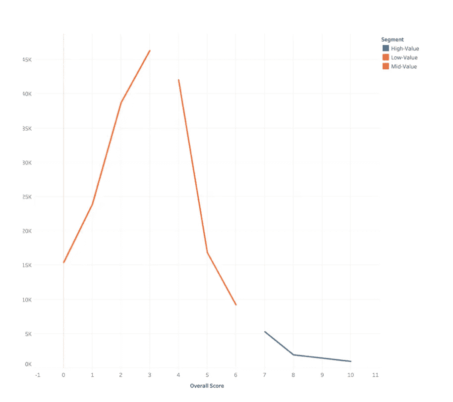
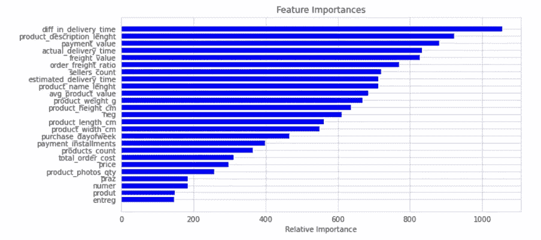

# 利用机器学习和行为心理学开启电子商务增长

> 原文：<https://towardsdatascience.com/unlocking-ecommerce-growth-with-machine-learning-and-behavioural-psychology-b220229c8c00?source=collection_archive---------28----------------------->

## 对 100，000 名在线购物者进行细分和评分预测，以及这对企业意味着什么


[rupixen.com](https://unsplash.com/@rupixen?utm_source=unsplash&utm_medium=referral&utm_content=creditCopyText)在 [Unsplash](https://unsplash.com/s/photos/ecommerce?utm_source=unsplash&utm_medium=referral&utm_content=creditCopyText) 上拍照

# 问题是

营销人员和研究人员长期以来一直使用人口统计学和心理统计学来进行客户细分。不可否认，这些信息对于满足客户需求至关重要。然而，随着 insights 实践的发展，我们现在知道基于购买行为的细分更加有效，因为它[会带来更好的广告支出回报和更高的转化率。](https://www.tuple.tech/learn/customer-segmentation-how-better-targeting-based-on-efficient-segmentation-can-improve-roi)

还有一个心理学基础[解释了为什么行为细分可能会带来更好的洞察力——诺贝尔经济学奖得主丹尼尔·卡内曼发现，购物者倾向于使用“系统 1”思维(快速&直觉)而不是“系统 2”(缓慢&深思熟虑)。](https://www.scientificamerican.com/article/kahneman-excerpt-thinking-fast-and-slow/)

在阅读了[最近频率货币(RFM)分割](https://www.nextlytics.com/blog/machine-learning-in-customer-segmentation-with-rfm-analysis)之后，我想在一个大型数据集上试验这种方法，并探索它能揭示什么样的洞察力。

***简单地说，这是我的发现——***

1.  K-means 聚类有助于根据行为确定购物者细分，从而揭示业务的直接机会。
2.  最高价值客户的评价最差，通常位于[马拉尼昂](https://www.google.com/maps/place/State+of+Maranhão,+Brazil/@-5.6259706,-49.7687155,6z/data=!3m1!4b1!4m5!3m4!1s0x7edd77a9bcc1ce5:0x6276aba3d96c2934!8m2!3d-4.9609498!4d-45.2744159)，在 Q2 购物最多。相比之下，价值最低的顾客会留下最好的评价，他们往往位于圣保罗，在 Q1 购物最多。
3.  我能够以 93%的准确率预测客户群，以 94%的准确率评估得分。

# 数据

Olist 是巴西最大的电子商务网站。它把全国各地的小零售商联系起来，直接卖给顾客。从 2016 年到 2018 年，该公司在其网站上慷慨地分享了一个包含 11 万份订单的大型数据集。

SQL 风格的关系数据库包括站点中的客户及其订单，其中包含大约 10 万个不同的订单和 73 个类别。它还包括与订单相关的商品价格、时间戳、评论和地理位置。这是真实的匿名商业数据。

# 方法论

**RFM 是一种用于分析客户行为的数据建模方法。它代表—**

**最近度**衡量客户最近一次订购到今天的时间(以天为单位)。

**频率**衡量客户的订单总数。

**货币**是他们在这些订单上花费的平均金额。

通过这三个镜头对客户进行细分，我们可以精确定位以特定方式行事的客户群，并创建人物角色，这反过来会带来更好的营销效果。RFM 分析可以帮助企业找出挑战和机遇，关注哪里，做什么。

## 我使用 K-means 聚类(无监督机器学习)来确定 RFM 聚类，然后给每个客户分配一个总体分数——将他们分为高价值、中价值和低价值。

```
#creates a generic user dataframe to keep CustomerID and new segmentation scores
df_user = pd.DataFrame(df['customer_unique_id'])
df_user.columns = ['customer_unique_id']#gets the max purchase date for each customer and create a dataframe with it
df_max_purchase = df.groupby('customer_unique_id').order_purchase_timestamp.max().reset_index()
df_max_purchase.columns = ['customer_unique_id', 'MaxPurchaseDate']#we take our observation point as the max purchase date in our dataset
df_max_purchase['Recency'] = (df_max_purchase['MaxPurchaseDate'].max() - df_max_purchase['MaxPurchaseDate']).dt.days#merge this dataframe to our new user dataframe
df_user = pd.merge(df_user, df_max_purchase[['customer_unique_id','Recency']], on='customer_unique_id')df_user.head()
```


作者图片

为了验证聚类的数量，我使用了 K 均值聚类的“肘方法”。

这种方法估计 K 的最佳值。使用下面的可视化，“肘部”计算失真下降的点，或者换句话说，如果图形看起来像一只手臂，肘部就是前臂开始的地方。


[作者图片]使用肘方法，我们可以确定最近有 5 个理想的集群

在我将同样的方法应用于频率和货币之后，我根据客户的总体聚类分数对他们进行了细分。分数低于 3 分为“低值”，介于 3-6 分为“中值”，高于 6 分为“高值”。

另一种方法是分配权重或进一步分割线段，但我决定在这个分析中保持简单。

```
#assigning value labels to segments
df_user['Segment'] = 'Low-Value'
df_user.loc[df_user['OverallScore']>3,'Segment'] = 'Mid-Value' 
df_user.loc[df_user['OverallScore']>6,'Segment'] = 'High-Value'
```



[图片由作者提供]虽然只有 10%的客户群，但是高价值客户占了营收的 50%！

从机器学习的角度来看，这是一个多类分类问题。价值段的预测模型结果相当准确，随机森林模型的 F1 得分达到 93%。


[图片由作者提供]最终模型:随机森林| F1 评分:93%

# 洞察力

探索这 3 个部分被证明是非常有用的，并且差异是明显的。每个细分市场都有不同的购买模式、地点和主要产品类别。这些信息可以告知营销团队如何为这些客户制定最佳策略。


[作者图片]高价值客户有明确的品类偏好，例如推动 2 月份电脑配件销售


[图片由作者提供]3 个细分市场的宏观人物角色

也许最有趣的区别是 3 个部分如何离开评论。最高价值的客户负责最差的评论，这对公司来说是一个巨大的危险信号。对于任何电子商务生态系统来说，评论对于培养买卖关系至关重要。因此，预测客户评论分数并了解是什么推动了积极的评论是合乎逻辑的下一步。


[图片由作者提供]高价值客户留下的平均评论分数仅为 3.2

这让我掉进了预测顾客评论的兔子洞。评论被二进制化为 0 表示负面(1-3)，1 表示正面(超过 4)。总体分布似乎更偏向积极阶层。


作者图片

在尝试了几个不同的机器学习模型后，我**用 94%的 F1 分数预测了客户满意度**，并找到了**两个决定正面或负面评价的关键因素-**



[图片由作者提供]最终模型:XGBoost | F1 评分:94%

满意度的最大预测因素是实际交付日期和预计交付日期之间的**差异**。从本质上讲，如果订单比预期提前到达，客户会更满意，如果订单比预期晚到达，客户会不高兴。从认知心理学的角度来看，这可以通过[锚定启发式](https://www.verywellmind.com/what-is-the-anchoring-bias-2795029)来解决——例如，Olist 可以为预期的交付时间建立一个缓冲窗口，从而导致更高的机会以比预期更早的交付来取悦购物者。

产品描述的长度是第二大预测因素——这意味着描述越长的产品往往会获得更多正面评价。这意味着管理购物者的期望有助于推动正面评价。我们可以再次利用行为偏差来“推动”购物者的行为——这是应用[框架效应](https://www.sciencedirect.com/topics/psychology/framing-effect)的绝佳机会。例如，Olist 可以与卖家合作，帮助提供更好(更长)的描述，这可能会带来更好的客户评论。

# 警告

虽然这是一个迷人的项目，具有明显的商业含义，但我可以想到一些进一步改进的方法—

1.  数据仅限于样本。10 万订单只是 Olist 实际业务量的一小部分。如果所有的数据都是可用的，那将会更有洞察力(也更费计算)。
2.  人口统计信息(年龄、性别等)的附加层将允许对客户细分进行更深入的分析。

# 最后的想法

如果你想看的话，可以在我的 GitHub 上找到完整的项目(在那里，我还使用寿命库和 beta geo fitter/负二项式分布模型研究了客户流失和客户终身价值，并创建了一个产品推荐引擎)。

我还发表了一个关于[场景故事的宏观观点。](https://public.tableau.com/views/OlisteCommerceinBrazil/Story1?:language=en&:display_count=y&:origin=viz_share_link)