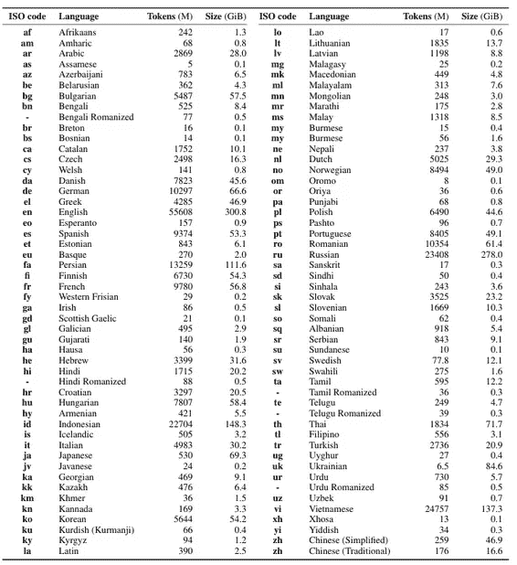
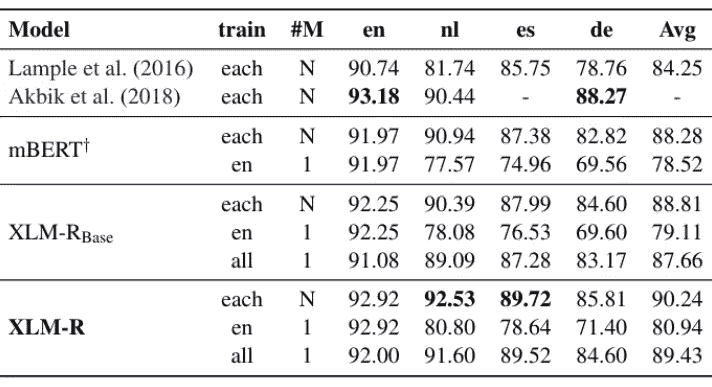

# 用多语言开启包容性的可能性-NER

> 原文：<https://towardsdatascience.com/unlocking-inclusivity-possibilities-with-polyglot-ner-9990baf03561?source=collection_archive---------40----------------------->

## [思想和理论](https://towardsdatascience.com/tagged/thoughts-and-theory)

## 海量多语言命名实体识别基础

通过 [Unsplash](https://unsplash.com/photos/BAZejJdZ57w) 由 Nick Fewings 拍摄的图像

**简介**

近年来，命名实体识别(NER)技术发展迅猛，新的模型不断出现。这是一个激动人心的地方，值得观看，也是其中的一部分。就在最近，我的同事 [Sybren Jansen](/whos-who-and-what-s-what-advances-in-biomedical-named-entity-recognition-bioner-c42a3f63334c) 和 [Stéphan Tulkens](/doing-almost-as-much-with-much-less-a-case-study-in-biomedical-named-entity-recognition-efa4abe18ed) 探索了生物医学命名实体识别(BioNER)的优势和局限性，作为一个例子。

然而，在利用 NER 能力构建值得信赖的人工智能时，仍然存在一个重大挑战:如何适应世界上的多样化语言。绝大多数 NER 模型、训练集、数据、开源代码等等都是英文的。然而，在全球近 80 亿人口中，只有 3.75 亿人的母语是英语。NER 盛行的英语偏见实际上是将世界上相当一部分地区排除在这一重要的技术进步之外。

多语言 NER 模型提供了语言之间的桥梁的可能性。

在这第一篇博文中，我将进一步探讨多语言模型的重要性，并更详细地探讨特定的多语言模型。在后续的文章中，我将更深入地研究测试和结果。

**输入:多语**

据估计，世界上有 7000 种活跃的语言。[1] NLP 专家通常将语言分为所谓的低、中和高资源语言。高资源语言是这样一种语言，其中有许多不同体裁的在线标记和未标记文本，如英语。低资源语言是一种数据非常少的语言；例如，约鲁巴语。中等资源语言介于这两种类型之间。

在 NLP 中，大多数研究是在英语和其他高级资源语言上完成的。因此，从语言技术中获益是不对称的。[2]

有两个常用术语用来描述可用于不同语言的模型:多语言和多语种。在这一领域，专家们也使用“跨语言学习”这个短语，这是将一种语言的知识应用到另一种语言的过程。这种技术用于训练多语言模型，可以用来在资源较少的语言上表现得更好。

**命名实体识别(NER)**

我们将通过 NER 的子任务探索多语言模型。在这项任务中，模型必须检测文本中哪些标记引用了命名实体(NE)。NE 的定义因域而异，但 NE 最简单的定义是一个令牌或一组令牌，它指的是现实世界中的特定事物。然而，这并不完全准确，因为“哈利·波特”这个角色也是一个 NE，但在现实世界中并不存在。

没有必要对 NE 有严格的定义，因为哪个令牌属于 NE 将因域和数据集而异。例如，在医学领域中，像肺炎这样的特定情况可以被认为是 NE，但是在商业领域中，它不会被认为是 NE。

当处理多种语言时，NER 任务变得更加困难，因为不同的语言对于如何指示 NE 有不同的约定。例如，在英语中，句子中间以大写字母开头的单词很可能是 NE。在德语中，这不太可靠，因为所有名词都以大写字母开头，但不是每个名词都是 NE。此外，有许多语言不使用拉丁字母，也不区分大写字母和小写字母。语言中表示 NE 的这些不同约定对于多语言领域来说是额外的挑战。

**应用 NER:匿名化**

能够识别 100 种不同语言的命名实体不同于用 100 种不同语言进行对话。然而，这仍然是一项有用且令人印象深刻的技能。匿名化领域可以通过使用 NER 模型获得显著的价值。随着开放数据趋势的增加[3]，匿名化扮演了一个关键角色，因为文档在发布前通常需要匿名化。此外，公众对透明政府的要求越来越高，政府官员提出了对隐私的关切。透明度和隐私之间的权衡是一个合理的考虑。通过 NER 的匿名化，可以帮助消除交易的负面影响。

还有几个其他的用例可以从 NER 文档匿名化中受益。欧盟(EU)对法院和医疗文件的匿名化表示了兴趣，并资助了 [MAPA 项目](https://mapa-project.eu/) [4]。该项目旨在创建一个工具，对欧盟所有 24 种官方语言的医学和法律文本进行匿名化处理。这个项目仍处于开发阶段。

**当前可用的型号**

今天有几种型号可供使用。首先，已在 LENER-BR 数据集上训练了由 [Luz 等人[5]](https://cic.unb.br/~teodecampos/LeNER-Br/luz_etal_propor2018.pdf) 建立的单语巴西葡萄牙语模型。这个数据集是为了训练这个模型而专门开发的。LENER 代表合法命名实体认可，BR 表示该名称在巴西葡萄牙语中。LENER-BR 数据集由 66 份法律文件组成，这些文件是用特定法律实体手动注释的。这些实体不同于标准命名实体，如个人、组织和位置。虽然这些类型的实体也包括在内，但数据集包括对特定法律实体和判例的注释，总共有 6 个类别。基于这些数据训练的模型是基于 LSTM 的 CRF，并使用单词嵌入作为输入。在他们的论文中，他们报告了 6 个班级的平均 92.5 分。

此外，还提供了一种由[connaau 等人](https://arxiv.org/pdf/1911.02116.pdf)命名为 XLM-R 的多语种模型供使用。[6] XLM-R 是基于 Transformer [7]的模型，是 XLM [ 8]和罗伯塔[9]的组合。XLM-R 使用掩蔽语言建模方法接受了 100 种语言的培训。下图显示了所包含的语言和每种语言的数据量。

表 1:XLM-R 模型训练数据，取自原论文[6]

XLM-R 模型已经在四个任务上进行了评估，其中之一是 NER。虽然 XLM-R 模型是在 100 种语言上训练出来的，但原始的论文只报告了四种语言的 NER 分数:英语、荷兰语、德语和西班牙语。这些结果已在 2003 年 CONLL NER 数据集上报告。[10]这令人失望，因为在其他任务中，该模型表现良好，即使在资源较少的语言中也是如此。看到 NER 在更多语言上的表现会很有趣。

表 2:XLM-R 在 NER 的性能与其他模型的比较取自原 XLM-R 论文[9]

在上表中，我们看到了原始 XLM-R 文件中关于 NER 的结果报告。多语 BERT (M-BERT) [11]是最成熟的多语种模型之一。M-BERT 用于比较 XLM-R 在原始论文中的表现。前两个模型被用作基线，都是单语模型。对于这四种语言，我们可以看到 XLM-R 模型在所有语言上都优于 M-BERT，在 4 种语言中的 2 种语言上优于单语基线。

幸运的是，我们可以超越这四种语言，因为 Plu [12]采用了 XLM-R，并在 40 种语言上进行微调，并在所有语言上进行 NER 实验。它可用于拥抱脸。[12]该模型在 PAN-X 数据集[13]上进行了微调，该数据集也称为 Wiki-Ann 数据集，它利用了维基百科的数据。在维基百科上，有超过 295 种不同语言的文章。手工标记所有这些页面将是一项非常耗费资源的任务。手工标签被认为是黄金标准。潘等人[13]通过利用维基百科页面标记，使用维基百科页面创建了所谓的银标准命名实体语料库，命名实体通常链接到其他页面。根据语言的不同，性能会有很大的差异，但总体而言，该模型表现良好:对于许多语言，F 值接近 0.9。令人印象深刻的是，这 40 种语言来自非常不同的语系。

**让 XLM-R 更进一步的实验**

我们已经看到了来自 XLM-R 的令人兴奋的结果。但是有两种方法可以将这种模式进一步发展，以获得更大的收益来执行 NER:

1.  领域变更:XLM-R 模型只在三个 NE 类上训练:人员、组织、位置。虽然 XLM-R 已经表明自己能够处理不同的语言，但我们还不知道它是否能够处理不同的领域。当我们在没有任何额外改变的情况下切换域时，看看结果会是什么将会是有趣的。这可能是因为该模型非常强大，可以开箱即用地跨领域应用。这将使它非常容易接近。
2.  匿名化:在这篇文章的开始，我们介绍了匿名化任务及其重要性。好消息是，我们可以通过将任务转换为二元任务，将 3 类模型应用于 6 类数据集。也就是预测某个东西是不是 NE。

如果您想匿名化一个文档，您想编校文档中的每一个 NE。然而，在某些情况下，控制哪种类型的实体需要匿名，哪种类型的实体需要保留并进行实验可能是好的；对于被认为是 NE 的一部分的令牌，预测 1，对于不是 NE 的一部分的令牌，预测 0。通过这种方式，我们可以将 XLM-R 模型应用于这个数据集。

在这样的实验中，有两件事需要测试:二值化的效果和 XLM-R 模型是否也可以在跨域设置中工作。为了将单语模型与二进制化的 XLM-R 进行比较，单语模型也应该以二进制方式进行转换。

**总结和下一步行动**

我们现在已经奠定了多语言 NER 的基础，作为构建更具包容性的自然语言处理的关键技术。在下一篇博文中，我们将看到二进制域转换实验的结果。你认为结果会是什么？你还希望看到什么样的实验？我很想收到你的来信！

如果你想了解更多关于更苗条的人工智能和我们人工智能创新团队的最新研究，请看:【https://medium.com/slimmerai/innovation/home】T2。

**参考文献**

[1]世界上有多少种语言？(2021 年 2 月 23 日)。从 https://www.ethnologue.com/guides/how-many-languages[取回](https://www.ethnologue.com/guides/how-many-languages)

[2]p . Joshi，s . Santy，a . Budhiraja，k . Bali 和 m . Choudhury(2020 年)。NLP 世界中语言多样性和包容性的状态和命运。arXiv，2004.09095。从 https://arxiv.org/abs/2004.09095v3[取回](https://arxiv.org/abs/2004.09095v3)

[3]欧洲联盟出版物处。，凯捷发明。，&欧洲数据门户。(2020).开放数据和隐私。出版办公室。[https://doi.org/10.2830/532195](https://doi.org/10.2830/532195)

[4]Mapa——公共管理的多语种匿名化。(2021 年 6 月 03 日)。检索自[https://mapa-project . eu](https://mapa-project.eu/)

[5] Luz de Araujo，P. H .，de Campos，T. E .，de Oliveira，R. R. R .，Stauffer，m .，Couto，s .，& Bermejo，P. (2018 年)。LeNER-Br:巴西法律文本中命名实体识别的数据集。葡萄牙语的计算处理。斯普林格。doi:10.1007/978–3–319–99722–3 _ 32

[6] Conneau，a .，Khandelwal，k .，Goyal，n .，Chaudhary，v .，Wenzek，g .，Guzmán，f .，…Stoyanov，V. (2019)。大规模无监督跨语言表征学习。arXiv，1911.02116。从 https://arxiv.org/abs/1911.02116v2[取回](https://arxiv.org/abs/1911.02116v2)

[7] Vaswani，a .，Shazeer，n .，Parmar，n .，Uszkoreit，j .，Jones，l .，Gomez，A. N .，…Polosukhin，I. (2017)。你需要的只是关注。arXiv，1706.03762。从 https://arxiv.org/abs/1706.03762v5[取回](https://arxiv.org/abs/1706.03762v5)

[8]兰普尔，g .，&康瑙，A. (2019 年)。跨语言语言模型预训练。arXiv，1901.07291。从 https://arxiv.org/abs/1901.07291v1[取回](https://arxiv.org/abs/1901.07291v1)

[9]刘，y .，奥特，m .，戈亚尔，n .，杜，j .，乔希，m .，陈，d，…斯托扬诺夫，V. (2019)。RoBERTa:稳健优化的 BERT 预训练方法。arXiv，1907.11692。从 https://arxiv.org/abs/1907.11692v1 取回

[10]桑，E. T. K .，& De Meulder，F. (2003 年)。CoNLL-2003 共享任务简介:独立于语言的命名实体识别。ACL 选集，142–147。从[https://www.aclweb.org/anthology/W03-0419](https://www.aclweb.org/anthology/W03-0419)取回

[11] Devlin，j .，Chang，m-w .，Lee，k .，& Toutanova，K. (2018 年)。BERT:用于语言理解的深度双向转换器的预训练。arXiv，1810.04805。从 https://arxiv.org/abs/1810.04805v2[取回](https://arxiv.org/abs/1810.04805v2)

[12]jplu/TF-xlm-r-ner-40-郎抱脸。(2021 年 6 月 22 日)。从 https://huggingface.co/jplu/tf-xlm-r-ner-40-lang[取回](https://huggingface.co/jplu/tf-xlm-r-ner-40-lang)

[13]潘，x .，张，b .，梅，j .，诺斯曼，j .，奈特，k .，&纪，H. (2017)。282 种语言的跨语言姓名标记和链接。ACL 选集，1946-1958。doi:10.18653/v1/P17–117