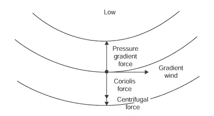
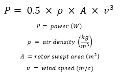
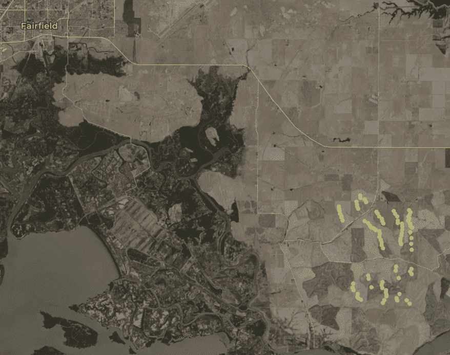
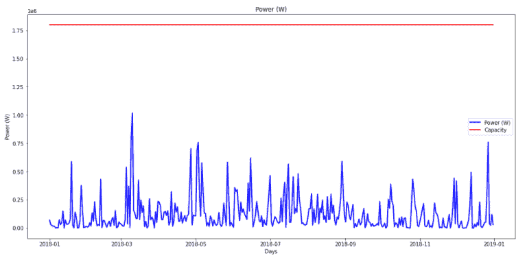
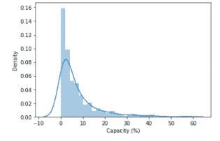
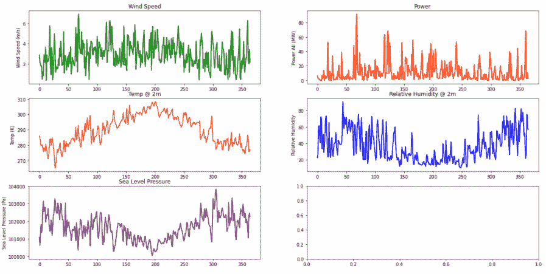

# 用数据释放风能的潜力

> 原文：<https://towardsdatascience.com/unlocking-the-potential-of-wind-energy-with-data-9b6c5eedb5a9?source=collection_archive---------51----------------------->

## 调查加利福尼亚风能的案例研究

由[蒂姆·福斯特](https://unsplash.com/@timberfoster?utm_source=unsplash&utm_medium=referral&utm_content=creditCopyText)在 [Unsplash](https://unsplash.com/s/photos/wind-farm?utm_source=unsplash&utm_medium=referral&utm_content=creditCopyText) 上拍摄的原始照片

全球变暖严重威胁着子孙后代的福祉以及他们与这个星球互动的能力。虽然有许多行业需要改变协议来帮助应对气候变化，但其中最关键的是能源部门。电力让我们开发出令人难以置信的技术，并将我们与全球联系起来。然而，它也是温室气体排放的主要来源。

> “根据美国环保署 2018 年进行的一项研究，电力生产产生了美国温室气体总量的 26.9%。”[1]

可再生能源在减少这一数字方面有很大作用。

可再生能源有很多种，其中一种是风力。风力是通过使用大型涡轮机来利用风的动能而产生的。风力使连接在发电机上的大型涡轮机旋转并发电。这些涡轮机可能非常大，高达 80 多米。一般来说，这些涡轮机建在风力发电场中，这些风力发电场包含大量相互靠近的涡轮机。

在本帖中，我们将关注北加州大风项目的风力发电，该项目是我在斯坦福大学天气和风暴课程项目的一部分。这篇文章的目的是给出相关数据的一般概念，以及如何用它来估算风力。我还想展示一些数据的大致数量，比如一个典型风力发电厂的发电量。让我们了解一下加州风力发电的现状:

> 2018 年，加州风能项目发电量为 15，078 千兆瓦时，占总发电量的 7.2%。[2]

W帽子是风？你知道实际上有不同类型的风吗？在课堂上，我们学习了四种主要类型:地转、梯度、沿直线等压线的表面和沿曲线等压线的表面。每种风的驱动力组合都不同。例如，沿圆形等压线作用的地面风有科里奥利力、压力梯度、摩擦力和视在离心力的作用。

沿圆形安索帕[3]的地面风力

一个地区的地形对该地区产生的风力也有影响。在北加州，特别是旧金山湾区，地形多山，靠近海边。在海边，当陆地在白天变暖时，你可以感受到陆风，风从陆地吹向海洋。相反，在晚上，当陆地更冷时，你可以得到海湾微风，风从海湾吹到陆地上。压力和温度对大气中的风的形成起着很大的作用。

T **这里的**是两种主要类型的风力发电机:垂直轴和水平轴。垂直轴风力涡轮机的轴垂直于气流，而水平轴风力涡轮机的轴平行于气流。一般来说，生产中的大多数风力涡轮机是水平轴的。

仔细观察水平轴涡轮机发电的机械结构，这些结构通过大型螺旋桨状叶片利用风能。通常有三个钢制叶片安装在一个大的塔上。叶片安装在高处，以利用更高海拔处更快的风速。吹过涡轮机的风在叶片的一侧产生低压，从而产生使叶片旋转的升力。由于螺旋桨叶片的惯性质量较大，轴的转速通常为 5-20 转/分。为了产生交流电，螺旋桨叶片的轴连接到齿轮箱，齿轮箱将转速提高到 1800 rpm。

由 El-Ahmar 等人进行的一项研究。al (2017)调查了风力发电的最关键因素，并设计了以下列表:风速、空气密度、转子扫掠面积和塔架高度[4]。这些部件中的每一个都对功率输出产生不同的影响。如你所料，发电量与风速直接相关(即风速越大，发电量越大)。事实上，下面的等式通常用于测量涡轮机的潜在功率输出。我们将利用这一进展来计算功率。

D 如前所述，High Winds 项目选自 USGS 风力涡轮机数据库进行分析，并收集了 2018 年的数据，时间范围为 2018 年 1 月 1 日至 2018 年 12 月 31 日[5]。该项目始于 2003 年，位于费尔菲尔德市东南的海湾东北部。该项目包含总共 90 台额定功率为 1.8 兆瓦的 Vestas V80–1.8 涡轮机，总容量为 162 兆瓦。每台涡轮机高 60 米，转子直径 80 米。下图突出显示了 90 台涡轮机的位置。

加州北部的大风项目[5]

除了单个涡轮机信息之外，还从加州能源委员会收集了功率输出汇总信息[6]。

气候信息是从美国国家海洋和大气管理局(NOAA)的全球预报系统(GFS)大气模型中收集的。地球观测卫星系统覆盖全球，分辨率为 28 公里。在此分析中，考虑了以下变量:时间、地表温度(K)、2m 处的温度(K)、向东风速(m/s)、向北风速(m/s)、2m 处的相对湿度(%)和海平面气压(Pa)。再次收集 2018 年的数据，中心坐标约为(38，-122)。

我找到了什么？根据这一分析，该农场将在 2018 年开工不足。该分析中有一些假设，例如使用简化的风力模型，这可以解释比风力涡轮机通常发现的运行能力略低的原因。在基于风速的预期输出和总容量之间进行了比较。输出和容量用于单台涡轮机。在下图中，红线代表容量，蓝线代表当天风速下的功率输出。从图中可以看出，大多数日子都远远低于容量。

相对于容量的涡轮机输出

创建实际容量百分比分布有助于正确看待之前的数字。从下图可以清楚地看到，2018 年的涡轮机在远低于容量的情况下运行。大部分日子都在 10%或以下。

容量百分比分布图

除了运行容量，还计算了风向趋势。下图总结了 2018 年的风向。360 度罗盘被分成 45 度的相等部分，并且在该范围内的任何数据点被分配相应的罗盘方向。从结果中我们可以看出，风主要来自北/东方向。一个可能的解释是地形，这解释了暗黑风现象。在海湾的东北部，山脉之间有一个缺口，这可以让山风发展并吹向旧金山。

2018 年风向直方图

除了风向之外，速度(绿色)、温度(黄色)、压力(紫色)、相对湿度(蓝色)和功率(红色)都标在了一起。下图显示了 2018 年全年绘制的这些变量。

2018 年气候变量时间序列

要全面了解这种方法，请查看本文底部 github 上的最终报告和 jupyter 笔记本

R可再生能源每年都在增长，如果我们要达到抑制全球变暖的排放目标，就需要继续增长。风能已经并将继续成为解决方案的重要组成部分。

我希望这能让我们更好地了解预测风力发电场发电量的复杂性。虽然这种分析的简单性有些随意，但它显示了使用天气变量预测风能产量可以获得多少洞察力。

为了获得更好的结果，可以使用更复杂的风模型来获得每个涡轮机位置的速度和方向。可以在更长的时间内收集数据，以更好地了解历史趋势并预测产量何时会高或低。随着机器学习的进步，预测这些变量变得更加精确，这可以在需求规划中发挥作用。

Github 完整报告和代码:

 [## 风能/风能可用于能源生产

### 斯坦福大学最后项目北加州可用于能源生产的风力分析…

github.com](https://github.com/jackseagrist/Wind_Available_for_Energy_Production) 

参考资料:

[1]—[https://www . EPA . gov/GHG emissions/sources-green house-gas-emissions #:~:text = Electricity %20 production % 20(26.9% 20 percent % 20)of，主要是% 20 煤炭% 20 和% 20 天然气% 20。](https://www.epa.gov/ghgemissions/sources-greenhouse-gas-emissions#:~:text=Electricity%20production%20(26.9%20percent%20of,mostly%20coal%20and%20natural%20gas.)

[2] —加州能源委员会，能源年鉴，全系统发电(2018)。(见[https://www . energy . ca . gov/data-reports/energy-almanac/California-electricity-data/2018-total-system-electric-generation。)](https://www.energy.ca.gov/data-reports/energy-almanac/california-electricity-data/2018-total-system-electric-generation.))

[3] —丹尼尔·a·瓦列罗，5 —大气物理学，编者:丹尼尔·a·瓦列罗，《空气污染基础》(第四版)，学术出版社，2008 年，第 123–153 页，ISBN 9780123736154，【https://doi.org/10.1016/B978-012373615-4/50006-6】T4。([http://www . science direct . com/science/article/pii/b 9780123736154500066](http://www.sciencedirect.com/science/article/pii/B9780123736154500066))

[4] — M. H. El-Ahmar，A. M. El-Sayed 和 A. M. Hemeida，“影响风力发电机组输出功率的因素评估”， *2017 年第十九届国际中东电力系统会议(MEPCON)* ，开罗，2017 年，第 1471–1476 页，doi:10.11109/MEPCON . 2013105

[5]—[https://eerscmap.usgs.gov/uswtdb/](https://eerscmap.usgs.gov/uswtdb/)

[6]—[https://WW2 . energy . ca . gov/almanac/renewables _ data/wind/index _ CMS . PHP](https://ww2.energy.ca.gov/almanac/renewables_data/wind/index_cms.php)