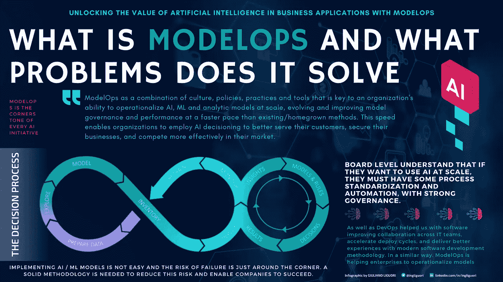

# 利用 ModelOps 释放人工智能在商业应用中的价值

> 原文：<https://towardsdatascience.com/unlocking-the-value-of-artificial-intelligence-in-business-applications-with-modelops-92379965f87c?source=collection_archive---------26----------------------->

图片来自 Canva

## 人工智能正迅速成为商业和 IT 应用和运营的关键。

多年来，各组织一直在投资人工智能能力以保持竞争力，正在雇用最好的数据科学家团队，并在人工智能和机器学习系统上投入了越来越多的资金。然而，实现 AI / ML 模型并不容易，失败的风险就在眼前。需要一种可靠的方法来降低这种风险并使公司取得成功。

## 什么是 ModelOps，它能解决什么问题

人工智能高管多年来一直致力于在商业中获得更多模型。第一个障碍是雇佣数据科学家和快速创建模型的工具。那个问题已经解决了。下一个障碍是及时、合规地将这些模型投入生产。公司积压了大量闲置和退化的模型，对业务没有任何价值/收入贡献。我们称之为模型债务。或者他们正在努力将他们的第一个人工智能模型投入生产，并发现它比他们预期的要复杂得多，花费的时间也长得多。最重要的是，他们意识到模型，尤其是 ML 模型本质上给整个组织带来了很多风险。董事会明白，如果他们想大规模使用人工智能，他们必须有一些流程标准化和自动化，以及强有力的治理。

作者精心制作的信息图

来自运营部门，并参与了许多数字化转型项目，难怪 ModelOps 是每个人工智能项目的基石。在实验室和生产中，团队之间的思维模式/需求/协作有着巨大的差异。这在企业世界中并不是第一次:软件也发生过类似的事情:软件开发人员的代码不能及时有效地投入生产。DevOps 通过软件帮助我们改善了跨 IT 团队的协作，加快了部署周期，并通过现代软件开发方法提供了更好的体验。以类似的方式，ModelOps 正在帮助企业运营模型(人工智能、机器学习、传统模型)。由于模型会随着时间的推移而漂移，并在企业间带来巨大的董事会级风险，这就更加复杂了。数据科学家使用多种工具和语言构建模型，然后在大多数情况下，模型永远不会在生产中出现，或者即使出现也需要很长时间——有时太多，模型在那个时候就不再有用了。如果将模型投入生产，通常模型在没有适当的监控、控制和整体治理的情况下运行，因此它们并不总是能够发挥应有的作用，并且可能会使整个公司面临多种风险:法规遵从性、声誉等。…这是企业级的风险。

> 也就是说，我们可以将 ModelOps 定义为文化、政策、实践和工具的组合，这是组织大规模运营 AI、ML 和分析模型的能力的关键，以比现有/自主开发的方法更快的速度发展和改善模型治理和性能。这种速度使组织能够采用人工智能决策来更好地服务他们的客户，保护他们的业务，并在他们的市场上更有效地竞争。

## 影子人工智能:未来几年组织将不得不应对的关键问题

在早期阶段经常被低估的一个重要方面是，ModelOp 和 MLOps 是截然不同的，彼此是分开的。MLOps 面向数据科学家，而 ModelOps 主要面向首席信息官。事实上，生产中的模型必须 24x7 全天候监控和治理，法规即将出台，而且不仅限于金融服务行业。这是应该由首席信息官组织处理的事情。风险是出现另一种情况，就像我们在影子 IT 中遇到的情况一样——我们可以称之为影子 AI:每个 BU 都在没有标准化的情况下将模型投入生产，我们有一个模型的狂野西部。即使是简单的问题:“有多少生产中的模型？”变得很难回答，更不用说了解生产中每个模型的状态和状况，更不用说与法规遵从性和风险管理相关的问题了。

如果我们想到影子 IT，它不一定是坏的，因为它刺激了创新。当然，首席信息官组织必须控制它，而不是真正消除它。我们已经看到了很多问题，我在最近的[文章](/scale-and-govern-ai-initiatives-with-modelops-afdc33ce1171)中提到了这个问题，即组织仍然将模型视为业务部门级别的一些资产，即使在生产中也属于业务部门和数据科学家，而不是像 it 组织管理的许多其他共享服务一样，作为应该集中管理的企业资产。这是一个需要的重大思维转变。起点是理解 ModelOps 必然与数据科学分离开来。实验室和生产应该像教会和国家。不应要求数据科学家兼任运营资源，因为他们既没有带宽，也没有技能，也没有兴趣管理确保正常运营的 24x7 复杂模型生命周期。

首席信息官应在首席风险官的帮助下加快步伐，实施模型操作。

## 没有合适的模型操作能力的公司面临的潜在风险

在最近的一份报告中，Forrester 宣称“**如果没有 ModelOps** ，你的人工智能转型注定要失败”。ModelOps 当然是企业部署、监控和治理 AI/ML 模型所需的核心能力。不决定采用 ModelOps 的公司可能很难跟上竞争，当然也不会超越或领先。

良好的治理绝对需要严格的政策、实践和工具来实施控制，并跟踪可审计性、风险管理和法规遵从性的步骤和变化。做不好模型操作的风险是不可靠的业务决策(影响收入)、监管和合规处罚以及导致巨额财务和品牌成本的潜在违规。

这不仅适用于金融服务等高度监管的行业。根据《福布斯》上 Stu Bailey 的文章,*人工智能正被用于在广泛的业务和行业中实现自动化决策，新的或许不太明显的漏洞正在出现。考虑这些场景:*

*   *一家使用人工智能驱动产品设计决策的制造商发现，一个机器学习模型出现了错误，导致了严重的客户安全问题。为了抵御责任，该公司被要求证明其人工智能模型得到了适当的开发和维护。*
*   *一家大型零售商的人力资源部门使用第三方软件工具来评估员工，并做出薪酬和职业发展决策。该工具整合了一些功能，允许公民数据科学家(在这种情况下，是一名没有数据科学或风险管理背景的人力资源经理)创建和部署人工智能模型，以评估员工并确定工资、奖金和晋升。该模型的部署和运行没有任何风险管理或合规团队的参与。一名没有获得晋升的员工声称，人工智能模型存在偏见，就不公平的劳动做法提起诉讼，并要求公司证明该模型是公平的”。*

此外，贝利认为，“随着人工智能越来越广泛和常规化，这些只是任何类型的公司都可能很快面临的一些现实挑战。据 Gartner 预测， [*到 2024 年，50%的 AI 用例*](https://www.gartner.com/account/signin?method=initialize&TARGET=http%253A%252F%252Fwww.gartner.com%252Fdocument%252F3995616) *将接受风险评估，到 2022 年，15%的应用领导者将面临 AI 故障的董事会级调查。显然，是时候关注 AI 合规性了”。*

## 组织应该如何开始做模型操作

对分析和数据科学团队:尽早让您的 IT 部门和风险部门参与进来，因为他们会帮您解决运营方面的问题，这将节省成本，并避免整个公司面临不必要的风险。

利用 ModelOps 平台自动化和标准化生产模型的模型生命周期设计流程。他们中的大多数都有乐高积木，可以缩短生产时间，例如开箱即用的工作流程、控制、监控和补救预设计流程。

[滑块](https://unsplash.com/@slidebean?utm_source=medium&utm_medium=referral)在 [Unsplash](https://unsplash.com?utm_source=medium&utm_medium=referral) 上拍照

选择 ModelOps 平台的另一个重要方面是尊重数据科学家和业务用户的需求:ds 平均使用 3 种模型创建工具/语言，这个数字只会增加，工具会不断地分阶段使用和淘汰。模型在内部、云中运行，并为多个分散的应用程序提供服务。这种“多对多”的情况需要一个不可知的 ModelOps 平台。

## 最后的想法

模型操作是大规模操作人工智能的必备能力。它包括工具、技术和实践，使组织能够在生产应用程序中部署、监控和治理 AI/ML 模型和其他分析模型。模型运算不仅仅是移动比特。部署模型并不仅仅是提供基础设施和复制代码。机器学习模型是独一无二的，因为它们必须在生产过程中不断受到监控，并定期进行再培训，这需要从数据科学家到运营专家等众多利益相关者的协作。

组织应该开始理解为什么模型操作是重要的，他们需要的能力，以及如何开发或获得它们。

**关注我的每日技术和创新更新**

[https://bit.ly/m/ingliguori](https://bit.ly/m/ingliguori)

## 参考

ModelOp，“2021 年 ModelOps 状态”报告。2021 年 4 月 15 日

[Gartner，“ModelOps 创新洞察”，Farhan Choudhary、Shubhangi Vashisth、Arun Chandrasekaran、Eric Brethenoux，2020 年 8 月 6 日](https://www.gartner.com/account/signin?method=initialize&TARGET=http%253A%252F%252Fwww.gartner.com%252Fdocument%252F3988487)

[Forrester，“引入人工智能的模型运算”，Kjell Carlsson 博士和 Mike Gualtieri，2020 年 8 月 13 日。](https://www.forrester.com/report/Introducing-ModelOps-To-Operationalize-AI/RES160698)

人工智能信任、风险和安全管理市场指南。2021 年 9 月，阿维瓦·谭力，法尔汉·乔杜里，杰瑞米·德霍因

[风险管理:AIceberg 的秘诀](https://www.forbes.com/sites/forbestechcouncil/2021/03/11/risk-management-the-tip-of-the-ai-ceberg/?sh=1a2a4d914b34)