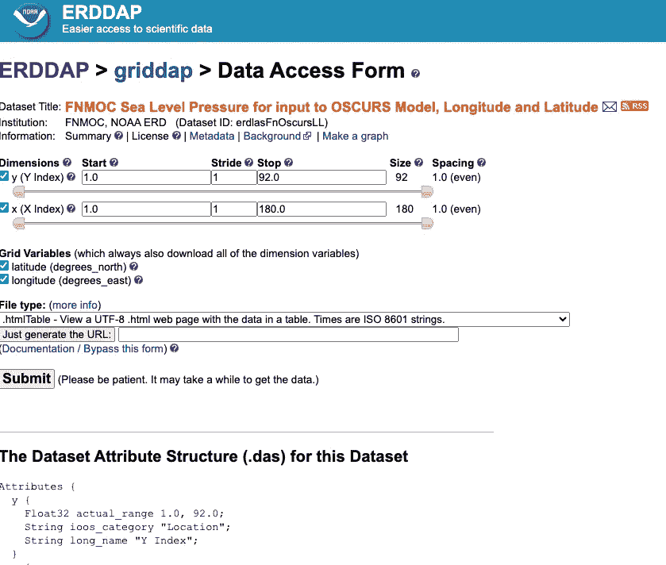
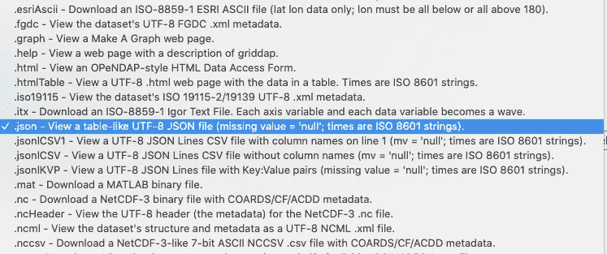
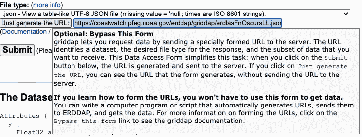

# 用 Spray 将 ERDDAP 数据解组到 Akka/Scala 中

> 原文：<https://towardsdatascience.com/unmarshalling-erddap-data-into-akka-scala-with-spray-bd094bc81a5b?source=collection_archive---------34----------------------->

## [实践教程](https://towardsdatascience.com/tagged/hands-on-tutorials)

## 科学数据唾手可得。有一种方法可以将它吸收到你的 Akka/Scala 项目中。

[ERDDAP](https://coastwatch.pfeg.noaa.gov/erddap/index.html) 是 NOAA 开发的工具，以可扩展的格式提供科学数据集，供公众广泛使用。如果您以前曾经处理过科学数据，您就会知道处理这些数据极具挑战性，因为这些数据格式是为非常特定的科学用途而构建的，具有复杂的要求，例如在多维数组中工作，并且通常是使用 Fortran 之类的计算机编程语言构建的，这些语言在科学世界之外很少使用。由于像美国宇航局或欧洲核子研究中心这样的长期组织不太可能在一夜之间改变他们的做法，所以 ERDDAP 是对公众的一种令人惊叹的服务，即使它在美学方面有一点缺乏。它吸收各种常见科学数据格式的数据，并以各种有用的格式提供易于访问的 API，以便于使用。许多组织使用 ERDDAP 来处理和分发他们的数据，以实现开放访问(和其他)的目的。

基于 ERDDAP 的数据服务中的大多数链接都指向 ERDDAP 表单，这本身就有点吓人。



ERDAP 表单——有点难看，但是考虑到您可以从 ERDAP 服务器提取的数据量，这种难看是可以原谅的。

默认的提交屏幕将为您提供一个 html 表格。我认为您可以尝试解析它，但是使用原始的 JSON 数据更有意义。您还可以使用许多其他格式，包括 MATLAB 二进制文件和 netcdfs。要访问 json 数据，只需更改文件类型。



获取一些好的旧 json 数据！

我们现在将使用普通的 JSON，但是我们也将查看。jsonlKVP(键值对流)。如果运行 submit，ERDDAP 会将 json 下载到您的计算机上——但是如果您想从服务器或以编程方式访问数据呢？为此，您可以使用“只生成 URL”服务。或者，您可以学习[erd DAP 如何生成 URL 并完全跳过表单过程。](https://coastwatch.pfeg.noaa.gov/erddap/rest.html#requests)



也许根本没有必要使用这个表单。

为了这项工作，我决定从加拿大渔业和海洋部收集数据——这是一个位于加拿大新斯科舍省普尔湾的水温和压力计。的。json 输出如下所示:

```
{
"table": {
  "columnNames": ["station_name", "time", "water_pressure", "water_temperature", "battery_voltage", "latitude", "longitude"],
  "columnTypes": ["String", "String", "float", "float", "float", "double", "double"],
  "columnUnits": [null, "UTC", "mbar", "degree_C", "V", "degrees_north", "degrees_east"],
  "rows": [
    ["POOLC_20200929", "2020-09-29T15:18:51Z", null, null, 0, 47.679933, -55.43001667],
    ["POOLC_20200929", "2020-09-29T15:18:51Z", null, null, 0, 47.679933, -55.43001667],
    ["POOLC_20200929", "2020-09-29T15:18:51Z", null, null, 0, 47.679933, -55.43001667], [...] ["POOLC_20200929", "2020-09-29T16:08:51Z", 83.5167, 14.4, 12.73, 47.679933, -55.42001667] [...]
}
```

如果你了解 Scala，你可能已经心脏病发作了。你看，与更流行的 Python 不同，Scala 非常关心进出程序的数据类型。作为一种强类型语言，它希望确切地知道正在使用什么数据类型。作为一种面向对象的语言，它希望使用类将数据放入对象中。最后，作为一种相当新的基于 Java 的语言，它会希望尽可能避免空值。

好消息是 [Spray](https://github.com/spray/spray-json) 被设计成将所有这些数据类型放入漂亮、干净的类 java 对象中。Spray 的另一个优点是它得到了 [Akka 框架](https://akka.io/)的支持。虽然我不会在这里过多地讨论 Akka 的内部工作方式，但主要的要点是，使用 Akka，您可以构建并发操作的流管道，而不会阻塞分布式系统。因此，如果你想获得所有这些可爱的 ERDDAP 数据，并通过一个巨大的消防水管快速可靠地发射出去，Akka 是一个很好的工作方式。Akka 也有一个名为 [Alpakka](https://doc.akka.io/docs/alpakka/current/index.html) 的姐妹库，它将允许你将这些流与其他服务挂钩，例如与 [Apache Kafka](https://kafka.apache.org/) 或 [Amazon Kinesis 流](https://aws.amazon.com/kinesis/)挂钩，与 [Cassandra](https://cassandra.apache.org/) 或 [MongoDB](https://www.mongodb.com/) 挂钩，通过像 [Lambda](https://aws.amazon.com/lambda/) 这样的无服务器应用程序，与像 [Parquet](https://databricks.com/glossary/what-is-parquet) 这样最新最棒的大数据格式挂钩(这是额尔达普人可能会做的事情)

但是足够证明 Akka，让我们进入编码的过程。我们首先需要一个对象来存储我们所有的类。这需要一些导入。

```
import akka.http.scaladsl.marshallers.sprayjson.SprayJsonSupport
import spray.json._
import DefaultJsonProtocol._
```

第一次导入允许我们在 Akka 代码中使用 Spray。二是喷 json 库本身。最后，spray 中的 *DefaultJsonProtocol* 库包含了 Json 中可以出现的所有基本数据类型如字符串、数组、对象、整型、浮点型等等。

接下来，我们构建对象并创建一些 case 类来存储数据。

```
object erddapConstants extends SprayJsonSupport {

  //(implicit val will go here eventually)
  final case class Root(table: Table) // the root class
  final case class Table(
    columnNames: List[String],
    columnTypes: List[String],
    columnUnits: List[Option[String]],
    rows: ???) abstract class ErddapDataFormat {} final case class **P**oolCoveSensorRow(
    station_name: String,
    time: String,
    water_pressure: Option[Float],
    water_temperature: Option[Float],
    battery_voltage: Float,
    latitude: Double,
    longitude: Double) extendsErddapDataFormat}
```

该对象扩展了“SprayJsonSupport ”,以确保我们可以将所有可爱的 json 工具翻译成基于 Akka 的命令。我们有一个承载所有数据的根类，然后有一个对应于其余可用数据的表类。幸运的是，我们不必创建对象来处理列表特性，因为 Spray 的 DefaultJsonProtocol 已经为我们做了这些。我们还通过要求 Spray 在遇到空数据时创建一个`Option[T]`来解决我们的`null`问题。再一次，`DefaultJsonProtocol`为我们做了繁重的工作。最后，有一个 PoolCoveSensorRow case 类来处理行数据本身。

然而，我们在弄清楚如何管理这些行时遇到了一个大问题。Spray 不支持构建一个值为`Any`类型的`List`。此外，spray 将无法将列表直接封送到 PoolCoveSensorRow 类中，因为没有可供 Spray 用来将行值与 case 类匹配的键值对。我们将在后面讨论这个问题。

首先，我们必须看看 spray 如何自动获取 json，并根据我们的需要将其放入我们的 case 类中。答案是通过包含隐式值来处理数据。同样，Spray 为我们提供了一些 jsonFormat 函数，帮助我们将 json 与 case 类相互转换。我们只需要知道我们的 case 类有多少个参数。

```
implicit val poolcSensorRowJsonFormat: JsonFormat[**P**oolCoveSensorRow] = jsonFormat7(PoolCoveSensorRow)
implicit val rootFormat: RootJsonFormat[Root] = jsonFormat1(Root)
implicit val tableFormat: JsonFormat[Table] = jsonFormat4(Table)
```

现在是最后一部分。我们如何处理这些行？我的第一次尝试尝试使用 Spray 的自定义格式化代码。为此，您用一个`write`和一个`read`方法构建一个隐式对象。大概是这样的:

```
implicit object PoolCoveSensorRowFormat extends RootJsonFormat[PoolCoveSensorRow] {
  // writing is not so important here as you can simply 
  // create a JsObject out of the case class.
  // How you want to handle it is up to you. def write(item: PoolCoveSensorRow) = {} // do nothing def read(json: JsValue) = {
    val jsObject = json.asJsObject
    jsObject.getFields("rows") match {
      case List[List[***???***] if (some test) => ***(put List items into           PoolCoveSensorRow object)***
      case _ => ***(handle error)***}
```

在尝试了许多可能的格式选项后，我决定采用更简单的方法。我们可以将数据整理成 spray 的 JsValue 类型，然后根据需要进行修改，而不是搞乱数据格式。这涉及到更改表 case 类。

```
final case class Table (columnNames: List[String],
  columnTypes: List[String],
  columnUnits: List[Option[String]]
  rows: List[List[JsValue]) { def poolCoveSensorTest: Boolean = rows(0).length == 7 && rows(0)(0).convertTo[String] == "POOLC_20200929" def convertedRows[T <: ErddapDataFormat]: List[T] = rows match {
    case x if poolCoveSensorTest => rows.map({row: List[JsValue] =>
      PoolCoveSensorRow(
        row(0).convertTo[String],
        row(1).convertTo[String],
        row(2).convertTo[Float],
        (etc)
      )
    case _ => throw new Exception("Rows did not match any known ErrdapDataSet")})
    }
  }
}
```

这种方法的一个好处是，您也可以为其他类型的数据创建测试，然后将测试用例包含在 convertedRows 定义中以进行数据处理。

最后，您只需将这个对象导入到另一个类中进行数据摄取。

```
**import** akka.NotUsed
**import** akka.actor.ActorSystem
**import** akka.http.scaladsl.Http
**import** akka.stream.scaladsl.{Sink, Source}
**import** akka.http.scaladsl.model.{DateTime, HttpRequest, HttpResponse}
**import** java.util.concurrent.ExecutorService
**import** scala.concurrent.{ExecutionContext, ExecutionContextExecutorService}class ProcessErddapData () {
  implicit val system: ActorSystem = ActorSystem()
  val execution: ExecutorService = java.util.concurrent.Executors.newSingleThreadExecutor()
  implicit val ec: ExecutionContextExecutorService = ExecutionContext.fromExecutorService(execution) import erddapConstants._ // Get source from url
  val poolCoveUrl: String = // the url def jsonDataSource(url: String): Future[HttpResponse] = { 
    val http = Http(system)
    http.singleRequest(HttpRequest(uri = url)
  } val poolCoveData: Source[PoolCoveSensorRow, NotUsed] = {
    val data = jsonDataSource(poolCoveUrl)
      .flatMap(resp => Unmarshal(resp.entity).to[Root])
      .map(_.table.convertedRows[PoolCoveSensorRow])
    Source.future(data).flatMapConcat(iter => Source(iter)) }}
```

现在，您可以使用`poolCoveData`值作为流源，以泵入 Kafka producer，映射，与其他数据源合并，过滤，并最终运行 Akka streams 接收器进行输出。

现在有另一种方法可以用来构建流媒体源。除了在 Erddap 中使用 json 格式，还可以使用 Jsonl 格式，它只是一组由换行符分隔的键值对。看起来是这样的:

```
{"station_name":"POOLC_20200929", "time":"2020-09-29T15:18:51Z", "water_pressure":null, "water_temperature":null, "battery_voltage":0, "latitude":47.679933, "longitude":-55.43001667}{"station_name":"POOLC_20200929", "time":"2020-09-29T15:38:51Z", "water_pressure":null, "water_temperature":null, "battery_voltage":0, "latitude":47.679933, "longitude":-55.43001667}{"station_name":"POOLC_20200929", "time":"2020-09-29T16:18:51Z", "water_pressure":83.5167, "water_temperature":null, "battery_voltage":12.73, "latitude":47.679933, "longitude":-55.43001667}[...] and so on...
```

为什么我一直不用这个？活到老学到老！

不用说，使用 Akka 和 spray 收集 jsonl 数据要简单得多，几乎不值得运行教程。当然，缺点是您无权访问列数据类型和单位，并且必须自己决定转换。主要的挑战是，您需要告诉 Akka 数据是如何构造的——`\n`定界的(如本例所示)或类似 json list 的其他东西。

```
class ProcessErddapStreamData () {
  // This part is the same as before. Set up your actor system,
  // and the context for your concurrent operations (single thread
  // in this case). implicit val system: ActorSystem = ActorSystem()
  val execution: ExecutorService = java.util.concurrent.Executors.newSingleThreadExecutor()
  implicit val ec: ExecutionContextExecutorService = ExecutionContext.fromExecutorService(execution) import erddapConstants._// Add a Flow to handle the framing of your Json with max size
  val jsonStream: Flow[ByteString, ByteString, NotUsed] = JsonFraming.objectScanner(1000) val poolCoveUrl = // the url ending with '.jsonlKVP' def jsonDataSource(url: String) = {
    // You need to fully run the Http request before 
    // processing the streams. If you do not, Akka will throw an
    // error to avoid having an http request open too long. Http()
      .singleRequest(HttpRequest(uri=url)
      .flatMap(resp => resp.entity.dataBytes.runReduce(_++_))} val poolCoveData = Source.future(jsonDataSource(poolCoveUrl))
      .via(jsonStream)
      .map(_.utf8String.parseJson.convertTo[PoolCoveSensorRow])}
```

使用 JsonFraming 类 objectScanner 方法，既可以标识要使用的分隔值，又可以为数据流设置最大值。因为这里的数据是新行分隔的，并且默认情况下在 JsonFraming 类中处理，所以除了简单地创建一个流来处理流之外，没有太多事情要做。接下来，您可以使用 Spray 的`.convertTo[Class]`方法，轻松地将 json 对象转换成适当的`PoolCoveSensorRow`类。

清理数据从来都不容易，处理不熟悉的数据会带来许多挑战。和往常一样，随着您越来越了解数据源内部的情况以及您的用户希望如何与数据源进行交互，找到一个可行的解决方案并随着时间的推移对其进行改进是没有坏处的。

为学习更多关于数据的知识并找到使用数据的新方法干杯！