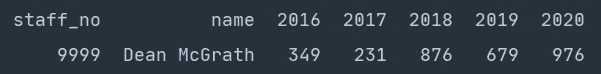
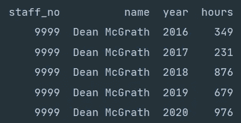

# 解除熊猫数据框的透视

> 原文：<https://towardsdatascience.com/unpivoting-a-pandas-dataframe-64daeb6acb9d?source=collection_archive---------18----------------------->

## 如何将熊猫的数据框按摩成你需要的形状

托德·夸肯布什在 [Unsplash](https://unsplash.com?utm_source=medium&utm_medium=referral) 上拍摄的照片

# 介绍

上一篇文章我们分享了一个尴尬的时刻，这鼓励我们学习和使用熊猫来[旋转数据帧](/pivoting-a-pandas-dataframe-c8ddfae35d2)。今天我们来看看熊猫内置的`.melt()`函数来反转我们的旋转数据。当您需要改变数据帧的形状或取消数据帧的透视时,`.melt()`函数就派上了用场。

# 入门指南

在开始之前，如果你还没有阅读[Pivoting a Pandas data frame](/pivoting-a-pandas-dataframe-c8ddfae35d2)或者之前没有接触过 Python Pandas，我们建议首先从 [Pandas 系列& DataFrame Explained](/pandas-series-dataframe-explained-a178f9748d46) 或者 [Python Pandas 迭代 DataFrame](/python-pandas-iterating-a-dataframe-eb7ce7db62f8) 开始。这两篇文章都将为您提供安装说明和今天文章的背景知识。

# 我们离开的地方

为了让你快速了解，我们在下面加入了一段 Python 代码，摘自[旋转熊猫数据框架](/pivoting-a-pandas-dataframe-c8ddfae35d2)。这个代码片段一旦执行，将会创建一个透视数据帧。

上面的 Python 代码片段将创建一个包含虚拟数据的 Pandas 数据框架。

上面的截图是执行上面的 Python 片段的结果。

既然我们的透视数据框架已经创建好了，我们将学习熊猫`.melt()`函数的语法，然后再将其应用到我们的数据框架中。

# 熊猫。melt()语法

上面是显示熊猫融化函数语法的 Python 片段。

## 因素

*   `id_vars`:您可以在这里输入一列或多列，Pandas 将使用这些列作为每条记录的标识符。
*   `value_vars`:您可以使用该参数设置您希望取消透视的列。如果您没有设置该参数，Pandas 将使用除了在`id_vars`中指定的列之外的所有剩余列。
*   `var_name`:这将为变量列设置一个带标签的列名。您可以为包含已取消透视的组的列传入所需的标签。
*   `value_name`:您可以在这里设置值栏的名称。values 列表示对应于原始透视列类别的值。
*   `col_level`:如果列是多索引的，您可以使用它来设置熔化发生的级别。
*   `ignore_index`:接受一个布尔值，`True`将保留原来的索引，`False`将删除它。

# 我们的解决方案

上面的 Python 片段演示了熊猫融化函数。

上面的截图显示了熊猫融化被调用后的数据帧。

为了取消原始数据帧，我们需要将`staff_no`和`name`传递给`id_vars`。这样做将告诉 Pandas，我们将使用员工编号和员工姓名作为每个分组的标识符。然后，我们使用`var_name`和`value_name`为变量和值列设置标记为列的数据帧。通过不引用原始数据帧中的 year 列作为`id_vars`，Pandas 知道这些是我们想要取消透视的列。

如果您在运行上面的 melt 片段时遇到问题，您可以在这里找到一个完整的脚本。

# 摘要

在[旋转熊猫数据框](/pivoting-a-pandas-dataframe-c8ddfae35d2)和这篇文章之间，我们为你提供了两种非常强大的方法来重塑数据框。能够应用`.pivot()`和`.melt()`将允许您以灵活的心态处理数据，因为您知道您可以将数据框调整到您想要的形状。

感谢您花时间阅读我们的故事，我们希望您已经发现它的价值。