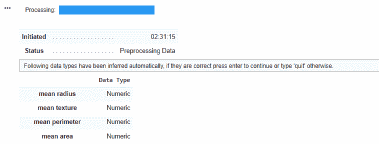
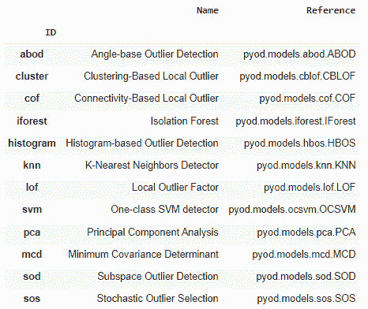
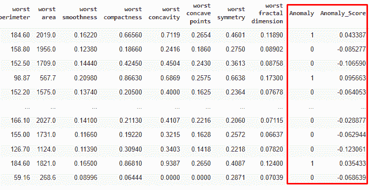
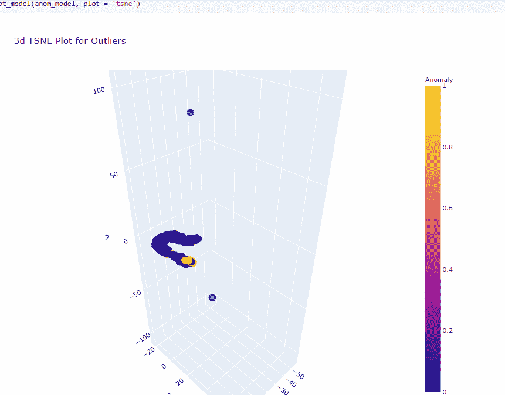
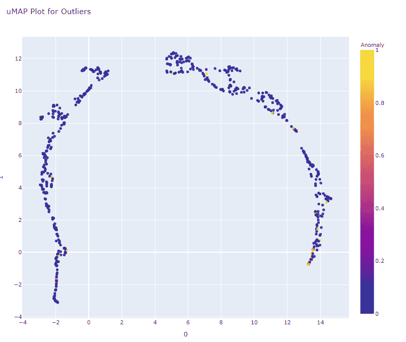

# Python 中的无监督异常检测

> 原文：<https://towardsdatascience.com/unsupervised-anomaly-detection-in-python-f2e61be17c2b?source=collection_archive---------1----------------------->

## 初学者指南


[Mulyadi](https://unsplash.com/@mullyadii?utm_source=medium&utm_medium=referral) 在 [Unsplash](https://unsplash.com?utm_source=medium&utm_medium=referral) 上的照片

# 什么是异常检测？

异常检测也称为离群点检测，是在数据集中寻找与其他数据点不同的数据点的过程。异常检测的常见应用包括金融交易中的欺诈检测、故障检测和预测性维护。

广义地说，异常检测可以分为监督和非监督领域。监督异常检测需要带标签的数据集来指示记录是“正常”还是“异常”。无监督异常检测涉及未标记的数据集。它假设未标记数据集中的大多数数据点是“正常”的，并且它寻找不同于“正常”数据点的数据点。

在本文中，我们将使用 Pycaret 来检测异常。Pycaret 是一个自动机器学习(AutoML)工具，可用于监督和非监督学习。

# 无监督异常检测

让我们从安装 PyCaret 开始。

```
pip install pycaret==2.3.5
pip install scipy==1.4.1
```

**导入必要的模块**

```
from pycaret.anomaly import *
from sklearn.datasets import load_breast_cancer
```

**加载数据集**

我们将使用来自 UCI 机器学习库[2]的威斯康星州乳腺癌(诊断)数据集[1],该数据集包含乳腺肿块细针抽吸的特征计算数字化图像以及肿块是良性(B)还是恶性(M)的诊断。该数据集通常用于演示受监督的机器学习，其中模型被训练来预测诊断。出于演示无监督异常检测的目的，我们将忽略诊断。

我们将数据分成训练集，保留一小部分“看不见的”数据用于评分。

```
df = load_breast_cancer(as_frame=True)['data']
df_train = df.iloc[:-10]
df_unseen = df.tail(10)
```

**设置 Pycaret**

```
anom = setup(data = df_train, 
             silent = True)
```

当执行`setup`时，将`silent`参数设置为`True`会自动确认数据类型的输入。如果`silent`设置为`False,`，Pycaret 要求用户手动确认输入数据类型，如下图所示。



作者图片

如果没有显式定义，Pycaret 将推断数据类型。我们还可以使用`categorical_features`、`numeric_features`、`ordinal_features`参数定义哪些列包含分类、数字、序数和日期特性。定义不同的数据类型将影响列的预处理方式。例如，`categorical_imputation`参数决定了如何处理缺失的分类值。可用选项有`constant`和`mode`。类似地，对于数字特征，`numeric_imputation`参数决定了如何处理丢失的数值。可用选项有`mean`、`median`或`zero`。

还有各种其他预处理选项，如归一化、降维甚至自定义转换。查看[文档](https://pycaret.org/anomaly-detection/)了解更多详情。

**查看可用车型**

让我们看看 Pycaret 中有哪些异常检测模型。

```
models()
```

reference 列指示模型是从哪个源包构建的。PyOD (Python 离群点检测)是一个提供各种离群点检测模型的包。



作者图片

**训练异常检测模型**

```
anom_model = create_model(model = 'iforest', fraction = 0.05)
```

我们通过定义模型的 ID 来训练异常检测模型。`fraction`参数指示数据集中存在的异常值的数量。默认值是`0.05`，表示数据集有 5%的异常值。

**对数据集评分**

```
results = assign_model(anom_model)
```

`assign_model`使用训练好的模型对训练数据集进行评分，并返回模型的预测，与训练数据连接在一起。`Anomaly`列为二进制，其中`1`表示记录异常，`0`表示记录正常。`Anomaly_Score`列给出了记录的原始分数，负值表示记录正常。



作者图片

**剧情模式**

`plot_model`功能有助于使用 TSNE 或 UMAP 可视化高维数据。

```
plot_model(anom_model, plot = 'tsne')
```



作者 Gif

```
plot_model(anom_model, plot = 'umap')
```



作者图片

**保存模型**

`save_model`将转换管道和训练好的模型保存为 pickle 文件。pickle 文件包含一个 scikit-learn 管道对象。

```
save_model(model = anom_model, model_name = 'iforest_model')
```

**加载模型**

`load_model`加载保存的转换管道和训练模型作为 scikit-learn 管道对象。

```
loaded_model = load_model('iforest_model')type(loaded_model)
>> sklearn.pipeline.Pipeline
```

**看不见的数据得分**

`predict`方法将得到`1`或`0`的二进制输出，其中`1`代表异常记录而`0`代表正常记录。

```
loaded_model.predict(df_unseen)>> array([0, 0, 0, 0, 0, 1, 0, 0, 1, 0])
```

`predict_proba`方法将得到记录被分类为`0`或`1`的概率。

```
loaded_model.predict_proba(df_unseen)>> array([[0.81527091, 0.18472909],
       [0.88219213, 0.11780787],
       [0.4789605 , 0.5210395 ],
       [0.46277058, 0.53722942],
       [0.47638085, 0.52361915],
       [0.4421625 , 0.5578375 ],
       [0.68153289, 0.31846711],
       [0.75207438, 0.24792562],
       [0.27120702, 0.72879298],
       [0.54821746, 0.45178254]])
```

`decision_function`方法将返回异常值

```
loaded_model.decision_function(df_unseen)>> array([-0.11826784, -0.14024322, -0.00783128, -0.00251488, -0.00698418,
        0.00425233, -0.07435137, -0.09751556,  0.06039016, -0.03057366])
```

# 结论

在本文中，我们探讨了如何使用 Pycaret 快速训练无监督异常检测模型，使用 TSNE 或 UMAP 可视化高维特征，并使用训练好的模型预测未知数据。

[加入 Medium](https://medium.com/@edwin.tan/membership) 阅读更多这样的故事。

# 参考

[1] [乳腺癌威斯康星州(诊断)数据集](https://archive-beta.ics.uci.edu/ml/datasets/breast+cancer+wisconsin+diagnostic)

创作者:

1.威廉·h·沃尔伯格医生，普通外科部
威斯康辛大学，临床科学中心
麦迪逊，WI 53792
沃尔伯格**' @ '**eagle.surgery.wisc.edu

2.威斯康星大学计算机科学系 w . Nick Street
，威斯康辛州麦迪逊市西代顿街 1210 号，邮编:53706
Street**' @ '**cs.wisc.edu 608–262–6619

3.Olvi L. Mangasarian，计算机科学系
威斯康星大学，威斯康辛州麦迪逊市西代顿街 1210 号，邮编:53706
olvi**' @ '**cs.wisc.edu

捐赠者:尼克街

许可证:CC BY 4.0

[2]Dua d .和 Graff c .(2019 年)。UCI 机器学习知识库[http://archive . ics . UCI . edu/ml]。加州欧文:加州大学信息与计算机科学学院。