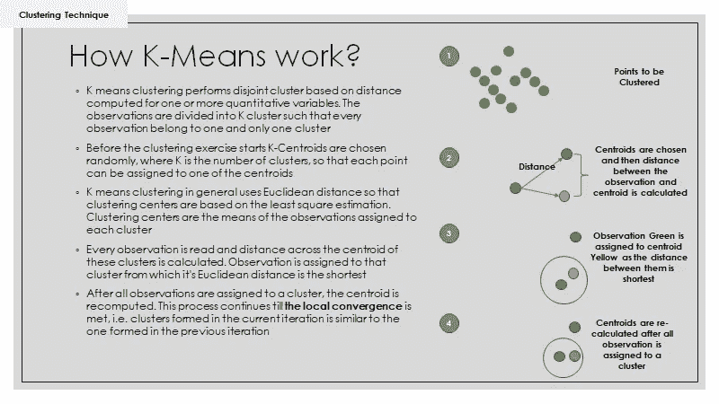
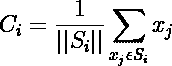
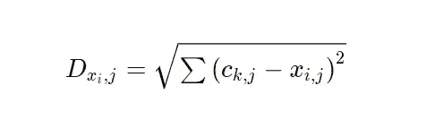
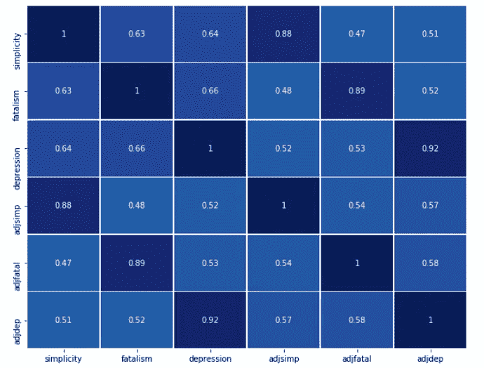
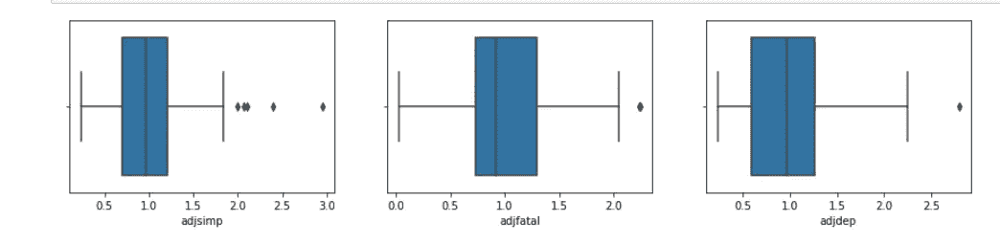
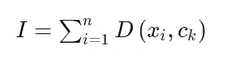
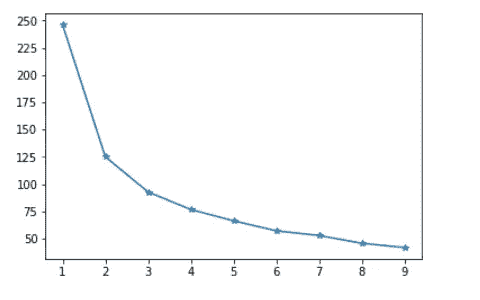
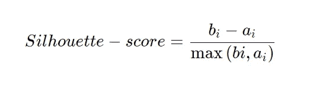

# 使用 Python-K Means ++和剪影分数进行聚类的无监督学习技术

> 原文：<https://towardsdatascience.com/unsupervised-learning-techniques-using-python-k-means-and-silhouette-score-for-clustering-d6dd1f30b660?source=collection_archive---------9----------------------->

## K 入门指南意味着使用 Python 进行集群


丽贝卡·坎贝尔在 [Unsplash](https://unsplash.com?utm_source=medium&utm_medium=referral) 上拍摄

# 没人监督我！

对于那些想知道什么是无监督学习技术的人，想象一下你在克莱顿经营一家体育用品店。你计划为你的高价值客户推出促销优惠，以示感谢。每天都有成百上千的顾客来拜访你。您应该将此报价发送给谁？艰难的选择！嗯，也许是高价值的？但是那些经常购买但花费不多的人呢？这是一个很大的困境。幸运的是，您的积分卡计划可以捕获您的客户信息，而您的 oracle 数据库包含所有交易详情。您可以使用这些数据，形成一组具有相似属性的客户，而无需预先定义谁属于哪里。简而言之，没有预定义的结果变量(在这种情况下是你的客户细分)但在研究客户属性后形成一个结果变量的学习技术被定义为无监督学习技术。

# 遭受维度的诅咒

从理论上讲，你对你的客户了解得越多，你就能更好地对他们进行分组。难道不是吗？然而，在现实生活中，比你想象的要复杂一点。实际上，太多的信息(特征)会导致你的客户分组不佳。但是为什么呢？

*   特征可能高度相关，年龄越高，花费越低
*   太多的特征会引入大量的噪声，使得算法很难对数据执行良好的操作——Sam，您的邻居客户几乎每天都来打招呼并购买价值一美元的蛋白质棒。他是一个非常受重视的客户？
*   训练任何无监督模型所需的数据点数量会随着维度(特征)呈指数增长。太多的信息意味着需要更多的数据来训练模型

> 为了克服这些问题，不同的降维技术，如主成分分析，因子分析等。可以使用。我们引入了维数灾难的概念，为围绕无监督学习技术的假设铺平了道路。

# 算法

无监督学习技术的一些常见算法包括:

1.  k 表示聚类
2.  分层聚类
3.  k 模式聚类
4.  DBScan 聚类-基于密度的空间聚类
5.  主成分分析
6.  要素分析

# 我们今天讨论什么？

人们通常认为现实是一系列非黑即白的事件。这是一个具有挑战性的问题，因为那些受这种思维方式折磨的人可能永远不会觉得现实足够好。今天，我们试图解决简单和抑郁的问题，同时确定因抑郁症住院的精神病患者中更高水平的黑白思维和更高水平的自我报告抑郁之间的关系。

## 数据源

用于此分析的数据来自 [Ginzberg 数据框架](https://rdrr.io/cran/carData/man/Ginzberg.html#heading-1)，该数据框架基于因抑郁症住院的精神病患者。数据收集自《应用回归分析和广义线性模型》一书，第二版，作者 Fox，J. (2008)。该数据集包括三个变量——简单性(非黑即白的思维)、宿命论和抑郁症及其调整后的分数。

## 算法— K 表示聚类

分解一下，K 表示组数，Means 表示平均值。本质上，我们有基于平均距离计算的 K 个组。我猜不清楚！对于任何要工作的 K 均值聚类算法，我们需要有以下参数。

1.  **K** —我们想要多少组。注意——该算法不具备决定或得出 k 值的预测能力。这是由肘图和轮廓分数等少数技术指导的用户调用
2.  **数据点**——在这种情况下，简单、宿命论和抑郁得分，即你的输入数据
3.  K 个质心 —把它想象成 K 个组中每一组的锚点/中心值。大多由算法随机选择。质心的选择影响最终集群/组的形成方式。此外，如果您熟悉使用 O(n)表示的任何算法的时间复杂度，已经观察到次优的质心分配使得时间复杂度为多项式，即算法运行和收敛的时间更长。因此，David Arthur 和 Sergei Vassilvitskii 提出了一种更智能的方法(也称为 **K 表示++的意思)**，它执行以下操作:
     *-从输入数据点(比如 X)
    中随机选择一个中心 C1-对于尚未选择的每个数据点 X*∈**X，计算 D(x)，即 X 和已经选择的最近质心之间的距离
    -对于所有 x* ∈选择一个新的中心 Ci，选择 x* ∈ *X，使其概率为 D(x) / Sum(对于所有 x* ∈ X *D(x) )
    -重复步骤 2 和 3，直到 k 个中心被选择*
4.  **距离度量** —主要是欧几里德距离，作为多个患者之间相似性的度量。例如，当我们谈论足球或众所周知的足球时，我们经常使用总得分来对优秀球员进行分组。说 c 罗，梅西，沃纳，普基分别进了 35，32，10，8 个球。你将如何衡量类似球员的质量？大概是 c 罗和梅西(各 35、32 球)和沃纳和普基(各 10、8 球)。请注意，我们研究了进球得分的差异。如果我添加“助攻”作为另一个指标，我们需要使用不同的衡量标准。比如助攻分别是 10，8，2，1。所以 c 罗和梅西之间的新距离变成了**的平方根((35–32)+(10–8))**。*注意——其他距离度量，如曼哈顿、城市街区、雅可比距离等。也被其他一些算法所采用。*

## K-如何意味着工作？


图一。K 均值聚类算法的工作可视化。图片来源:图片来源——Wikimedia.com GIF



图二。说明了 K 均值算法的逐步分解。图片来源——由作者使用 PowerPoint 开发。

## 重要术语和公式

*注:所有图片均由作者使用 latex 复制。*

*   **质心**



```
1. Ci - ith Centroid where i ∈ K (or K Groups of Cluster)
2\. Si - Group of Data points that belong to Cluster K with Ci as its centroid; j represents attributes of a point Xi
3\. ||Si|| - Number of data points from Si
```

*   **欧几里德距离**



```
1\. Dx is the distance of of a point Xi from it's centroid Ck
```

*   **收敛准则** K 意味着是一个迭代过程。一旦所有数据点都被分配给质心(基于最短的欧几里德距离)，质心被重新计算，并且该过程继续，直到质心停止重新移动，即新的和先前的质心编号没有显著变化
*   **类内和类间距离**
    类内距离是同一类中的点之间的总距离，类间距离是不同类中的两点之间的距离

## 假设

1.  k 表示如果数据包含异常值，算法性能很差
2.  k 表示算法不能处理缺失值
3.  聚类变量之间不应该高度相关
4.  所有聚类变量都应标准化，因为变量的大小会影响距离计算

# 还在想怎么决定 K？让我们深入挖掘

```
# Numerical libraries
import numpy as npfrom sklearn.model_selection import train_test_splitfrom sklearn.cluster import KMeans# to handle data in form of rows and columns 
import pandas as pd# importing ploting libraries
from matplotlib import pyplot as plt
%matplotlib inline#importing seaborn for statistical plots
import seaborn as snsfrom sklearn import metricsimport pandas as pd# reading the CSV file into pandas dataframe
mydata = pd.read_csv(“Depression.csv”)mydata.drop('id', axis=1, inplace=True)
```

## **检查相关性**

```
# — — — — — — — — — — — — — — — -Heat map to identify highly correlated variables — — — — — — — — — — — — -
#-------------------------------Heat map to identify highly correlated variables-------------------------
plt.figure(figsize=(10,8))
sns.heatmap(mydata.corr(),
            annot=True,
            linewidths=.5,
            center=0,
            cbar=False,
            cmap="YlGnBu")
plt.show()
```



图 3。展示了关联矩阵的热图。注意——所有变量都与其调整后的分数高度相关。这是一个关于是保留原来的分数还是继续调整分数的个人问题。这无法得到任何统计假设的支持。图片来源——作者使用 Jupyter Notebook 开发。

## **异常检测和处理**

```
mydata.drop(columns = {‘simplicity’, ‘fatalism’,’depression’}, inplace=True)#--Checking Outliers
plt.figure(figsize=(15,10))
pos = 1
for i in mydata.columns:
    plt.subplot(3, 3, pos)
    sns.boxplot(mydata[i])
    pos += 1
```



图 4。聚类变量的箱线图摘要。图片来源——作者使用 Jupyter Notebook 开发。

```
col_names=list(mydata.columns)
display(col_names)for i in col_names:
 q1, q2, q3 = mydata[i].quantile([0.25,0.5,0.75])
 IQR = q3 — q1
 lower_cap=q1–1.5*IQR
 upper_cap=q3+1.5*IQR
 mydata[i]=mydata[i].apply(lambda x: upper_cap if x>(upper_cap) else (lower_cap if x<(lower_cap) else x))
```

## **标准化属性/聚类变量**

```
##Scale the data
from scipy.stats import zscoremydata_z = mydata.apply(zscore)mydata_z.head()
```

## **K 表示使用 Sklearn 进行聚类**

```
# List to store cluster and intra cluster distanceclusters = []
inertia_vals = []# Since creating one cluster is similar to observing the data as a whole, multiple values of K are utilized to come up with the optimum cluster value
#Note: Cluster number and intra cluster distance is appended for plotting the elbow curve
for k in range(1, 10, 1):

    # train clustering with the specified K
    model = KMeans(n_clusters=k, random_state=7, n_jobs=10)
    model.fit(mydata_z)# append model to cluster list
    clusters.append(model)
    inertia_vals.append(model.inertia_)
```

## **参数**

1.  n_clusters —要形成的簇的数量；也等同于要生成的质心的数量
2.  init 指定初始质心初始化的方法(默认 K-means++)
3.  n_init —使用不同质心种子运行 k-means 算法的次数
4.  max _ ITER—k-means 算法单次运行的最大迭代次数。满足收敛标准时停止，使用 tol(公差选项)定义
5.  random_state —协助质心初始化的随机数生成。导入以确保可重现的结果

## **什么是惯性 _？**

惯性被定义为数据点到它们最近的聚类中心(质心)的平方距离之和。距离越小，聚类的紧密度越好。但是，随着 k 值的不断增加，惯性会不断降低。具有两个聚类的算法将始终比具有四个聚类的算法具有更高的惯性分数，依此类推。这就是我们结合肘部绘图和轮廓分数来决定 k 的最佳值。

## **肘击剧情**

这里的想法是为不同的 K 值绘制总惯性分数，并确定 K，超过 K 惯性变化不大。惯性的公式如下。



```
1\. I = Inertial = Sum of the squared distance of data points to their closest cluster
2\. n = Total number of records in the dataset
3\. D()= Sum of squared distance
4\. Xi = Record i in the data (i.e. in this case record of a given patient)
5\. Ck = Cluster to which record Xi is assigned
```



图 5。说明了肘图。X 轴表示聚类的数量(K ), Y 轴表示惯性值。图片来源——作者使用 Jupyter Notebook 开发。

```
# plot the inertia vs K values
plt.plot(range(1,10,1),inertia_vals,marker='*')
plt.show()
```

研究上图可以发现，4、5 或 6 是 k 的最佳值。请注意，从 6 到 7，曲线趋于平缓，而斜率在 4 个聚类后没有观察到显著变化。

## 比我们想象的要难！让剪影配乐成为救世主



轮廓分数用于测量聚类之间的分离程度。在上面的公式中，bi 表示一个点到 I 不属于的任何其他聚类中所有点之间的最短平均距离，而 ai 是 I 和来自同一聚类的所有数据点的平均距离。从逻辑上来说，如果 bi > ai，那么一个点与它的相邻聚类分离得很好，而它更接近它所属的聚类中的所有点。

```
from sklearn.metrics import silhouette_scorefor i in range(1,9,1):

    print("---------------------------------------")
    print(clusters[i])
    print("Silhouette score:",silhouette_score(mydata_z, clusters[i].predict(mydata_z)))
```

**输出**

```
KMeans(n_clusters=2, n_jobs=10, random_state=7)
Silhouette score: 0.40099183297222984
---------------------------------------
KMeans(n_clusters=3, n_jobs=10, random_state=7)
Silhouette score: 0.3191854112351335
---------------------------------------
KMeans(n_clusters=4, n_jobs=10, random_state=7)
Silhouette score: 0.281779515317617
---------------------------------------
KMeans(n_clusters=5, n_jobs=10, random_state=7)
Silhouette score: 0.2742499085300452
---------------------------------------
KMeans(n_clusters=6, n_jobs=10, random_state=7)
Silhouette score: 0.2790023172083168
---------------------------------------
KMeans(n_clusters=7, n_jobs=10, random_state=7)
Silhouette score: 0.2761554255999077
---------------------------------------
KMeans(n_jobs=10, random_state=7)
Silhouette score: 0.2666698045792603
---------------------------------------
KMeans(n_clusters=9, n_jobs=10, random_state=7)
Silhouette score: 0.27378613906697535
```

观察局部最大值的轮廓分数用于确定与肘图一起的聚类的最佳数量。因此，在本例中，我们可以将 6 作为最佳群集数量。

*关于作者:高级分析专家和管理顾问，帮助公司通过对组织数据的商业、技术和数学的组合找到各种问题的解决方案。一个数据科学爱好者，在这里分享、学习、贡献；你可以和我在* [*上联系*](https://www.linkedin.com/in/angel-das-9532bb12a/) *和* [*上推特*](https://twitter.com/dasangel07_andy)*；*