# 人脑分布式区域的无监督表示学习(下)

> 原文：<https://towardsdatascience.com/unsupervised-representation-learning-on-distributed-regions-in-the-human-brain-part-iv-55fecf4e1b6f?source=collection_archive---------27----------------------->

## 无监督学习和人脑的交集

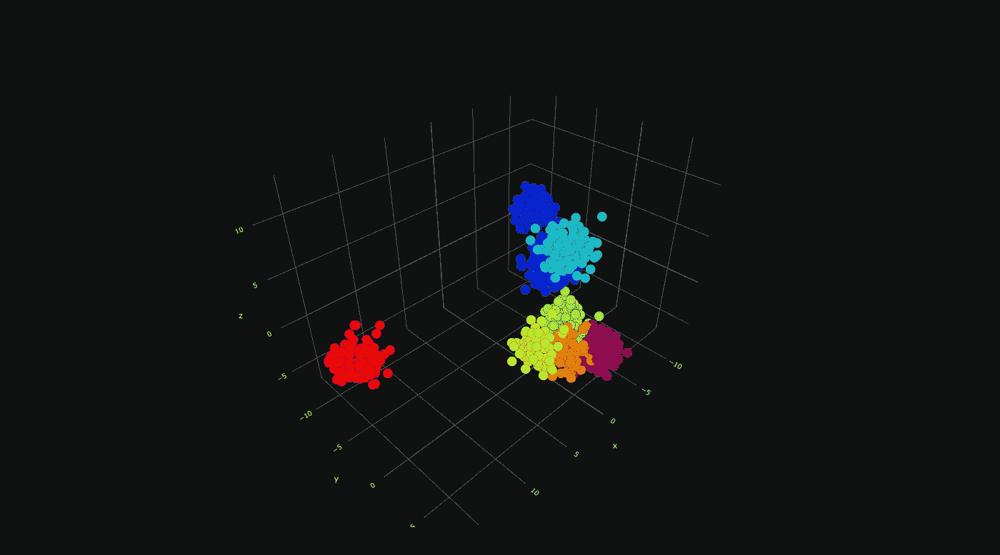

腹侧颞叶皮层感兴趣区域的潜在空间(图片由作者提供)

这是该系列的第四篇文章，即“腹侧颞叶皮层时空功能磁共振成像的认知计算模型”。如果你想了解整个系列，请点击下面的链接。

  

我将介绍人脑中分布式区域上的无监督表示学习的主题及其在大脑解码研究中的用例。让我们开始吧。

所有相关资料都放在我的 GitHub 页面上。别忘了去看看。如果你是一个纸质爱好者，你可以阅读这一系列文章的纸质版，也可以在我的回购中找到。

<https://github.com/cankocagil/Cognitive-Computational-Modelling-for-Spatio-Temporal-fMRI-in-Ventral-Temporal-Cortex>  

# **无监督的&人脑中的流形学习**

F 如果考虑用标准成像参数采集的所有体素或表面坐标，功能性 MRI 数据是非常高维的。在我们的数据集中，4D 时间序列图像数据的结构，我们有一个维数曲线的问题。因此，降维和流形学习算法可以通过在较低的空间表示中保持测地线关系来降低 fMRI 空间的维度。我们使用主成分分析、线性判别分析、独立分量分析、NNMF 和 MDS 作为降维算法。此外，t- SNE，UMAP，ISOMAP，LLE 和频谱嵌入执行生成低维流形的功能磁共振成像空间。让我们开始发现无监督学习和人类大脑的交集。我执行了许多无监督学习算法，因为它进一步帮助理解人类大脑下面的测地线信息，并给出关于分布式区域中的神经活动是否可解码的先验信息。

让我们安装并导入所有必需的包。请参考以前的文章(第一部分)了解数据集。请注意，本文不是为了回答以下问题(这些问题之前已经回答过了)

*   fMRI 数据是如何构成的？(第一部分)
*   为什么对人脑进行时空掩蔽？(第二部分)

下面是安装我们需要的所有东西的 pip 命令。

我们安装了所有需要的东西(甚至更多)。下面我们来导入一下。

我们准备好了！让我们获取哈克斯比数据集。

接下来的事情是准备，屏蔽，标准化和转换 fMRI 数据为 NumPy 矩阵形式如下。

预处理部分完成。因此，我们可以转到我们想要执行的实际流程。在这个代码片段中，“masks”是人脑中被屏蔽的区域，我们希望对其执行认知任务，类别只是它们的标签。我们不使用整体体素进行表示学习。我们的主要想法是提取和可视化人类大脑中的潜在变量，其中神经活动的分布和重叠模式正在发生。

最后，我们可以开始实际的业务如下。在下图中，不同的颜色代表不同的类别。(即蓝色属于第 1 类，橙色属于第 2 类，等等。)

为了恰当地可视化潜在空间，我使用了 *plotly* python 包。以下代码以交互方式执行 2D 和 3D 可视化。

**降维:主成分分析**

PCA 是一种线性无监督降维算法，它计算主向量来改变表示的基础[26]。PCA 是在从图像压缩到文本去相关的广泛主题中使用的算法。这里，我们对受试者 5 的 RoI 进行了 PCA，并将其可视化如下。

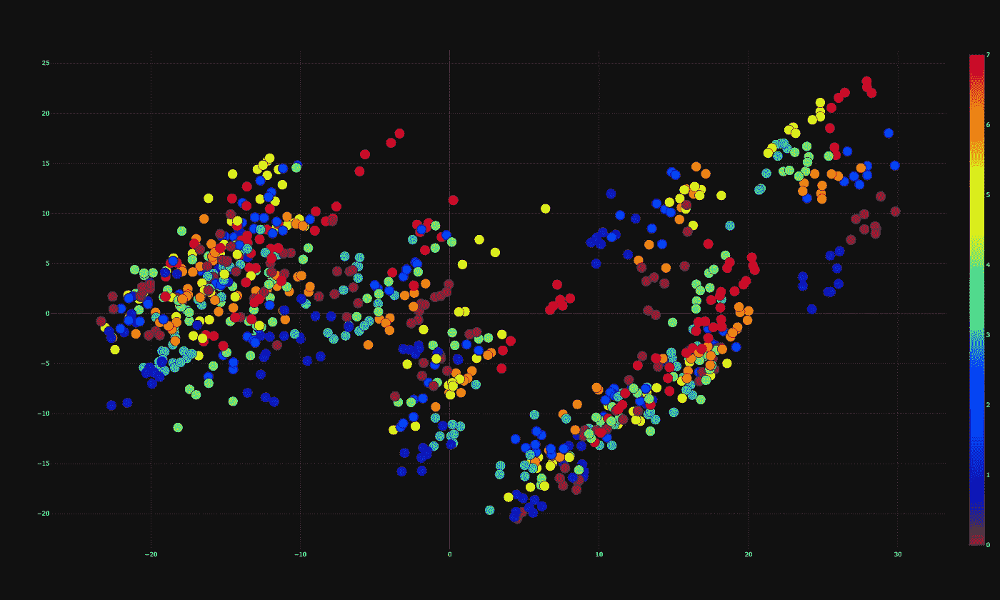

人类大脑掩蔽区域的主成分分析(图片由作者提供)

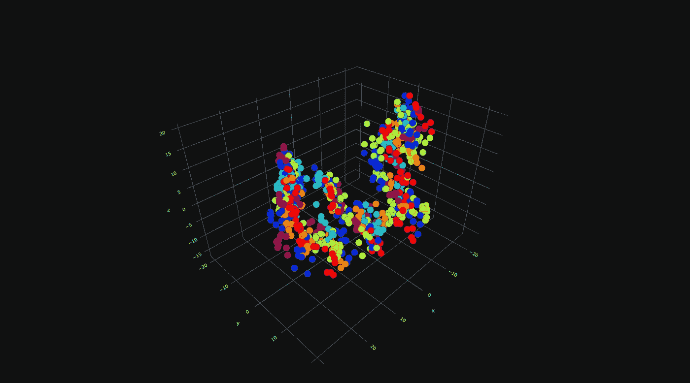

人类大脑掩蔽区域的主成分分析(图片由作者提供)

**降维:LDA**

LDA 是一种监督降维算法，它是 Fisher 线性判别式的推广，旨在找到表征原始数据空间的线性子空间。因为它是受监督的，所以它是表征学习中一个强有力的范例。这里，我们对受试者 5 的 RoI 执行 LDA 并将其可视化。从图中，我们可以看到，通过独特地分离流形中的测地线距离，LDA 优于其他方法。

LDA 研究人类大脑中的掩蔽区域(图片由作者提供)

**降维:ICA**

ICA 是一种计算方法，用于将多变量信号分离成它们的加性分量。这是无监督降维的自然范例。这里，我们对受试者 5 的 RoI 进行 ICA，并将其可视化如下。

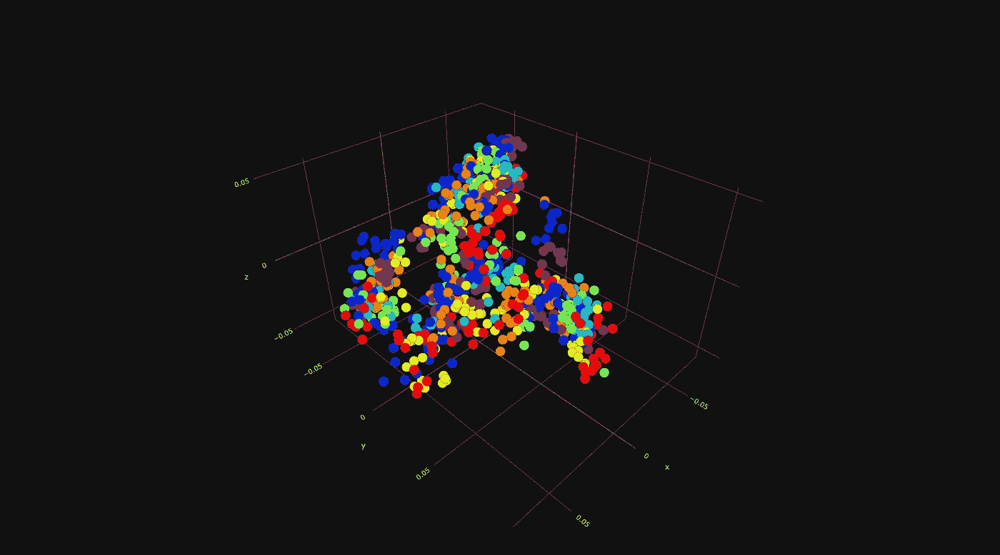

人类大脑中掩蔽区域的 ICA(图片由作者提供)

**降维:NNMF**

NNMF 是一种迭代的非负因子分析，将一个非负矩阵分解成它的线性子空间。这对于提取原始数据样本的自然线性子空间是有用的。在这里，我们对受试者 5 的 RoI 进行了 NNMF，并将其可视化。

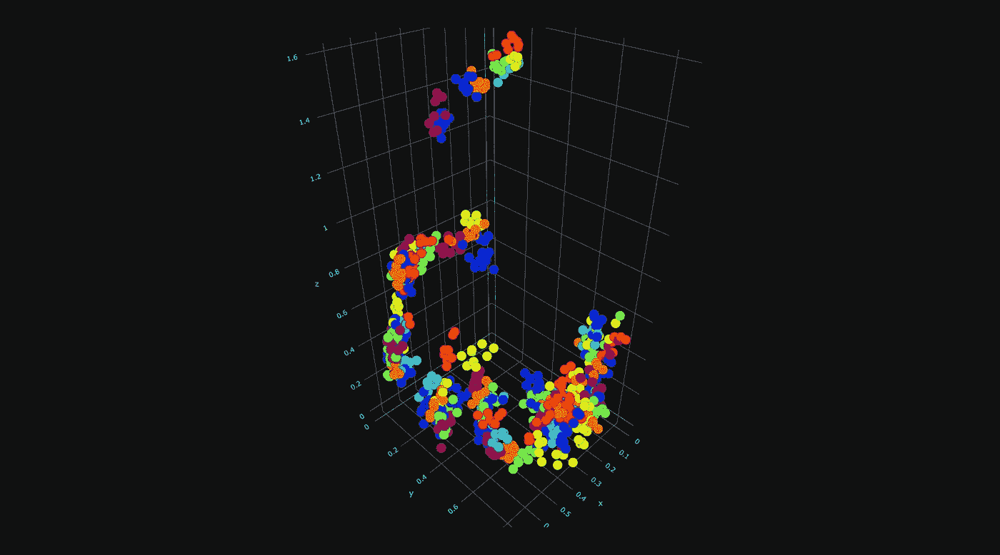

NNMF 论人类大脑中的掩蔽区域(图片由作者提供)

**流形学习:MDS**

MDS 是通过保持流形中的测地线距离来提取原始数据空间的非线性子空间的经典方法。获得较低维度的嵌入来表示流形中的原始数据。在这里，我们对受试者 5 的 RoI 进行了 MDS，并将其可视化。

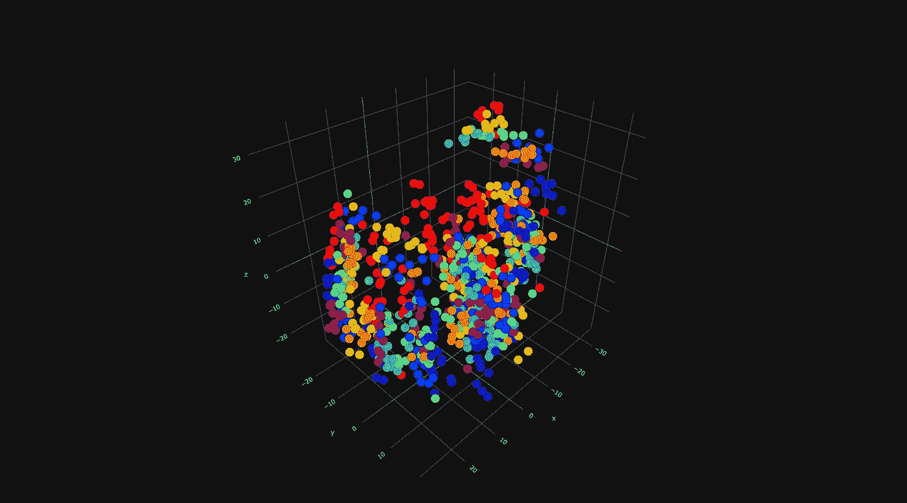

MDS 论人类大脑中的掩蔽区域(图片由作者提供)

**流形学习:t-SNE**

T-SNE 是一种迭代统计方法，用于通过保留小的成对距离或局部相似性来产生原始数据空间的非线性嵌入。它最小化了低维嵌入和高维数据的联合概率之间的 Kullback-Leibler 散度。在这里，我们对受试者 5 的 RoI 进行了 t-SNE 检查并将其可视化。

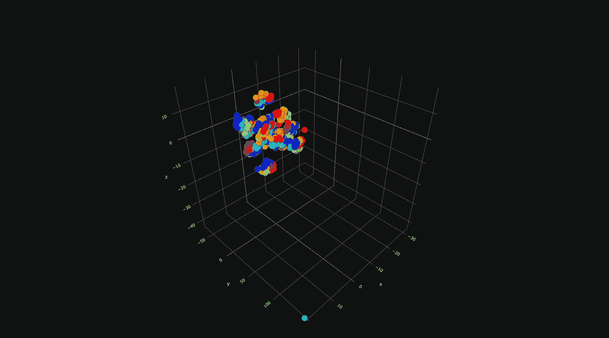

t-SNE 研究人类大脑中的掩蔽区域(图片由作者提供)

**流形学习:UMAP**

UMAP 是非线性嵌入的最近方法，并且它通常以显著的优势胜过 t-SNE。它与 t-SNE 非常相似，但也保留了数据的全局测地线结构。在这里，我们对受试者 5 的 RoI 进行了 UMAP，并将其可视化。

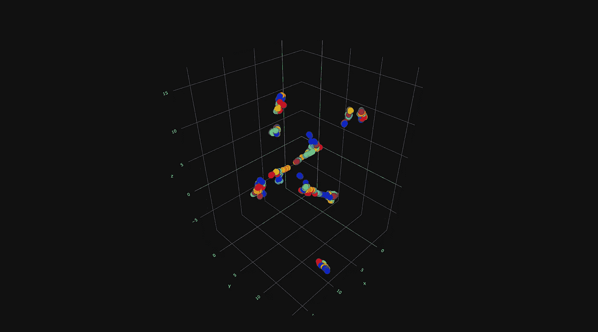

UMAP 论人类大脑中的掩蔽区域(图片由作者提供)

**流形学习:ISOMAP**

ISOMAP 映射也是一种通过等距映射的非线性嵌入算法，用于通过保持流形中的测地线距离来精确估计流形的内在几何形状。这里，我们对受试者 5 的 RoI 执行了 ISOMAP，并对其进行了可视化。

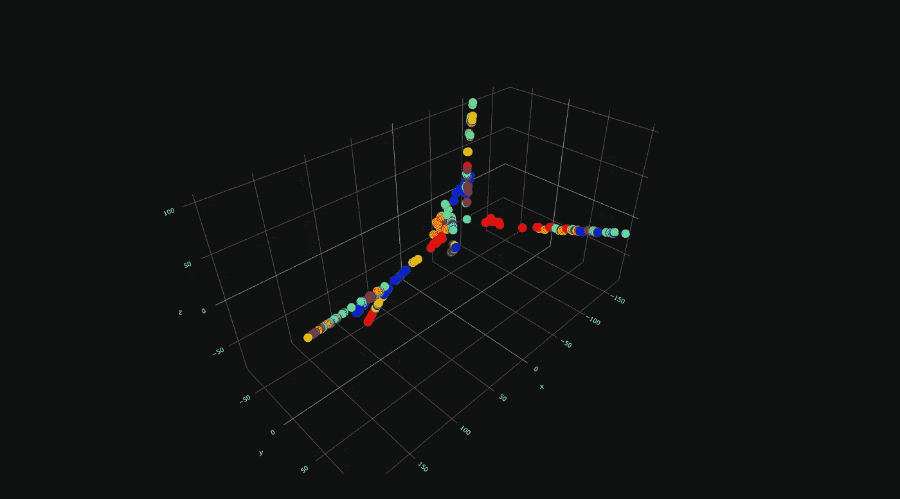

人脑掩蔽区域的 ISOMAP(图片由作者提供)

**流形学习:LLE**

LLE 是一种保持拓扑的非线性降维算法，试图保持流形中的邻居结构，并且它通常在优化和速度方面优于 ISOMAP，因此它在文献中具有非常实际的用途。在这里，我们对受试者 5 的 RoI 进行了 LLE，并将其可视化。

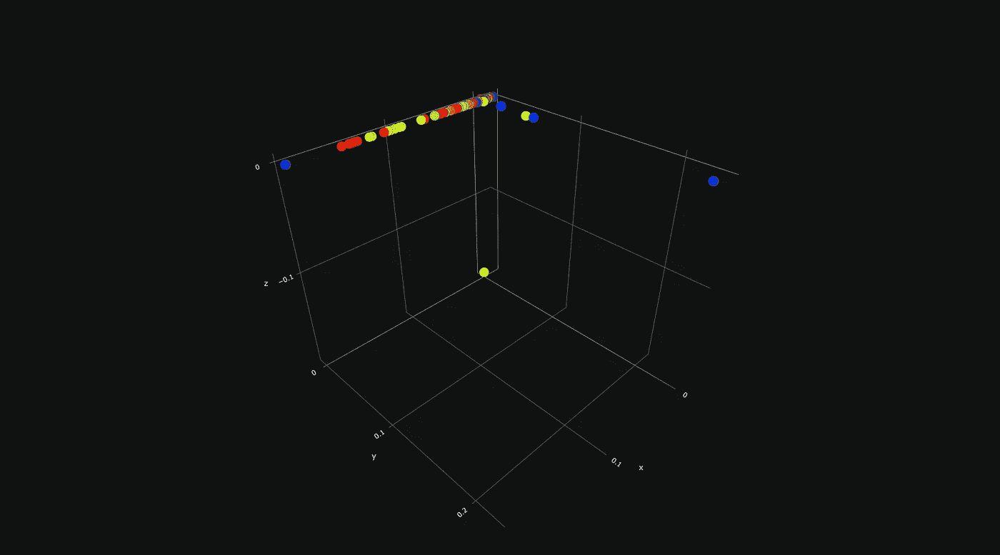

LLE 论人类大脑中的掩蔽区域(图片由作者提供)

**流形学习:光谱嵌入**

频谱嵌入也是一种非线性嵌入算法，它形成一个亲和矩阵并将频谱分解应用于拉普拉斯图。这里，我们对受试者 5 的 RoI 进行了光谱嵌入，并将其可视化。

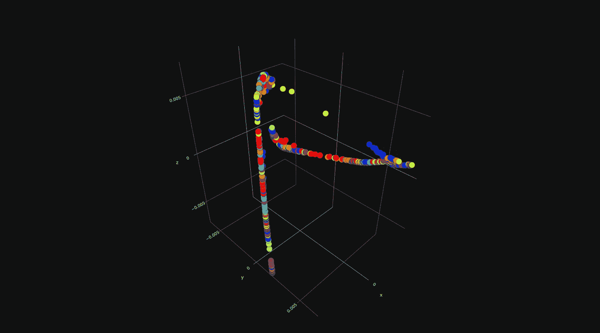

人脑掩蔽区域的光谱嵌入(图片由作者提供)

本文到此为止。我们涵盖了人脑中分布式区域的无监督表示学习及其在大脑解码研究中的用例。恭喜你！您已经完成了第四篇文章，并通过认知计算方法对人脑解码迈出了一步。

在下一篇文章中，我们将执行从经典 ML 算法到神经网络的全面解码算法。

## 文章链接

1.  **发表文章**

<https://cankocagil.medium.com/introduction-to-cognitive-computational-modelling-of-human-brain-part-i-90c61e0e24c9>  

2.

<https://cankocagil.medium.com/discovery-neuroimaging-analysis-part-ii-b2cdbdc6e6c3>  

3.

<https://cankocagil.medium.com/functional-connectivity-and-similarity-analysis-of-human-brain-part-iii-c427c88ca5bb>  

4.

<https://cankocagil.medium.com/unsupervised-representation-learning-on-distributed-regions-in-the-human-brain-part-iv-55fecf4e1b6f>  

2.**在路上(即将到来…)**

1.  第五部分的占位符

## 进一步阅读

*   https://www.hindawi.com/journals/cmmm/2012/961257/

我在机器学习和神经科学方面的研究中使用了以下参考文献列表。我强烈建议复制粘贴参考资料，并简要回顾一下。

# 参考

[1]巴、基罗斯和辛顿。图层归一化，2016。

[2] L. Buitinck，G. Louppe，M. Blondel，F. Pedregosa，A. Mueller，O. Grisel，V. Niculae，P. Prettenhofer，A. Gramfort，J. Grobler，R. Layton，J. VanderPlas，a .乔利，B. Holt，10 和 G. Varoquaux。机器学习软件的 API 设计:scikit-learn 项目的经验。在 ECML PKDD 研讨会:数据挖掘和机器学习的语言，第 108–122 页，2013。

[3]褚，田，王，张，任，魏，夏，沈。双胞胎:重新审视《视觉变形金刚》中空间注意力的设计，2021。

[4] K .克拉默、o .德克、j .凯舍特、s .沙莱夫-施瓦茨和 y .辛格。在线被动攻击算法。2006.

[5] K. J .弗里斯顿。统计参数映射。1994.

[6]格罗斯、罗查-米兰达和本德。猕猴下颞皮质神经元的视觉特性。神经生理学杂志，35(1):96–111，1972。

[7] S. J .汉森、t .松坂和 J. V .哈克斯比。用于物体识别的腹侧颞叶组合编码。

[8]哈克斯比、戈比尼、富里、伊沙伊、斯豪滕和彼得里尼。《视觉物体识别》，2018。

[9]赫克曼、哈伊纳尔、贾巴尔、吕克特和哈默斯。结合标记传播和决策融合的自动解剖脑 mri 分割。神经影像，33(1):115–126，2006。

10d .亨德里克斯和 k .金佩尔。高斯误差线性单位(gelus)，2020。

[11]黄少华，邵文伟，王明林，张德庆.人脑活动视觉信息的功能解码:简要综述。国际自动化和计算杂志，第 1-15 页，2021。

[12] R. Koster、M. J. Chadwick、Y. Chen、D. Berron、A. Banino、E. Duzel、D. Hassabis 和 D. Kumaran。海马系统内的大循环复发支持跨发作的信息整合。神经元，99(6):1342–1354，2018。

[13]马奥尔。勾股定理:4000 年的历史。普林斯顿大学出版社，2019。

[14] K. A. Norman、S. M. Polyn、G. J. Detre 和 J. V. Haxby 超越读心术:功能磁共振成像数据的多体素模式分析。认知科学趋势，10(9):424–430，2006。

[15]奥图尔、江、阿卜迪和哈克斯比。腹侧颞叶皮层中物体和面孔的部分分布表征。认知神经科学杂志，17(4):580–590，2005。

[16] F .佩德雷戈萨、g .瓦洛夸、a .格拉姆福特、v .米歇尔、b .蒂里翁、o .格里塞尔、m .布隆德尔、p .普雷登霍弗、r .魏斯、v .杜伯格、j .范德普拉斯、a .帕索斯、d .库尔纳波、m .布鲁彻、m .佩罗特和 e .杜切斯内。sci kit-learn:Python 中的机器学习。机器学习研究杂志，12:2825–2830，2011。

17 r . a .波尔德拉克。功能磁共振成像的感兴趣区域分析。社会认知和情感神经科学，2(1):67–70，2007。

[18] M. Poustchi-Amin、S. A. Mirowitz、J. J. Brown、R. C. McKinstry 和 T. Li。回波平面成像的原理和应用:普通放射科医师回顾。放射学，21(3):767–779，2001。

[19] R. P. Reddy，A. R. Mathulla 和 J. Rajeswaran。心理健康专家的观点采择和情绪传染的初步研究:移情的玻璃脑观点。印度心理医学杂志，0253717620973380，2021 页。

[20]史密斯、米勒、萨利米-科尔希迪、韦伯斯特、贝克曼、尼科尔斯、拉姆齐和伍尔利奇。功能磁共振成像的网络建模方法。神经影像，54(2):875–891，2011。

21 田中先生。下颞叶皮层和物体视觉。神经科学年度评论，19(1):109–139，1996。

[22] M. S .特雷德。Mvpa-light:一个多维数据的分类和回归工具箱。神经科学前沿，14:289，2020。

[23] M. P .范登赫维尔和 H. E .波尔。探索大脑网络:静息态功能磁共振成像功能连接综述。欧洲神经精神药理学，20(8):519–534，2010。

[24] G. Varoquaux，A. Gramfort，J. B. Poline 和 B. Thirion。大脑协方差选择:使用群体先验的更好的个体功能连接模型。arXiv 预印本 arXiv:1008.5071，2010。

[25] Y. Wang，J. Kang，P. B. Kemmer 和 Y. Guo。一种利用偏相关估计大规模脑网络功能连接的有效可靠的统计方法。神经科学前沿，10:123，2016。

26s . Wold、K. Esbensen 和 P. Geladi。主成分分析。化学计量学和智能实验室系统，2(1–3):37–52，1987。

27s . Wold、K. Esbensen 和 P. Geladi。主成分分析。化学计量学和智能实验室系统，2(1–3):37–52，1987。