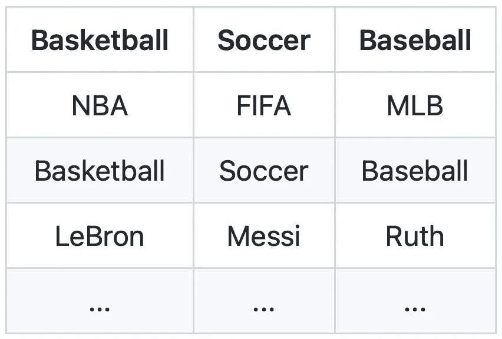
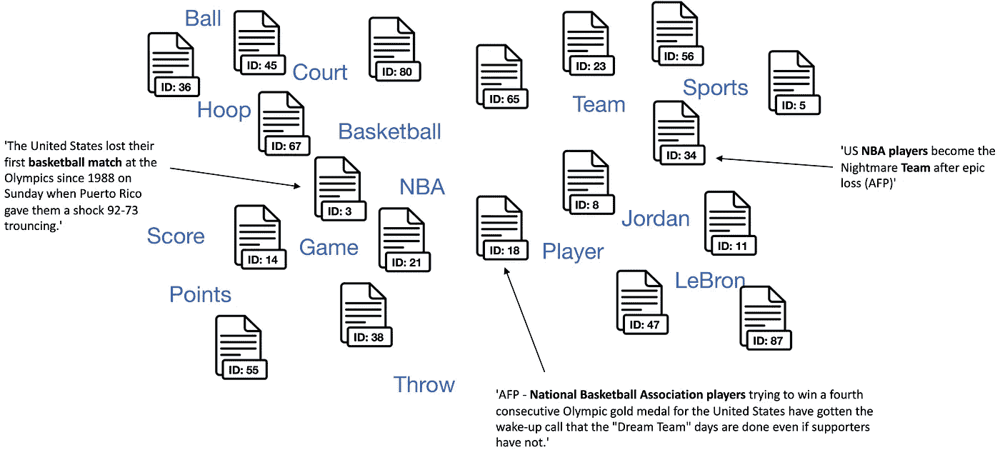
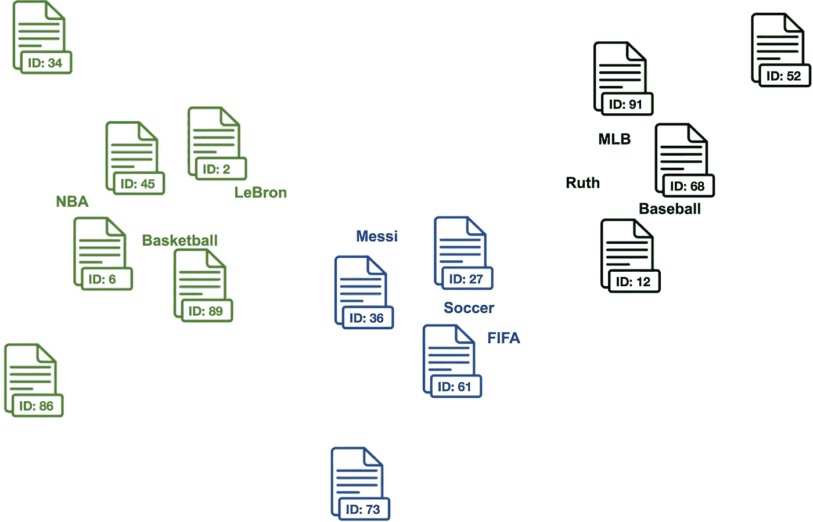
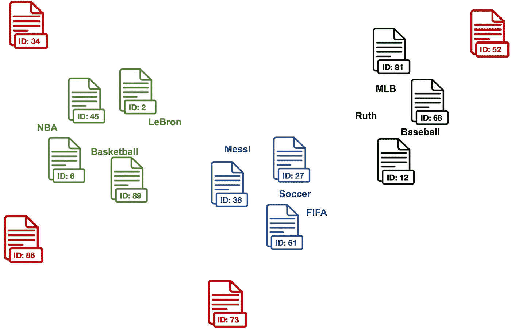
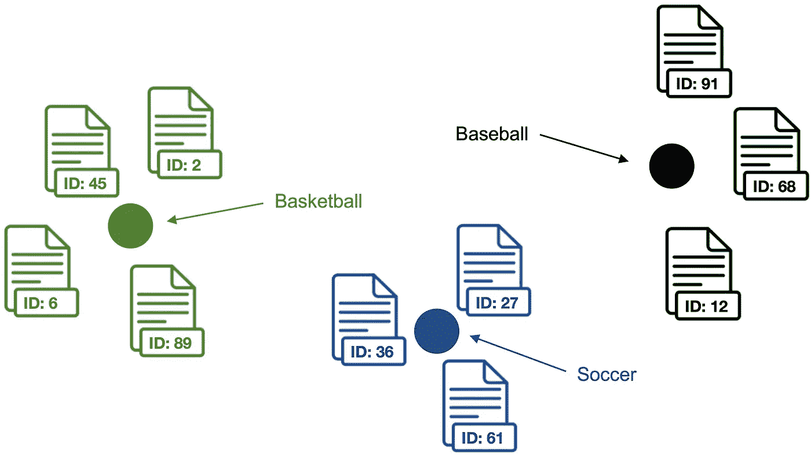
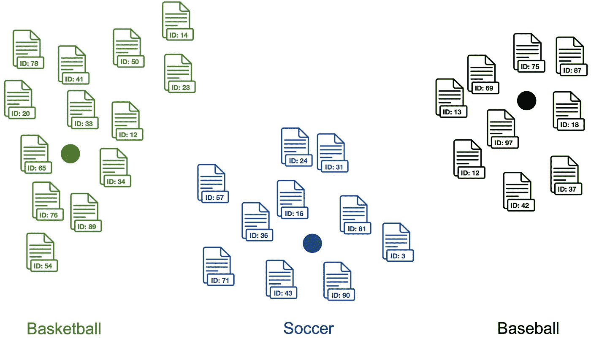
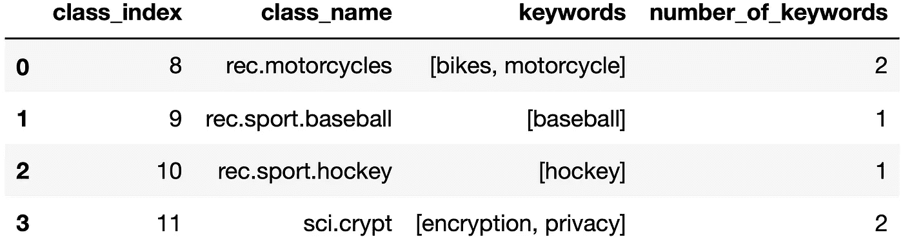
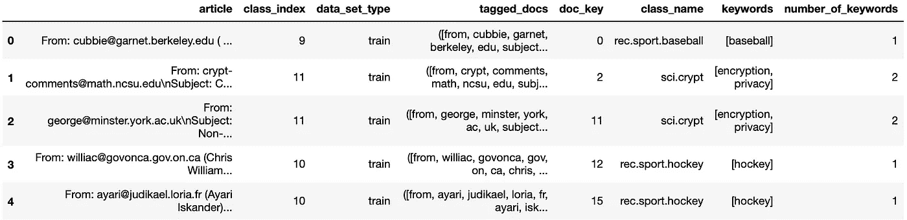

# 基于 Lbl2Vec 的无监督文本分类

> 原文：<https://towardsdatascience.com/unsupervised-text-classification-with-lbl2vec-6c5e040354de?source=collection_archive---------0----------------------->

## **对无标签文本文档的基于嵌入的分类的介绍**

由[帕特里克·托马索](https://unsplash.com/@impatrickt)在 [Unsplash](https://unsplash.com) 上拍摄的照片。

*本帖基于我们的论文*[*“LBL 2 vec:一种基于嵌入的预定义主题无监督文档检索方法(2021)”*](https://www.scitepress.org/Link.aspx?doi=10.5220/0010710300003058)*。你可以在那里读到更多的细节。*

文本分类的任务是给一个句子或文档分配一个合适的类别。类别取决于所选数据集，可以涵盖任意主题。因此，文本分类器可用于组织、构建和分类任何类型的文本。

常见的方法使用监督学习来分类文本。尤其是近年来基于 BERT 的语言模型取得了非常好的文本分类效果。这些传统的文本分类方法通常需要大量的标注训练数据。然而，在实践中，用于训练最先进的分类算法的带注释的文本数据集通常是不可用的。数据的标注通常涉及大量的人工工作和高昂的费用。因此，无监督的方法提供了对未标记数据集运行低成本文本分类的机会。最近，无监督文本分类也被称为零镜头文本分类。**在本文中，你将学习如何使用**[**LBL 2 vec**](https://github.com/sebischair/Lbl2Vec)**来执行无监督的文本分类。**

# Lbl2Vec 是如何工作的？

[**Lbl2Vec**](https://github.com/sebischair/Lbl2Vec) 是一种用于无监督文档分类和无监督文档检索的算法。它自动生成联合嵌入的标签、文档和词向量，并返回由手动预定义的关键字建模的类别的文档。该算法的核心思想是许多语义相似的关键词可以代表一个类别。在第一步中，该算法创建文档和单词向量的联合嵌入。一旦文档和单词被嵌入到共享向量空间中，该算法的目标是从先前手动定义的表示类别的关键词中学习标签向量。最后，该算法可以基于文档向量与标签向量的相似性来预测文档与类别的从属关系。在高层次上，该算法执行以下步骤来分类未标记的文本:

## 1.对每个感兴趣的类别使用手动定义的关键字

首先，我们必须定义关键字来描述每个感兴趣的分类类别。这个过程需要一定程度的领域知识来定义描述分类类别并且在分类类别中彼此语义相似的关键词。

不同运动分类类别的关键词示例。图片作者。

## 2.创建联合嵌入的文档和单词向量

> 嵌入向量是允许我们在多维空间中表示单词或文本文档的向量。嵌入向量背后的思想是相似的单词或文本文档将具有相似的向量。 **-** [**阿莫尔**](/how-to-perform-topic-modeling-with-top2vec-1ae9bb4e89dc)

因此，在创建共同嵌入的向量之后，文档被定位成靠近其他相似的文档并且靠近最有区别的单词。

联合嵌入的单词和文档向量。图片作者。

一旦我们有了一组单词和文档向量，我们就可以进入下一步。

## 3.找到与每个分类类别的关键字向量相似的文档向量

现在我们可以计算文档和每个类别的手动定义的关键字之间的余弦相似度。与类别关键词相似的文档被分配给相应类别的一组候选文档。

分类类别关键字及其各自的候选文档集。每种颜色代表不同的分类类别。图片作者。

## 4.清除每个分类类别的异常文档

该算法使用 [LOF](/local-outlier-factor-lof-algorithm-for-outlier-identification-8efb887d9843) 从每组候选文档中清除离群文档，这些文档可能与一些描述性关键字相关，但不完全匹配预期的分类类别。

红色文档是从候选文档集中移除的离群值。图片作者。

## 5.计算异常值清除文档向量的质心，作为每个分类类别的标签向量

为了得到分类类别的嵌入表示，我们计算标签向量。稍后，将使用文档与标签向量的相似度来对文本文档进行分类。每个标签向量由一个类别的异常清除文档向量的[质心](https://en.wikipedia.org/wiki/Centroid)组成。该算法计算文档而不是关键词质心，因为实验表明仅基于与关键词的相似性来分类文档更加困难，即使它们共享相同的向量空间。

标签向量，计算为各个清除的候选文档向量的质心。点代表各个主题的标签向量。图片作者。

## 6.文本文档分类

该算法为数据集中的每个标签向量和文档向量计算*标签向量< - >文档向量*相似度。最后，文本文档被归类为具有最高*标签向量< - >文档向量*相似度的类别。

数据集中所有文档的分类结果。点表示分类类别的标签向量。文档颜色代表其预测的分类类别。图片作者。

# Lbl2Vec 教程

在本教程中，我们将使用 [Lbl2Vec](https://github.com/sebischair/Lbl2Vec) 对来自 [20 个新闻组数据集](http://qwone.com/~jason/20Newsgroups/)的文本文档进行分类。它是大约 20，000 个文本文档的集合，平均分布在 20 个不同的新闻组类别中。在本教程中，我们将重点关注由类别“rec.motorcycles”、“rec.sport.baseball”、“rec.sport.hockey”和“sci.crypt”组成的 20 个新闻组数据集的子集。此外，我们将为每个分类类别使用已经预定义的关键字。预定义的关键字可以从[这里](https://github.com/TimSchopf/MediumBlog/blob/main/data/20newsgroups_keywords.csv)下载。还可以在 GitHub 上访问更多 [Lbl2Vec 示例](https://github.com/sebischair/Lbl2Vec/tree/main/examples)。

## **安装 Lbl2Vec**

我们可以使用 pip 和以下命令安装 Lbl2Vec:

`pip install lbl2vec`

## 读取数据

我们将下载的“20newsgroups_keywords.csv”文件存储在与 Python 脚本相同的目录中。然后我们读取带有[熊猫](https://pandas.pydata.org)的 CSV，并从 [Scikit-learn](https://scikit-learn.org/0.19/datasets/twenty_newsgroups.html) 获取 20 个新闻组数据集。

## 预处理数据

为了训练 Lbl2Vec 模型，我们需要对数据进行预处理。首先，我们处理用作 Lbl2Vec 输入的关键字。

我们看到，关键字描述了每个分类类别，关键字的数量可能会有所不同。

此外，我们还需要对新闻文章进行预处理。因此，我们对每个文档进行单词标记化，并添加[gensim . models . doc 2 vec . tagged document](https://radimrehurek.com/gensim/models/doc2vec.html#gensim.models.doc2vec.TaggedDocument)标签。Lbl2Vec 需要标记化和标签化的文档作为训练输入格式。

我们可以在数据框中看到文章文本及其分类类别。“tagged_docs”列包含作为 Lbl2Vec 输入所需的预处理文档。“class_name”列中的分类类别仅用于评估，而不用于 Lbl2Vec 培训。

## 培训 Lbl2Vec

准备好数据后，我们现在可以在训练数据集上训练 Lbl2Vec 模型。我们用以下参数初始化模型:

*   **keywords_list** :列表的可重复列表，包含每个类别的描述性关键字。
*   **tagged _ documents**:gensim . models . doc 2 vec . tagged document 元素的可迭代列表。每个元素由一个文档组成。
*   **label_names** :每个标签自定义名称的可重复列表。同一主题的标签名称和关键字必须具有相同的索引。
*   **similarity_threshold** :只有与各个描述关键词的相似度高于该阈值的文档才用于计算标签嵌入。
*   **min_num_docs** :用于计算标签嵌入的最小文档数。
*   **纪元**:语料库的迭代次数。

## 文本文档的分类

在模型被训练之后，我们可以预测用于训练 Lbl2Vec 模型的文档的类别。

`[Out]: F1 Score: 0.9054393305439331`

我们的模型可以预测正确的文档类别，得分相当可观，为 *F1≈0.91* 。这是在培训期间甚至不需要看到文档标签的情况下实现的。

此外，我们还可以预测未用于训练 Lbl2Vec 模型并因此对其完全未知的文档的分类类别。为此，我们从以前未使用的测试数据集中预测文档的类别。

`[Out]: F1 Score: 0.889937106918239`

我们训练的 Lbl2Vec 模型甚至可以预测新文档的分类类别，得分为 *F1≈0.89* 。如前所述，这是通过完全无监督的方法实现的，其中在训练期间不使用标签信息。

关于 Lbl2Vec 可用特性的更多细节，请查看 [Lbl2Vec GitHub 库](https://github.com/sebischair/Lbl2Vec)。我希望这篇教程对你有用。

# 摘要

Lbl2Vec 是最近开发的一种方法，可用于无监督的文本文档分类。与其他最先进的方法不同，它在训练期间不需要标签信息，因此提供了对无标签数据集运行低成本文本分类的机会。开源的 Lbl2Vec 库也非常容易使用，允许开发人员只需几行代码就可以训练模型。

# 来源

1.  绍普夫，t。Braun d .和 Matthes f .(2021)。 [Lbl2Vec:基于嵌入的预定义主题无监督文档检索方法](https://www.scitepress.org/Link.aspx?doi=10.5220/0010710300003058)，(2021)，第 17 届网络信息系统与技术国际会议论文集
2.  [https://github.com/sebischair/Lbl2Vec](https://github.com/sebischair/Lbl2Vec)