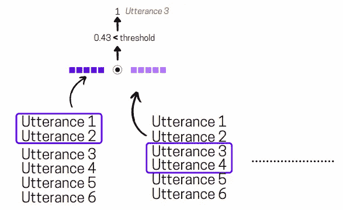

# 具有 BERT 嵌入的会议的无监督主题分割(摘要)

> 原文：<https://towardsdatascience.com/unsupervised-topic-segmentation-of-meetings-with-bert-embeddings-summary-46e1b7369755?source=collection_archive---------9----------------------->

## *NLP 研究论文演练*

*修改后的图片来自* [*来源*](https://unsplash.com/photos/W8KTS-mhFUE)

*在这篇博客中，我试着根据我的理解总结了* [*使用 BERT 嵌入的会议无监督主题分割*](https://arxiv.org/pdf/2106.12978.pdf) *这篇论文。请随时评论你的想法！*

# *问题陈述*

在过去的几年里，各种在线会议工具的使用突然激增，比如 Zoom、Google Meet、Microsoft Teams 等。几乎所有的时间你都会因为这样或那样的原因记录这些会议，但是因为它们的原始形式和某人操纵会议中讨论的要点所需要的痛苦，它们真的被再次看到或提及吗？我想不会。受这个问题的启发，脸书的研究人员提出了一种**无监督的方法，使用预先训练的 BERT 嵌入将会议分割成主题**。

会议背景下的主题分割是预测多人会议记录中主题边界的任务。作者在无人监督的情况下特别针对这项任务，因为大规模手动注释这些会议很难。

# *方法建议*

假设我们有一份会议记录 **M** ，其中有 **U** 个总话语数和 **T** 个总话题边界数需要我们识别。这里 T 个话题中的每一个都是用 U 个连续的话语集合来表示的，姑且称之为可以用 U(i)到 U(i+z)来表示的块。这里， **z** 是块中考虑的连续话语的计数。现在以 M 和 U 作为输入，任务是预测长度为 U 的布尔向量，其中 0 表示话语 U(i)包含在正在进行的主题中，1 表示话语 U(i)是正在进行的主题的主题转移。

如前所述，作者利用 BERT 嵌入来获得会议片段的语义表示。他们为此测试了两种技术，其中一种是 max-pooled 预训练 [RoBERTa 在架构中倒数第二层的嵌入](https://huggingface.co/roberta-base)。第二个是[句子-BERT](https://www.sbert.net/docs/pretrained_models.html) 模型(BERT 使用[暹罗网络](/a-friendly-introduction-to-siamese-networks-85ab17522942)在 SNLI 数据集上训练)。

在此之后，他们将整个会议语料库分成大小为 **z** 的多个块，并通过**对话语嵌入分层执行最大池操作**来获得每个块的嵌入表示。在获得块表示之后，它们计算对话中相邻块表示之间的[角距离](https://en.wikipedia.org/wiki/Cosine_similarity)。最后，基于某个阈值，他们给话语分配 0 或 1 值。

*下图直观地说明了这一点—*

提议方法的插图|作者提供的图片

# *我的想法*

我觉得这确实是一项有趣、实用、同时又具有挑战性的任务。所提出的方法看起来很有希望，尽管在下一次迭代中，有趣的是看到围绕发言者的身份、会议的主题、专业领域地名词典等添加额外的特征将如何影响当前的分数。此外，观察使用非上下文嵌入时的分数变化也是值得尝试的。下一步可以尝试的一件更有趣的事情是提出一种自动标记这些主题的技术。

> *如果你愿意，你也可以* [*看看我写的其他研究论文摘要*](https://medium.com/analytics-vidhya/summarizing-nlp-research-papers-dbd12965aa0a) *。*

*随意看论文，对作者说“* ***Hi*** *”，感谢他们的贡献。此外，如果你喜欢看视频而不是文字(就像我:D 一样)，一定要看看——*

[*多看此类研究论文演练*](https://www.youtube.com/channel/UCoz8NrwgL7U9535VNc0mRPA)

> *⏩* **论文标题**:具有 BERT 嵌入的会议无监督主题分割
> 
> ⏩**论文**:【https://arxiv.org/pdf/2106.12978.pdf】T2
> 
> ⏩**作者** : [亚历山德罗·索尔比亚蒂](https://arxiv.org/search/cs?searchtype=author&query=Solbiati%2C+A)，[凯文·赫夫南](https://arxiv.org/search/cs?searchtype=author&query=Heffernan%2C+K)，[圣乔治·达玛斯基诺](https://arxiv.org/search/cs?searchtype=author&query=Damaskinos%2C+G)，[什瓦尼·波德达尔](https://arxiv.org/search/cs?searchtype=author&query=Poddar%2C+S)，[舒巴姆·莫迪](https://arxiv.org/search/cs?searchtype=author&query=Modi%2C+S)，[雅克·卡利](https://arxiv.org/search/cs?searchtype=author&query=Cali%2C+J)

我希望你喜欢读这篇文章。如果你愿意支持我成为一名作家，可以考虑注册[成为一名媒体成员](https://prakhar-mishra.medium.com/membership)。每月只需 5 美元，你就可以无限制地使用 Medium。谢谢！