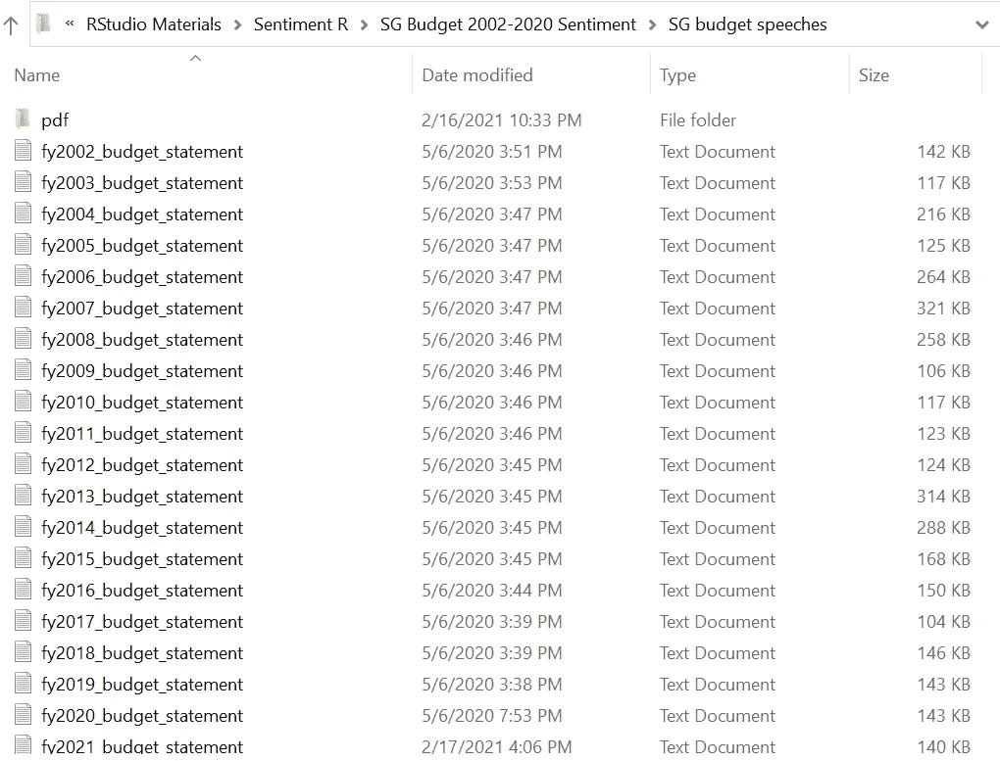
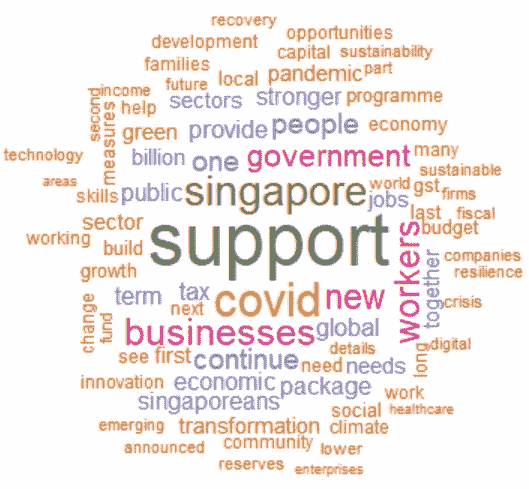
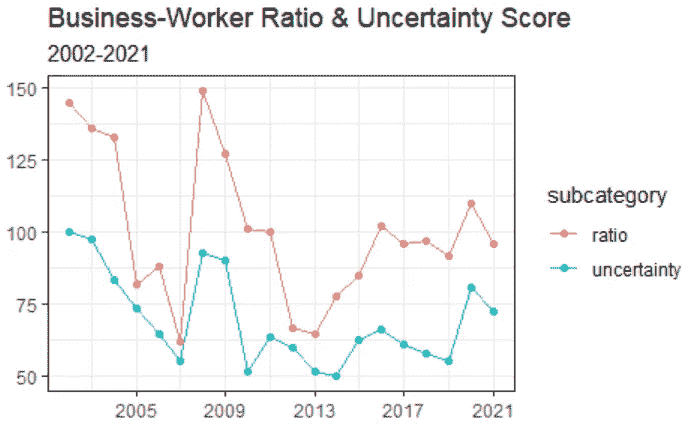
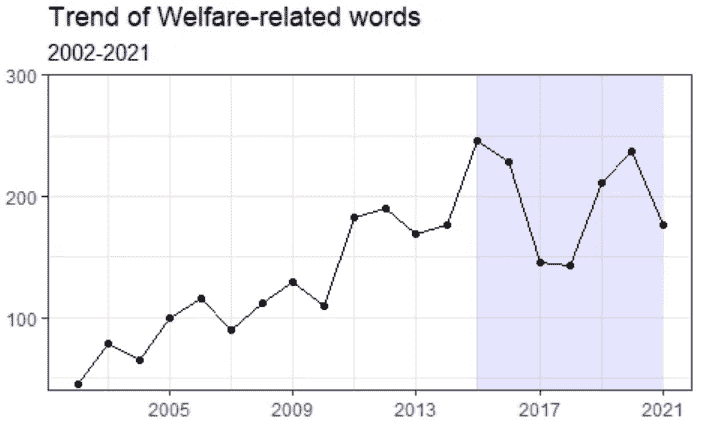
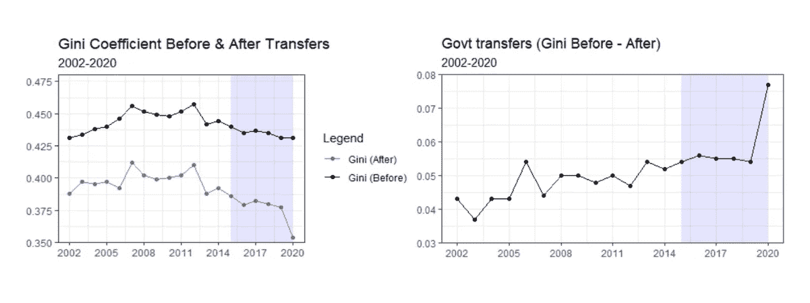
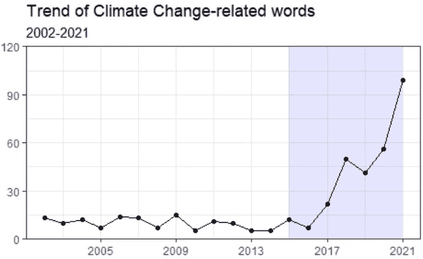
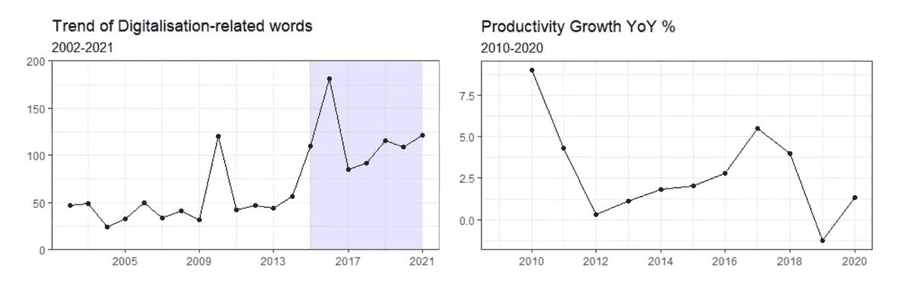

# 揭示新加坡 2021 年预算与以往预算趋势的差异

> 原文：<https://towardsdatascience.com/unveiling-insights-from-singapores-budget-2021-with-data-science-596c0c67c752?source=collection_archive---------43----------------------->

## **R 中基于文本的分析**


图片来源:石民·德( [Unsplash](https://unsplash.com/photos/ZVzlyWZqw_Q)

每年 2 月左右，我们的财政部长都会公布新加坡的财政预算。但预算报告通常相当冗长，长达 40-50 页。

此外，如果我们想研究过去的趋势如何演变，以了解政府的立场，我们可能必须手动阅读过去的预算报表，这是非常耗时的。

使用 R 和少量基于文本的分析，我们可以:(1)有效地获得 2021 年预算中的主要主题，以及(2)快速地与过去预算报表中的先前趋势进行比较，以研究政府的立场是否发生了变化。

具体而言，通过将《2021 年预算》与以前的预算进行比较，可以揭示政府在各种主题上的立场，如亲商、进步、气候变化和数字化工作。

这篇文章是上一篇[文章](https://medium.com/swlh/is-singapore-turning-into-a-support-state-7790d1539571)的延伸，在这篇文章中，我通过查看新加坡过去 19 年(2002 年至 2020 年)的预算报表，分析了新加坡是否真的正在变成一个支持国家。

我将重复使用与以前相同的工作流程，做一些小的调整。

好了，让我们从代码开始吧！

## 数据

这项分析的第一步将是从财政部的[网站](https://www.mof.gov.sg/docs/librariesprovider3/budget2021/download/pdf/fy2021_budget_statement.pdf)下载最新的《2021 年预算》报表，并将其添加到我们过去的预算报表集合中。

我把它们保存为。txt 文件，因为它们以后会更容易处理。



作者图片

以下是我们需要的库:

```
**# Libraries**library(tidyverse)
library(tidytext)
library(readtext)
library(scales)
library(wordcloud)
```

现在我们将 R 中的工作目录设置为上面的文件夹，并读入。我们 20 个预算报表的 txt 文件:

```
**# Call the files from working directory into R**list_of_files <- list.files(path=".", recursive = TRUE, pattern="\\.txt$",full.names=TRUE)data <- lapply(list_of_files, readtext)
data1 <- do.call(rbind, data)
```

接下来，我们将句子分解成单个单词，并删除停用词，例如 *the* 和 *a* 。最后，我们计算每个单词的频率。

```
**# Unnest tokens**dtm <- data1 %>%
  unnest_tokens(word, text)**# Clean the dtm, remove stopwords**dtm_clean <- dtm %>%
  anti_join(get_stopwords())**# Get the words frequency**words <- dtm_clean %>%
  group_by(doc_id) %>%
  count(word, sort=TRUE)
```

粗略检查后，似乎有必要进行二次手动清洁。txt 文件似乎包含许多奇特的符号。

```
**# Secondary "manual" cleaning of the words data frame**droptext <- c(letters, 0:2021, "â", "ï", "page", "ii", "iii", "iv", "can", "also", "å", "ä", "ç", "æ", "è", "çš", "kg", "é", "year", "years", "must", "annex")**# Drop the words with 1-2 characters only**words1 <- words %>%
  mutate(
    numchar=nchar(word)
  ) %>%
  filter(!word %in% droptext,
         !numchar %in% c(1,2))
```

在第二次手工清理之后，我们在数据框中添加一个“年”列，并按升序对预算报表进行排序:

```
**# Create a new column in words1 which is the year column**words2 <- words1 %>%
  mutate(year= as.numeric(str_match(doc_id, "\\d{4}")))**# Sort by year**words3 <- words2[order(words2$year),]
```

# 2021 年预算的主题

现在基础工作已经完成，我们可以开始提取见解了！

使用单词云有助于快速了解 2021 年预算的主要主题:

```
**# Word Cloud**wcloud <- words3 %>% filter(year == 2021)dev.new(width=1000, height=1000, unit="px")
wordcloud(words=wcloud$word, freq=wcloud$n, scale=c(3,0.2),
          min.freq=2, max.words=80, random.order=FALSE,
          rot.per=0.1, colors=brewer.pal(8, "Dark2"))
```



作者图片

一眼望去，Covid、就业、工人和企业占据了中心舞台，其次是数字化、技能升级和气候变化等主题。

这些主题也与[亚洲新闻](https://www.channelnewsasia.com/news/singapore/budget-2021-singapore-jss-household-support-package-covid-19-14209224)频道报道的《2021 年预算》标题一致。

# 【2021 年预算与以往预算趋势对比

《2021 年预算》与之前各种主题的预算相比如何，如亲商、进步、气候变化和行业转型努力？

## **危机期间的亲商立场？**

有趣的是，我发现在经济不稳定时期，提及“商业相关”词汇的次数，如*企业、商业、雇主、*和*公司*，往往高于提及“工人相关”词汇的次数，如*工人*和*雇员*。

我们可以将“业务相关”单词和“工人相关”单词汇总如下:

```
**# Business/Worker ratio****# Create vector of "Business-related" & "Worker-related" words** selectedwords <- c("worker","workers","employer","employers",
                   "business","businesses","employee","employees",
                   "enterprise","enterprises","company","companies")words4 <- words3 %>%
  group_by(word) %>%
  filter(word %in% selectedwords) %>%
  select(year, word, n)**# Classify words into "Business" or "Worker" group** words4 <- words4 %>%
  mutate(
    status = ifelse(word %in% c("employer", "employers", "business",
                                "businesses", "enterprise",
                                "enterprises", "company",
                                "companies"), 
                                "Businesses", "Workers")
  )words4 <- words4 %>%
  group_by(year, status) %>%
  summarise(n=sum(n)) %>%
  spread(status,n)**# Rescale Businesses and Workers to a similar scale** words4$Businesses <- rescale(words4$Businesses, to=c(50,100))
words4$Workers <- rescale(words4$Workers, to=c(50,100))**# Create a ratio score: Businesses/Workers** words4 <- words4 %>%
  mutate(
    ratio = round(`Businesses`/`Workers`,2)
  )
```

现在，我们可以使用 Loughran 词典创建一个不确定性得分，这对于分析带有金融术语的文本非常有用。

```
**# Use the Loughran lexicon to get Uncertainty score**
senti_dfloughran <- dtm_clean %>%
  group_by(doc_id) %>%
  inner_join(get_sentiments("loughran")) %>%
  count(sentiment) %>%
  spread(sentiment, n, fill=0)**# Add year column to senti_dfloughran to compare across time**
senti_dfloughran <- senti_dfloughran %>%
  mutate(year=as.numeric(str_match(doc_id, "\\d{4}"))) %>%
  filter(year >= 2002)**# Rescale uncertainty score to match the Business/Worker scale**
senti_rescale <- senti_dfloughran %>%
  select(year,uncertainty)senti_rescale$uncertainty <- rescale(senti_rescale$uncertainty,
                                     to=c(50,100))**# Correlation between uncertainty score & the Business/Worker ratio**
cor(words4$ratio, senti_rescale$uncertainty) 
**#0.865**
```

在下面的图表中，我将每年预算报表的不确定性得分与企业员工比率进行了比较，企业员工比率是通过将“企业相关”词语的总频率除以“员工相关”词语的总频率获得的。

在给定的一年中，企业与员工的比率为 2 意味着“与企业相关”的词汇提及次数是“与员工相关”的两倍。



注:业务人员比率乘以 100，以便更好地与不确定性得分进行比较。

不确定性得分和企业与员工比率之间的相关性为 0.865，这意味着它们表现出强烈的协同运动。

虽然我们观察到在经济不稳定时期，企业与工人的比率似乎有上升的趋势，但这并不意味着政府优先考虑企业而不是工人。

通常，政府的危机管理策略包括为企业支付商业和工资成本，确保足够的信贷额度，同时提供一些家庭支持。

总体想法是首先让企业保持运转，进而避免危机期间大范围的裁员和失业。

## 新加坡越来越进步了吗？

如果我们观察“福利相关”词汇的使用趋势，如*支持、帮助、提供、*和*补贴*，并将它们与衡量收入不平等的基尼系数进行比较，我们确实发现了一种反比关系。

```
**# Create a vector of "Welfare-related" words**
selectedwords <- c("support","help","provide","give","subsidy",
                   "subsidies")words5 <- words3 %>%
  group_by(word) %>%
  filter(word %in% selectedwords) %>%
  select(year, word, n)words5 <- words5 %>%
  group_by(year) %>%
  summarise(n=sum(n))**# Plot the trend of "Welfare-related" words** 
words5 %>% ggplot(aes(x=year,y=n))+geom_line()+geom_point()+
  xlab("")+ylab("")+
  theme_bw()+
  labs(title="Trend of Welfare-related words", 
       subtitle = "2002-2021")+
  scale_x_continuous(breaks=seq(2001,2021, by=4))+
  annotate("rect", xmin = 2015, xmax = 2021, ymin = 40, ymax = 300,
           alpha = .1,fill = "blue")+
  scale_y_continuous(expand=c(0,0))
```



注:蓝色阴影部分表示财政部长(2015 年至今)的任期



资料来源:基尼系数数据来自新加坡统计局(Ref Id: 12307，经合组织标度)

随着“福利相关”词语的使用增加，基尼系数逐年下降，这意味着收入不平等正在缩小，这可能是额外的支持措施和货币转移的结果。

“福利相关”词汇的使用在 2015 年左右达到高峰，此后一直保持在相当高的水平，这与 DPM Heng 担任新加坡财政部长的时间相吻合。

与此同时，基尼系数继续呈下降趋势。转移支付后的基尼系数在 2020 年大幅下降，这是因为向家庭发放了大量补贴和凭证以应对新冠肺炎。

## 气候变化是一种生存威胁吗？

如果我们看看“气候变化相关”词汇的使用趋势，如*气候、可持续发展*和*环境*，很可能政府在 2017 年左右开始认识到气候变化的严重性。

```
**# Environment & climate change****# Create vector of "climate change-related" words**
selectedwords <- c("green", "sustainable", "sustainability",
                   "environment", "climate")words6 <- words3 %>%
  group_by(word) %>%
  filter(word %in% selectedwords) %>%
  select(year, word, n)words6 <- words6 %>%
  group_by(year) %>%
  summarise(n=sum(n))**# Plot the trend of "climate change-related" words** 
words6 %>% ggplot(aes(x=year,y=n))+geom_line()+geom_point()+
  xlab("")+ylab("")+
  theme_bw()+
  labs(title="Trend of Climate Change-related words", 
       subtitle = "2002-2021")+
  scale_x_continuous(breaks=seq(2001,2021, by=4))+
  annotate("rect", xmin = 2015, xmax = 2021, ymin = 0, ymax = 120,
           alpha = .1,fill = "blue")+
  scale_y_continuous(expand=c(0,0))
```



注:蓝色阴影部分表示财政部长(2015 年至今)的任期

我个人认为，自 2017 年以来，推动可持续发展的紧迫性增加了，这令人鼓舞。

政府今年还公布了“绿色计划 2030”，这将加快电动汽车和绿色债券融资的采用，因为新加坡寻求将自己定位为绿色中心。

## 新冠肺炎是否阻碍了政府对数字化的关注？

自 2010 年以来，供应委员会建议新加坡应优先考虑生产力，将其作为未来 GDP 增长的关键驱动力，进而减少对进口外国劳动力的依赖。

要实现生产率增长，公司必须采用数字化，工人必须提高技能。

从“数字化相关”词汇的使用趋势来看，如*技能提升、创新、变革、*和*技能未来*，这似乎是政府持续关注的焦点，并在 2015-2016 年左右有所增加。

```
**# Create vector of "digitalisation-related" words**
selectedwords <-c("skills","upgrade","upgrading","digital",
                  "digitalisation","restructure","restructuring",
                  "transform","transformation","upskill",
                  "upskilling","innovate","innovation",
                  "skillsfuture")words7 <- words3 %>%
  group_by(word) %>%
  filter(word %in% selectedwords) %>%
  select(year, word, n)words7 <- words7 %>%
  group_by(year) %>%
  summarise(n=sum(n))# **Plot the trend of "digitalisation-related" words** 
words7 %>% ggplot(aes(x=year,y=n))+geom_line()+geom_point()+
  xlab("")+ylab("")+
  theme_bw()+
  labs(title="Trend of Digitalisation-related words", 
       subtitle = "2002-2021")+
  scale_x_continuous(breaks=seq(2001,2021, by=4))+
  annotate("rect", xmin = 2015, xmax = 2021, ymin = 0, ymax = 200,
           alpha = .1,fill = "blue")+
  scale_y_continuous(expand=c(0,0))
```



资料来源:总生产率(每实际工作小时的增加值)；新加坡统计局(引用 Id: 16098)

2015-2016 年的激增很可能是由于全国技能未来计划的推出，该计划为工人提供信用以提升他们的技能。

技能未来计划今天仍然有效，是政府旨在提高我们缓慢的生产率增长数字的众多政策之一。

# 结论

在这篇文章中，我们应用基于文本的分析来研究新加坡的 2021 年预算，以及以前预算报表中的趋势，而不必手动阅读每份文件的 40-50 页。

通过单词 cloud，我们可以很快确定 2021 年预算中的关键主题与 Covid、就业、工人和企业有关，其次是数字化、技能升级和气候变化的主题。

从不确定性得分的下降可以看出,《2021 年预算》显示了谨慎的乐观。虽然这仍然是一个旨在支持工人和企业的扩张性预算，但重点已经慢慢开始从仅仅提供紧急财政援助转向为新冠肺炎后的增长重新定位经济。

结合过去的预算报表，我们还可以看到，进步、气候变化和数字化等主题仍然是政府前进的关键优先事项。

非常感谢您的阅读！