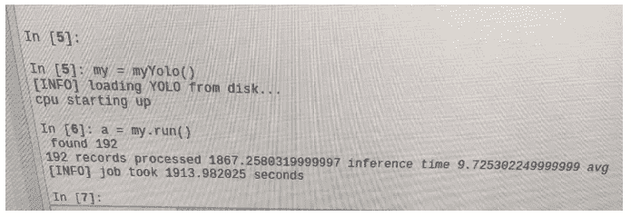

# 升级和重建主机

> 原文：<https://towardsdatascience.com/upgrading-and-rebuilding-the-host-6dd4efb347d2?source=collection_archive---------27----------------------->

## [从零开始逐个任务地进行数据科学](https://towardsdatascience.com/tagged/dofromscratch)

## 在我最后一次通宵黑客攻击后，事情进展得很快


[丹尼·米勒](https://unsplash.com/@redaquamedia?utm_source=medium&utm_medium=referral)在 [Unsplash](https://unsplash.com?utm_source=medium&utm_medium=referral) 上的照片

如果你开车并经历过左前爆胎，我可以很舒服地说，我知道你看到 [Denny Müller](https://unsplash.com/@redaquamedia?utm_source=medium&utm_medium=referral) 在 [Unsplash](https://unsplash.com?utm_source=medium&utm_medium=referral) 上发布的照片时的感受。在我的驾驶生涯中，我有过两次危险的井喷。有一次，在进入一个急转弯时，我的轮胎爆裂了，失去了控制，那真是太可怕了。最近，在另一个急转弯时，我撞到了一块岩石，粉碎了我的左前轮。一次完全不可思议且令人心痛的经历。当我说 ***“在我的日志文件中找不到支持 Cuda 的设备”*** 对我来说是一次同样痛苦和令人沮丧的经历，而且不像爆胎那样容易修复，也许你不一定同意。

如果你一直在阅读我的文章，你会从我的上一篇文章中知道[我熬了一个通宵——在 Ubuntu 20.4 LTS 上配置 GPU 库](/pulling-an-all-nighter-e27b18ad96c7)。在我的数据科学机器上配置了 TensorFlow GPU 和 OpenCV 4.0，这很难抑制我纯粹的兴奋。不过，我并不那么有信心，就像那些瘪了的轮胎一样，事情可能而且经常会出错。从字面上看，我期望整件事都破裂， ***果然如此。***

依附神赢得了另一场战斗。让我们讨论一下发生了什么，以及我是如何解决的。这次我感觉更舒服了，但只有时间会证明一切。


照片由[哈桑·阿尔马西](https://unsplash.com/@hasanalmasi?utm_source=medium&utm_medium=referral)在 [Unsplash](https://unsplash.com?utm_source=medium&utm_medium=referral) 上拍摄

# 发生了什么

我所知道的和表面上的事实如下。12 月 31 日，我安装了 TensorFlow 2.0 GPU，用 Cuda 库编译了 OpenCV。我还安装了 Virtual Box，并用一些 Ubuntu 和 Windows VM 做了一些工作。2021 年 1 月的第一周，一切都很好。由于一切都运行良好，我创建了一个 FastApi 端点并包装了我的 Yolo 类，为我提供了一个我可以使用的端点。我对这个设置很满意。使用 Curl 或 Postman，我可以向端点发送一张照片，并取回在 JSON 中检测到的对象。API 的响应时间非常好。我的下一步是集成 webhook 和来自 Motion Eye 设备的调用，使我走向实时触发和警报。我取得了这么大的进步，这看起来很疯狂。

我有一些专业的东西需要我 120%的注意力，但我记得 Ubuntu 上的一些更新，我选择在我的构建中实现它们。这似乎是一个错误的举动！更新后，我用我的鸟类检测相机，想知道 Yolo 是否会正确检测和分类当地的鸟类。所以我对我的 FastAPI 端点进行了 API 调用，并发出了第一张图片。在 Postman 中，我收到了来自端点的错误消息。查看日志， ***我发现了“没有找到支持 Cuda 的 GPU”错误*** 。不管你是否同意我的比喻，我感觉我的心脏像被刀捅了一刀。这似乎是我人生旅途中的又一次爆胎。在某种程度上，我对配置和功能的损失感到难过。对于开发机器来说，这可能过于戏剧化了，但是对于生产主机来说，这个错误可能会很麻烦。

然而，不仅仅是我的深度学习工具链被破坏了！ ***虚拟框也开始给我报错*** 。所以我也不能使用我的虚拟机，这也很痛苦。我做过一些 OSINT ( ***开源智能*** )配置，也很享受这段旅程。

在这一点上，我不得不接受一些教训，让我来分享这些，这样你就可以反思你自己的实践。

## 我学到了什么？

对我来说，最大的问题是我不得不接受我熬夜的方式可能导致了我的问题。

第一件事是我已经在我的 Ubuntu 20.04 系统中添加了 Ubuntu 18.04 库。更糟糕的是，我甚至可能将更老的库添加回 16.04。我认为这真的是一个可怕的想法。在发出 sudo add-apt 之前，考虑对系统的影响可能是明智的。

```
sudo add-apt-repository universe
sudo add-apt-repository multiverse
sudo apt update
```

接下来，一些二进制文件中出现了错误和差异。Virtual Box 6 在从主机到客户或客户到主机的复制和粘贴方面存在一些问题。为了解决这个问题，我安装了 Virtual Box 5，但是我在系统上的 APT 库中混合了一些库。

对我来说，最大的教训是那句古老的格言— ***“如果它没坏，就不要修理它！”*** 这适用于在没有做任何研究的情况下接受可能不必要的更新或升级。那才是真正的杀手。

最后一个教训是，我们不能盲目地从教程中复制粘贴命令，从一个教程跳到另一个教程，直到有东西可以用为止！搜索谷歌并执行命令希望修复只会导致一个不稳定的系统和最终的 ***“没有找到支持 Cuda 的设备”。***

我遇到的一些困难的根本原因似乎是 ***未签名的二进制文件，Ubuntu 要求所有二进制文件都要签名*** 。所以我猜是安装了一个安全更新，引发了旧版本的一些问题。

好吧，你可以说，我也听得见，这些东西很复杂，必须加载许多依赖项。这当然不容易，事情可能会出错。我是怎么修好的？嗯，我是通过 ***有条不紊的细心得到的！*** 那是底线。让我解释一下！我是怎么修好的

# 我是怎么修好的

解决我的问题包括几件不同的事情。首先，我必须接受教训，让自己适应用不同的方式做事。然后是一段时间的反思和对主机硬件的回顾。最后确定方向，执行计划，回到正轨。让我用简短的总结来解释这些步骤。

## 反映在主机上并定义所需的硬件

我的 Linux 数据科学工作站最初是为我女儿建造的游戏平台。它是专门为 ***在 ***最大性能*** 下玩模拟人生 4*** 而配置制作的。回想起来，我觉得那是大约 6 年前的事了。当我购买组件时，我的预算有限，所以我添加了一个当时已经被取代的 GPU。我得出的结论是，硬件需要检查和更新。

现在，你可能会说并认为这种升级是可以避免的。毕竟，我在 GTX 750TI 上编译了 CUDA Open CV DNN 模块，我对出错前我的端点的响应时间很满意。事实是我也有编译错误。考虑用 Cuda 构建 OpenCV 的 cmake 命令。

```
cmake -D CMAKE_BUILD_TYPE=RELEASE \
-D CMAKE_INSTALL_PREFIX=/usr/local \
-D INSTALL_PYTHON_EXAMPLES=ON \
-D INSTALL_C_EXAMPLES=OFF \
-D OPENCV_ENABLE_NONFREE=ON \
-D WITH_CUDA=ON \
-D WITH_CUDNN=ON \
-D OPENCV_DNN_CUDA=ON \
-D ENABLE_FAST_MATH=1 \
-D CUDA_FAST_MATH=1 \
***-D CUDA_ARCH_BIN=7.0 \***
-D WITH_CUBLAS=1 \
-D OPENCV_EXTRA_MODULES_PATH=~/opencv_contrib/modules \
-D HAVE_opencv_python3=ON \
-D PYTHON_EXECUTABLE=~/.virtualenvs/opencv_cuda/bin/python \
-D BUILD_EXAMPLES=ON ..
```

特别是 CUDA_ARCH_BIN=7.0，就是麻烦的那一行。同样，您不能只是复制粘贴并执行这个 cmake 命令。在我的系统上，CUDA_ARCH_BIN = 5.0


[摘自 Nivida 的《GPU、CUDA 库和计算能力指南》](https://developer.nvidia.com/cuda-gpus)

尽管如此，用 CUDA_ARCH_BIN = 5.0 编译 Cuda 10，OpenCV 4 只是产生了 Cuda 编译错误。于是我尝试了 Cuda 9，用 CUDA_ARCH_BIN = 5.0 打开 CV 3。然后我得到一条错误消息，告诉我 5.0 不是允许的值，需要 CUDA_ARCH_BIN > 5.3。所以你知道这一切将走向何方。 我很难解释甚至回忆起我有多少次擦系统，安装了一个全新的 Ubuntu 安装，调用了 CMake，安装了 TensorFlow GPU。TensorFlow 有很好的记录，并不是真正的问题；相反，我努力编译 OpenCV 来获得我的 CV2 Python 与 Cuda 的绑定。最后，我决定是时候换一个新的显卡了。

我目前的 GPU 是 GTX 750Ti，根据英伟达的说法，这是“[第一代英伟达 Maxwell 架构](https://developer.nvidia.com/maxwell-compute-architecture)”。如果您愿意，可以在 NVIDIA 产品网站上找到完整的规格。最新的 GPU 架构是 Ampere——NVIDIA 的第二代 RTX 架构，在 NVIDIA 的产品特定页面 *有很好的描述。*现在，从第一代 Maxwell 转向第二代 RTX 将需要一大笔钱，这也将是痛苦的。痛苦在于，需要用许多啤酒代币来换取另一个 GPU，而这些卡供应有限，在新冠肺炎全球疫情期间不可能在爱尔兰买到。

## 云计算与内部部署

我们都会抓住的另一个论点是 IBM、Google、Oracle、AWS 和 Microsoft 上可用的 GPU 实例。我们应该租用 GPU 实例，而不是购买、安装和配置本地工作站。这个问题永远不会有直截了当的答案。这将归结为项目，可用的预算，安全和隐私的要求。

将我的前门系统连接到公共云，我会感到不舒服。想想这篇文章“几十个人说他们在家里的智能摄像头被黑后受到了死亡威胁、种族诽谤和勒索。”来自[守护者](https://www.theguardian.com/technology/2020/dec/23/amazon-ring-camera-hack-lawsuit-threats)。

考虑运行一项服务所需的系统数量至关重要。这些是:

*   生产实例；
*   预生产、试运行或用户测试环境；
*   集成测试代码的开发环境；
*   面向个人工程师的开发机器

当我们从环境数量的角度来看这种情况时，使用基于云的服务的价值就变得更加明显了。当我们谈论一个个人工作站来做实验、设计服务和写书或写论文时，云并没有多大意义。我在 AWS 上有基于 GPU 的虚拟机，但偶尔我会收到巨额账单，因为我忘了关闭开发机器。

考虑到所有的事情，我决定购买一张新卡，并安装在我现有的系统中。我很了解云的论点，但我也知道事情可能会很快失控。

## 制定计划

做出购买新卡的决定后，我开始寻找我能得到的东西。这里的新冠肺炎疫情比以往任何时候都更糟糕，此外，我们还受到英国退出欧盟的影响。经过一番寻找，我设法得到了一个 Quadro P2000 交付。对我来说，Quadro P2000 产品描述包含了一些要点。它拥有一个“ ***Pascal GPU，拥有 1024 个 CUDA 内核，超大 5 GB GDDR5 板载内存“*** ，来自 [Nvidia](https://www.nvidia.com/content/dam/en-zz/Solutions/design-visualization/productspage/quadro/quadro-desktop/quadro-pascal-p2000-data-sheet-us-nvidia-704443-r2-web.pdf) 产品页面。

从第一代 Maxwell 架构转移到 Pascal 框架允许我从 ***计算能力 5.0 跳到 6.1。对我来说，就所涉及的金钱而言，这似乎是合理的。有了新设备，剩下的就是安装卡并让它工作！ ***执行计划老兄！******

## 执行计划

由于工作站是我自己建造的，所以我很容易就能打开盖子，接触到机器的内部。移除几个螺丝让我可以将 GPU 从插槽中取出。请不要忘记， ***主板有一个锁紧机构*** ，在插卡之前必须打开。否则，你会弄坏东西的！安装卡、更换外壳和连接外围设备非常简单。我没有把我的显示器直接插入 GPU 卡，因为我的 CPU 芯片上也有一个 ***GPU。在训练深度神经网络时，最好移除屏幕工作负载，甚至直接启动到终端。使用带有 UI 的计算机对 GPU 来说是一个很大的工作量，会降低速度。 ***你不能一边看《网飞》，一边你的深度神经网络在同一台机器上训练！******

我决定最好清除硬盘，安装 Ubuntu 18.04 作为新的安装程序，重新进行配置。环顾四周，阅读 NVIDIA CUDA 文档，显示对 Ubuntu 20.04 的参考相对较少，所以我认为我应该继续使用 18.04。

为了配置***tensor flow 2.0***我使用了以下教程

<https://www.pyimagesearch.com/2019/12/09/how-to-install-tensorflow-2-0-on-ubuntu/>  

为了配置 ***OpenCV DNN 和 Cuda*** 我使用了这个教程

<https://www.pyimagesearch.com/2020/02/03/how-to-use-opencvs-dnn-module-with-nvidia-gpus-cuda-and-cudnn/>  

对于虚拟盒子，我使用的是版本 6.0.24，如下所示，但我已经得到了 ***关于更新版本*** 的通知。抵抗 ***不是徒劳的！*** 忽略它！


作者显示“关于虚拟框”对话框的图像


作者展示虚拟盒子升级通知的图片。

双向复制和粘贴功能 ***不工作*** ，但我已经决定生活没有这些。在我的新 Ubuntu 系统上安装 Virtual Box 5.0 失败。

这次 ***我没有添加任何新的库*** 。没有 sudo apt-add！但是我已经从 Ubuntu 18.04 得到了两个“系统问题”的报告。我又一次担心这个新版本会很快遇到问题。

靶心——一切又恢复了。OMG！我的 Yolo 课程终于又开始工作了，这是多么美妙的一刻啊。 ***'模块不是用 CUDA 编译的！'再也没有了！*** 下面你可以看到一段处理要使用的设备的代码。

```
coprocessor = {
'***cuda***': {
 'backend' : cv2.dnn.DNN_BACKEND_CUDA,
 'target' : cv2.dnn.DNN_TARGET_CUDA
},
'***cpu***': {
 'backend': cv2.dnn.DNN_BACKEND_DEFAULT,
 'target': cv2.dnn.DNN_TARGET_CPU
},
'***myriad***': {
 'backend' : cv2.dnn.DNN_BACKEND_INFERENCE_ENGINE,
 'target' : cv2.dnn.DNN_TARGET_MYRIAD
}
}
```


照片由[安妮·尼加德](https://unsplash.com/@polarmermaid?utm_source=medium&utm_medium=referral)在 [Unsplash](https://unsplash.com?utm_source=medium&utm_medium=referral) 拍摄

随着系统的工作，但很明显，操作系统级的问题存在，我可以再次考虑前进。

# 走向

要回到我原来的位置，还有很多工作要做。 **Nginx** 必须安装， **Gunicorn，FastAPI** ，我需要重新做 ***我的 OSINT 虚拟机*** 。但这是个好日子！我的 GPU 升级了，性能也提高了。当然，我安装可视代码是我做的第一件事！为了说明新的性能，我进行了一些测试。

```
from myYoloC import myYolo
my = myYolo(device='cuda')
a = my.run()
myY = myYolo(device='cpu')
a = myY.run()
```

之前我创建了一个名为 myYolo 的类，在上面的代码中，我简单地用两个不同的设备创建了该对象的一个实例。示例“my”是用 Cuda 后端和分配给 CPU 的“myY”模型制作的。五个代码 ***行简直可以击垮我的精神，*** 但是我必须勇敢的去执行它们。关于可视代码，我非常喜欢的一个特性是虚拟环境支持。


作者展示可用 Python 环境的图片

我的 opencv_cuda 环境包含了用 cuda 编译的 OpenCV 4.0 版本。我的“dl4cv”虚拟环境具有 TensorFlow GPU 配置。这与 pyimagesearch.com 的指导是一致的。

选择正确的环境允许我运行代码。


代码执行后作者从可视代码中获取的图像

因此，从磁盘加载 Yolo，并向前传递 192 张照片，拍摄了 7.57 秒的*，平均每张照片花费了*0.039 秒。这是新 GPU 的出色表现。在 CPU 上花费了 44.75 秒，平均每张图片 0.23 秒。这也不错，但是用户不会喜欢这样的延迟。围绕 CPU 和 GPU 信令，当然还有两个代码片段中的模块加载，大约有 7 秒钟的构造和解构造任务。**

**当我在 GTX 750TI 上运行同样的代码时，我得到了不同的答案。这毕竟是第一代麦克斯韦和帕斯卡，所以如果答案是一样的，我会感到惊讶。正如下面的截图，从我的上一篇文章中可以看出，Maxwell 的 GPU 平均值为 ***.13，而 Pascal*** 的 GPU 平均值为. 04。那大约是 ***时间*** 的 1/3。太神奇了！同样的工作 ***在老款 GPU 上需要 31 秒，而在新卡*** 上只需要 14 秒。**

****

**图片由作者基于前一篇文章。**

**无论我们安装什么样的 GPU，基于 CPU 的处理都不会改变。我没有在 Linux 机器上安装 OpenVino，所以我不知道 Intel Myriad 设备会怎样。在 Raspberry Pi 板上，我们知道 Myriad 很快。**

********

**图片由前一篇文章的作者提供**

**从上面的图片中，右上方显示了基于 CPU 的 ARM 处理器，配备了 Raspberry Pi 4 8GB——这项工作花费了*32 分钟，一切都变得很紧张。在 Myriad 上，左上 ***同样的工作量用了 3 分钟*** 。我猜这些统计数据证明了为什么使用 Pascal 架构对我如此有吸引力。装备更好的 Linux 工作站可以在 14 秒内用 192 幅图像进行正向传递神经网络推理。这些事实都让我非常兴奋，继续我的任务，使用 Yolo、计算机视觉和廉价的基于 Raspberry Pi 的运动检测器来计数经过的车辆。***

**蛋糕上的糖衣也许可以用 TensorFlow 来演示**

```
**import tensorflow as tf
print(tf.__version__)
print(tf.test.is_gpu_available())**
```

****

**图片由 is_gpu_available()的结果作者提供**

# **is_gpu_available() = True**

**是不是很神奇？有一种轮胎被修理过的感觉。我车上所有的轮子都是对的，我在开阔的道路上行驶。尽情享受吧！**

****

**照片由 [KAUE FONSECA](https://unsplash.com/@kauefonseca?utm_source=medium&utm_medium=referral) 在 [Unsplash](https://unsplash.com?utm_source=medium&utm_medium=referral) 上拍摄**