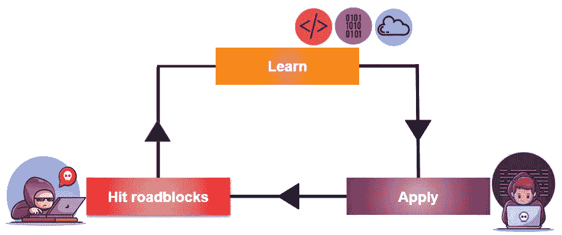
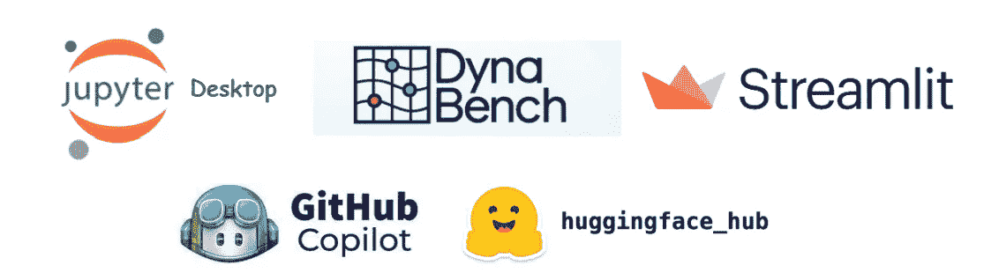
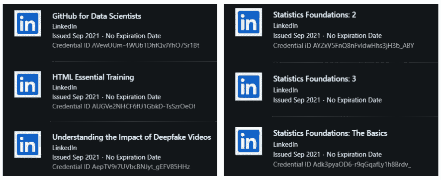
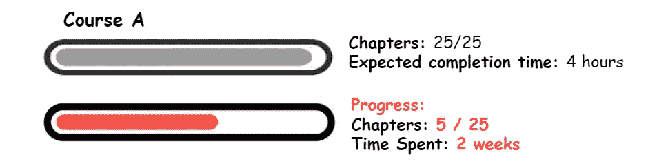
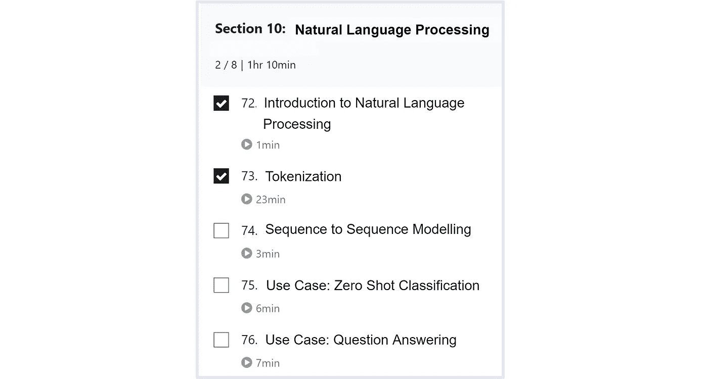
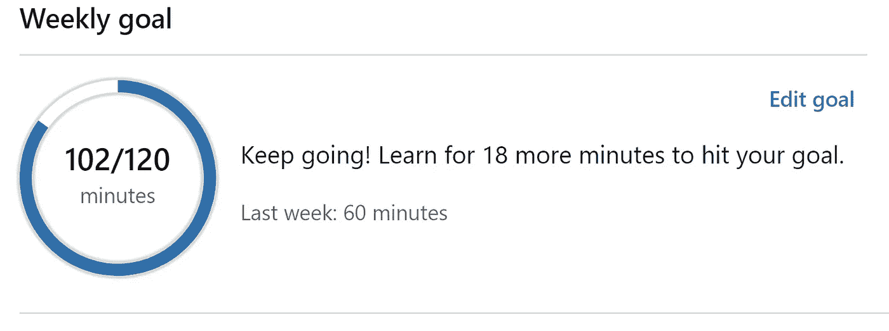
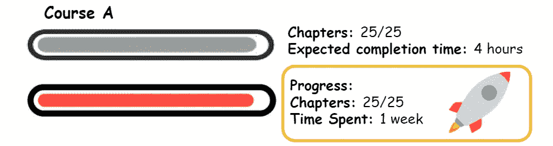

# 作为数据科学领域的职业成年人的技能提升

> 原文：<https://towardsdatascience.com/upskill-as-a-working-adult-in-the-data-science-field-c51da3d07006?source=collection_archive---------20----------------------->

## 我在一个月内完成了 6 门在线课程，以下是我的方法

作者照片

如果你是数据科学从业者或与数据科学团队密切合作，你会意识到总是需要继续提升工作任务或有趣的副业项目的技能。

作者照片

数据科学领域非常广泛，各行业不断推出新的平台/包。数据科学领域的任何职位都需要继续保持和掌握新技能。取决于任务的紧急程度，学习-应用-遇到障碍的循环可能会加快。

9 月，我开始担任数据科学主管的新职务。这从一整套不同的挑战开始，例如处理几 TB 的数据、可视化这些数据的趋势以及管理利益相关者的期望。

随着向新角色的转变，我利用这个机会提升了自己应对新挑战所需的一些基本技能，并在一个月内完成了 6 门课程。

作者照片

现在，任何订阅过在线课程的人都知道，完成整个课程并不是一帆风顺的。一个 4 小时的课程不需要花 3 个小时来完成。将它乘以 3 倍的可能性更大，或者它可能永远不会完成，因为大多数人中途停下来，让它无人照管。

作者照片

这里有一些关于如何完成在线课程以及如何在这个过程中最大化学习的有价值的提示。

# 内容

*   看一眼终点线
*   设定雄心勃勃的目标
*   每天一口的大小

# 看一眼终点线

激励我们参加在线课程的一件事是知道在终点线等待我们的是什么水果。

我强烈建议在订阅课程后立即执行这一步骤。成为流氓，直接滚动到最后几章，看看高级话题是什么样子的。

现在，回想一下，所有通向大结局的章节都是完成一个相对更复杂的任务的基础。

肯·苏亚雷斯在 [Unsplash](https://unsplash.com?utm_source=medium&utm_medium=referral) 上的照片

这将培养我们作为学习者理解较小模块的毅力，并有助于将我们推向终点线。

# 设定雄心勃勃的目标

在成年人的工作生活中，参加在线课程不再仅仅是为了通过考试。我们也可能没有人在背后给我们施压，要求我们完成一门课程。这有时会导致我们一旦认为我们学得足够多，甚至更糟，失去兴趣，就放弃了。

为了克服这一点，在开始时设定一个雄心勃勃的最终目标可以提供完成课程的动力。

照片由[谢恩](https://unsplash.com/@theyshane?utm_source=medium&utm_medium=referral)在 [Unsplash](https://unsplash.com?utm_source=medium&utm_medium=referral) 上拍摄

目标是不同的，通常对学习者来说是个人的，促使他/她首先学习一门课程。然而，我们的目标不应该是一个唾手可得的果实，而是一个令人兴奋的、当我们想到它时会让我们夜不能寐的果实。

供参考的一些目标:

*   通过添加认证来提升专业形象
*   提高完成经理分配的任务的能力
*   构建有趣的辅助项目

# 每天一口的大小

在 [Coursera](https://www.coursera.org/) 、 [Linked in Learning](https://www.linkedin.com/learning) 或 [Udemy](https://www.udemy.com/) 等学习平台上选修任何一门课程，你会发现这门课程被精心制作成了一个个小章节。每个单元持续时间为 3 至 10 分钟。这是有意在合理的时间内吸引学习者的注意力。

我发现致力于学习在线课程的一个有效策略是利用平台的功能。**目标是在更短的时间内完成更小的里程碑。对我来说，这意味着每天坚持几个小节。**

作者照片

或者，可以在 [LinkedIn Learning](https://www.linkedin.com/learning/) 上设定每周目标。这很好地让我们保持在正轨上，如果我们比计划晚了，可以在周末进行冲刺。

作者照片

订阅一门课程并不仅仅是为了走完这段旅程并完成它。对于数据科学从业者来说尤其如此。这里的目标是最大限度地学习特定主题，并将其应用于我们面临的棘手问题。

学习，弄脏你的手，创造出令人敬畏的产品。

作者照片

下次见！