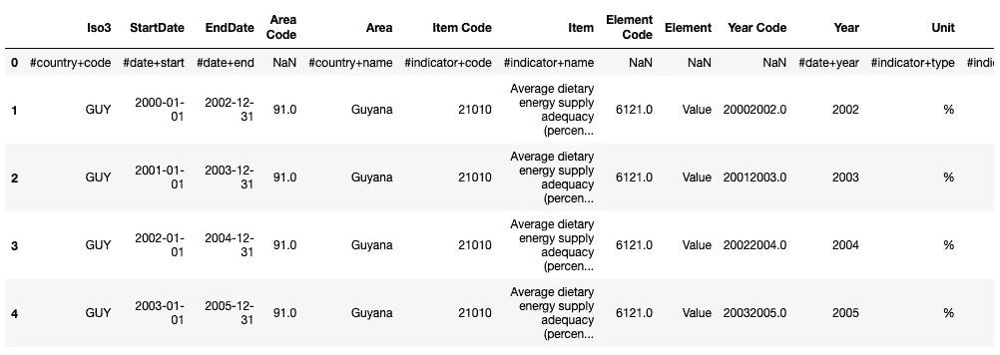
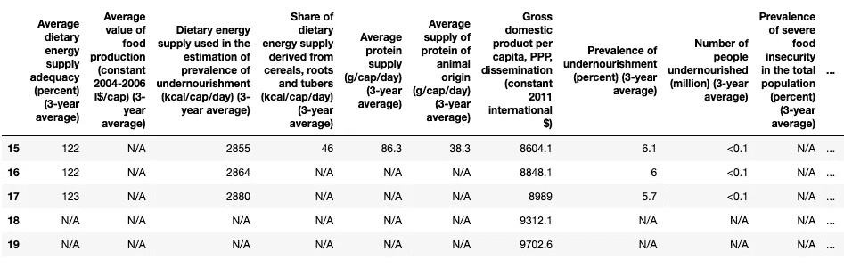
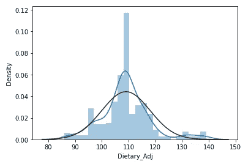
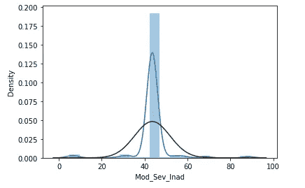
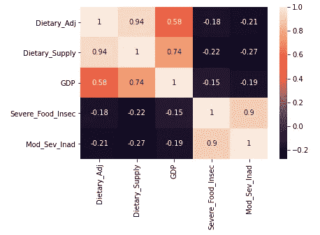
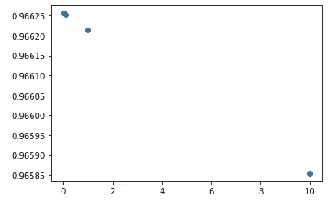
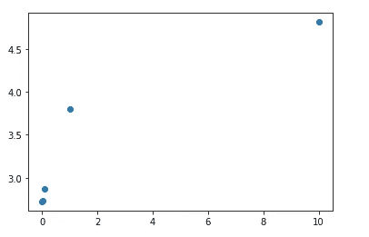

# 城市健康第 2 部分:预测发展中国家的粮食不安全

> 原文：<https://towardsdatascience.com/urban-health-part-2-predicting-food-insecurity-in-developing-countries-8cf39e15ecec?source=collection_archive---------41----------------------->


照片由[nguyễn](https://unsplash.com/@ddawng_rosie?utm_source=medium&utm_medium=referral)在 [Unsplash](https://unsplash.com?utm_source=medium&utm_medium=referral) 上拍摄

这个故事是我的城市健康教程的第二部分。在这个故事中，我们将使用各种机器学习技术预测发展中国家的粮食不安全状况。你可以在这里找到第一部分:[https://towards data science . com/healthy-cities-in-the-us-part-1-food-62b 9724467 E8](/healthiest-cities-in-the-us-part-1-food-62b9724467e8)

## **工具和数据**

*   Python，Jupyter 笔记本，Sklearn，Pandas，Numpy，Seaborn，Scipy
*   数据:[https://data.humdata.org/dataset](https://data.humdata.org/dataset)

该数据集是通过收集 28 个国家的食品数据创建的，包含以下变量:

```
'Dietary_Adj', 'Food_Production', 'Dietary_Supply', 'Cereal_Supply',
       'Average protein supply (g/cap/day) (3-year average)',
       'Average supply of protein of animal origin (g/cap/day) (3-year average)',
       'GDP', 'Prevalence of undernourishment (percent) (3-year average)',
       'Number of people undernourished (million) (3-year average)',
       'Severe_Food_Insec', 'Mod_Sev_Inad',
       'Number of severely food insecure people (million) (3-year average)',
       'Number of moderately or severely food insecure people (million) (3-year average)',
       'Cereal import dependency ratio (percent) (3-year average)',
       'Percent of arable land equipped for irrigation (percent) (3-year average)',
       'Value of food imports in total merchandise exports (percent) (3-year average)',
       'Political stability and absence of violence/terrorism (index)',
       'Per capita food production variability (constant 2004-2006 thousand int$ per capita)',
       'Per capita food supply variability (kcal/cap/day)',
       'Percentage of population using at least basic drinking water services (percent)',
       'Percentage of population using at least basic sanitation services (percent)',
       'Percentage of children under 5 years affected by wasting (percent)',
       'Percentage of children under 5 years of age who are stunted (percent)',
       'Percentage of children under 5 years of age who are overweight (percent)',
       'Prevalence of obesity in the adult population (18 years and older)',
       'Prevalence of anemia among women of reproductive age (15-49 years)',
       'Prevalence of exclusive breastfeeding among infants 0-5 months of age',
       'Prevalence of low birthweight (percent)'
```

## **数据清理和预处理**

初始数据包括 2003 年至 2019 年期间约 28 个国家及其食品相关指标。这是一张快照:



如您所见，这些指标分布在各个行上，每一行都代表该特定指标一年的价值。让我们转换数据，将这些变量作为列名:

以下是更改后的数据集:



在我们继续可视化之前，我们还需要修正 NaNs 和 N/A 类型值。使用此函数可以轻松解决前者:

为了固定 N/A 虚拟值，我将它们替换为 1，然后取每列中其他非 1 值的平均值，如下所示:

## (英)可视化(= visualization)

现在我们有了一个干净的数据集，让我们更熟悉一下这些数据。我们将寻找正态分布，因为正态是机器学习数据的一般假设。首先，这是一张所有国家平均膳食能量供应充足度的图表，符合一条相对正常的正态分布线:



接下来，让我们看看另一个变量是如何分布的，即“中度和重度食物不足”，它看起来也聚集在 40 左右，但仍然是正常的:



接下来，我们希望这些变量中的许多变量相互关联，因为它们是不同的饮食指标。让我们使用热图 **:** 来想象一下



正如你所看到的，诸如膳食供应等变量与食物不足呈负相关，这是可以预料的。然而，国内生产总值与膳食充足性的相关性很弱(0.58)，这可能令人惊讶。

## 线性回归

现在，我们可以开始让模型适合我们的数据集。我们将使用数据中的所有列(除了我们正在预测的那一列)来预测平均膳食能量供应充足性。我们可以从一个简单的线性回归模型开始:

我们使用的测试规模为数据的 0.2 或 20%，随机状态等于 27。让我们看看斜率和截距是多少:

*   **系数(斜率):**56660 . 68686868661
*   **截距:**【4.64360863 e-03，3.89312086e-02，-6.49480051e-02，-1.59175835e-02，
    1.38100769e-02，-1.06957325e-04，7.38095045e-02，6.35949018e-03

为了衡量我们的模型有多好，我们可以使用 sklearn 的一些内置指标:

*   均方误差

顾名思义，均方误差衡量的是误差平方的平均值。误差被定义为实际值和预测值之间的差异。线性回归模型的误差约为 2.72。与以下两个指标一起，它可以用来确定一个模型有多好。

*   绝对平均误差

平均绝对误差是误差绝对值的平均值，在我们的模型中，它约为 1.65。

*   r 的平方

R square 衡量数据点与模型预测线的接近程度。分数越高，模型的表现越好。

## 里脊回归

我们也可以使用岭回归来预测我们的变量。当数据存在多重共线性时，通常使用岭回归，即当一些预测变量与其他预测变量相关时，其主要好处是**避免数据**的过度拟合。这个模型可以很容易地构建成这样:

现在，让我们看看山脊模型的三个指标:

*   r 的平方值:0.9662149081149515
*   平均绝对误差:1.6。36860.68686868661
*   均方误差:2。38860 . 68868686861

R 平方值略低于线性回归模型，因为平均绝对误差和均方误差非常相似。我们能进一步调整这个模型以提高它的性能吗？

## 测试各种α值

在这里，我们将查看一组将传递给模型的 alpha 值，然后构建一个散点图来查看它们的 R 平方值:



如您所见，alpha 的最佳值是 0.001 和 0.01，因为它们产生最高的 R 平方值。

## 套索回归

另一种回归技术是套索回归。它与岭回归有相似的用例，因为它也减少了过度拟合。拟合该模型的代码如下:

以下是 lasso 回归的指标:

*   r 的平方是:0.964876876866
*   平均绝对误差:1.646868686866
*   均方误差:2.864886888866

lasso 回归的指标稍差，尤其是误差值。我们可以使用不同的 alpha 值来优化模型吗？

## 测试各种α值

让我们像处理岭回归一样输入多个α值。下面是 alpha 数组(0.001，0.01，0.1，1，10)与均方误差的散点图:



如您所见，alpha 值为 0.001、0.01、0.1 时，错误率最低。

## 随机森林

作为我们的最后一个模型，我们将为数据集拟合一个随机森林回归量。这方面的代码如下:

以下是衡量标准:

*   r 的平方是:0.987686868866
*   均方误差:1.00003863686
*   平均绝对误差:1.000038686866

需要注意的一点是，随机森林模型的误差值似乎有所减少，这可能会使其更好地用于现实世界的数据集。

## 做预测

现在我们已经建立了几个模型，我们可以用它们来做一些预测。让我们挑选一些国家，比如塞尔维亚和印度尼西亚，看看这个模型对他们的平均膳食能量供应充足性的预测是什么:

从上面可以看出，模型预测值分别为 119.07 和 114.52。现在我们已经建立了一些模型并对它们进行了评估，是时候继续建立神经网络来进行与食物相关的预测了。这将是本系列的第 3 部分。感谢您的阅读，您可以在这里找到代码:

[](https://github.com/DeaBardhoshi/Data-Science-Projects/blob/main/Urban%20Health%2C%20Part%202%20Developing%20Countries%20-%20Machine%20Learning%20Algorithms.ipynb) [## 数据科学项目

### 在 GitHub 上创建一个帐户，为 DeaBardhoshi/数据科学项目的发展做出贡献。

github.com](https://github.com/DeaBardhoshi/Data-Science-Projects/blob/main/Urban%20Health%2C%20Part%202%20Developing%20Countries%20-%20Machine%20Learning%20Algorithms.ipynb)