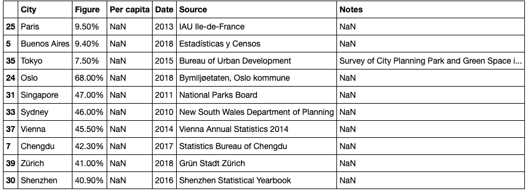

# 城市中的数据科学:一个故事

> 原文：<https://towardsdatascience.com/urbanism-for-developing-cities-a-data-science-perspective-d53d0fb824b7?source=collection_archive---------33----------------------->

美国宇航局在 [Unsplash](https://unsplash.com?utm_source=medium&utm_medium=referral) 拍摄的照片

问题:如何利用数据科学来帮助我们更好地了解发展中的城市？

你好中号！

数据科学是一个跨学科领域，其大部分应用仍未开发。数据科学可以帮助改善的领域之一是城市规划和发展。例如，我一直对“智能城市”的概念很感兴趣，也就是被设计成尽可能高效的城市。在本教程中，我们将看看地拉那，阿尔巴尼亚的首都，也是我的家乡。现在，地拉那远远不符合“智能城市”的描述——事实上，地拉那在很大程度上是一个发展中国家的首都:熙熙攘攘，脏乱不堪，充满活力。

通过与城市中的其他人交谈，我听到最多的一个抱怨是城市过于拥挤:交通太拥挤，建筑太多，绿色和休闲空间太少。所以我想，我们能不能用数据科学来更仔细地看待这个说法？让我们开始吧:

首先，指导这一过程的几点:

*   地拉那的人口密度在世界城市中排名很高吗
*   地拉那是否缺少绿色空间(也就是说，没有足够的空间供居住在那里的每个人使用)？

要使用的库:

让我们看看地拉那的人口数量和密度。对于这部分，我将使用来自 [opendata.tirana.al](http://opendata.tirana.al) 的 GeoJSON 数据。地拉那的城市分为 11 个行政区，每个行政区有不同的面积和人口数:“states”是一个 GeoPandas 数据框，显示每个地区及其相应的对称性，“pa”显示每个地区的 2020 人口。

管理员。区域及其各自的多边形

每个行政区的人口(在“人口亚洲 _2020”下)。区域

现在，让我们通过使用人口除以表面积来查看每个区域的密度，如下所示:首先，我们创建一个数据框架，其中包含每个行政区域的人口和表面积数据。然后，我们计算密度，将它们作为一列添加，并将几何多边形添加到数据帧中。在此基础上，我们绘制数据帧，用不同颜色显示密度:

如你所见，这些区域有不同的密度。但是什么是平均密度，它与不同的世界城市相比如何？下面，您可以找到返回平均密度为 **20229.54889607044** 的 Python 计算，以及从联合国收集的城市密度数据集:

现在，让我们使用条形图绘制该数据集，x 轴为国家，y 轴为密度:

正如你所看到的，地拉那的城市在列表中名列前茅(请记住，这一数据仅涉及城市人口，尽管地拉那包括 8 个农村地区)。

现在，让我们看看地拉那的绿色空间。为了回答它们是否足够多的问题，我们首先需要像上一节中的多边形一样可视化和绘制数据。我找不到地拉那公园的任何 GeoJSON 数据，所以我访问了 Geojson.io 并手工绘制了这些区域，然后将其导出到 Geojson 文件中。然后，我可以用 geopandas 读取该文件，结果如下:

多边形显示地拉那的公园和娱乐区

为了测量有多少绿色空间，我决定使用 shapely 来计算每个多边形的面积。基本上，坐标列表包含了所有绿色空间的几何形状，但是是以弧度的形式，然后 area_greens 计算坐标中每个元素的面积，单位是平方公里。

如果我们把面积加起来，大约有 4.02815753409 平方公里。地拉那市区总面积为 41.8 平方公里。因此，地拉那大约有 10%的绿地。具体来说，它与其他世界城市相比如何？嗯，看看下面排序的数据集，地拉那的身材排名最接近巴黎(令人惊讶！)和布宜诺斯艾利斯。

世界城市,“数字”是绿色区域的百分比

现在我们知道了地拉那与其他城市相比如何，我们如何决定是否有足够的绿色空间给它的每个居住者？为了回答这个问题，我们需要有某种考虑到绿地比例和密度的指标。绿地比例除以人口密度怎么样？为了解释这一点，我们可以认为大的值意味着人们有更多的绿色空间，小的值意味着更少的空间。下面的单元格对地拉那和数据集中的其他城市进行计算，然后绘制结果:

我们计算的度量标绘了

**结论:**

正如我们在这个简短的教程中看到的，与其他世界城市相比，地拉那看起来确实人口过剩。此外，该市居民认为该市缺乏绿色空间的想法可能是正确的，在比例和比例/密度这两项指标上排名都很低。

*   另外，如果您对本教程的代码感兴趣，可以在下面找到它:

<https://github.com/DeaBardhoshi/Data-Science-Projects/blob/main/Project%203%2C%20Is%20Tirana%20Overpopulated_.ipynb>  

感谢阅读！