# (几乎)免费使用量子云

> 原文：<https://towardsdatascience.com/use-a-quantum-cloud-for-almost-free-13da8f1dfa34?source=collection_archive---------11----------------------->

## 实用量子计算 AWS Braket 101


演职员表:[佩克斯公司的弗拉达·卡尔波维奇](https://www.pexels.com/@vlada-karpovich/)

**这个故事是关于地理和社会包容的！**

**地理包容性**:量子计算机目前并不便宜(我们谈到了 1500 万美元的投资)，更不用说设置它的知识了。好消息是，地球上的任何人都可以通过云平台开始使用量子计算机。所以，不管你住在挪威、美国、秘鲁还是博茨瓦纳。只要你能上网，你就能在量子电路上运行程序。不幸的是，它们不是完全免费的，但是它们的价格是可以接受的(例如每次运行 0.3 美元)。

社会包容:在这篇文章中，我将介绍其中一个平台。这不是一个过于全面的指南，我也没有将这个平台与其他平台进行比较。我想让你展示在量子电路上运行程序是多么容易。需要量子物理博士吗？显然这样更好，但是如果你只是一个高中生，你可以从这里开始，如果你喜欢，你可以在将来继续。还有，姑娘们这不是书呆子气的东西，你们可能会喜欢:-)所以我们先从亚马逊 Braket 说起。

# 1.初始步骤

Amazon Braket 是一个易于在线访问的平台。这是一个量子计算平台，允许访问来自不同公司(D-Wave、IonQ、Rigetti)的多个量子设备，使用它的一种方式是通过 [Braket Python SDK](https://github.com/aws/amazon-braket-sdk-python) 。我会指导你基本的步骤。老实说，我更喜欢 IBM QPU(实际上完全免费)和 Qiskit，但我认为正是因为这个原因，我将来会在 dept 教程中写得更多。无论如何，这里让我们首先关注 Braket。

首先，**打开浏览器，进入网址**[**https://aws.amazon.com/braket/**](https://aws.amazon.com/braket/)

然后，您必须**选择一个北美云和一个数据存储库**。亚马逊 Braket 将您的算法结果存储在任何亚马逊 S3 桶中。

我们可以**选择量子处理器** (D-wave，IonQ，Rigetti)或者模拟器。D-Wave 和 Rigetti 有几种选择。也有可能那些量子机器暂时没有。在您选择之前，让我们先简要了解一下这些连接的设备。这个仪表板实际上更多的是可能性的概述，实际的选择是通过编码进行的。

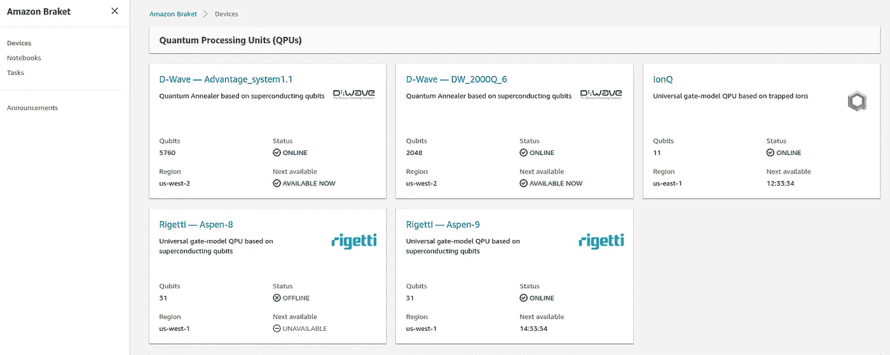

亚马逊 Braket 初始截图

# **D-Wave —优势系统**

Advantage quantum processor unit(QPU)基于量子位和耦合器的物理点阵，称为 Pegasus。飞马架构包括一个重复的结构，其中每个量子位耦合到其他相对排列的量子位。一个基本单位细胞包含 24 个这样的量子位。

D-wave 机器的一个特别之处在于它是一个量子退火器，特别适合优化解决方案。[退火](https://en.wikipedia.org/wiki/Quantum_annealing#:~:text=Quantum%20annealing%20(QA)%20is%20a,size%2Flength%2Fcost%2Fdistance)是一种寻找全局最小值/最大值的元启发式算法。

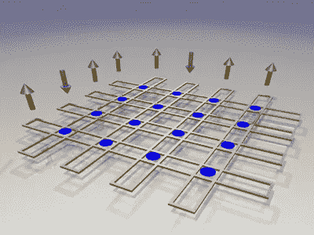

8 个量子位回路(黄金)的示意图。蓝点是允许量子位交换信息的 16 个耦合元件的位置。在数学上，这些元素将你希望计算机解决的问题中的变量结合在一起。演职员表: [D-wave](https://www.dwavesys.com/tutorials/background-reading-series/introduction-d-wave-quantum-hardware#h2-0)

# **IonQ**

IonQ 是一台*通用门量子计算机*，带有俘获离子。更具体地说，有 11 个由镱制成的量子位，带有由激光定义的陷阱链。尽管只有 11 个量子位，但这种拓扑结构非常有趣，因为该设备是完全连接的，这使得量子位交互非常有效。使用来自锁模脉冲激光器的一对[反向传播光束，通过双光子拉曼跃迁给出门。](https://www.nature.com/articles/s41598-018-30743-9)

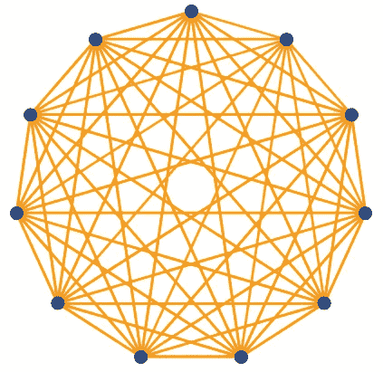

IonQ 拓扑的亚马逊市场图

还有关于校准保真度(两个量子态有多接近的度量)的信息:

```
{
 “braketSchemaHeader”: {
 “name”: “braket.device_schema.ionq.ionq_provider_properties”,
 “version”: “1”
 },
 “fidelity”: {
 “1Q”: {
 “mean”: 0.99717
 },
 “2Q”: {
 “mean”: 0.9696
 },
 “spam”: {
 “mean”: 0.9961
 }
 },
 “timing”: {
 “T1”: 10000,
 “T2”: 0.2,
 “1Q”: 0.000011,
 “2Q”: 0.00021,
 “readout”: 0.000175,
 “reset”: 0.000035
 }
}
```

这意味着我们有 99.7%的机会为一个量子位应用一个门读出与预期相同的状态。

# 里盖蒂

Rigetti 是另一台带有超导量子位的计算机。它有 30 个量子位(大于 10 个量子位),但拓扑结构完全不同:

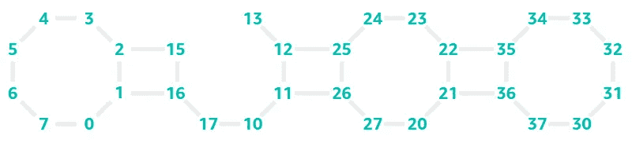

Rigetti Aspen 8 的 Amazon Braket 地块

并非所有的量子位都是相互连接的，这需要在量子位上编程 c-零门时特别注意。例如，我们将需要交换门，这将增加错误测量的机会(量子电路仍然容易出错)。至于 IonQ，Braket 也提供校准信息，包括每个量子位的相干时间。

**T1** 和 **T2** 是 cubit 失去相干性需要多长时间的时间量化(可以存储的时间量子信息量)。

T1 是*自旋晶格弛豫时间，而*测量一个量子位漂移回基态需要多长时间。T2 的退相时间也叫 [*自旋弛豫*或*横向弛豫。* **当一个量子比特处于某个状态，但它开始绕轴旋转时，就会发生去相位(而这显然是不好的)。**为了实现高精度，目标是使这些值尽可能高。](https://en.wikipedia.org/wiki/Spin%E2%80%93spin_relaxation#:~:text=In%20physics%2C%20the%20spin%E2%80%93spin,magnetic%20resonance%20imaging%20(MRI).)

# 模拟器

Braket 还提供了一个多达 34 个量子位模拟器。模拟器只是一台经典计算机伪装成量子计算机。然而，它可以用来测试电路，以及当我们在量子电路上运行它们时，它们的成本是多少。不幸的是，模拟器也不是免费的，但它肯定比真正的量子计算机便宜。

在 Braket 行话中，镜头是一个程序运行的次数(这对成本也有影响)。

一旦你理解了所有这些设置，你就可以启动一个笔记本和一个程序。由于价格是由时间和镜头给出的，请记住，您使用笔记本的次数越多，价格越高**(不要忘记关闭实例，如果您不在乎，我不负责您的账单)**。

# 2.笔记本实例

点击左侧菜单*“笔记本”*进入笔记本部分:

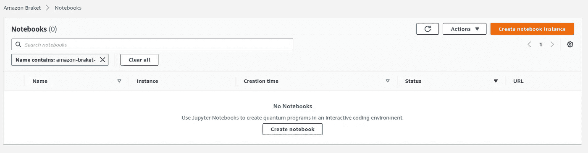

现在点击橙色按钮“创建笔记本实例”。

提供实例名称、实例类型以及是否加密的选项。一旦您启动它，将需要几分钟时间(您可以在菜单中看到“*待定*或“*服务中*”)。

当你看到*“服役中”*时，你可以点击名字，从那里打开 *Jupyter 笔记本*(在那里你可以看到一些例子)。

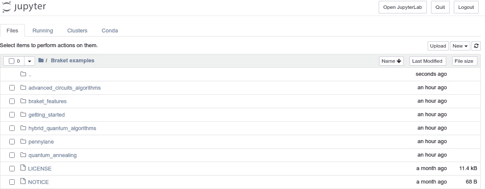

如果你想创建一个新的脚本，点击角落，你可以创建一个新的笔记本(选择 conda_braket)。如果你是全新的，Jupyter 笔记本正在编写网页脚本，我们可以在其中运行 Python 脚本。如果你完全不懂 Python，最好先[学](https://www.learnpython.org/)一些基本语法(import，notation…)。

我通过一个简单的 Python 脚本(就像一个“量子 Hello World”)来指导你，在最相关的一行(以 bell=…)我们建立了一个具有两个量子位的 bell 态。贝尔态是两个[量子位](https://en.wikipedia.org/wiki/Qubit)的四个特定最大纠缠[量子态](https://en.wikipedia.org/wiki/Quantum_states)。

首先在 Box1 中选择量子计算机，导入特定的库，然后我们在 Box2 中定义贝尔态。框 3 中的“运行方法”是实际启动任务的代码行。

在这个例子中，我选择了一个模拟器:

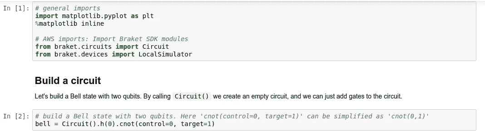

然后将电路提交给本地模拟器并获得结果

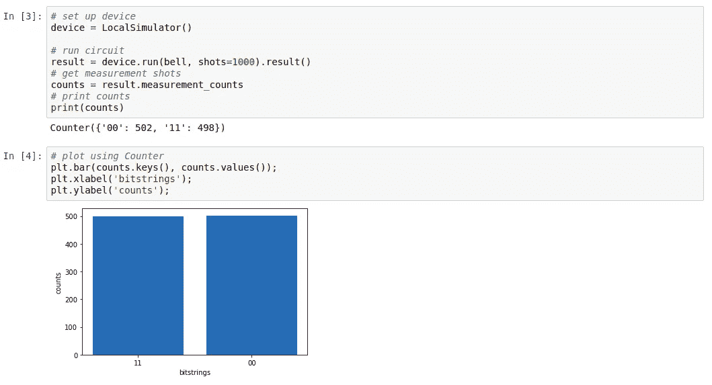

要在 quantum 处理器上运行，请使用以下代码行:

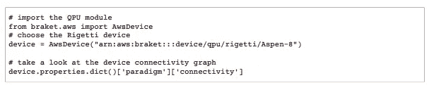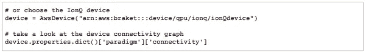

如果我们在模拟器上运行脚本，你会得到上图中绘制的结果，这是因为第一个量子位处于零状态，受控的非门对第二个量子位没有做任何事情，第二个量子位仍然处于零状态。然而，量子位处于一个状态，它将第二个量子位从零状态翻转到一个状态。第一个量子位处于相等的叠加状态，这意味着它有 50%的几率坍缩到零状态，有 50%的几率坍缩到一。

在真实的量子机器上运行的结果可能与 50–50 略有不同，因为真实的量子硬件可能会有误差。这确实是一个独立的话题，目前有几个[解决方案正在调查](https://www.nature.com/articles/s41586-021-03257-0)。

在 Jupyter 笔记本的示例文件夹中，还有一个子文件夹，其中有更多关于 D 波 QPU 和网络分析的有趣示例(如图形划分、最小顶点覆盖问题等)

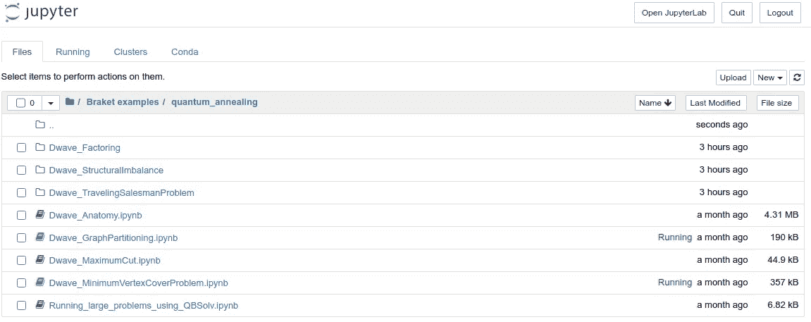

永远记得停止实例，费用很低，但如果你让它每天或每月运行；这将是昂贵的，所以选择实例并停止它:

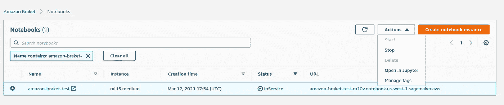

# 3.如何从这里继续

为了保持超级拼版的主题，你可以在这里看到 Python 中使用[其他量子计算库的相同 Bell 对示例。](https://fullstackquantumcomputation.tech/blog/post-tutorial-1-Bell-state/?fbclid=IwAR1erLcp_zxUzJB7GEhSeaDtcLWT94C9kHn-APqRyB70HqV7VeBn-OH7AZc)

如果你想了解更多关于 Braket 云系统的信息，起点大概是[亚马逊 Braket 指南。](https://docs.aws.amazon.com/braket/latest/developerguide/braket-developer-guide.pdf)

关于其他量子云解决方案(Azure 和 IBM)的简要介绍，请查看

<https://medium.com/technology-hits/azure-quantum-computing-b7b9e009de7a>  <https://medium.com/illumination-curated/is-quantum-machine-learning-the-next-thing-6328b594f424>  

# 结论

有了 AWS Braket，你可以真正启动你的量子计算脚本。这是一个让你真正接触量子计算机和模拟器的合理方法。这样，任何人，即使没有量子物理/计算博士学位，在地球上的任何地方(从挪威到卢旺达，从智利到印度)，任何人都可以成为量子开发者。你需要网络连接和信用卡上的一些美元。显然，这还远远算不上高级研究。为此，你需要更多的量子位、更少的噪音和更长的相干时间。11 或 30 个量子位太小，无法实现量子计算机的算法，声称量子优势有用(如寻找整数质因数的[肖尔算法，](https://en.wikipedia.org/wiki/Shor%27s_algorithm)，即使它们在例子中可用)。IBM Quantum cluster 和 Azure 给出了其他替代解决方案。无论如何，这个行业还处于起步阶段，希望所有的量子云在(不久的)将来会更有效率。

# 想连接就连接


[@ Dr _ Alex _ 克里米](https://twitter.com/Dr_Alex_Crimi)


[@ Alec rimi 博士](https://www.instagram.com/dr.alecrimi/)


[https://web.facebook.com/dralecrimi](https://web.facebook.com/dralecrimi)