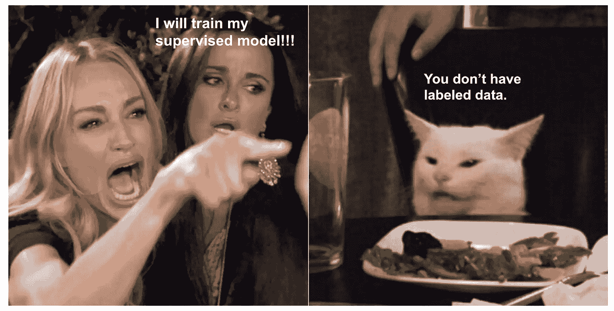
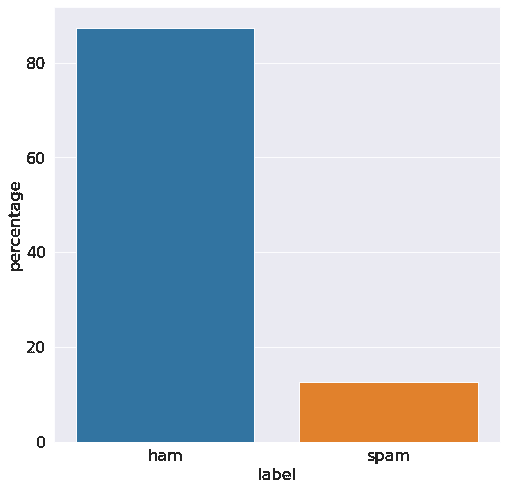
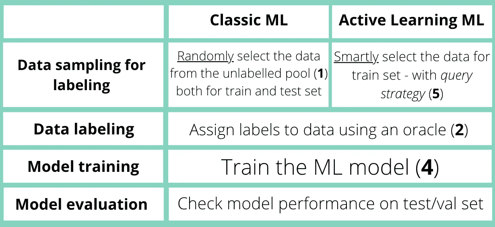
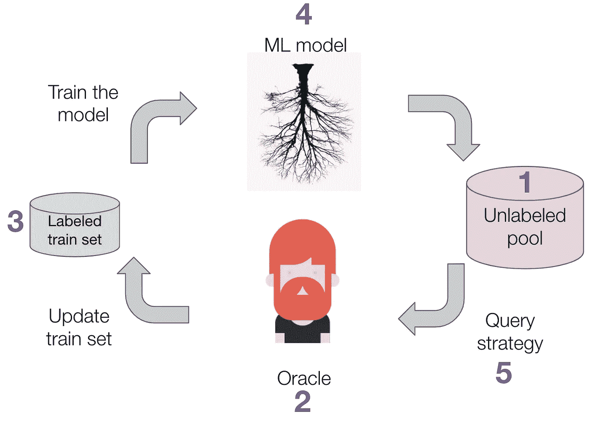
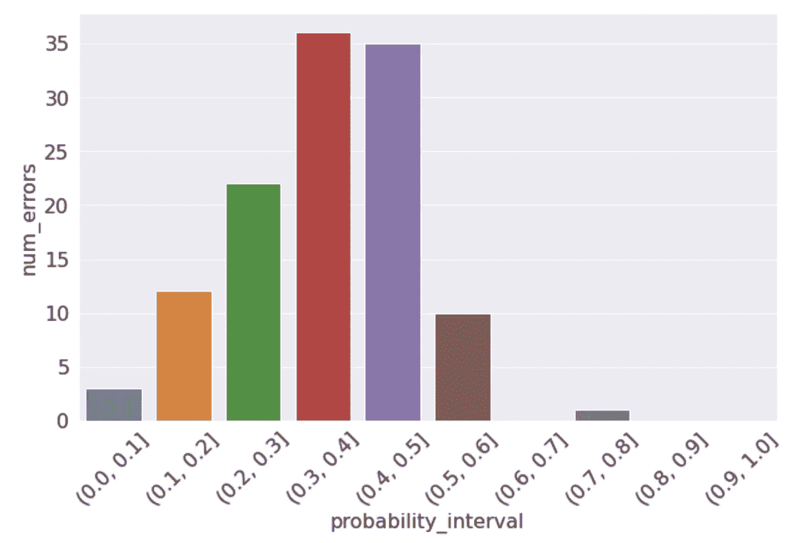
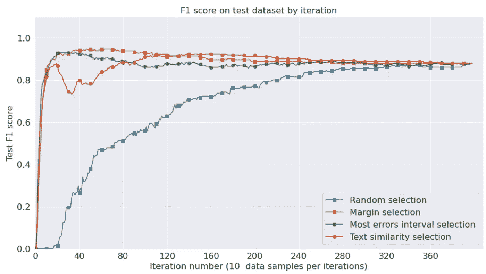

# 主动学习促进你的智力问题

> 原文：<https://towardsdatascience.com/use-active-learning-to-boost-your-ml-problem-53c70f72b979?source=collection_archive---------16----------------------->

## 你也可以看看我在 FWdays 大会上的[演讲](https://www.slideshare.net/fwdays/mariia-havrylovych-active-learning-and-weak-supervision-in-nlp-projects?ref=https://fwdays.com/)和[视频](https://www.youtube.com/watch?v=AkKYP49Pgd0&feature=youtu.be)关于主动学习和弱监督用法解决 NLP 问题

迷因作者使用了 imgflip.com[上的照片](https://imgflip.com/memegenerator/Woman-Yelling-At-Cat)

很难否认，解决机器学习(ML)问题的最广泛和最有效的方法是香草监督学习。在过去的十年里，算法改进了很多，特别是深度学习模型。然而，模型的成功在很大程度上取决于数据的质量和数量，而这反过来又需要时间、财力和人力资源。这里可能会出现并发症。

如果您对开发成功的数据科学解决方案感兴趣，但遇到资源不足的问题或没有足够的资源来获取标签，那么这些材料正适合您！即使你或你的公司有足够的(财政)资源来获得标签，这篇文章仍然是有益的。即使在 Wix 这样的大公司，我们有一个完整的内部标签部门，我们仍然在获得令人满意的高质量标签数据方面遇到问题。

考虑可能的情况:

*   您的问题涉及特定领域的数据，如司法文档或生物数据。要获得标签，你需要高度合格的专家；
*   你不能给你的数据贴上廉价众包平台的标签，因为它有 NDA 下的敏感信息；
*   你没有很多数据——例如，不平衡的数据集和罕见的类；
*   你需要训练一个更复杂的模型，比如神经网络，对数据特别饥渴；
*   贴标签的过程非常耗时，您希望以某种方式加快它的速度。

所以，不管上面发生了什么情况，你都没有足够的标签数据。

在这里，主动学习成为焦点！

有了这个神奇的工具，您在数据科学任务中可能需要更少的手动标记样本，而不会损害甚至提高性能！

在[Wix.com](https://www.wix.com/)，我们用它来解决文本分类(业务分类)问题，对用户支持请求、对象和肖像分割进行情感分析。

还有，除了贴子，你还可以回顾一下准备好的 [Colab 笔记本](https://colab.research.google.com/drive/1G_4o-1_CkR4eNgzGVcx89IJ_lKLBQQv-?usp=sharing)，用编码弄脏自己的手:)

**开始吧！**

# 目录

1.  [数据集和起始组件](#2f0f)
2.  [主动学习框架](#e5d7)
3.  [主动学习的查询策略](#0012)
    — [基本查询策略](#0804)
    — [如何选择查询策略](#8f5a)
    — [如何定制查询策略](#04ff)
4.  [满管道](#4bc0)
5.  [结果](#6cea)
6.  [总结](#5793)
7.  [参考文献](#e3ce)

# 数据集和起始组件

在本帖中，为了简单易懂，我们将使用经典的垃圾短信收集数据集[【1】](https://archive.ics.uci.edu/ml/datasets/SMS+Spam+Collection)[【2】](http://www.dt.fee.unicamp.br/~tiago/smsspamcollection/)来检测垃圾短信。该数据集包含大约 5200 个样本。班级比例如下图 1 所示。

我们将该数据集分为三个部分:

*   **取 20%** 作为测试集。
*   **~75%** 作为短信池，我们假设这里没有标签。
*   剩余的(~ **200 个**样本)作为带标签的初始训练集—种子。

我们将用一个初始的小训练集来模拟标签短缺的情况，并展示主动学习将如何解决这个问题！

作为模型，我们将采用 **TF-IDF 矢量器**和简单的**逻辑回归**。作为受监控的指标—**F1—对*“垃圾邮件”*类别的评分**。

图 1 —垃圾短信数据集中的类别比例—按作者分类

# 主动学习框架

拥有用于模型训练的无尽资源、时间和金钱——您只需收集所有可用的数据信号，并为每个信号分配一个标签。但遗憾的是，这是不可行的。现在，想象一下，你的数据科学模型非常聪明，它可以决定它喜欢和想要训练的数据。当然，该模型没有关于数据的情感，但是仅在显著影响其性能的样本上训练该模型仍然是一个好主意。这实际上就是主动学习所做的。

AL 背后的主要思想是允许我们的模型以" **smart** 的方式选择用于训练的数据。在 [AdaBoost](https://www.mygreatlearning.com/blog/adaboost-algorithm/) 算法中使用了类似的想法，其中它将更高的权重分配给信息更丰富的样本，即模型犯更多错误的样本。我们将为模型提供最丰富、最复杂的例子。因此，由于标记更少的数据点，训练过程的成本将被优化。

有不同类型的主动学习[ [3](http://burrsettles.com/pub/settles.activelearning.pdf) ]。我们将专注于最流行的一种——基于**池的**类型的主动学习(AL)。

让我们试着找出常规的 ML 和主动学习用法的 ML 之间的区别。

图 2——经典学习和主动学习 ML 对比——作者图片

图 3——主动学习周期——作者的图片，灵感来自[ [3](http://burrsettles.com/pub/settles.activelearning.pdf) ]

从上图中可以看出，经典的监督训练和基于池的主动学习的区别在于**查询策略**——如何选择训练集数据进行标注。

此外，不要忘记 ML 过程本质上是*迭代*的——如果模型评估结果不够好——您可以返回并决定是添加更多数据还是玩模型。虽然在常规 ML 中，您可能会以第一次迭代结束，但在主动学习中，您肯定会有两次迭代——您将设置**批处理大小**参数——您将在一次迭代中标记多少数据样本。

# 主动学习的提问策略

理解算法的最好方法就是编码。因此，我们将在这里实现选定的查询策略。

你可以尝试各种已经实现了不同查询策略的主动学习软件包(比如 [modAL](https://github.com/modAL-python/modAL) 或者 [ALiPy](https://github.com/NUAA-AL/ALiPy) )。但是，如果您不需要复杂的 POC 或想要创建快速 POC，请自己编写代码。

我使用了本教程【5】中的实现思想。

首先，我们需要定义一个只有一个抽象方法的元类——“选择*”。*

## *基本查询策略*

***随机选择***

*我们用来选择数据进行标记的天真方法是**随机抽样**——只是从未标记的池中随机查询样本——这实际上是**被动**学习。与其他非随机选择相比，它有一个显著的优势，因为您的训练集分布将反映现实，尽管它有其他明显的问题，如高成本。*

*下面看看如何实现*“选择”*方法( *pool_len* 是未标记池中数据样本的数量， *num_samples* —我们的批量大小，我们将在一次迭代中标记多少样本):*

***不确定性采样:余量选择***

*另一组最流行的查询策略是**不确定性采样**——在模型不确定的地方选择样本。对于支持概率输出的模型来说，这是一个非常简单的概念，比如逻辑回归，而对于只输出[0，1]范围内的分数的模型来说就不那么简单了。*

*在 ***边界选择*** *—* 不确定性抽样查询策略之一的情况下，最不确定的样本将是两个最高置信度预测之间的差值最小的样本(概率最高)。*

*保证金分步选择的实施:*

1.  *对于未标记池中的每个样本，将其预测概率从最大到最小排序:*

*2.计算两个最大概率之间的差值:*

*3.取值最小的样本(在*数量 _ 样本*数量中)——最不确定的样本:*

*要了解更多关于查询策略的信息，请阅读本主动学习手册****【3】。*****

*****想了解更多主动学习 python 的包—看这个 [**调查**](https://medium.com/data-from-the-trenches/a-proactive-look-at-active-learning-packages-8845fb6541e9)**【4】。*******

## *******如何选择查询策略*******

*******不同的查询策略会选择不同的样本；因此，需要选择您的模型将从中受益最多。*******

*********模型不支持** **概率输出。**在这种情况下，您可以考虑不使用概率的查询策略，如按委员会查询。此外，请记住:'*最不确定的实例位于分类边界上，但并不“代表”分布中的其他实例，因此知道其标签不可能提高整体数据的准确性* ' [3]。这就是为什么即使您的模型具有概率输出，您也可能不仅希望使用基于不确定性的查询策略。*******

*******不平衡的数据集。**当您有异常/欺诈检测任务或不平衡的数据集时，这种情况下的“次要”类别通常更重要。在这种情况下，基于相似性或密度的查询策略会更有用。*****

*******分散或高密度特征分布**。如果查询策略试图增加数据方差并获取最不相似的样本，它可能会查询异常值，这不会提高模型性能。*****

*******每次迭代，模型性能不会改变**。一些查询策略是**贪婪的**——在一次迭代中，它们将选择信息含量相似的数据点。因此，我们需要选择一种查询策略，它不仅要选择信息量最大的数据，还要选择信息量多样的数据。例如，您可以组合几个查询策略或者使用批处理感知策略[ [7](https://dsgissin.github.io/DiscriminativeActiveLearning/2018/07/05/Batch-AL.html) ]。*****

*****不要忘记冷启动**。开始时，试着使用一些查询策略，而不是专注于某些特定的策略。*******

*****幸运的是，您不局限于现有的查询策略。此外，您可以创建适合您的特定问题的查询策略。不要害怕使用定制的查询策略，例如，基于一些规则或启发。你会看到:这很容易做到！*****

## *****如何定制查询策略*****

*****正如你已经知道的，中心点是给模型最有价值的数据实例。您可以决定在特定问题中哪些样本可以提供信息。您可能对某个特定的类感兴趣，而您的模型很难检测到它。或者，在错误分析之后，您已经知道了模型的弱点，并打算利用它们。*****

*****经典的基于不确定性的查询策略选择接近 0.5 预测概率值的样本。但是，如果您将决策阈值从默认的 0.5 更改为另一个值会怎么样呢？现在，您可能对落在阈值附近的概率值感兴趣。然后，您可以创建策略来选择接近阈值的样本。*****

*******区间内的最大误差*******

*****另一种了解模型在哪里表现更差的方法是查看每个不同预测概率值的误差分布直方图，并找到具有最大错误分类量的最有问题的概率范围。*****

**********

*****图 4 —不同概率范围导致的误差分布示例—按作者分类*****

*****例如，在上面的图中，我们可以说 **(0.3，0.4]** 概率值区间是误差最大的区间。*****

*****基于此，我们将实现一个查询策略，从具有最高错误数的概率范围中选择样本:*****

1.  *****将模型预测的概率分成 10 个(随意设置另一个数字)大小相等的区间。*****

*****2.在训练集上，进行预测并计算每个区间的错误数。*****

*****3.选择错误数量最多的时间间隔。*****

*****4.从未标记的池样本中选取，这些样本的预测概率落在从第 3 步选择的区间内。*****

*****这种“最大误差”查询策略可以用于任何分类问题。*****

*******文本相似度查询策略*******

*****在 Wix，对于网站分类任务，我们遇到了有数十亿个 Wix 网站的问题，例如，要找到瑜伽教练网站，您需要随机选择并标记大量数据。因此，有了 Yoga 站点示例的小种子，我们选择只标记与种子有相似文本的站点。如下所示，我们能够以低得多的成本标记和构建大量类别的数据集！*****

*****现在，试着回答这个问题:对于垃圾短信检测来说，哪些样本的信息量最大？*****

*****在大多数垃圾邮件检测应用中，正确的“垃圾邮件”检测至关重要，因为我们只有 13%的垃圾邮件样本，所以我们可以说“垃圾邮件”类别比常规的非垃圾邮件样本更重要。*****

*****因此，这里有一个基于相似性的查询策略，它使用文本嵌入来计算数据点的相似性，并根据您的需要选择特定的样本。*****

*****我们可以使用简单的 TF-IDF 或 BOW，预训练的单词嵌入，如 TensorFlow 的通用句子编码器或任何其他先进的预训练嵌入(BERT、LaBSE 等)。).为了使用文本嵌入为我们的“垃圾邮件”类获取最相似的样本，我们还必须定义一个相似性度量。我们决定使用**通用语句编码器**嵌入和**余弦相似度**度量。*****

*****现在，让我们一步一步地编写这个查询策略:*****

*****0.首先，准备嵌入函数。*****

1.  *****从我们已经训练好的数据中获取“垃圾邮件”样本并嵌入它们。*****

*****2.计算未标记池的嵌入。*****

*****3.计算来自步骤 1 的“垃圾邮件”样本和来自步骤 2 的池嵌入之间的余弦相似性。*****

*****4.从未标记的库中获取具有最高相似性的样本。*****

*****仅此而已！您可以通过选择与整个训练集最不相似的样本(以增加数据集方差)或选择与所有类相似的样本(如果认为这样的样本最棘手)来修改此查询策略。*****

*****如您所见，定制查询策略不是火箭科学，而是您可以发挥创造力并从中获得乐趣的领域！*****

# *****完整管道*****

*****既然我们已经实现了查询策略，那么是时候将它们放入主动学习循环并训练模型了。*****

1.  *****定义分类器:*****

*****2.在我们的初始小标签集上训练分类器。*****

*****3.对未标记的池进行预测:*****

*****4.使用所选的查询策略进行选择(例如，边距选择):*****

*****5.将带有标签的选定数据样本添加到已经存在的初始训练集:*****

*****6.从库中删除所选项目(因为我们已经将这些数据点添加到训练集中):*****

*****7.在更新的训练集上训练分类器，并计算更新的度量。*****

*****8.重复步骤 2-7，直到您获得满意的结果或耗尽资源。*****

# *****结果*****

*****最后，让我们在一个使用不同查询策略的测试集上回顾一下模型性能。*****

**********

*****图 5 —主动学习结果—按作者分类的图表*****

*****在图 5 中，我们可以看到，如果我们标记整个未标记池，我们会得到一个**87%**F1-分数。因此， **87%** F1 将是分数基线——因为这是你标注所有数据后得到的表现。*****

*****利用余量选择，在 14 次迭代(140 个数据样本)上实现相同的性能。对于 207 行的初始测试，总共有 347 个样本。那可是比**少十倍**的数据！*****

*****在下表中，您可以看到使用不同的查询策略获得 **87%** 基线 F1 分数需要多少个标签。边距选择的性能几乎与区间选择中的最大误差相同，而文本相似性选择稍差，但仍然非常好。*****

*******表 1:主动学习实验结果*******

*****总之，无论我们使用哪种查询策略，我们都可以用更少的数据标签获得良好的性能。*****

*****在 SMS 案例中，最好的是边缘选择策略，但请记住，我们对一个非常简单的分类问题进行了实验，并使用了逻辑回归模型，该模型给出了校准良好的概率输出。在真实的情况下，仅使用基于不确定性的查询策略可能无法获得如此好的性能。*****

# *****摘要*****

*****让我们总结一下我们在上面所做的一切:*****

*   *****主动学习可以显著减少标记数据点的数量(在我们的例子中，数据几乎减少了十分之一！);*****
*   *****主动学习查询策略可以针对特定任务轻松定制和优化。*****

*****在您的数据科学任务中，有许多方法可以克服数据瓶颈。你只需要选择一个最适合你的问题。在这篇文章中，我们用主动学习工具成功地解决了这个问题。*****

*******致谢** 非常感谢 Gilad Barkan、Olga Diadenko 和 Lior Sidi 对本文早期版本的反馈！*****

# *****参考*****

*****[1] [UCI 机器学习知识库:垃圾短信收集数据集](https://archive.ics.uci.edu/ml/datasets/SMS+Spam+Collection)
【2】Almeida，T.A .、GÃ mez Hidalgo，J.M .、Yamakami，A. [对垃圾短信过滤研究的贡献:新的收集和结果](https://www.researchgate.net/publication/221353226_Contributions_to_the_study_of_SMS_spam_filtering_new_collection_and_results) (2011)，2011 年 ACM 文档工程研讨会会议录(DOCENG'11)。
【3】毛刺落定。[主动学习文献调查](http://burrsettles.com/pub/settles.activelearning.pdf) (2010)，计算机科学技术报告 1648，威斯康星大学麦迪逊分校。
【4】亚历山大·亚伯拉罕。[主动观察主动学习包——来自渠道的数据](https://medium.com/data-from-the-trenches/a-proactive-look-at-active-learning-packages-8845fb6541e9) (2020)。
【5】Ori Kohen。[主动学习教程](/active-learning-tutorial-57c3398e34d) (2018)。
[6]陈育坤、托马斯·A·拉斯科、朱樵·梅、约书亚·C·丹尼、华旭。[临床文本中命名实体识别的主动学习方法研究](https://www.sciencedirect.com/science/article/pii/S1532046415002038) (2015)，生物医学信息学杂志，第 58 卷，第 11-18 页。
【7】丹尼尔·吉辛。[批量主动学习|判别主动学习](https://dsgissin.github.io/DiscriminativeActiveLearning/2018/07/05/Batch-AL.html) (2018)。*****