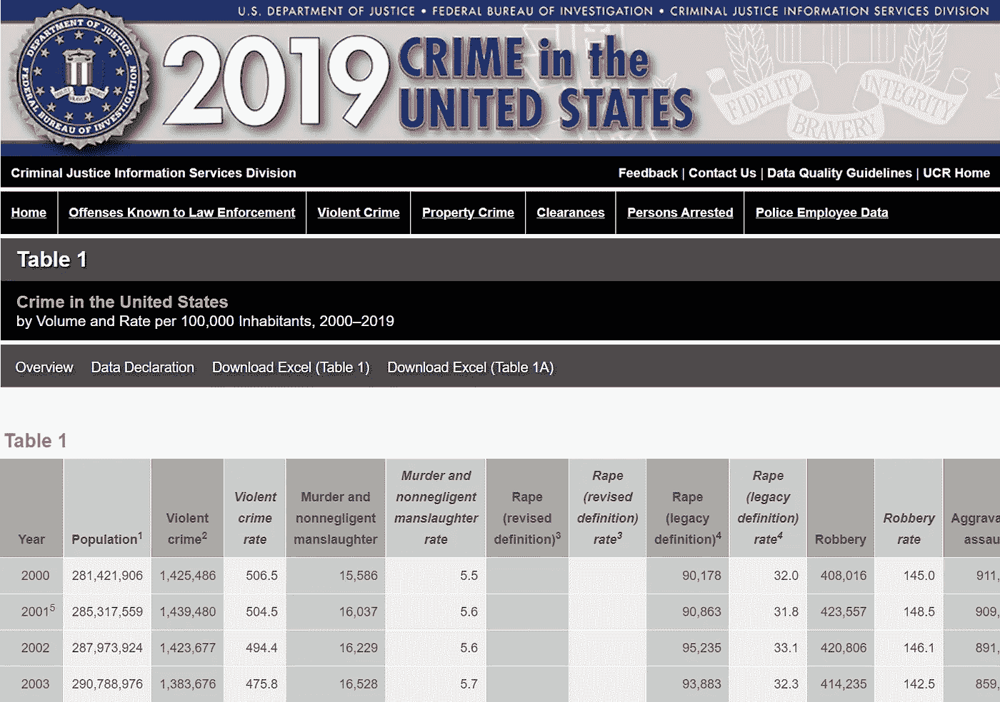
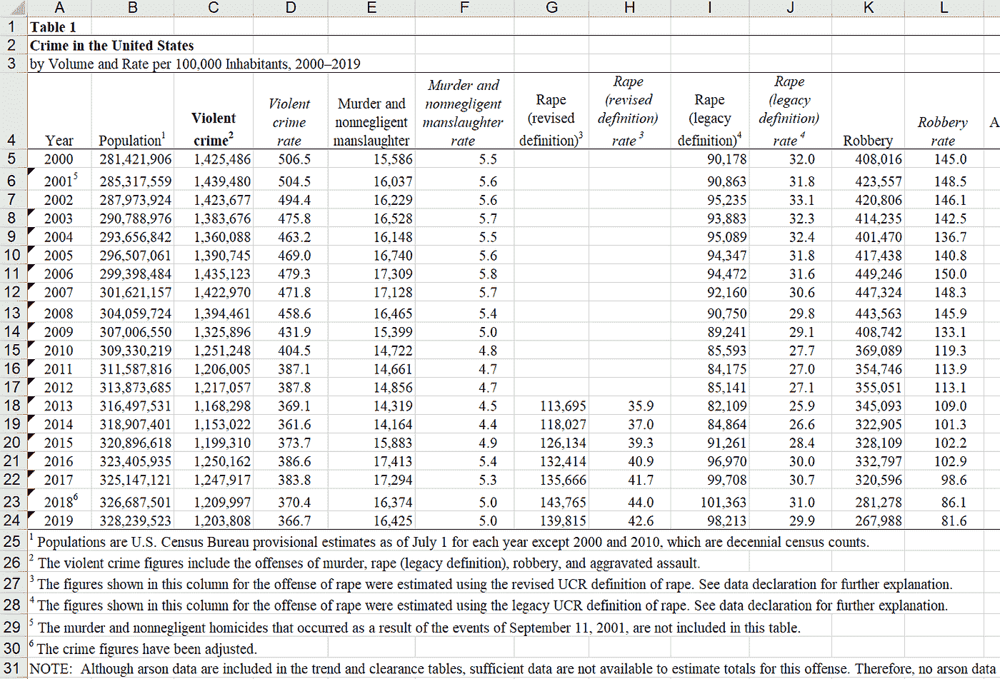
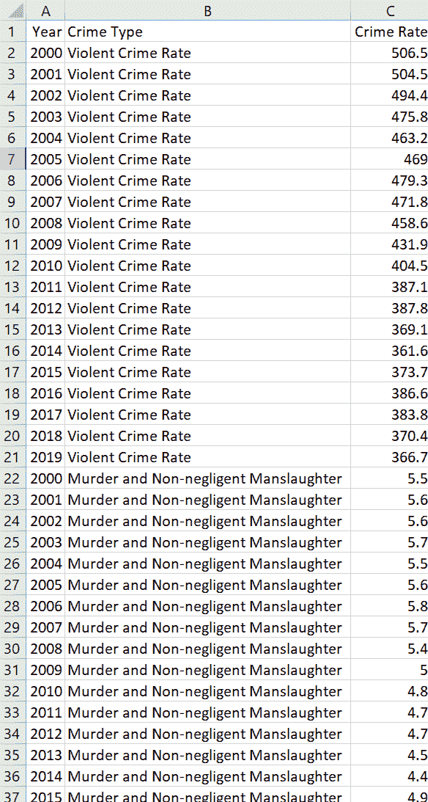

# 使用并增强这个 Python 类来下载 Excel 工作簿，并为分析做准备

> 原文：<https://towardsdatascience.com/use-and-enhance-this-python-class-to-download-excel-workbooks-and-prepare-them-for-analytics-4750ae00d8c2?source=collection_archive---------10----------------------->

## 使用 Python 类 c_download_prep_excel 从网站上自动下载 excel 电子表格，并准备用于数据分析项目

免费图片，由 Pixabay.com 提供。

# 介绍

在最近的一篇文章中，我分享了一个从 analytics.usa.gov 的 T2 下载报告的 Python 类。这些文件提供了有关公众如何访问大约 5，700 个美国政府网站的数据。他们是干净的，同质的设计，并准备在画面中可视化。

相比之下，美国联邦调查局(FBI)在其网站上公布的一些 Excel 文件则存在挑战。我需要转换他们的数据，然后才能在数据分析项目中使用它们。本文介绍了一个可重用的 Python 类，称为 c_download_prep_excel，它从网站上下载 excel 工作簿(如 FBI 发布的工作簿),并重新构造它们的数据，为数据分析项目做准备。

这种技术和这里介绍的 c_download_prep_excel 类可以用来从其他站点下载和处理 excel 文件。任何人也可以修改这个类来处理不同来源的 Excel 文件和执行其他任务。

# 联邦调查局报告样本

我使用了 from 2019 年[暴力犯罪统计报告](https://ucr.fbi.gov/crime-in-the-u.s/2019/crime-in-the-u.s.-2019/topic-pages/tables/table-1)来开发和测试 c_download_prep_excel 类。单击下载 Excel-表 1 以检索 Excel 工作簿。

美国联邦调查局 2019 年美国犯罪报告。图片来自 FBI 网站。

# 报告问题

下面显示的示例 Excel 工作表还不能用于数据分析。虽然可以接受在 Excel 中查看，但应该对其进行清理和转换，以使其适合分析。以下是它的一些问题:

*   第 1 行到第 3 行包含元数据的标题信息。
*   第 25 到 31 行包含页脚信息，这些信息也是元数据。
*   第 1 列中的某些年份包含向年份值添加数字的上标。
*   数据的矩阵格式不适合加载到数据分析工具中。

联邦调查局暴力犯罪报告。作者拍摄的图片。

# 解决方案

为了准备用于数据分析的报告，我编写了一个 Python 类和程序，将数据从原始工作表转录到新工作表中。结果格式如下所示，每行一个数据点(年份、犯罪类型和犯罪率的组合)。

将联邦调查局暴力犯罪报告中的数据转换成可供分析的格式。图片由作者提供。

可以根据需要使用和增强该类，以便从 FBI 网站或其他网站下载和准备其他 Excel 文件。本文后面给出的示例程序执行这些步骤:

1.  将 Excel 工作簿从 FBI 网站下载到本地文件夹。
2.  如果工作簿是 xls 文件，请以 xlsx 格式保存一份副本。
3.  保持 xlsx 文件的原始工作表不变。相反，创建一个新的工作表，其中包含所需格式的数据。以下步骤描述了将工作表 19tbl01 中的数据转录到新工作表中。
4.  创建三个列名:年份、犯罪类型和犯罪率。
5.  对于犯罪类型，在第 1 列中每年写一行，在第 2 列中写犯罪类型。
6.  将包含上标的年份值截断为四位数。
7.  将每种犯罪类型的犯罪率数据从原始工作表转录到新工作表中。
8.  右对齐第 1 列和第 3 列的列名。
9.  设置列宽。

# 本项目中使用的工具

我使用了以下工具来开发程序。

*   Python 3.9.2
*   微软 Excel 365
*   Microsoft Visual Studio 社区

# 程序、c_download_prep_excel 类和 Python 模块

## 该计划

下载和准备用于数据分析的 Excel 工作簿的程序由文件 process_fbi_data.py 中的控制器模块和文件 c_download_prep_excel.py 中的 c_download_prep_excel 类组成。process_fbi_data.py 中的代码控制程序。控制器创建 c_download_prep_excel 的一个实例，并调用它的函数将 FBI 报告文件的原始工作表中的数据转录并转换到一个新的工作表中。

## c _ 下载 _ 准备 _excel 类

c_download_prep_excel 类执行控制器请求的任务，如上面的解决方案部分所述。它可以根据需要进行修改和增强，以满足特定的要求。

程序控制器和 c_download_prep_excel 类代码见 ***附录 A*** 。

## Python 模块

程序调用 [openpyxl](https://openpyxl.readthedocs.io/en/stable/) 模块中的函数来创建新的工作表并格式化数据。该程序还调用 [pyexcel](https://pypi.org/project/pyexcel/) 函数，这些函数使用 pyexcel-xls 和 pyexcel-xlsx 将 xls 工作簿复制到 xlsx 工作簿。

从命令行运行下面列出的命令，或者如果支持，在您的集成开发环境(IDE)中运行这些命令，以安装这些模块:

*   pip 安装 openpyxl
*   pip 安装 pyexcel
*   pip 安装 pyexcel-xls
*   pip 安装 pyexcel-xlsx

Python 包括程序使用的操作系统和请求模块

# Tableau 公共仪表板

我将支持分析的 Excel 工作表加载到 Tableau Public 中，并创建了一个简单的[仪表板来显示各种犯罪类型的趋势](https://public.tableau.com/profile/randall.runtsch#!/vizhome/ViolentCrimeintheUnitedStates_16168698396790/ViolentCrime)。

# 潜在的改进

该程序很好地执行了它的基本任务，从 FBI 报告电子表格中准备暴力犯罪数据用于数据分析。以下增强功能可以使程序为生产做好准备，并扩展其处理不同格式的各种 Excel 工作簿的能力。

*   添加**错误处理**来从严重错误中恢复或者优雅地关闭程序。
*   **将程序活动写入日志文件**，以跟踪程序的启动、完成、错误和动作。
*   向类中添加函数以**执行额外的格式化**并应对新电子表格带来的挑战。
*   **从其他文件或数据库中查找并替换数据**。
*   执行额外的**数据清理**。

# 结论

Excel 电子表格可以从网站上手动下载，并手动转换成可供分析的形式。但是程序可以自动完成这项任务。当需要下载多个文件并准备在数据分析项目中使用时，这是非常有益的。另外，如果设计良好，您可以在将来为类似的任务重用 Python 类和程序。

# 关于作者

Randy Runtsch 是一名数据分析师、软件开发人员、作家、摄影师、自行车手和冒险家。他和妻子住在美国明尼苏达州东南部。

关注 Randy 即将发表的关于公共数据集的文章，以推动数据分析见解和决策、编程、数据分析、摄影、自行车旅行等。你可以在 shootproof.com 和 shutterstock.com 看到他的一些照片。

# 附录 A —源代码

程序的 Python 控制器代码和 c_download_prep_excel 类代码如下所示。请随意复制代码并根据您的需要进行修改。