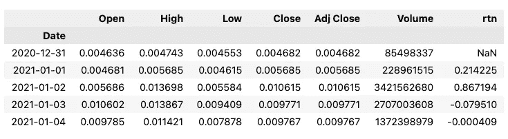
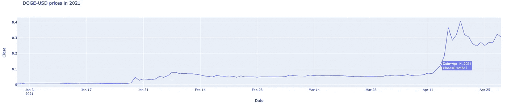
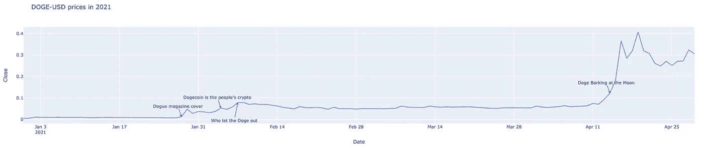
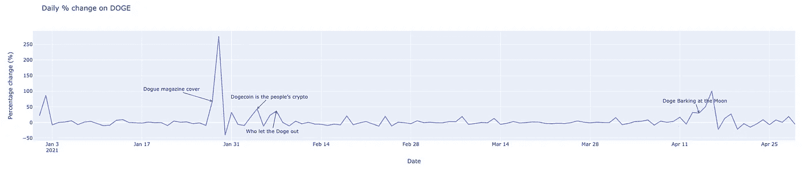

# 使用注释来讲述更好的故事

> 原文：<https://towardsdatascience.com/use-annotations-to-tell-better-stories-with-your-plots-410cb1752bee?source=collection_archive---------20----------------------->

照片由[艾萨克·史密斯](https://unsplash.com/@isaacmsmith?utm_source=unsplash&utm_medium=referral&utm_content=creditCopyText)在 [Unsplash](https://unsplash.com/?utm_source=unsplash&utm_medium=referral&utm_content=creditCopyText) 拍摄

## 以及如何使用`plotly`在 Python 中实现

俗话说，一幅画胜过千言万语。在数据科学中，我们经常使用不同类型的情节来探索数据或讲述故事，通常是针对非技术观众。

数据可视化通常被认为是一项独立的技能，需要花费专门的时间和精力来掌握。几乎任何人都可以运行一行程序来创建一个简单的情节。但是有许多技术或细节可以极大地改善图形，强化我们想要传达的信息。

有许多很棒的文章和书籍致力于该主题，例如， [*用数据讲故事:商业人士的数据可视化指南*](https://www.amazon.com/gp/product/1119002257/ref=as_li_tl?ie=UTF8&camp=1789&creative=9325&creativeASIN=1119002257&linkCode=as2&tag=erykml0c-20&linkId=f9ab5a2c180698ede61f6ccdb33bc825) (免责声明:引用链接)。在这篇短文中，我们将关注一个可以极大地帮助理解故事的方面——情节注释。

## 关于封面故事的一些背景信息

你很有可能已经听说过这个故事，即使你可能对加密货币没有明确的兴趣。2021 年初，埃隆·马斯克发布了几条关于 **DOGE** 的推文，DOGE 最初是作为一个笑话而创造的。这些推文对 DOGE 的价格产生了很大的影响，使其暴涨。我们将仔细看看硬币的价格，以及它是如何受到推文的影响的。

引发这一切的推特

## 用 Python 探索 DOGE 价格

和往常一样，我们首先需要导入库。对于本文，我们将使用绘图库`plotly`。这是因为我发现它是最容易实现注释的。然而，这在其他库中也是可能的。

我们将使用`yfinance`库下载 2021 年 1 月至 4 月的 DOGE-USD 历史价格。关于如何使用这个库的更多细节，你可以参考我以前的文章。我们还计算了每日百分比变化，以供进一步分析。

下载的数据如下所示:

作者图片

我们可以使用以下代码片段轻松创建 DOGE 收盘价的交互式线图:

作者图片

我们确实可以看到 DOGE 的价格是如何随着时间的推移而变化的。在那 4 个月里，价格增长了 65 倍！使用`plotly`的交互式工具提示，我们可以详细了解任意一天的价格。

注释的一个方便的用例是指出埃隆·马斯克在哪一天发推文。然后，我们可以清楚地观察到价格是如何响应这些推文而变化的(注意:推文本身并不是价格变化的唯一原因)。

首先，让我们定义注释。

在这个列表中，我们提到了埃隆·马斯克在 2021 年的 4 个月里发布的 4 条推文。对于每个注释，我们指定以下内容:

*   `x`-用于注释的 x 轴值。在这种情况下，我们使用推文的日期。
*   `y` —用于注释的 y 轴值。这里，我们使用当天的收盘价。
*   `text` —注释的标题。在这里，我们使用的是埃隆·马斯克的推文内容。
*   `arrowhead` —表示我们想要使用哪种形状的箭头

我们可以使用的一些附加参数:

*   `arrowsize` —决定箭头的大小
*   `ax` / `ay` —用于沿轴移动标注。当我们不希望注释相互重叠或与线条重叠时，这就很方便了。

当我们准备好列表时，我们可以使用`update_layout`方法将注释应用到图中。

运行该行会更新该图，如下所示:

作者图片

通过注释，我们可以清楚地看到 DOGE 的价格在推文发布当天以及随后几天的表现。有趣的是，当我们查看 2021 年之前的价格历史时，与推文发布后的暴涨相比，价格基本持平。

**注意**:我们也可以使用`fig`对象的`add_annotation`方法来添加注释。参数与上面指定的参数相同。我们使用了`update_layout`方法，因为一次添加多个注释更方便。

通过稍微修改包含注释(y 轴值)的列表，我们可以得到相同的图，但 DOGE 价格的每日百分比变化除外。

作者图片

正如我们所看到的，tweets 和随后的几天可以被描述为 DOGE 价格的异常高的每日百分比变化。

## 外卖食品

*   在情节上使用注释可以极大地帮助向观众传达故事，尤其是非技术性的观众，
*   在 Python 中，注释可以添加到任何类型的绘图中，但是要记住，不同库之间实现的细节是不同的，
*   `plotly`提供了一种非常简单的方法来给它的图形添加注释。

你可以在我的 [GitHub](https://github.com/erykml/medium_articles/blob/master/Misc/plot_annotations.ipynb) 上找到本文使用的代码。此外，欢迎任何建设性的反馈。你可以在推特或评论中联系我。

喜欢这篇文章吗？成为一个媒介成员，通过无限制的阅读继续学习。如果你使用[这个链接](https://eryk-lewinson.medium.com/membership)成为会员，你将支持我，不需要额外的费用。提前感谢，再见！

您可能还会对以下内容感兴趣:

 [## 了解什么是深度图以及如何用 Python 创建深度图

### 使用币安的 API 获取订单数据

towardsdatascience.com](/learn-what-a-depth-chart-is-and-how-to-create-it-in-python-323d065e6f86)  [## mpl finance——matplolib 相对不为人知的用于绘制金融数据的库

### 包括快速创建图表的方法，如烛台，连科，或点和图

towardsdatascience.com](/mplfinance-matplolibs-relatively-unknown-library-for-plotting-financial-data-62c1c23177fd)  [## 用 Python 创建交互式烛台图表的最简单方法

towardsdatascience.com](/the-simplest-way-to-create-an-interactive-candlestick-chart-in-python-ee9c1cde50d8) 

## 参考

[https://www . fool . com/the-ascent/buying-stocks/articles/5-times-elon-musk-has-send-dog ecoin-prices-spiring/](https://www.fool.com/the-ascent/buying-stocks/articles/5-times-elon-musk-has-sent-dogecoin-prices-soaring/)