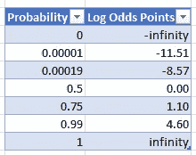
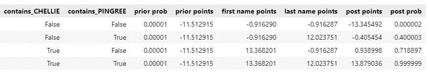

# 使用贝叶斯定理在列表中查找不同的名称

> 原文：<https://towardsdatascience.com/use-bayes-theorem-to-find-distinctive-names-in-a-list-5acd8fe03c2b?source=collection_archive---------24----------------------->

## 通过这个实用的 Python 应用程序学习对数概率贝叶斯


由 [Unsplash](https://unsplash.com?utm_source=medium&utm_medium=referral) 上的[顶点事件](https://unsplash.com/@capstoneeventgroup?utm_source=medium&utm_medium=referral)拍摄的照片

国会跑步俱乐部想让你找到他们的比赛结果。比赛公布结果，所以只要在那些结果中寻找俱乐部成员的名字，对吗？然而，如果你只寻找一个名字，比如“罗伯特”或“斯科特”，你会发现你得到太多的匹配。而且，如果你寻找全名，你有时会*仍然*得到太多的匹配(“罗伯特·斯科特”)。由于错误、打字错误、昵称和缩写(例如，“Chellie Pingree”显示为“Chelly Pingree”)，您有时也会得到很少的匹配。一个好的解决方案是给与众不同的名字(“Pingree”)比普通的名字(“Robert”)更大的权重。让这个解决方案可行的关键是贝叶斯定理。

具体来说，我们将学习“朴素贝叶斯”的对数概率版本。这个奇妙的公式让我们把匹配和不匹配的分数加起来。它还为我们提供了一种原则性的方法:

*   根据名字的独特性来打分
*   缺少一个名字时，减去不同的点数
*   将名和姓的点结合起来
*   处理昵称
*   处理附加信息，例如，跑步者的家乡，它有时会出现在比赛结果中。

我真正的跑步俱乐部使用这些工具的版本。除了这篇文章，我还提供了一个您可以使用的 [Python 笔记本](https://github.com/CarlKCarlK/bayesmatch/blob/main/bayesmatch/bayesmatch.ipynb)。除了比赛结果，你应该会发现它在其他名字/地方/等方面很有用。匹配应用程序。此外，虽然朴素贝叶斯被广泛教授，但其美丽的*对数概率公式*经常被忽视，学习起来很有用。

我们将通过考虑一系列概率问题来发展我们的匹配方法。我们的目标不是产生“完美”的概率；相反，我们希望概率是:

*   简单—易于计算
*   合理—足以突出大多数匹配
*   原则性——在给出一些简化假设的情况下，与全概率理论一致。

如果需要，这些结果可以进一步改进。

让我们开始提问:

## 随机线是关于罗伯特的

**问**:假设你从一场本地比赛的结果中随机选择一条线，并随机选择一名跑步俱乐部的成员。这条随机线指向这个随机成员的(合理)概率是多少？

**答:**让我们假设一个给定的俱乐部成员有 1%的机会参加给定的本地比赛。我们还假设一场典型的比赛包括 1000 名跑步者，因此有 1000 条结果线。因此，随机线指向随机俱乐部成员的概率约为 1%/1000 = .00001。

*输入:*

```
prob_member_in_race = .01
result_count = 1000prior_prob = prob_member_in_race / result_countf"{prior_prob:.5f}"
```

*输出:*

```
'0.00001'
```

## 我们的罗伯特导致“罗伯特”

**问:**关于成员 Robert Scott 的*为*的结果行包含单词“Robert”的概率是多少？

**答:**你可能认为这是肯定的事情，但是“事情总会发生”，比如错误、错别字、不知名的昵称、缩写等等。让我们假设一个错别字的概率，等等。一个名字是 40%。因此，答对一个名字的概率是 60%。

*输入:*

```
prob_name_right = .6
prob_name_right
```

*输出:*

```
0.6
```

## 其他人指向“罗伯特”

**问**:假设我们选择一个随机的结果行，这个结果行是*而不是*关于那个成员 Robert Scott 的。随机行包含“罗伯特”这个词的概率有多大？

**答:**让我们假设这个概率与美国人口中“罗伯特”这个名字的出现频率相同。利用公开的政府数据，我创建了一个包含 245，000 个名字及其(大概)频率的表格。([这张表是给你用的](https://github.com/CarlKCarlK/bayesmatch/releases/download/v0.0.1/name_probability.tsv")。)它报告“罗伯特”的概率为 3%。

*输入:*

```
import pandas as pd
from pooch import retrievedef load_name_to_prob():
    name_prob_file = retrieve("https://github.com/CarlKCarlK/bayesmatch/releases/download/v0.0.1/name_probability.tsv",
        known_hash="md5:cf2b3277a9e88b846c18bed559a4fbea",
        fname="name_probability.tsv")
    name_to_prob_df = pd.read_csv(name_prob_file, sep="\t")
    name_to_prob_df.set_index("name", inplace=True)
    name_to_prob = name_to_prob_df.to_dict()["probability"]
    return name_to_probname_to_prob = load_name_to_prob()
prob_coincidence = name_to_prob["ROBERT"]
prob_coincidence
```

*输出:*

```
0.03143
```

## “罗伯特”来自罗伯特

**问:**包含“Robert”的结果行是关于我们的成员 Robert Scott 的概率有多大？

到目前为止，我们已经看到了导致结果的原因。例如，我们说一个关于成员 Robert Scott(原因)的结果行将包含单词“Robert”(结果)，概率为 60%。

贝叶斯定理让我们逆转这一点，从结果到原因进行反向推理。在示例中，当结果行包含单词“Robert”(一个结果)时，贝叶斯定理告诉我们结果行关于成员 Robert Scott(一个原因)的概率。

通常的贝叶斯定理公式是:

`P(C1|E) = P(E|C1) P(C1) / P(E)` 何处`P(E) = (E|C1) P(C1) + P(E|C2) P(C2)`。

我们将使用[等价的](https://allendowney.blogspot.com/2014/04/bayess-theorem-and-logistic-regression.html)对数概率表:

`logodds(C1|E) = logodds(C1) + log(P(E|C1)/P(E|C2))`

公式的两个版本都告诉我们如何

*   一个原因的先验概率(随机线是关于罗伯特的)，
*   给定一个原因的结果的概率(我们的罗伯特导致“罗伯特”)，
*   给定所有其他原因的结果的概率(其他人导致“罗伯特”)

把它们变成

*   给定结果的原因的后验概率(“罗伯特”来自罗伯特)

我们喜欢这个公式的对数概率版本，因为它包含的项更少。此外，它让我们创建一个积分系统。具体来说，称为“对数贝叶斯因子”的术语`log(P(E|C1)/P(E|C2))`告诉我们，如果我们看到“罗伯特”，应该增加多少分。在 Python 中，计算变成:

*输入:*

```
import numpy as npdef logodds(prob):
    return np.log(prob / (1.0 - prob))def prob(logodds):
    odds = np.exp(logodds)
    prob = odds / (odds + 1.0)
    return probprior_points = logodds(prior_prob)
print(f"prior: {prior_points:.2f} points, {prior_prob:.5f} probability")delta_points = np.log(prob_name_right / prob_coincidence)
print(f"delta: {delta_points:.2f} points")post_points = prior_points + delta_points
print(f"post: {post_points:.2f} points, {prob(post_points):.5f} probability")
```

*输出:*

```
prior: -11.51 points, 0.00001 probability
delta: 2.95 points
post: -8.56 points, 0.00019 probability
```

换句话说，在结果行中看到“Robert”会使该行与成员 Robert Scott 有关的概率增加 19 倍。(它将概率从 0.00001 移动到 0.00019。)

该代码还显示了如何从概率转换到对数优势点，以及如何转换回来。此表显示了一些转换值。



## 没有“罗伯特”，但仍然来自罗伯特

**问:**包含“Robert”的结果行*而非*是关于我们的成员 Robert Scott 的概率有多大？

**答:**我们看到，在结果行中找到“Robert”会增加该行与 Robert Scott 相关的概率。同样，找不到“罗伯特”会降低概率。有趣的是，潜在的增加通常不同于潜在的减少。公式是:

`logodds(C1|not E) = logodds(C1) + log(P(not E|C1)/P(not E|C2))`

这告诉我们如何采取

*   原因的先验概率(如前)，
*   给定一个原因遗漏一个结果的概率(我们的罗伯特不会导致“罗伯特”，0.4，一个错别字的概率，等等。),
*   在给定所有其他原因的情况下，遗漏一个效应的概率(其他人不会导致“罗伯特”，大约 97%，人口不命名为“罗伯特”)。)

把它们变成

*   给定缺失结果的原因的后验概率(没有“罗伯特”，但仍然来自罗伯特)

术语`log(P(not E|C1)/P(not E|C2))`是在结果中看不到“罗伯特”的对数贝叶斯因子。在 Python 中，计算变成:

*输入:*

```
print(f"prior: {prior_points:.2f} points, {prior_prob:.5f} probability")delta_points = np.log((1.0-prob_name_right) / (1.0-prob_coincidence))
print(f"delta: {delta_points:.2f} points")post_points = prior_points + delta_points
print(f"post: {post_points:.2f} points, {prob(post_points):.6f} probability")
```

*输出:*

```
prior: -11.51 points, 0.00001 probability
delta: -0.88 points
post: -12.40 points, 0.000004 probability
```

换句话说，看不到“罗伯特”会减少我们 0.88 分。因此，它将这条线关于成员 Robert Scott 的概率从 0.00001 降低到 0.000004。

## “罗伯特”和“斯科特”来自罗伯特·斯科特。

**问:**包含“Robert”和“Scott”的结果行是关于我们的成员 Robert Scott 的概率有多大？

**答:**如果我们愿意忽略“罗伯特”和“斯科特”之间可能存在的依赖关系(详见下文)，那么公式就变成了:

`logodds(C1|E1&E2) =
logodds(C1) + log(P(E1|C1)/P(E1|C2)) + log(P(E2|C1)/P(E2|C2))`

> 旁白:我们称之为“朴素贝叶斯”,因为它忽略了证据之间可能的相关性。例如，它忽略了一个粗心的键盘输入者比一般人更有可能在两个 T2 的名字中造成一个错别字。它还忽略了来自苏格兰的姓(“斯科特”)与常见的苏格兰名(“罗伯特”)相关联。尽管如此，这种“天真”的假设在实践中往往很有效，并极大地简化了我们的数学和编程。

新公式只是原始公式的第二个增量“Scott”。在 Python 中:

*输入:*

```
print(f"prior: {prior_points:.2f} points, {prior_prob:.5f} probability")first_name_points = np.log(prob_name_right / name_to_prob["ROBERT"])
print(f"first_name: {first_name_points:.2f} points")last_name_points = np.log(prob_name_right / name_to_prob["SCOTT"])
print(f"last_name: {last_name_points:.2f} points")post_points = prior_points + first_name_points + last_name_points
print(f"post: {post_points:.2f} points, {prob(post_points):.5f} probability")
```

*输出:*

```
prior: -11.51 points, 0.00001 probability
first_name: 2.95 points
last_name: 4.70 points
post: -3.86 points, 0.02055 probability
```

换句话说，看到“罗伯特”增加了 2.95 分(和之前一样)，看到“斯科特”又增加了 4.70 分。因此，概率从 0.00001(非常、非常、非常不可能)变为 0.02(不可能)。

当我们试图将一名俱乐部成员与一个更独特的名字 Chellie Pingree 匹配时，会发生以下情况:



她的姓值 12 分，所以如果我们看到她的姓，但没有看到她的名(-0.92 分)，我们最终有 40%的可能性结果行是关于她的。同样，她更独特的名字本身就值 13 分以上，因此后验概率为 72%。最后，如果我们看到两个名字，我们将 99.99%确定结果行是关于她的。

## “鲍勃”来自罗伯特

**问:**包含“Bob”和“Robert”的结果行是关于我们的成员 Robert Scott 的概率有多大？

**答:**为了处理昵称，我们需要指定关于成员 Robert Scott 的结果包含的概率，例如，“Robert”、“Bob”、“Rob”和其他内容。

让我们假设我们仍然有 40%的机会出现打印错误，等等。然而，现在，如果有昵称，我们假设有 50%的机会看到主名。我们将剩下的 10%概率平均分配给昵称。请注意，这些概率加起来是 100%。

我们将在这里使用的公式是:

`logodds(C1|E1 ∨ E2 ∨ E3) = logodds(C1) + max(
log(P(E1|C1)/P(E1|C2)), log(P(E2|C1)/P(E2|C2)), log(P(E3|C1)/P(E3|C2))
)` 其中“∨”表示“逻辑或”

这表示当寻找多个相关效果时，我们将分别找到每个效果的分数，然后使用分数最高的那个。这是一个保守的假设，它阻止我们对包含名字的两个版本的结果行给予额外的积分，例如，“Robert (Bob)”。

当我们对包含“Robert”、“Bob”和“Scott”的行运行 Python 时，结果是:

```
prior: -11.51 points, 0.00001 probability
    ROBERT: 2.77 points
    BOB: 4.51 points
    ROB: -0.05 points
first_name: 4.51 points
last_name: 4.70 points
post: -2.30 points, 0.09083 probability
```

我们既看到“罗伯特”，也看到“鲍勃”，但“鲍勃”更有特色，所以我们用其中的点。

然而，即使有了昵称，我们仍然只有 9%的把握这一行是关于我们的成员罗伯特·斯科特的。为了做得更好，我们需要一些额外的信息。正是因为这个原因，大型比赛通常包含城市信息。

> 旁白:带连字符的名字(比如奥卡西奥-科尔特斯)和多词名字(比如范·霍伦)怎么办？我们将像对待昵称一样对待它们，将昵称作为主要名称和一个或多个附加名称。

## “贝尔维尤”指的是罗伯特·斯科特的小镇。

**问:**如果结果包含城市信息，那么包含“Bellevue”的结果行是关于我们住在 Bellevue 的成员 Robert Scott 的概率有多大？

**答:**要回答这个问题，我们必须回答两个子问题。

*   如果这条线是关于成员罗伯特·斯科特的，它包含“贝尔维尤”的概率是多少？我们将再次假设 60%(因此，40%的打字错误的概率，等等。)
*   如果这条线是关于别人的，那么它包含“贝尔维尤”的概率是多少？我们将在感兴趣的比赛结果中使用“Bellevue”的频率，而不是在美国使用名称的频率。查看一个真实的比赛结果，我发现在 1592 行中有 170 行包含“Bellevue”。我们将稍微平滑一下，把这些计数变成一个概率:

`P(“Bellevue”|about someone else) = (170+1)/(1592+2)= 0.11`

在 Python 中，我们添加这些行:

```
city_name_points = np.log(0.60 / ((170+1)/(1592+2)))
print(f"city: {city_name_points:.2f} points")
```

这导致了以下输出:

```
prior: -11.51 points, 0.00001 probability
    ROBERT: 2.77 points
    BOB: 4.51 points
    ROB: -0.05 points
first_name: 4.51 points
last_name: 4.70 points
city: 1.72 points
post: -0.58 points, 0.35846 probability
```

因此，现在我们认为这条结果线以 36%的概率指向我们来自贝尔维尤的俱乐部成员罗伯特·斯科特。这足以说明这条结果线值得一看，也许可以通过突出它来说明。

## 首字母和遗漏的姓名

**问:**如果我们不知道一个成员的名字或者只知道一个首字母，应该如何调整概率？

答:处理这个问题的一个实用方法就是跳过评分。如果我们不知道成员的名字或者只知道名字的首字母，我们可以跳过记录他们的名字。如果我们不知道成员的城市，或者如果结果不包含城市，我们可以跳过城市评分。

## 后续步骤

有了这些问题的答案，我们可以有效地从列表中挑选出名字。您可以在笔记本[[CarlKCarlK/Bayes match:(github.com)](https://github.com/CarlKCarlK/bayesmatch)]中看到用于创建这篇论文的 Python 代码。我的跑步俱乐部也在使用这些方法作为一个更大的比赛结果项目的一部分，用 c#[[luillo 1/race results(github.com)](https://github.com/luillo1/RaceResults)]编写。(如果您对我将 Python 笔记本扩展成完整的 Python 包感兴趣，请告诉我。)

这些方法可以在几个方向上更进一步。

*   更多信息——我们可以用[编辑距离](https://en.wikipedia.org/wiki/Edit_distance)来模拟拼写错误的概率，而不是忽略拼写错误。我们也可以考虑谁比赛更频繁，谁倾向于一起比赛。最后，通过更好地解析比赛结果，我们可以尝试匹配性别、年龄、首选距离和预期速度。当我实际寻找比赛结果时，我发现从程序的输出开始，然后使用这些额外的信息源来手动确认匹配是很有用的。
*   新的应用——除了比赛结果，我还在一个未发表的项目中使用这些方法来识别科学论文的作者。我使用的主要信息来源是名称独特性、合著者、机构和主题领域。我认为这些方法在系谱学中也是有用的。
*   作为机器学习的输入—想象一个简单的机器学习系统，它将对数贝叶斯因子作为输入，即来自匹配或缺失效应的点。这样一个系统可以轻易地覆盖数十万个名字和数千个城市，包括那些以前从未见过的城市。它可以以一种比我们现在更数据驱动的方式将它们结合起来。(如果你知道这样的作品，请留下评论。)
*   作为[贝叶斯推理](https://en.wikipedia.org/wiki/Bayesian_statistics)的第一个构件，概率编码了数据和由于我们缺乏数据而产生的不确定性。

## 摘要

我们已经看到了贝叶斯定理如何提供了一种从结果到原因反向推理的有原则而又实用的方法。使用其奇妙的对数概率公式，将影响的存在或不存在转化为简单的点。最后，“朴素贝叶斯”假设让我们用加法将这些点结合起来。

*感谢 David Heckerman 和 Luke Bordonaro 对本文的建议。*