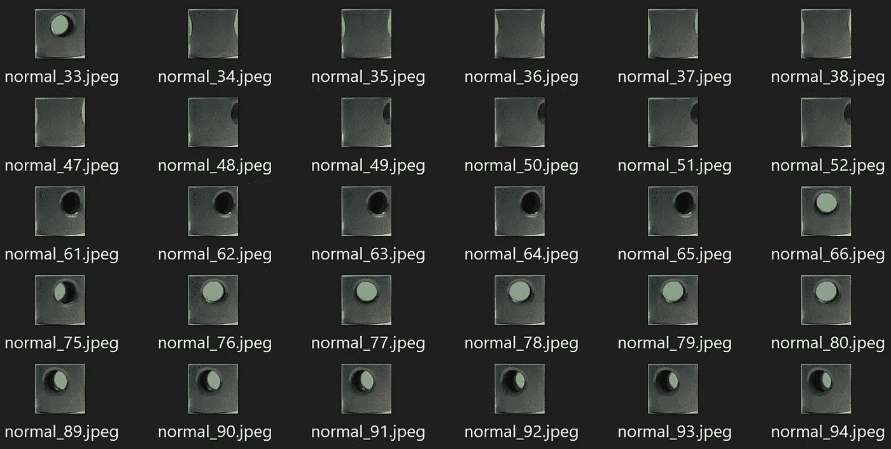
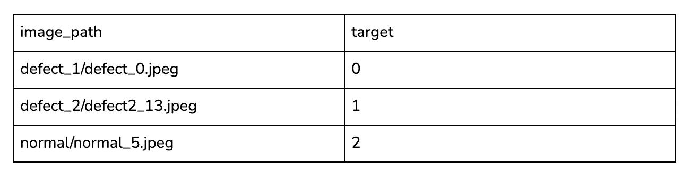
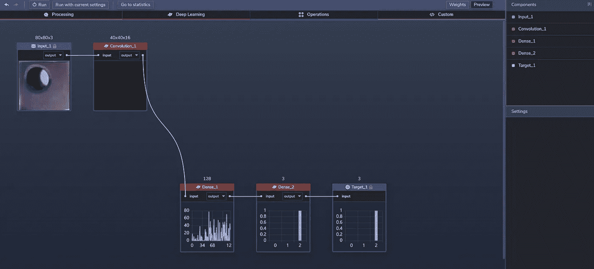
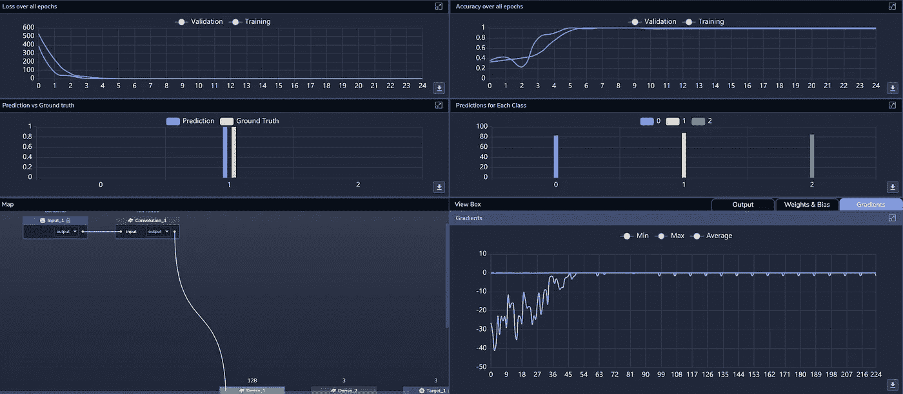
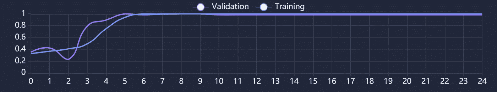
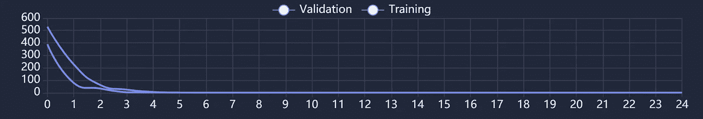

# 用例:在几分钟内构建一个用于材料缺陷检测的 CNN

> 原文：<https://towardsdatascience.com/use-case-air-conditioner-piston-check-6007b9be40cf?source=collection_archive---------28----------------------->

## 我们如何建立一个图像识别模型，可以对 AC 活塞的图像进行分类

空调([图片来源](https://unsplash.com/photos/LAnc1nT9b7g))

制造或建筑中使用的材料可能有各种各样的缺陷，从物理异常(如断裂)到化学问题(如油性表面)。这些问题可能在制造、安装或安装后(例如，由于磨损、环境暴露等)发生。).这种问题通常需要尽快检测以避免随后的问题，或者被标记为待修复或被重新分类为较低质量等级，这取决于情况。

在涉及高精度组件的情况下，检测此类缺陷对于避免后续问题变得更加重要。一个这样的例子是制造空调(AC)单元的活塞，该活塞必须在严格的公差内制造，以使单元在现场可靠地运行。

随着[工业物联网](https://en.wikipedia.org/wiki/Industrial_internet_of_things) (IIoT)和[工业 4.0](https://en.wikipedia.org/wiki/Fourth_Industrial_Revolution) 越来越多地使用计算机视觉来分析和检测缺陷，我们受到启发，建立了一个图像识别模型，可以将 AC 活塞的图像分类为正常(即无缺陷)、油性/油腻或有缺陷(即破裂、变形或掉落)。这包括准备和处理训练数据，构建一个. csv 文件来将数据映射到分类，并在 [PerceptiLabs](https://www.perceptilabs.com/) 中迭代模型。

**数据**

对于这个模型，我们使用了来自这个 [Kaggle](https://www.kaggle.com/satishpaladi11/mechanic-component-images-normal-defected) 数据集的图像，这些图像代表了 AC 活塞的三种分类:

*   **缺陷 1** :破损、变形或掉落。
*   **缺陷 2** :有油渍、油污或锈迹。
*   **正常**:正常、无缺陷活塞。

图 1 显示了一些*正常*交流活塞图像的示例:

*图 1:来自描述正常 AC 活塞的训练数据集的图像。*

我们对图像进行了预处理，将每个图像的大小调整为 80x80 像素的分辨率，并创建了一个. csv 文件，以将图像映射到标称分类值:0 表示*缺陷 1* ，1 表示*缺陷 2* ，2 表示*正常*。下面是一个部分的例子。csv 文件看起来:

*将数据加载到感知实验室的. csv 文件示例，其中 0 表示缺陷 1，1 表示缺陷 2，2 表示正常。*

**车型总结**

我们的模型只用了三个[组件](https://docs.perceptilabs.com/perceptilabs/references/components):

组件 1:卷积路径大小=3，步幅=2，特征映射=16

组件 2:密集激活= [ReLU](https://machinelearningmastery.com/rectified-linear-activation-function-for-deep-learning-neural-networks/) ，神经元=128

组件 3:密集激活= [Softmax](https://en.wikipedia.org/wiki/Softmax_function) ，神经元=3

*图 2:percept ilabs 中的最终模型(图片来源*[*percept ilabs*](http://www.perceptilabs.com)*)。*

**培训和结果**

*图 3: PerceptiLabs 在训练时的统计视图(图片来源*[*percept ilabs*](http://www.perceptilabs.com)*)。*

**我们用 32 个**一批 25 个历元训练模型，使用 [ADAM](https://machinelearningmastery.com/adam-optimization-algorithm-for-deep-learning/#:~:text=Adam%20is%20a%20replacement%20optimization,sparse%20gradients%20on%20noisy%20problems.) 优化器，学习率 0.001，交叉熵[损失](https://blog.perceptilabs.com/choosing-and-customizing-loss-functions-for-image-processing/)函数。

使用大约 21 秒的**训练时间，我们能够实现 100%的训练准确率和 98.25%的验证准确率。**在下面来自 PerceptiLabs 的屏幕截图中，您可以看到准确性如何在 25 个时期内提升到这些百分比，其中大部分提升仅发生在前六个时期内:

*图 4:精度图(图片来源* [*感知器*](http://www.perceptilabs.com) *)。*

与此同时，在前三个时期，损失下降最多:

*图 5:损失图(图片来源* [*感知器*](http://www.perceptilabs.com) *)。*

**垂直应用**

使用这种图像识别模型来发现缺陷可以在工业物联网( [IIoT](https://en.wikipedia.org/wiki/Industrial_internet_of_things) )应用中发挥关键作用，范围从机械到石油和天然气等。公司有可能使用它来自动检测缺陷，从而获得对资源的更多控制，减少缺陷，并优化他们的运营。

该模型本身也可以用作[转移学习](https://blog.perceptilabs.com/when-to-use-transfer-learning-in-image-processing/)的基础，以创建检测其他类型缺陷的更高级的模型。

**总结**

这个用例是一个简单的例子，说明了如何使用 ML 通过图像识别来识别材料缺陷。如果你想在几分钟内建立一个类似的深度学习模型，[运行 PerceptiLabs](https://docs.perceptilabs.com/perceptilabs/getting-started/quickstart-guide) 并从 [GitHub](https://github.com/PerceptiLabs/AC-Piston-Checks) 获取我们预处理过的数据集的副本。