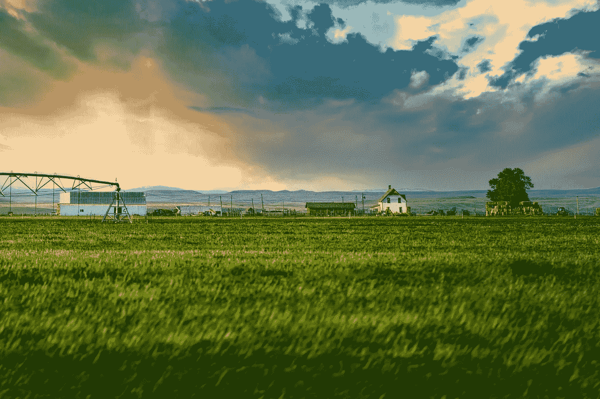
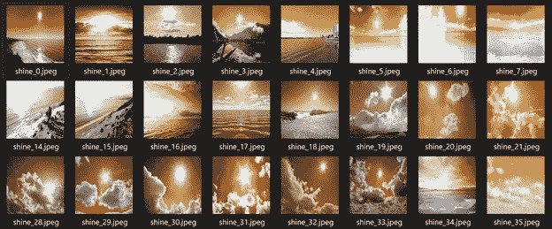
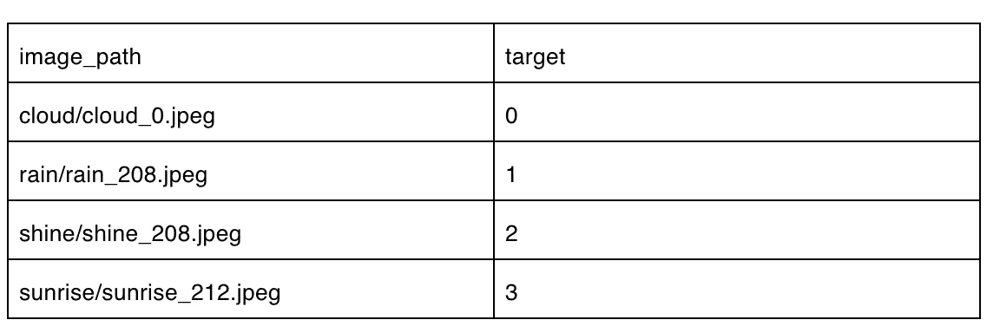
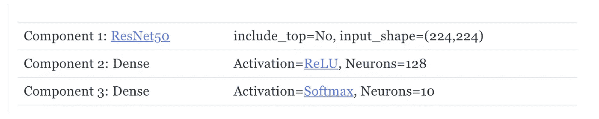
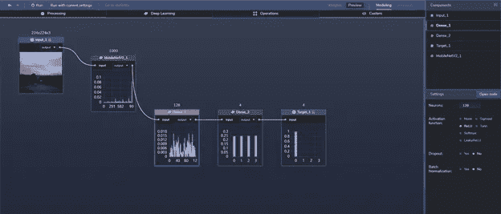
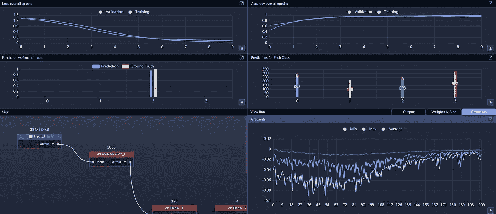
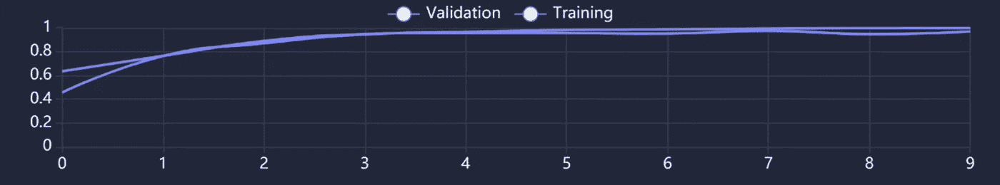
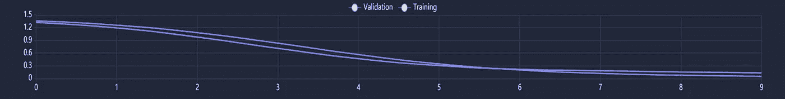

# 用例:使用图像识别的自动化天气分析

> 原文：<https://towardsdatascience.com/use-case-automated-weather-analysis-using-image-recognition-c6b4659557ac?source=collection_archive---------26----------------------->

[图片来源](https://unsplash.com/photos/VDhBKvg1_HQ)。

许多行业都需要识别当前和过去的天气状况。这些数据有助于他们计划、组织和/或优化运营。例如，农民可能会查看当前的天气来决定是否应该打开或关闭洒水装置。滑雪场经营者可能会根据山上不同的天气条件选择启用造雪机。建筑工人可能会计划好他们在一个偏远的工地需要的物资和雨具。

目前，做出这样的决定可能需要手动查看来自远程摄像机的视频，依赖天气预报，或者只是看着窗外。

通过提供一只*数字眼*，使用机器学习(ML)提供了自动化的潜力。更具体地说，如果可以建立图像识别 ML 模型来通过简单地查看天气图像来识别条件，则它可以部署在如上所述的场景中。例如，农场上的摄像机馈送可以由部署在边缘的物联网设备(例如，智能摄像机)上的 ML 模型来处理。然后，该模型可用于自动确定当前的天气状况，并相应地启用或禁用喷水阀。

为了演示这个用例，我们在 PerceptiLabs 中建立了一个模型，用于对四种不同类型的天气进行分类。我们使用了来自[多类天气数据集的 1123 张图像进行图像分类](https://data.mendeley.com/datasets/4drtyfjtfy/1):多云、晴朗、日出和下雨。

**数据**

*图 1:来自描述不同天气条件的训练数据集的图像。*

我们对图像进行了预处理，将每个图像的大小调整为 224x224 像素的分辨率，并创建了一个. csv 文件来将图像映射到它们各自的分类枚举。下面是一个部分的例子。csv 文件看起来:

*将数据加载到 PerceptiLabs 的. csv 文件示例，其中 0 表示多云，1 表示下雨，2 表示晴天，3 表示日出。*

**型号总结**

我们的模型仅由三个[组件](https://docs.perceptilabs.com/perceptilabs/references/components)组成:

ResNet50 可以在这里找到。ReLU 可以在这里找到。Softmax 可以在这里找到。

图片来源:[感知器](http://perceptilabs.com)

**训练及结果**

图片来源:[感知实验室](http://perceptilabs.com)

**我们使用 [ADAM](https://machinelearningmastery.com/adam-optimization-algorithm-for-deep-learning/#:~:text=Adam%20is%20a%20replacement%20optimization,sparse%20gradients%20on%20noisy%20problems.) 优化器，学习率为 0.001，交叉熵[损失](https://blog.perceptilabs.com/choosing-and-customizing-loss-functions-for-image-processing/)函数，以 10 个历元为一批，每批 50 个**来训练模型。

在大约四分钟的**训练时间内，我们能够实现 99.4%的训练准确率和 95.9%的验证准确率。**在以下来自 PerceptiLabs 的屏幕截图中，您可以看到准确度如何在 10 个时期内提升到这些百分比，其中大部分提升发生在前三个时期内:

图片来源:[感知实验室](http://perceptilabs.com)

与此同时，在前五到六个时期，损失下降最多:

图片来源:[感知实验室](http://perceptilabs.com)

**垂直应用**

使用图像识别自动识别当前天气状况的能力可以在工业物联网( [IIoT](https://en.wikipedia.org/wiki/Industrial_internet_of_things) )应用中发挥关键作用，从农业到石油和天然气等等。公司可以利用它来控制资源、节约能源和优化运营。

该模型本身也可以用作迁移学习的基础，以创建更高级的模型，检测其他天气条件，甚至分析给定的环境。

**总结**

这个用例是一个简单的例子，展示了 ML 如何通过图像识别来识别天气状况。如果你想在几分钟内建立一个类似的深度学习模型，[运行 PerceptiLabs](https://docs.perceptilabs.com/perceptilabs/getting-started/quickstart-guide) 并从 [GitHub](https://github.com/PerceptiLabs/Weather-Analysis) 获取我们预处理过的数据集的副本。

数据集鸣谢:Ajayi，Gbeminiyi (2018)，“用于影像分类的多类天气数据集”，门德利数据，V1，doi: 10.17632/4drtyfjtfy.1