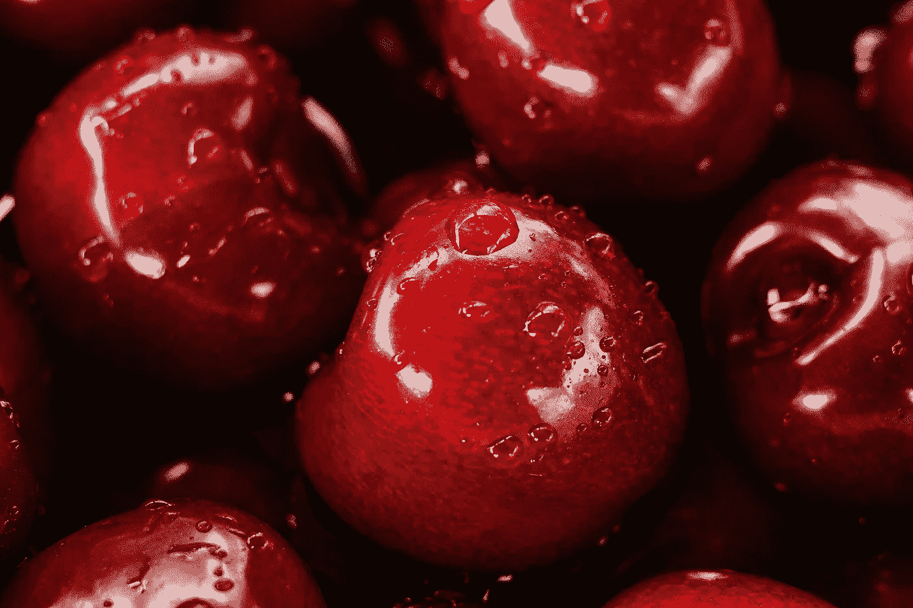
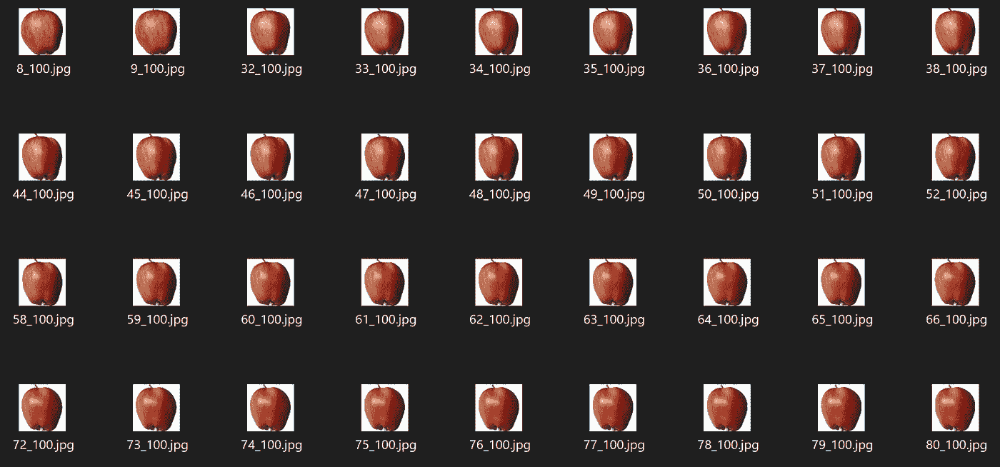
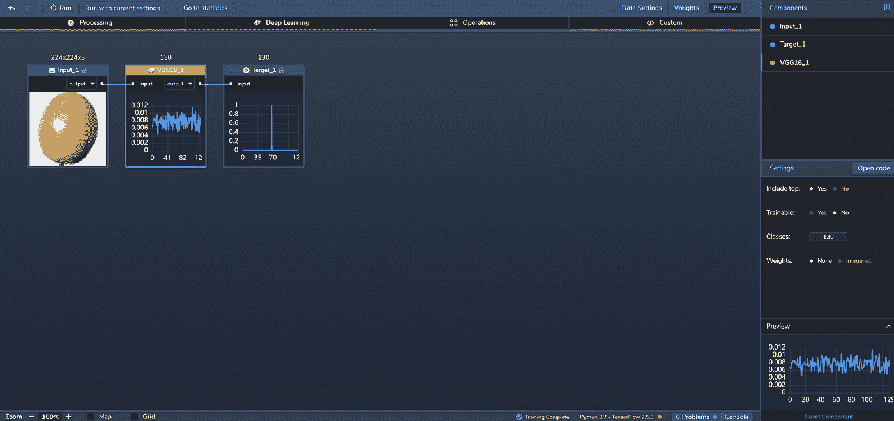
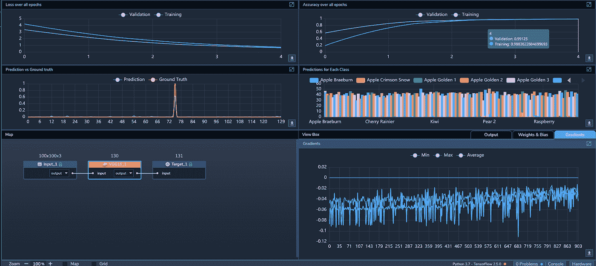
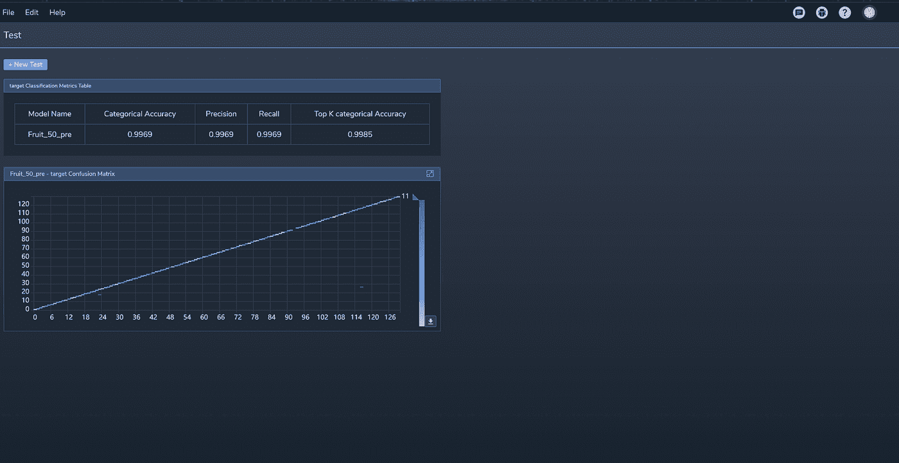

# 用例:水果分类

> 原文：<https://towardsdatascience.com/use-case-classifying-fruit-1a0ae4da3c5e?source=collection_archive---------28----------------------->

## 图像识别模型能理解新鲜农产品的奇特之处吗？

图片[来源](https://unsplash.com/photos/CR28Ot0ckaE)。

供应链中水果和蔬菜等易腐食品的处理可能涉及许多过程，如分拣、称重和识别过期产品。传统上，这些过程是手工完成的，但随着技术的进步，自动化程度越来越高。现在，工业物联网(IIoT)和 ML 等领域在供应链中发挥着越来越重要的作用，行业参与者可以利用图像识别等技术来帮助对产品进行分类，在边缘做出决策，并优化他们的运营。

像这样的垂直市场对 ML 来说是一个很好的测试。举个例子，像水果和蔬菜这样的食物。每个标本的大小、形状和特征都各不相同，而照明等环境因素都增加了图像处理训练数据的复杂性。

谢天谢地，在感知力实验室，我们从不在挑战面前退缩。因此，我们在[感知实验室](https://www.perceptilabs.com/)中建立了一个图像识别模型，看看它能否通过分析图像来识别不同类型的水果。

有了足够高的准确性，像这样的模型可能会帮助农民、批发商和超市自动化供应链中负责管理和处理这些产品的不同流程。让我们看看进展如何。

**数据集**

为了训练我们的模型，我们使用了来自 [Kaggle](https://www.kaggle.com/) 上的 [Fruits 360](https://www.kaggle.com/moltean/fruits) 数据集的图像，这些图像最初是使用视频捕获获得的，如这里的[所示](https://www.youtube.com/watch?v=_HFKJ144JuU)。

数据集包含超过 90，000 种颜色。jpg 图像分为 131 类，代表不同类型的水果。使用 6500 多张图像的子集，我们使用 PerceptiLabs 的[数据向导](https://docs.perceptilabs.com/perceptilabs/references/ui-overview/data-wizard)中的预处理选项将每张图像的大小调整为 224x224 像素。图 1 显示了该数据集中的一些苹果图片示例:

*图 1:来自数据集的图像示例—图像* [*来源*](http://www.perceptilabs.com) *。*

为了将分类映射到图像，我们创建了一个. csv 文件，将每个图像文件与适当的水果分类标签相关联，以便通过 PerceptiLabs 的[数据向导](https://docs.perceptilabs.com/perceptilabs/references/ui-overview/data-wizard)加载数据。下面是一个部分的例子。csv 文件看起来:

*的例子。csv 文件，用于将数据加载到将图像文件映射到其关联标签的 PerceptiLabs 中。*

我们已经将图像数据和这个 CSV 文件在 [GitHub](https://github.com/PerceptiLabs/Fruit-Classification) 上进行实验。

**型号汇总**

我们的模型只使用了一个[组件](https://docs.perceptilabs.com/perceptilabs/references/components):

组件 1: [VGG16](https://keras.io/api/applications/vgg/)

我们采用的 VGG16 模型是具有 16 层的神经网络架构，其中 13 层是卷积层，其余三层是密集层。图 2 显示了感知实验室中模型的拓扑结构:

*图 2:感知实验室中模型的拓扑结构—图片* [*来源*](http://www.perceptilabs.com) *。*

**训练和结果**

**我们用 32 个**批量 5 个历元训练模型，使用 [ADAM](https://machinelearningmastery.com/adam-optimization-algorithm-for-deep-learning/#:~:text=Adam%20is%20a%20replacement%20optimization,sparse%20gradients%20on%20noisy%20problems.) 优化器，学习率 0.001，交叉熵[损失](https://blog.perceptilabs.com/choosing-and-customizing-loss-functions-for-image-processing/)函数。使用大约 74 分 44 秒的训练时间，**我们能够实现 99.82%的训练准确率、99.54%的验证准确率和 99.6%的测试准确率。全球培训损失为 0.19%，全球验证损失为 0.14%。**

图 3 显示了训练期间 PerceptiLabs 的统计视图:

*图 3:训练时 PerceptiLabs 的统计视图。训练损失和精度分别显示在左上角和右上角，右下角可以看到渐变—图片* [*来源*](http://www.perceptilabs.com) *。*

在这里，我们可以看到验证和训练损失随着时间的推移逐渐下降，两者的曲线非常相似。验证和训练准确性的曲线也反映了彼此的形状，并在稳定在略低于 1.0 之前的前三个时期上升。

图 4 显示了模型的分类标签度量表测试结果和混淆矩阵:

*图 4:模型的分类标签度量和混淆矩阵—图像* [*来源*](http://www.perceptilabs.com) *。*

混淆矩阵表明，模型正确地测试了几乎所有的样本(即，只有少数假阳性或假阴性)。Labels Metrics 表通过显示以下各项的高(标准化)值来证实这一点:**分类准确度**(每个类别的准确度对所有类别进行平均)**前 K 个分类准确度**(前 K 个预测类别中正确类别的频率)**精确度**(正面预测的准确度)，以及**召回**(找到的正面的百分比(即，没有被错误分类为负面而不是正面)。

**垂直应用**

像这样的模型可以用于水果的收集、分类和分配。例如，该模型可用于分析通过相机获取的照片或视频帧，以分析传送带上不同种类的苹果，从而帮助对它们进行分类。该模型本身也可以用作[迁移学习](https://blog.perceptilabs.com/when-to-use-transfer-learning-in-image-processing/)的基础，以创建用于对其他类型的食品、材料或产品进行分类的模型。

**总结**

此使用案例展示了如何构建图像识别模型来支持整合了 IIoT 和/或 ML 的供应链流程。如果你想建立一个类似这样的深度学习模型，[运行 PerceptiLabs](https://docs.perceptilabs.com/perceptilabs/getting-started/quickstart-guide) 并从 [GitHub](https://github.com/PerceptiLabs/Fruit-Classification) 中抓取一份我们预处理过的数据集。

Mihai Oltean，水果 360 数据集:*包含水果和蔬菜的图像数据集*，2020，[Kaggle.com](http://kaggle.com/)，2020.05.18.0，[https://www.kaggle.com/moltean/fruits](https://www.kaggle.com/moltean/fruits)，麻省理工学院许可证