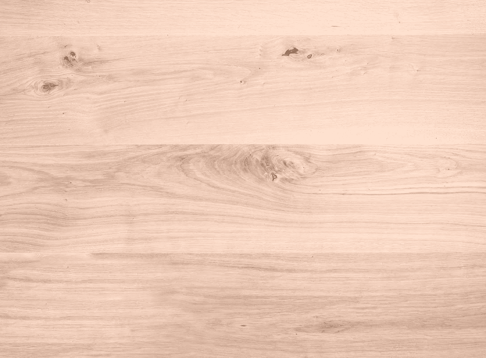
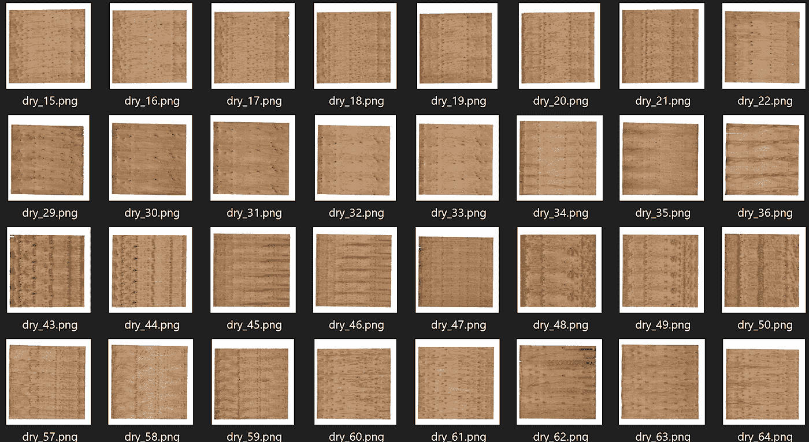
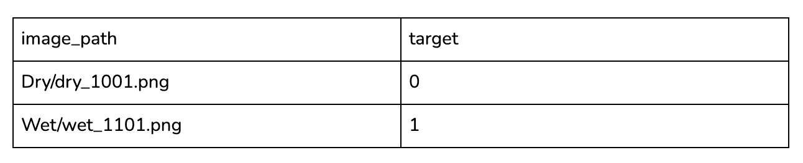
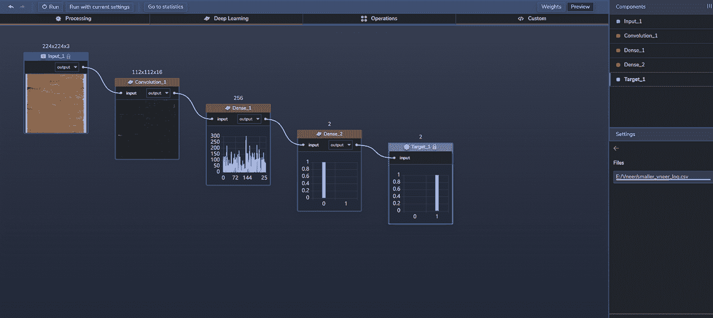
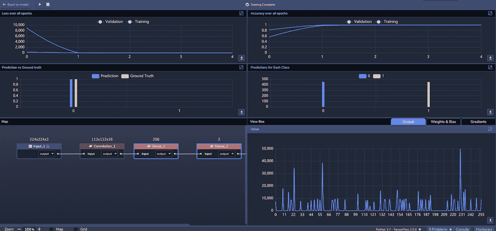
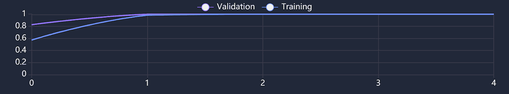
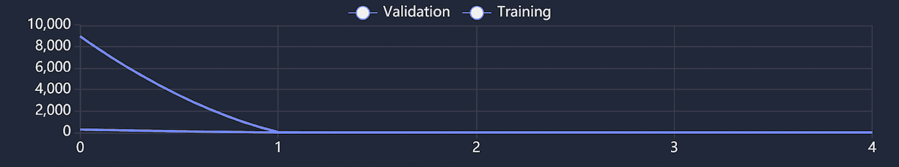

# 用例:将木材单板分为干和湿

> 原文：<https://towardsdatascience.com/use-case-classifying-wood-veneers-into-dry-and-wet-19e10c387973?source=collection_archive---------27----------------------->

## 我们如何构建一个图像识别模型来自动化密钥验证过程

[图片来源](https://unsplash.com/photos/JH_R66BihvA)。

工业物联网在[工业 4.0](https://en.wikipedia.org/wiki/Fourth_Industrial_Revolution) 中发挥着重要作用，尤其是在自动化[制造](https://en.wikipedia.org/wiki/Internet_of_things#Industrial_applications)流程方面。随着传感器、摄像头和人工智能在边缘的集成，组织现在可以自动化许多流程，如视觉质量控制检查。

以制造[木皮](https://en.wikipedia.org/wiki/Wood_veneer)为例。制造过程的一个重要部分包括在高达 320°F 的温度下干燥木材片，以获得大约 8%至 12%的含水量。在此干燥过程之后，必须对板材进行多次验证，以确保它们已正确干燥并符合质量控制标准。

为了帮助自动化这一验证过程，我们开始在 [PerceptiLabs](https://www.perceptilabs.com/) 中构建一个图像识别模型，该模型可以识别单板是*干*还是*湿*。像这样的模型可能有助于制造商自动识别水分含量过高的单板。

**数据集**

为了训练我们的模型，我们使用了来自[单板 21 数据集](https://ieee-dataport.org/open-access/veneer21)的图像。原始数据集包括高分辨率。png 图像(通常超过 4000x4000 像素)分为两类，分别代表*湿*和*干*木皮。使用 PerceptiLabs 的[数据向导](https://docs.perceptilabs.com/perceptilabs/references/ui-overview/data-wizard)，我们将图像预处理为 224x224 像素。图 1 显示了来自该数据集的*干*单板的一些示例图像:

*图 1:显示干燥单板的数据集的图像示例—* [*图像来源*](https://ieee-dataport.org/open-access/veneer21) *。*

为了将分类映射到图像，我们创建了一个. csv 文件，将每个图像文件与适当的分类号(0 =干，1 =湿)相关联，以便使用 PerceptiLabs 的数据向导加载数据。下面是一个部分的例子。csv 文件看起来:

*的例子。csv 文件，用于将数据加载到将图像文件映射到其分类号的 PerceptiLabs 中。*

**车型总结**

我们的模型只用了三个[组件](https://docs.perceptilabs.com/perceptilabs/references/components):

组件 1:卷积神经网络(CNN)，Activation= [ReLU](https://machinelearningmastery.com/rectified-linear-activation-function-for-deep-learning-neural-networks/) ，特征映射=16，Patch_size=3，Stride=2

组件 2:密集，激活= [ReLU](https://machinelearningmastery.com/rectified-linear-activation-function-for-deep-learning-neural-networks/) ，神经元=256

组件 3:密集，激活= [Softmax](https://en.wikipedia.org/wiki/Softmax_function) ，神经元=2

图 2 显示了感知实验室中模型的拓扑结构:

*图 2:感知实验室中模型的拓扑结构—* [*图片来源*](http://www.perceptilabs.com) *。*

**训练和结果**

**我们用 32 个**批量 5 个历元训练模型，使用 [ADAM](https://machinelearningmastery.com/adam-optimization-algorithm-for-deep-learning/#:~:text=Adam%20is%20a%20replacement%20optimization,sparse%20gradients%20on%20noisy%20problems.) 优化器，学习率 0.001，交叉熵[损失](https://blog.perceptilabs.com/choosing-and-customizing-loss-functions-for-image-processing/)函数。在大约 22 分 10 秒的训练时间内，**我们实现了 100%的训练准确率和 99.7%的验证准确率**。图 3 显示了训练期间 PerceptiLabs 的统计视图。

*图 3: PerceptiLabs 在训练时的统计视图—* [*图片来源*](http://www.perceptilabs.com) *。*

下面的图 4 和图 5 显示了训练期间五个时期的准确度和损失:

*图 4:训练时的准确度—* [*图片来源*](http://www.perceptilabs.com) *。*

*图 5:训练中的损耗—* [*图片来源*](http://www.perceptilabs.com) *。*

这里我们可以看到，在训练和验证的第一个时期，精确度增加最多，损失减少最多。在第一个时期之后，精确度和损失在其余时期保持稳定。

**垂直应用**

像这样的模型可以用来检测生产线上的制造缺陷。例如，该模型可用于分析照片或视频帧，这些照片或视频帧是通过工厂地板上的摄像机采集的，这些摄像机在制造过程中捕捉通过装配线的单板。任何含有 T2 湿木材的板材都会被标记出来，供工厂工人进一步检查。该模型本身也可以用作[迁移学习](https://blog.perceptilabs.com/when-to-use-transfer-learning-in-image-processing/)的基础，以创建用于检测其他类型的材料或产品中的缺陷的附加模型。

**总结**

这个使用案例是一个例子，说明图像识别如何用于帮助制造业。如果你想建立一个类似这样的深度学习模型，[运行 PerceptiLabs](https://docs.perceptilabs.com/perceptilabs/getting-started/quickstart-guide) 并在 [GitHub](https://github.com/PerceptiLabs/Classifying-Wood-Veneers-as-Dry-or-Wet) 上查看我们为这个用例创建的 repo。

[https://ghar pedia . com/blog/manufacturing-process-of-wood-单板/](https://gharpedia.com/blog/manufacturing-process-of-wood-veneer/)

T.Jalonen，F. Laakom，M. Gabbouj 和 T. Puoskari，“使用暹罗神经网络的视觉产品跟踪系统”，IEEE Access，第 9 卷，第 76796–76805 页，2021 年，doi:10.1109/Access . 2021 . 3082934([cc 4.0](https://creativecommons.org/licenses/by/4.0/))。