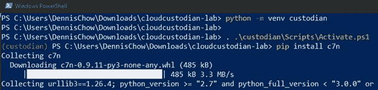
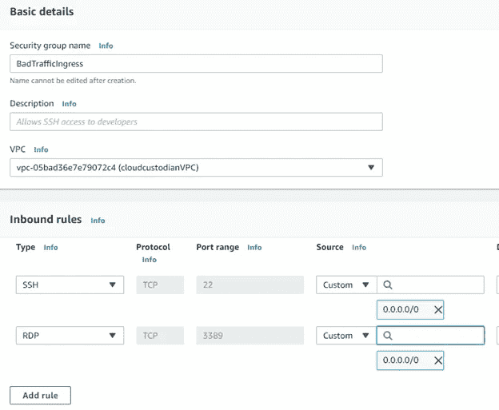
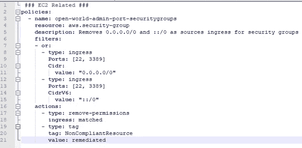
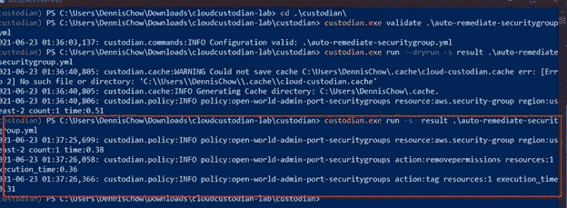
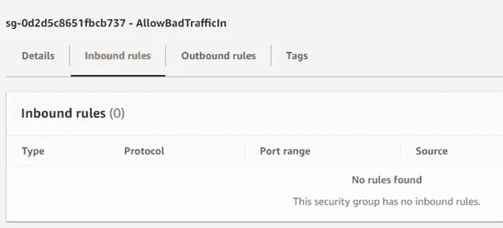
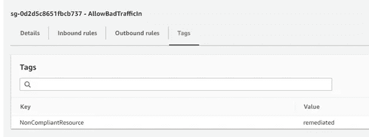
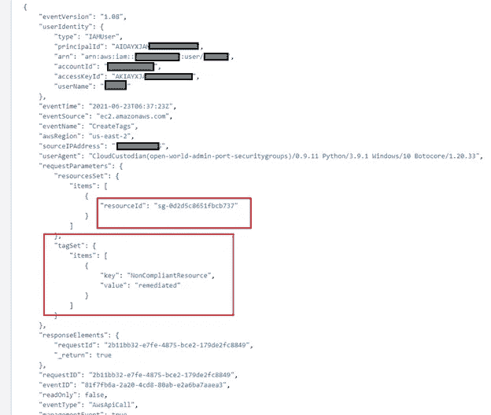

# 使用云托管实现 AWS 安全性自动化

> 原文：<https://towardsdatascience.com/use-cloud-custodian-to-automate-security-in-amazon-web-services-3ea7b800a209?source=collection_archive---------16----------------------->

了解如何使用云托管自动保护您的 AWS 帐户使用易于使用的免费政策。

任何使用过亚马逊网络服务( [AWS](https://aws.amazon.com/) )的人都知道有一些很棒的自动化安全功能，比如 [AWS Config](https://aws.amazon.com/config/) 。不利的一面是，根据你的账户有多忙，费用会很快增加。AWS 自己的客户之一， [Capital One](https://www.capitalone.com/tech/cloud/cloud-custodian-cncf-donation/) 创建了一个名为[云托管](https://cloudcustodian.io/)的社区项目。

该项目在执行时即时创建临时的 [Lambdas](https://aws.amazon.com/lambda/) ，以对照策略进行检查，并在发现配置不合适时采取纠正措施。要了解更多关于云托管如何工作的信息，你可以查看 AWS Re:Invent 视频[这里](https://www.youtube.com/watch?v=oY8Nmh6B7P8)。让我们开始实现免费的自动化安全！

先决条件:确保 Python3 已安装并可在您的终端中访问。您还需要确保设置了 AWS CLI 和您的 [IAM 密钥](https://docs.aws.amazon.com/cli/latest/userguide/cli-services-iam-create-creds.html)或您的 [SSO](https://aws.amazon.com/blogs/security/how-to-create-and-manage-users-within-aws-sso/#:~:text=AWS%20Single%20Sign%2DOn%20(AWS,set%20permissions%20across%20those%20groups.) 凭证。然后根据您的操作系统使用以下语法安装云保管人:

```
#For Linux and Mac Terminals
python3 -m venv cloud-custodian-lab
source cloud-custodian-lab/bin/activate
pip install c7n

#For Windows using Powershell:
Python -m venv cloud-custodian-lab
. .\custodian\Scripts\Activate.ps1
pip install c7n
```



创建虚拟环境并安装云托管

现在让我们创建一些资源，然后编写一个策略来检查它。创建 VPC 和开放安全组。使用 VPC 向导创建一个带有一个公共子网的 VPC。然后创建一个安全组，允许从 0.0.0.0/0 到 tcp 端口 22 和 3389 的整个入站。


VPC 中不安全安全组的创建示例



向您的安全组添加开放的 RDP 和 SSH 规则入口列表

现在，让我们在 YAML 创建一个样本样板策略来展示云托管的健壮性。检查提供的样板样本策略。该示例策略将检查允许 RDP 和 SSH 从互联网进入的 VPC 安全组。删除规则，然后标记资源:



YAML 的云托管政策示例

如果你想跟进，请随意从我的文本中复制粘贴到这里:

```
### EC2 Related ###
policies:
  - name: open-world-admin-port-securitygroups
    resource: aws.security-group
    description: Removes 0.0.0.0/0 and ::/0 as sources ingress for security groups
    filters:
    - or:
      - type: ingress
        Ports: [22, 3389]
        Cidr:
          value: "0.0.0.0/0"
      - type: ingress
        Ports: [22, 3389]
        CidrV6:
          value: "::/0"
    actions:
      - type: remove-permissions
        ingress: matched
      - type: tag
        tag: NonCompliantResource
        value: remediated
```

您将对我们的不良实践安全组使用样本策略，并确保规则已随云保管人标记的安全组一起删除。利用以下命令:

```
custodian validate <your policy name.ext
custodian run --dryrun -s result <your policy name.ext>
custodian run -s result <your policy name.ext>
```

如果您一直这样做，您的输出将类似于下面这样:



Powershell 验证和运行云托管策略

运行示例策略后，检查您创建的 AWS 帐户 VPC 安全组，您会看到对它的更改。观察以下结果，包括被删除的违规规则和对象上的新标签:



云托管人删除了不合规的规则



云保管人向资源对象添加了自定义标记

您还可以在 CloudTrail 中检查对 AWS 帐户的 API 调用和结果。打开 CloudTrail，注意正在使用的 IAM 用户编程键或 SSO 凭据，深入研究标记事件和规则删除，并查看 Cloudtrail 提供的详细信息:



AWS Cloudtrail 显示成功添加的自定义标记

恭喜您，您现在已经成功利用云托管来自动化您的 AWS 帐户安全的一个方面。在我让您自己进行试验之前，这里有另一个非常受欢迎的示例策略，您可以从它开始。以下是如何始终确保 S3 存储桶被加密的方法:

```
policies:
 - name: s3-bucket-encryption-policy-absent
    resource: s3
    description: s3 buckets without encryption required and re-enable encryption 
    filters:
      - type: no-encryption-statement
    actions:
      - type: set-bucket-encryption
        crypto: AES256
        enabled: True
      - type: tag
        tag: NonCompliantResource
        value: remediated
```

那么下一步是什么？您可以在您的 [CI/CD pipeline](https://aws.amazon.com/blogs/opensource/continuous-deployment-of-cloud-custodian-to-aws-control-tower/) 中添加云托管作为您的部署后操作的一部分。或者你甚至可以将云托管策略和引擎封装在另一个 lambda 中，并在 [CloudWatch Events](https://docs.aws.amazon.com/AmazonCloudWatch/latest/events/RunLambdaSchedule.html) 中的预定 cron 任务上运行。

一如既往，如果你觉得这些信息有用，并希望更深入的咨询；请随时在 www.scissecurity.com[联系我](http://www.scissecurity.com)

快乐*安全*发展！