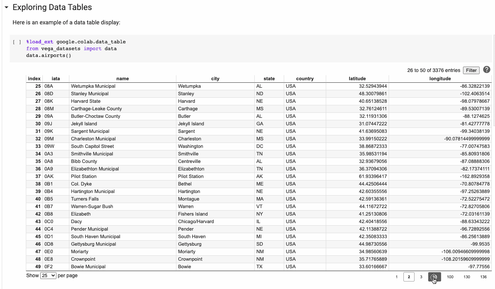

# 通过这些技巧更有效地使用 Colab

> 原文：<https://towardsdatascience.com/use-colab-more-efficiently-with-these-hacks-fc89ef1162d8?source=collection_archive---------8----------------------->

## [*招数*](https://towardsdatascience.com/tagged/tips-and-tricks)

## 充分利用 Google Colab 笔记本电脑


来源:[https://pixabay.com/images/id-4905013/](https://pixabay.com/images/id-4905013/)

[合作实验室](https://colab.research.google.com/notebooks/intro.ipynb)，简称“Colab”，是由谷歌托管的 Jupyter 笔记本，它们允许你通过浏览器编写和执行 Python 代码。旋转 Colab 很容易，因为它直接与您的谷歌帐户集成在一起。Colab 提供对 GPU 和 TPU 的免费访问，要求零配置，实现代码无缝共享。

Colab 有一段有趣的历史。它最初是作为谷歌内部的数据分析工具出现的。然而，后来它被公开推出，从那以后，许多人一直在使用这个工具来完成他们的机器学习任务。许多学生和没有 GPU 的人依靠 colab 的免费资源来运行他们的机器学习实验。

本文汇编了一些有用的技巧和窍门，我用它们来完成我在 Colab 中的工作。我已经试着列出我第一次阅读的大部分资料来源。希望这些技巧能帮助你充分利用你的 Colab 笔记本。

# 1.使用🖥本地运行时

通常情况下，Colab 会为您提供免费的 GPU 资源。但是，如果您有自己的 GPU，并且仍然希望利用 Colab UI，有一种方法。您可以在本地运行时使用 Colab UI，如下所示:


在 Colab |作者图片中使用本地运行时

这样，您可以在本地硬件上执行代码并访问本地文件系统，而无需离开 Colab 笔记本。下面的文档更深入地介绍了它的工作方式。

<https://research.google.com/colaboratory/local-runtimes.html>  

# 2.便条簿📃

你是否最终创建了多个名为“`untitled 1.ipynb`”和“`untitled 2.ipynb`”等的 Colab 笔记本？？在这方面，我想我们大多数人都在同一条船上。如果是这样，那么 [Cloud scratchpad 笔记本](https://colab.research.google.com/notebooks/empty.ipynb)可能适合你。云端暂存是一种特殊的笔记本，可在网址`[https://colab.research.google.com/notebooks/empty.ipynb](https://colab.research.google.com/notebooks/empty.ipynb)`找到，不会自动保存到您的硬盘帐户。它非常适合实验或非平凡的工作，并且不占用 Google drive 的空间。


Colab 中的便签本|作者图片

# 3.直接在 Colab 中打开 GitHub Jupyter 笔记本📖

Colab 笔记本的设计方式可以轻松地与 GitHub 集成。这意味着你可以直接将 Colab 笔记本加载和保存到 GitHub。多亏了成宰·瑞恩·李，有一种简便的方法可以做到这一点。

当你在 GitHub 上的一个笔记本上想要在 Colab 中打开时，在 URL 中将`github`替换为`githubtocolab`,其他的保持不变。这会在 Colab 中打开同一个笔记本。


在 Colab 中打开 GitHub Jupyter 笔记本|作者图片

# 4.获得已完成单元执行的通知🔔

即使您切换到另一个选项卡、窗口或应用程序，Colab 也可以通知您已完成的执行。你可以通过`Tools → Settings → Site → Show desktop notifications`来启用它(并在提示时允许浏览器通知)来查看它。


在 Colab|按作者排列的图像中启用单元格通知

这是一个演示，演示了即使导航到另一个选项卡，通知也是如何显示的。


获得已完成单元格执行的通知|作者图片

## 附加提示

> 你希望你的 Jupyter 笔记本也有同样的功能吗？我会掩护你的。您还可以在 **Jupyter 笔记本**中启用单元格完成通知。详情请阅读👇

</enabling-notifications-in-your-jupyter-notebooks-for-cell-completion-68d82b02bbc6>  

# 5.搜索驱动器中的所有笔记本🔍

您要在驱动器中搜索特定的 Colab 笔记本吗？导航到驱动器搜索框并添加:

```
application/vnd.google.colaboratory
```

这将列出您的 Google Drive 中的所有 Colab 笔记本。此外，您还可以指定特定笔记本的标题和所有权。例如，如果我想搜索一个由我创建的标题为“`Transfer`”的笔记本，我会提到以下内容:


按作者搜索驱动器|图片中的所有笔记本

# 6.Kaggle 数据集到 Google Colab🏅

如果你的预算有限，并且已经用完了 Kaggle 上的 GPU 资源配额，这个黑客可能会给你一个喘息的机会。可以将任何数据集从 Kaggle 无缝下载到您的 Colab 基础架构中。你需要做的是:

1.  **下载您的 Kaggle API 令牌:**


按作者访问您的 Kaggle API 令牌|图像

点击。`Create New API Token`选项卡，将会生成一个包含您的 API 令牌的`kaggle.json`文件。在 Google Drive 中创建一个名为 **Kaggle** 的文件夹，并将`kaggle.json`文件存储在其中。


包含 kaggle.json 文件的 Kaggle 文件夹|作者图片

**2。在 Colab 笔记本中安装驱动器**


在 Colab 笔记本中安装驱动器|图片由作者提供

**3。提供“kaggle.json”的配置路径，更改当前工作目录**

```
import os
os.environ['KAGGLE_CONFIG_DIR'] = "/content/drive/My Drive/Kaggle"%cd /content/drive/MyDrive/Kaggle
```

**4。复制要下载的数据集的 API。**

对于标准数据集，可以如下访问 API:


【2021 年福布斯亿万富翁数据集在 Kaggle 上公开发布 |图片由作者提供

对于与竞赛相关联的数据集，API 位于“数据”选项卡下:


[IEEE-CIS 欺诈检测竞赛](http://IEEE-CIS Fraud Detection) [公开](http://Forbes Billionaires 2021 3.0)在 Kaggle 上[可用|图片由作者提供](http://IEEE-CIS Fraud Detection)

5.最后，运行以下命令下载数据集:

```
!kaggle datasets download -d alexanderbader/forbes-billionaires-2021-30or!kaggle competitions download -c ieee-fraud-detection
```


Kaggle 数据集到 Google Colab |作者图片

# 7 .通过终端访问 Colab

好吧，如果你不是笔记本的忠实粉丝，但想使用 colab 提供的 GPU 和 TPU，有一个办法。感谢 [Mark Saroufim](https://twitter.com/marksaroufim/status/1403396861889634305) 在社区中公开分享这个黑客。

为此，您需要安装 [tmate](https://tmate.io/) 。让我们看看这是如何工作的:

```
!apt-get install tmate
!ssh-keygen 
!tmatessh into the generated url
```


# 8.在 Colab 上访问 Visual Studio 代码(VS 代码)💻

不使用笔记本要不要使用 Colab 的基础设施？那么这个提示可能是给你的。由于社区的努力，创建了一个名为[C**olab code**](https://github.com/abhi1thakur/colabcode)**的包。**现在可以在 Colab 中运行 VSCode 了。从技术上讲，这是通过[代码服务器](https://github.com/cdr/code-server)完成的——一个运行在远程服务器上的 [Visual Studio 代码](https://code.visualstudio.com/)实例，可以通过任何网络浏览器访问。安装软件包的详细说明可以在下面找到。

<https://github.com/abhi1thakur/colabcode>  

这是这个过程的一个快速演示。


通过作者访问 Colab | Image 上的 Visual Studio 代码(VS 代码)

# 9.数据表扩展🗄

Colab 包括一个[扩展](https://colab.research.google.com/notebooks/data_table.ipynb#scrollTo=JgBtx0xFFv_i)，它将熊猫的数据帧渲染成可以动态过滤、排序和浏览的交互式显示。要启用熊猫数据帧的数据表显示，请在笔记本单元格中键入以下内容:

```
%load_ext google.colab.data_table#To diable the display
%unload_ext google.colab.data_table
```

这里有一个相同的快速演示:【https://colab.research.google.com/notebooks/data_table.ipyn】T4b



Colab |作者图片中的数据表扩展

# 10.比较笔记本👀

Colab 可以很容易地比较两个笔记本。使用 Colab 菜单中的`View > Diff notebooks`或导航到`[https://colab.research.google.com/diff](https://t.co/wu8ce4ngMl?amp=1)`并将要比较的笔记本电脑的 Colab URLs 粘贴到顶部的输入框中。


比较 Colab |作者图片中的笔记本

# 包裹

这些是我发现非常有用的一些 Colab 技巧，特别是在 GPU 上训练机器学习模型的时候。尽管 Colab 笔记本最多只能运行 12 个小时，然而，有了上面分享的技巧，你应该能够充分利用你的会议。

*👉有兴趣看我写的其他文章。这个* [*回购*](https://github.com/parulnith/Data-Science-Articles/blob/main/README.md) *包含了我分类写的所有文章。*