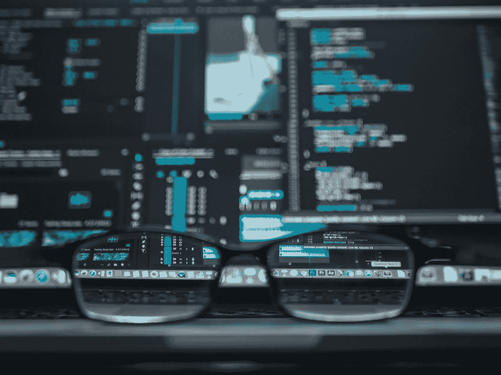
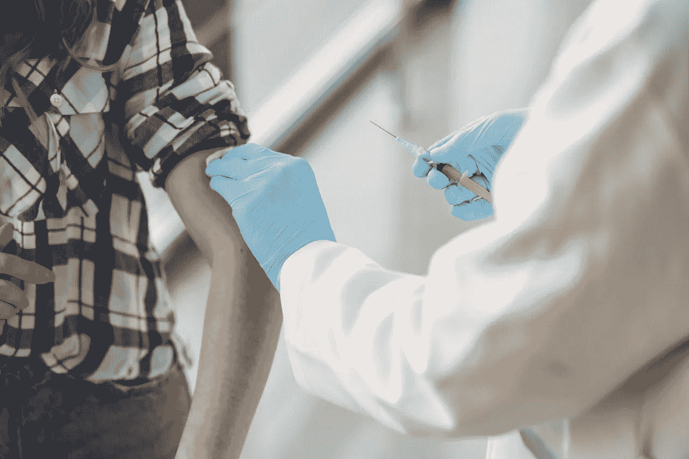
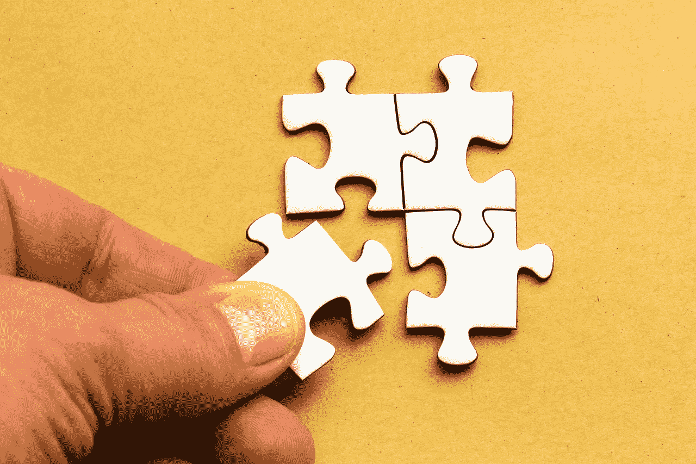

# 使用计算机视觉捕捉真实世界的事件

> 原文：<https://towardsdatascience.com/use-computer-vision-to-capture-real-world-events-57dc890e82d5?source=collection_archive---------21----------------------->

## [变更数据](https://towardsdatascience.com/tagged/data-for-change)

## 利用计算机视觉协助 COVID 疫苗分发



来自 [Pexels](https://www.pexels.com/photo/black-farmed-eyeglasses-in-front-of-laptop-computer-577585/?utm_content=attributionCopyText&utm_medium=referral&utm_source=pexels) 的[凯文·Ku](https://www.pexels.com/@kevin-ku-92347?utm_content=attributionCopyText&utm_medium=referral&utm_source=pexels)拍摄的照片。

在这篇博文中，我将描述使用计算机视觉捕捉不同事件的一般方法，重点是如何使用计算机视觉进行一系列应用来帮助疫苗分发。这篇博文比较长，但是我涵盖了一些不同的场景，这些场景在很多情况下会有帮助。如果你想查看代码，可以在这里找到。如果对应用程序进行了改进，本文也会更新！

一年多来，新冠肺炎疫情以多种方式影响了我们的生活，也给我们带来了诸多挑战。有了现在可用的疫苗，我们有能力加速疫情的终结，只要疫苗能够安全有效地分发。应该尽一切努力帮助这一进程。进入计算机视觉！

在开发应用程序时，最好考虑到特定的用例及环境。为了确定计算机视觉如何帮助疫苗接种过程，我们的团队咨询了疫苗接种中心的一名志愿者，以了解更多关于该过程的信息，并寻找应用计算机视觉的机会。如果你想看这次讨论的录音和应用的演示，你可以在 [YouTube](https://youtu.be/ROOFvzPfR3I) 上观看。

在志愿者的疫苗接种中心，有三个主要阶段:等待接种疫苗(和/或等待登记)、接种疫苗和接种后监测。我们的志愿者确定的主要问题是，我们认为计算机视觉可以很容易地帮助我们:减少长时间的等待时间，帮助个人练习社交距离，以及监控疫苗接种后的房间。由于目前的方法是手动点击器计数器，因此有一种方法来验证已经进行了多少次疫苗接种也是有用的。

疫苗接种过程中的一些其他障碍，如难以导航的网站，不适合用计算机视觉来解决。其他挑战，如多余的表单输入，可以通过将计算机视觉许可证验证解决方案与更高效的在线注册流程相结合来解决！

该解决方案使用三个模块化应用程序，可以单独使用或与仪表板结合使用，以帮助解决上述问题。第一个应用程序监视等候室，记录个人之间的距离、戴口罩的个人比例以及等候室中有多少椅子是空的。第二个应用程序监控发生了多少次疫苗接种事件。第三个应用程序监视患者何时举手，表示他们需要志愿者的帮助。通过整合这些解决方案，以及一些关于正在使用的疫苗类型和当天疫苗接种预约数量的一般输入数据，我们还可以帮助提供一种验证方法，以确定打开了多少个疫苗瓶、打开的疫苗瓶中还剩多少剂量，以及是否到达了当天的最后预约。这些数据可以帮助管理等待时间，如果排队速度比预期慢或快，就会自动发送短信通知即将到来的预约，如果一天结束时打开的小瓶中还有疫苗剂量，就会拨打等待名单。

因为这些应用程序不是为真实的站点开发的，只是尽可能接近真实场景，所以使用了库存视频数据，而这些数据正是驱动应用程序实现的原因。如果您构建自己的疫苗接种应用程序，确切的应用程序将很可能非常不同；要么过程会略有不同，要么拍摄角度会有所不同。

# 候诊室申请


照片由来自 [Pexels](https://www.pexels.com/photo/green-wooden-chair-on-white-surface-963486/?utm_content=attributionCopyText&utm_medium=referral&utm_source=pexels) 的 [Paula Schmidt](https://www.pexels.com/@paula-schmidt-353488?utm_content=attributionCopyText&utm_medium=referral&utm_source=pexels) 拍摄。

[候诊室应用](https://github.com/alwaysai/vaccination-center-assistant/tree/main/waiting)协助分析社交距离和面具检测，以及在候诊室椅子无人时进行监控。距离其他人至少 6 英尺(大约)并且戴着面具的人有绿色的边界框；如果一个人与另一个人的距离小于 6 英尺，或者没有戴口罩，就会显示红色方框。

为了确定等候室有多满，我们检测等候室的椅子上有多少人。这是通过使用免费提供的股票 alwaysAI 模型 yolov3 进行对象检测来实现的。[结果过滤函数](https://alwaysai.co/docs/edgeiq_api/tools.html#edgeiq.edge_tools.filter_predictions_by_label)用于将结果限制为带有“人”标签的结果，以确保只检测到对人的预测。这是通过在每把椅子周围创建一个[边界框](https://alwaysai.co/docs/edgeiq_api/bounding_box.html#edgeiq.bounding_box.BoundingBox)来实现的，并注意当一个人的[边界框与最近的椅子边界框](https://alwaysai.co/docs/edgeiq_api/bounding_box.html#edgeiq.bounding_box.BoundingBox.compute_overlap)重叠超过某个阈值时——比如大约 70%。使用该阈值是因为一些人在椅子上前倾，或者将脚伸向侧面，因此使用阈值< 100%允许以更一般化的方式检测一个人正坐在椅子上。关于检测到多少个面具、每对人之间的平均距离或距离以及有多少椅子被占用的报告被发送到服务器(参见最后一节)。

开发该应用程序的第一步是执行遮罩检测。

alwaysAI 的产品经理托德·格里德(Todd Gleed)训练了一个新模型，使用标签“面具”(代表任何戴着面部覆盖物的脸)和“无面具”(代表没有任何覆盖物的脸)。通过与我分享项目的模型，我能够测试不同的版本。在应用程序中测试该模型时，它偶尔会工作，但在股票视频数据上有困难，这些数据具有较小的遮罩实例(人比他们在训练数据中离摄像机更远)。股票数据碰巧只使用了更柔和的中性色。我还注意到，当患者坐在登记工作人员的正对面时，该模型并不总是能够做出任何预测(无论是“戴口罩”还是“不戴口罩”)；所以从那个角度拍摄的图像在数据集中可能没有得到很好的表现。我们当然可以对模型进行更多的训练，使用更接近用例的数据，但是我修改了应用程序代码。

因为知道哪些人戴着面具是有用的，要么人的边界框必须与面具检测的边界框进行比较，要么对应于人检测框的图像可以简单地用作面具检测模型的输入，这就是我选择要做的。

对于每个“人”检测框，对应于人[的原始帧部分被切掉](https://alwaysai.co/docs/edgeiq_api/tools.html#edgeiq.edge_tools.cutout_image)，并且该图像通过掩模检测模型运行。在[这个应用](https://github.com/alwaysai/gesture-audio-control)中使用了类似的方法。此外，如果模型不能做出任何预测，我们就有能力说‘这里有一个人，但我不知道他们是否戴着面具’；如果有人背对着相机，或者由于其他原因很难检测到遮罩，这将非常有用。如果检测到一个人，但无法确定他们是否戴着面具，则此人的边界框会用红色标记，并给出“未检测到面具”的标签。该应用程序在登机工作人员正对面的角度上仍然有问题。

应用程序的这一部分确实使用了[跟踪](https://alwaysai.co/docs/edgeiq_api/object_tracking.html#edgeiq.object_tracking.CentroidTracker)，但是，这可能是不必要的。在这种情况下，跟踪对于查看病人如何从一张椅子移动到另一张椅子是有用的，但是对于候诊室，我们可能只关心是否所有的椅子都满了，或者注意有多少椅子是空的，等等。这可以通过物体检测来实现。每当有人坐在椅子上或离开椅子时，这些信息都会被发送到仪表板应用程序。

在这个应用中，距离是通过对一个人使用硬编码的标准测量来完成的，大约 3.5 英尺，并使用像素标度，例如在这个示例应用的[中使用的。如果你想看这个逻辑的演示和解释，你可以在 YouTube 上查看这个关于距离测量的](https://github.com/alwaysai/distance-detector)[视频教程](https://youtu.be/y5Kw3GN-u3s)。在这种情况下使用三英尺半，因为人们通常坐在用于开发应用程序的股票数据中。使用硬编码的比例是可能的，因为只有一个静态摄像机，每当检测到一个人坐着时，整个人都在画面中。根据相机角度和环境，您的应用可能需要更强大的距离测量方法，例如使用帧中尺寸已知的其他对象，或者检查关键点以查看是否找到完整的人，或者如果只找到部分人，则使用不同的比例。你也可以使用[深度相机](https://alwaysai.co/docs/edgeiq_api/real_sense.html)进行更精确的测量。

# 疫苗接种申请



照片由来自[佩克斯](https://www.pexels.com/photo/person-getting-vaccinated-3985170/?utm_content=attributionCopyText&utm_medium=referral&utm_source=pexels)的[古斯塔沃·福林](https://www.pexels.com/@gustavo-fring?utm_content=attributionCopyText&utm_medium=referral&utm_source=pexels)拍摄。

对于[疫苗接种应用程序](https://github.com/alwaysai/vaccination-center-assistant/tree/main/vaccination)，我建模的场景是单个表的静态视图。医疗专业人员坐在桌旁，并且定期有患者过来坐在桌旁。一段时间后，医务人员绕过桌子，站在病人旁边，给他们注射疫苗。因此，可以通过记录两个人何时进入图像的一部分，记录他们何时离开，然后基于这些时间戳确定他们在该区域停留了可接受的持续时间，来捕捉“接种事件”。每次发生疫苗接种事件时，都会向仪表板服务器发送 POST 请求。

这种实现只需要[跟踪](https://alwaysai.co/docs/edgeiq_api/object_tracking.html#edgeiq.object_tracking.CentroidTracker)并注意到被跟踪的边界框在设定的时间内位于图像的特定部分，与上一节中描述的方式完全相同。根据摄像机角度和每个疫苗接种站的摄像机数量，您可能需要采取类似于候诊室椅子的方法，或者您可能需要使用关键点来记录某人何时坐着或站着。

# 疫苗接种后监测应用程序


照片由 [RODNAE Productions](https://www.pexels.com/@rodnae-prod?utm_content=attributionCopyText&utm_medium=referral&utm_source=pexels) 从 [Pexels](https://www.pexels.com/photo/people-sitting-on-green-grass-waving-their-hands-7551760/?utm_content=attributionCopyText&utm_medium=referral&utm_source=pexels) 拍摄。

在个人接种疫苗后，他们通常被放入一个大房间约 15 分钟，在那里他们可以坐下来，如果他们感到不适，可以通过举手通知医疗保健专业人员。第三个应用程序旨在协助此[疫苗接种后监测](https://github.com/alwaysai/vaccination-center-assistant/tree/main/post-vaccination)。这是一个非常简单的概念——捕捉举手动作。在这个[应用程序](https://github.com/alwaysai/posture-corrector)中也做了类似的事情。在这种情况下，我没有定义什么是不良姿势，而是抓住了“举手”的不同概念。在本应用程序使用的普通视频中，当一个人的肘部高于相应的肩部时(注意:这意味着肘部的 y 坐标小于相应肩部的 y 坐标)，可以通过记录来捕捉举手动作。

不过，这是一种过于简单的抓牌方式。看看这一部分顶部图像中的所有人，或者想想当你举起手臂时，你的手臂与你的头、肩膀和其他关键点的关系。也许你的朋友举起手臂的方式有所不同——也许你的手臂向上伸直，所以你的手腕在你肘部的正上方，肘部在你肩膀的正上方。也许你的朋友只是把他们的手放在他们的脸上，所以他们的手腕在他们的肩膀上，但是他们的肘部在侧面，在垂直位置上在手腕和肩膀之间。在相机视图中，也许你看不到手腕、胳膊肘或肩膀。您可以使用真实世界的举手动作进行测试，看看在给定相机角度的情况下，哪些关键点关系反映了最常见的举手动作！

为了防止捕捉到某人刚刚拂去脸上的头发或可能调整眼镜时的动作，这些动作可能导致与举手非常相似的关键点关系，我们可以在应用程序中使用“共识”逻辑。这将在检测到举手时启动一个计时器，然后计算在特定超时时间内检测到举手的次数。总结果数除以当前人数，然后将其与检测到“硬加薪”的总次数进行比较。例如，如果我们运行循环 10 次，有一个人举手，我们应该有 10 个“举手”结果和 20 个“没有举手”结果。只要“举手”事件的数量大于或等于事件总数除以人数，我们就将其记录为真正的举手。每当有人举手，这就被发送到仪表板服务器。在我们的[手势控制应用](https://github.com/alwaysai/gesture-audio-control)中使用了类似的方法。你也可以看看关于这个话题的 [YouTube](https://youtu.be/kxU761yA0TA) 的记录！

# 将这一切结合在一起



迈克·范·肖特沃特摄于[佩克斯](https://www.pexels.com/photo/person-holding-white-puzzle-piece-5505150/?utm_content=attributionCopyText&utm_medium=referral&utm_source=pexels)。

在我最初的实现中，三个应用程序使用一个用 [Dash Plotly](https://dash.plotly.com) 生成的仪表板捆绑在一起。因为 alwaysAI 是基于 Python 的，所以您可以将这些应用程序与现有的 Python 包集成。这个 [GitHub](https://github.com/alwaysai/dash-interactive-streamer) 存储库提供了一个基本的 Dash 仪表板作为 alwaysAI 应用程序；您可以将所有数据(在每个应用程序中使用“server_url”属性)发送到这个仪表板，处理事件日志，并使用这些数据填充仪表板中的各种图形和表格！请注意，在单个应用程序中，我们将数据发送到“路由”和 URL。为了处理传入的数据，您需要在 dashboard_server/app.py 中的各个应用程序中创建发送数据的路由，如下所示:

```
@app.route("/event", methods=["POST"])
def event():
    body = request.json
    # process body further, send to managing object
```

您可以创建额外的路由(如 **'/setup'** ，或者您可以为每个单独的应用程序创建不同的端点)。创建一个特定的类来解析和管理传入的数据可能会很有用。因此，您可以在 **dashboard_server/app.py** 中实例化一个“经理”对象(您可以自己定义的类的实例),然后将所有数据传递给这个对象并处理它。例如，烧瓶路径可能如下所示:

```
manager = DataManager()@app.route("/event", methods=["POST"])
def event():
    body = request.json
    manager.process_data(body)
```

事实上，如果您只想聚合数据并发出警报，或者根据结果编写数据文件，那么您可以不使用 Dash 可视化工具来完成这些工作——只需使用这些路由来处理传入的数据，并让一些应用程序逻辑使用数据管理实例来确定要采取的操作。

如果您正在使用 Dash，那么您的 **dashboard_server/app.py** 中的回调函数可以调用这个管理对象上的方法来获取数据以填充您的可视化。例如，上述 GitHub 存储库中的回调可以修改为如下所示:

```
# Dash Callbacks
@dash_app.callback(
   output=[Output("logs", "data"), Output("logs", "columns")],
   inputs=[Input('interval-component', 'n_intervals')]
)
def render_log_table(n_intervals):
   df = manager.get_log_table_df() 
   return df.to_dict('records'), [{"name": i, "id": i} for i in df.columns]
```

在“DataManager”类中，您可以定义函数 **get_log_table_df()** 并实现它来返回正确的数据。

将重新格式化的数据存储在 [pandas 数据帧](https://pandas.pydata.org/docs/reference/api/pandas.DataFrame.html)中可能是有用的，因为 Dash 中的许多组件都将[数据帧作为输入](https://dash.plotly.com/layout)。

# 最后的想法

虽然所有其他应用程序都设置为使用 alwaysAI [streamer](https://alwaysai.co/docs/edgeiq_api/streamer.html) 功能(用于查看应用程序输出的本地网页)运行，但这主要是为了展示应用程序是如何工作的。如果您需要对 streamer 进行更多的控制，您可以自己构建；你可以在这里找到各种关于 T2 的例子。如果您不需要整合可视化，也可以将此模板用于您的中央服务器。您也可以在没有流媒体工具的情况下运行这些应用程序，只需使用计算机视觉服务生成的信息向您的服务器发送请求。如果你想使用 streamer，但是你想隐藏人脸，你总是可以使用人脸检测模型(比如[alwaysai/res10 _ 300 x300 _ SSD _ ITER _ 140000](https://console.alwaysai.co/model-catalog?model=alwaysai/res10_300x300_ssd_iter_140000#))，然后在对 [edgeiq.blur_objects()](https://alwaysai.co/docs/edgeiq_api/tools.html#edgeiq.edge_tools.blur_objects) 的调用中使用从结果返回的预测。当然，如果您曾经开发过使用健康相关数据的生产应用程序，您将需要遵守 HIPAA 和卫生组织的所有要求。

疫苗接种中心用例很可能不再需要，但是您可以使用计算机视觉来捕捉许多不同的事件！