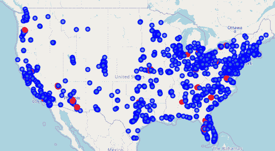
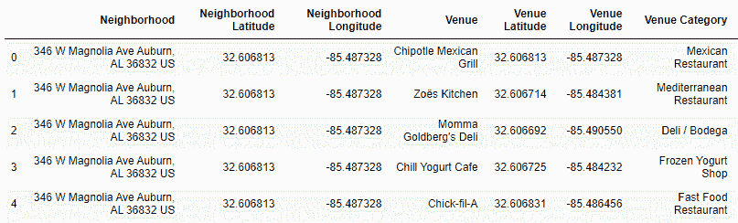
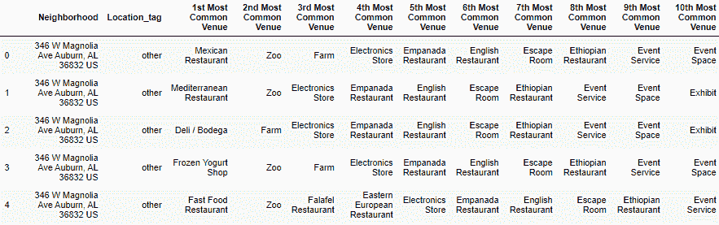
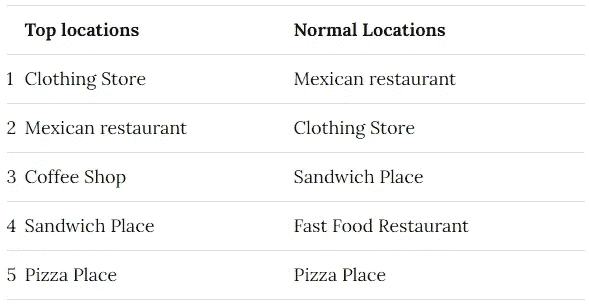
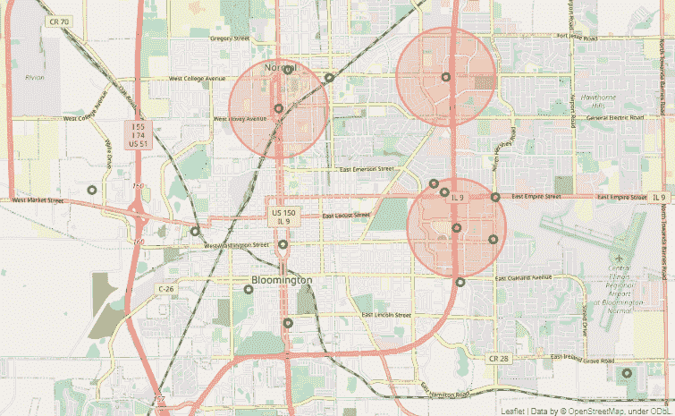
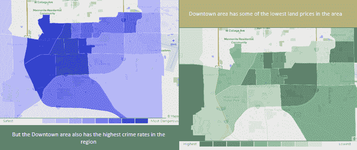
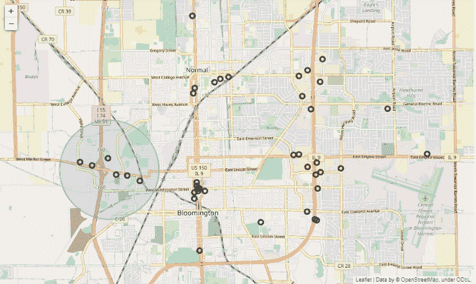

# 利用数据科学找到你的下一家餐馆

> 原文：<https://towardsdatascience.com/use-data-science-to-locate-your-next-restaurant-e99b27efec3b?source=collection_archive---------33----------------------->

在你的城市开一家 Chipotle 连锁店| Justin Snyder 摄影在 [Unsplash](https://unsplash.com?utm_source=medium&utm_medium=referral) 上

> **这个博客提供了一种利用现有的特许经营位置来决定你的餐馆的最佳位置的方法。**

**注意**:关于详细的分析和统计，请查看 [GitHub 代码](https://github.com/kmair/blogs/tree/main/Restaurant%20opening)！

虽然传统上，根据可行性研究、各种成本和经济因素来确定在哪里开餐馆是一个重要的决定，但依靠数据科学可以提供更深入的见解。住在伊利诺伊州布卢明顿的我继续寻找下一个最好的墨西哥卷饼店，使用他们在 [Kaggle](https://www.kaggle.com/jeffreybraun/chipotle-locations) 上的位置数据，如下图所示。

**图 1。** Chipotle 在美国的特许经营店。热门位置(红色)和其他位置(蓝色)|作者图片

# 地理分析

下一个需求是获取邻居信息，这里我们没有直接提供。幸运的是，各种供应商都提供 API 数据，如 Google、Yelp 等。存在。我推荐 [Foursquare](https://developer.foursquare.com/docs) ，它每天提供大约 50000 个免费 API 信用点，并且易于使用，提供:

*   场馆-该地区的所有场馆
*   用户-用户的个人资料详细信息
*   提示-用户的评分、照片和评论

我们可以迭代我们的位置并查询场馆以获得相关信息，如下所示:

结果为我们提供了邻近位置及其类别。数据可以整理为一个数据帧:

# 数据预处理

数据可能有一些重复次数太少的类别。根据数据集的大小，设定一个截止频率(例如:最少出现 5 次),并去除其他异常地点。然后，我们可以得到如下所示的数据帧:

**图二。**包含位置和查询的邻域数据的初始数据帧|作者的图像

我们的目标是为我们的餐厅主题确定最佳场地，并以此为基础筛选出我们城市的类似区域。最后的预处理步骤是为每个地点找到前 10 个最常见的地点。

**图 3。**入围网点附近的公共场馆|图片作者

# 聚集场馆

入围后，一种方法是只选择最常见的场馆。另一方面，聚类方法可以为我们提供一个地区的共同主题的答案。使用 K-Means 聚类提供了这些途径。

对于当前场景，最佳位置与其他特许经营位置的比较如下:

**表 1。**最佳表演地点和普通小吃店的场馆主题对比

两个城市都有相似的顶级场馆，唯一的区别参数是顶级场馆附近的人口密度较高。

# 本地相似集群

最后一项任务是查询所选城市中的类似位置。使用 Foursquare API，查询以上场馆，可以入围最佳位置。根据聚类，可行的位置必须靠近其他类似的餐厅，尤其是墨西哥的场馆。

关于地点的最终决定还必须考虑避免新的特许店靠近现有的 Chipotle 地点。

使用该图，有 3 个位置应该避免，留下两个区域有相似的场地:城市的西部和南部(市中心)部分。

**图 4。**布鲁明顿墨西哥餐馆的位置(绿色)和墨西哥小吃店的位置(红色)|图片由作者提供

# 商业决策

根据查询，我们比较这两个地区，以最终确定餐馆可以在哪里开业。最后要考虑的是社区的安全和价格。

**图五。**西部的位置更安全，同样昂贵|作者图片

# 结论

考虑到以下因素，城市西部似乎是最佳选择:

*   南部有一大群餐馆，竞争会很激烈。
*   除此之外，市中心区(南部)附近有许多餐馆，竞争非常激烈。
*   另一方面，在相对安全的西部地区，餐馆都很远。
*   此外，该地区是一个很好的匹配，因为其他机构在价格和目标人群方面与 Chipotle 相似。

**图 6。布卢明顿所有餐馆的位置。突出显示的区域是建议打开下一个系列的地方|作者图片**

这是对地理位置的预可行性可行性检查，最终位置可以根据该地区的实际土地可用性、价格和其他因素来决定。

非常感谢您的阅读！我希望听到您的反馈，如果您有任何疑问，我会尽快回复。