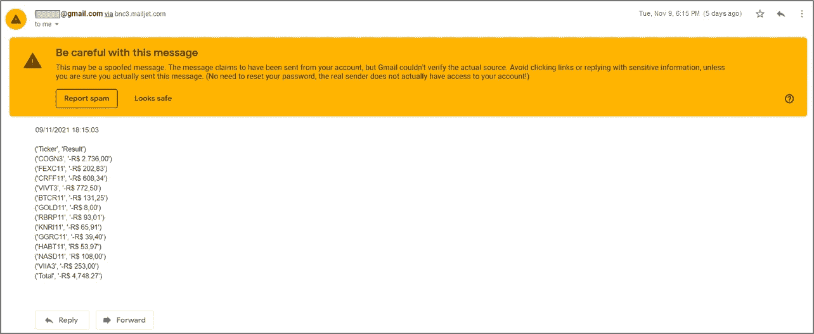

# 使用谷歌云平台发送电子邮件通知

> 原文：<https://towardsdatascience.com/use-google-cloud-platform-for-sending-email-notifications-9c518f5a57a5?source=collection_archive---------10----------------------->

## 使用 Postfix、Mailjet 和 DNS 记录配置您自己的每日股票摘要报告

布雷特·乔丹在 [Unsplash](https://unsplash.com?utm_source=medium&utm_medium=referral) 上的照片

如果你曾经想过找到一种方法，可以轻松地不断了解你个人投资的当前结果，这篇文章就是为你准备的。

在以前的帖子中，我介绍了一种使用谷歌服务管理个人投资的方法，如谷歌资产负债表和[计算引擎](https://cloud.google.com/compute)(来自谷歌云平台)。我鼓励您也访问这些帖子，因为您可以浏览主要实现文件(但也包括虚拟机目录)所需的步骤，我们将在这里使用这些文件作为我们解决方案的输入。

<https://levelup.gitconnected.com/python-and-linux-i-o-redirection-for-managing-investments-ef009be30f39>  </this-virtual-machine-is-saving-my-time-23076f592b94>  

下面，我列出了我们在这篇文章中将要经历的主要步骤:

1.  文件输入和存储它的实例(1)
2.  用于邮件服务本身的实例(2)
3.  Mailjet 和电子邮件真实性

请记住，我使用谷歌云平台作为选择的云服务提供商，但如果你愿意，你应该可以使用其他服务。

# 1.文件输入和存储它的实例(1)

如上所述，这里将要使用的文件输入是我之前分享的其他帖子中提到的解决方案的结果。为了理解当前的文章流，阅读这些文章并不是强制性的。然而，为了从整体上实现解决方案，您还应该遵循其中涵盖的所有步骤。

文件本身非常简单:

实例 1 中的每日结果示例文本文件

导入要突出显示的内容:

*   “lucasnunesfe9”是实例用户；
*   “实例-示例”是正在使用的实例；
*   该文件的路径是:"。/python script/log/result _ output . py "

除此之外，这个文件的内容是什么？

这是两列，代表一个表。第一列“Ticker”是在巴西股票市场上交易的本例投资组合公司的每一张股票(用作示例)，第二列“Result”是在给定时刻每张股票的余额。更具体地说，该文件设置为从上午 10 点到下午 5 点(UTC-3)每 15 分钟生成一次，使用 cron 作业。

好了，这应该足以让你熟悉我们将在本文中使用的输入。

# 2.用于邮件服务本身的实例(2)

你可以考虑从谷歌云平台实例发送电子邮件的多种方式。在我的案例中，我选择了 [Mailjet](https://www.mailjet.com/) 服务，因为:

*   从构建和维护 SMTP 中继服务器的角度来看，我需要选择一些第三方电子邮件服务来避免这种开销；
*   从选择哪个第三方电子邮件服务选项的角度来看，主要是因为在撰写本文时，它提供了相当数量的每月免费发送的电子邮件(6，000 封),并且如果需要，它有一个很好的界面用于一些配置和活动指标分析。此外，它的部署过程相当[直截了当](https://medium.com/r?url=https%3A%2F%2Fcloud.google.com%2Fcompute%2Fdocs%2Ftutorials%2Fsending-mail%2Fusing-mailjet)。

请使用后面的链接来浏览部署它的非常详细的步骤，我没有理由在这里粘贴它们。我会确保在整篇文章中突出可能的棘手部分。

## SSH 文件输入实例

由于这个项目考虑了两个实例，所以需要确保这两个实例可以相互访问。更具体地说，应该允许前面提到的第二个实例连接到第一个实例。

请看下图:

实例 1 和实例 2 通信图

这是必需的，因为我们通过部署了 Mailjet 服务的实例(实例 2)发送电子邮件通知内容(输入文件，在实例 1 中可用)。

## 防火墙规则

您可能会注意到，在上图中，我还包括了“VPC 网络”标签。这是相关的，因为默认情况下，2 个实例所属的 GCP VPC 网络拥有一些防火墙显式规则，这些规则允许实例之间通过 SSH 进行通信(更具体地说，“default-allow-internal”和“default-allow-SSH”-确保它们都已设置并应用于实例，并且没有排除实例 IP 的 IP 范围过滤器)。

除了上面提到的默认防火墙规则之外，还有一个防火墙规则需要额外设置:

*   流量类型:出口
*   协议:TCP
*   端口:2525(Mail Jet 服务的一部分，逐步部署)

## 发送电子邮件

您应该在实例 2 中设置一个 cron 作业，理想情况下，在实例 1 中设置的最后一个文件输入更新之后运行(以便每天使用最后一个更新)。

我将 cron 作业输入拆分如下，以便单独识别每个部分:

Cron 作业语法分解

这就是发送电子邮件作为每日股票结果通知的目的。

# 3.Mailjet 和电子邮件真实性

在遵循 Mailjet 的服务部署流程时，系统会指示您配置您的电子邮件发件人地址。只要选择流程中的这一步，您就可以通过访问[此链接](https://app.mailjet.com/account/sender)轻松进行配置(向下滚动页面，直到出现下图):

Mailjet 片段

如果已经完成了这一步，那么只需要等待 Instance 2 cron 作业运行。当它运行时，您将在几秒钟内收到电子邮件通知:

电子邮件通知片段

好了，成功了！但是，有没有什么引起你的注意？这个橙色的消息框肯定不是理想的。这是什么意思？

在这个例子中，我使用我的 Gmail 帐户发送电子邮件通知。正如你所注意到的，据说“*邮件声称是从你的账户发出的，但 Gmail 无法核实实际来源*”。换句话说…不可能确保这封邮件是由我在 Mailjet 中列为授权发件人的电子邮件地址发送的。这就是当涉及到 DNS(域名服务器)记录配置。

DNS 记录是一堆信息([简要查看](https://support.google.com/a/answer/48090?hl=en))，在处理域名和主机名时可能非常重要。特别是在我们的例子中，我们特别感兴趣的是 TXT 记录(可以用于您的邮件域之外的源的文本信息，在这个例子中，用于 Mailjet)，称为 SPF(发件人策略框架)。

在其他也可以用于安全措施的 TXT 记录中，如 DKIM 和 DMARC，SPF 专门用于指定允许为您的域发送电子邮件的邮件服务器。您可以通过配置您的域的 DNS 记录来做到这一点。

问题是免费的网络邮件服务，如 Gmail(我的例子)，还有其他如雅虎或 Outlook，不允许我们配置他们的 DNS 记录。出于这个原因，你应该使用一个域名托管服务(GoDaddy，Bluehost，DreamHost，仅举几个例子)，它通常允许你编辑它的 DNS 记录。

因此，这一步将取决于你选择哪个域名托管服务，但你应该找到它的 DNS 管理页面，在那里你将把 [Mailjet 的信息](https://documentation.mailjet.com/hc/en-us/articles/360042412734-Authenticating-Domains-with-SPF-DKIM)添加到你的域名 DNS 记录中。

通过更新 Mailjet 中的邮件发送者列表和 cron 作业的邮件发送者部分，我等待 cron 作业再次运行，以检查橙色消息框是否已经消失:

DNS 配置后的电子邮件通知片段

略有不同，对吧？但是，这对于确保您的电子邮件通知不会被标记为垃圾邮件(从安全角度来看是正确的)非常重要！

# 结论

通过上图概括你所做的事情:

总图

你已经设法每天将你的股票结果通知到你的电子邮件中，并确保你的电子邮件客户端不会将其标记为垃圾邮件。

这一过程为您提供了一个基础，您可以根据自己的情况考虑不同的需求和条件，在此基础上进行调整。

是的，电子邮件的正文设计必须改进！

***注来自《走向数据科学》的编辑:*** *虽然我们允许独立作者根据我们的* [*规则和指导方针*](/questions-96667b06af5) *发表文章，但我们不认可每个作者的贡献。你不应该在没有寻求专业建议的情况下依赖一个作者的作品。详见我们的* [*读者术语*](/readers-terms-b5d780a700a4) *。*