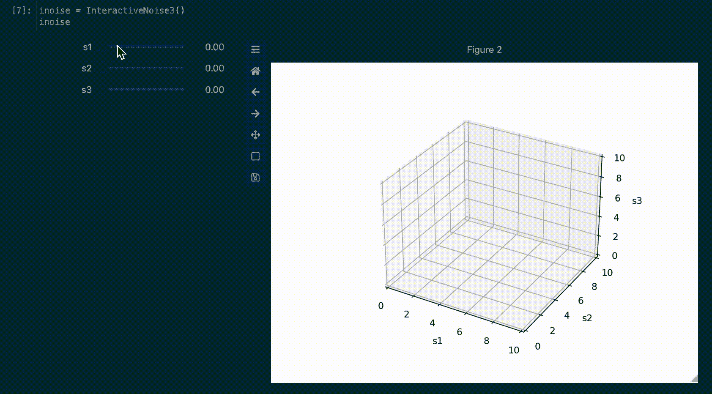
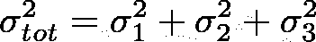
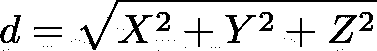

# 使用 ipywidgets 和 matplotlib 可视化噪声分解:这是毕达哥拉斯的

> 原文：<https://towardsdatascience.com/use-ipywidgets-and-matplotlib-to-visualize-noise-decomposition-in-3d-this-is-pythagorean-371ac9769aea?source=collection_archive---------31----------------------->

## 使用 3D 向量来帮助你的大脑。

> 自本月(4 月 22 日)起，Medium 决定你的作品必须拥有至少 100 名追随者才能获得奖励。 ***如果你喜欢这篇文章，只要你按下那个“跟随”按钮*** *:)很多欢呼，我希望你喜欢这篇文章！*

图片作者。

众所周知，独立噪声源的总噪声方差是方差之和。因此，对于方差为σi 的 3 个独立噪声源，我们得到:

因此，总噪声标准偏差为:

这个方程可以简单地比作坐标向量(X，Y，Z)的通常欧几里得距离，其长度为:

看到这里的模式了吗？

这意味着，我们可以将具有独立标准偏差(σ₁、σ₂、σ₃)的“噪声矢量”表示为具有坐标(X=σ₁、Y=σ₂、Z=σ₃)的空间中的点:总标准偏差则由该矢量的范数(或[欧几里德距离](https://en.wikipedia.org/wiki/Euclidean_distance))给出。

我们的大脑习惯于将一个和分解成一组互相相加的项(x+y+z = total)，但它真的不擅长使用“平方”分解(d = x +y +z)来分解。使用我们的大脑更习惯看到的 3D 向量表示，可以帮助我们更好地理解总噪声来自“哪里”:它主要来自σ₁吗？一点σ₂？没有σ₃？

在这篇文章中，我们将看到如何快速构建一个交互式可视化工具来表示噪声源及其对总噪声的影响，使用 ipywidgets 来实现交互体验，以及 matplotlib 的 3D 绘图功能。

# Python 实现

为了可视化我们的噪声分解，我们将使用:
—“matplotlib”及其用于绘图的 3D 工具包
—“ipywidgets”来创建滑块和回调以更新绘图

我们将创建 3 个滑块来控制每个标准偏差的值，这类似于 3D 噪声空间中总噪声的(X，Y，Z)坐标。

我们首先创建 3 个浮动滑块来设置我们的独立噪声分量，一个标签来显示总标准偏差，一个“输出”来保存我们的 matplotlib 数字/ax。然后，我们将所有东西一起装入一个“HBox”中。注意创建子情节时的“投影=3d”参数:这是我们告诉 matplotlib 我们想要在 3d 中工作的方式。

现在，在回到` __init__ '构造函数方法之前，我们将添加一些有用的方法。首先，我们创建一种方法来检索每个标准差分量值，并使用众所周知的等式σtot = √(σ₁ +σ₂ +σ₃来计算总标准差。

现在，我们使用 matplotlib 的“颤动”函数来绘制一组向量，以显示每个噪声分量以及总噪声。

最后，一个简单的“repr__”方法可以轻松地显示我们的滑块和图形输出:

现在回到“__init__”方法，我们定义了一个回调函数，它将用于在任何滑块的每次变化时更新标签和颤动图。然后我们在每个滑块上注册这个回调:

最后，我们初始化箭筒，并添加轴标签和限制:

# 这再容易不过了

我们现在可以创建一个实例，并开始试验:

瞧！

然后，您可以移动每个浮动滑块来设置每个标准差的值。该图会相应地更新每个向量的长度，并显示总标准偏差，这也表示 3D 向量的长度。

在我让你走之前，请注意:

*   尝试更改主向量的颜色，以便更好地区分独立向量和分量向量。
*   尝试使用`%matplotlib qt`获得更好的图形性能

# 完整代码