# 使用机器学习来检测数据集中的错误

> 原文：<https://towardsdatascience.com/use-machine-learning-to-detect-errors-in-a-dataset-2028ffdf2aa1?source=collection_archive---------29----------------------->

## 如何使用泛化语言大海捞针

雷诺·莱蒂安在 [Unsplash](https://unsplash.com/s/photos/haystack?utm_source=unsplash&utm_medium=referral&utm_content=creditCopyText) 上的照片

结构化数据集中损坏的数据值比您想象的要常见得多。早期检测这些错误对于下游分析任务的执行至关重要。然而，手动检查每个数据点既不高效也不可能。

这个故事利用了泛化树和泛化语言的概念，并提出了一种聚合不同语言的结果来发现表格数据集中的格式错误的方法。如果你需要泛化树和语言的详细介绍，你可以浏览下面的故事。

 [## 如何自动检测数据集中的错误

### 引入泛化树和泛化语言来自动检测结构化数据集中的损坏值。

towardsdatascience.com](/how-to-auto-detect-format-errors-in-a-dataset-6609a9e9aacc) 

简而言之，由泛化树导出的泛化语言将原始值泛化成模式。例如，让我们考虑下图中给出的一般化树。

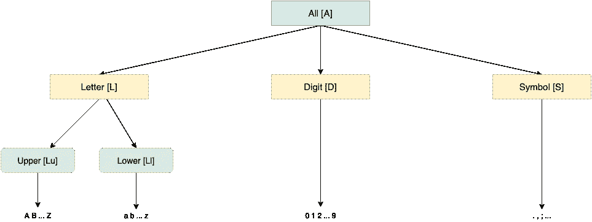

作者图片

从那棵树，我们可以得到一种语言，如果`x`不是一个符号，它将每个变量`x`转换成一个值`\A`。这种语言将把像`03.17.2019`这样的原始日期值转换成模式`\A{2}.\A{2}.\A{4}`。

沿着这个思路，在 [*《自动检测:表中数据驱动的错误检测*](https://dl.acm.org/doi/abs/10.1145/3183713.3196889?casa_token=SAUDUyrv2lwAAAAA:Aao6vxthGuNfNSEJyUYX_CyjUyrn0LM6fXrRsUvpGfB8GiQBBSJ6ZFJS-Q2_SQ3u3dPDzGwTJmYSTw) *、* [、黄志鹏](https://scholar.google.com/citations?user=WdEqRxEAAAAJ&hl=en&oi=sra)和叶烨中，他使用了一种泛化语言来缓解检测错误时的稀疏性问题。正如我们将在后面看到的，不同的语言对不同类型的错误是敏感的。因此，问题陈述可以概括为一个约束优化难题。

我们如何选择一组适当的泛化语言，由一个特定的泛化树归纳，以检测尽可能多的错误，受内存预算和精度值？

根据这一定义，我们得出以下挑战:

*   如何创建验证数据集来评估每种泛化语言
*   如何设置阈值`θ`,低于该阈值时，我们的分数表示样本错误
*   如何聚合选择不同泛化语言所导致的结果

> [学习率](https://www.dimpo.me/newsletter?utm_source=medium&utm_medium=article&utm_campaign=error_detection)是为那些对 AI 和 MLOps 的世界感到好奇的人准备的时事通讯。你会在每周五收到我关于最新人工智能新闻和文章的更新和想法。在这里订阅！

# 生成验证数据的远程监督

给定一种泛化语言`L`，我们必须有一种方法来量化它在检测错误时的精度。例如，给定一个表语料库`C`(即，一组用作训练数据的许多表)，如果我们将一个值`v`归纳为一个模式`p₁ = L(v)`，并且发现它与由`C`中一个表的同一列中的不同值`u`导出的另一个模式`p₂ = L(u)`不兼容，我们应该能够判断这是正确的预测还是误报。

我们可以手动标记例子，并用它们来验证一种泛化语言的性能，但这通常太昂贵，而且扩展性不好。为了克服这个问题，我们可以使用一种叫做*的远程监控技术。因此，为了创建一个将验证泛化语言的数据集，我们从我们的表语料库`C`中取出两个干净的列，我们将其标记为`C₁`和`C₂`。然后，我们对来自`C₁`的值`v`进行采样，并将其与`C₂`的副本合并，产生一个新的“脏”列`C₂'`。这是因为`v`很可能与`C₂`中的其他值不兼容。*

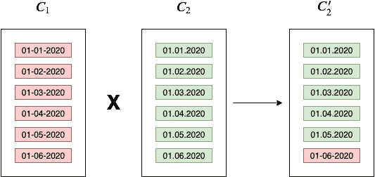

由于日期格式不同，C₁的红色值与 C₂的其他值不兼容。因此，C₂'现在是一个新的，由作者生成的*“肮脏”专栏—* 图像

接下来，我们可以使用`C₂`中的任意值`u`和我们合并的值`v`:`(u,v,-)`—`—`符号表示不兼容的对，来创建否定验证示例(即不兼容值对)。同样，我们可以创建兼容值对:`C₂`中任意一个`u,t`的`(u,t,+)`。**这样工作，我们有一组用** `**T¯**` **表示的不相容对和一组用** `**T⁺**` **表示的相容对。这两个集合的联合构成了验证集合** `**T**` **。这组数据并不完美，但我们可以廉价地创建的大量数据往往会比那些根据少量手工标注的样本训练的模型更好。**

在下面的部分中，我们使用具体的例子来更好地理解。

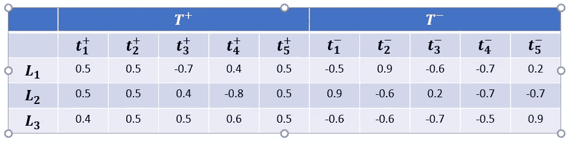

表 1: NPMI 使用三种不同的概括语言对 10 个例子进行评分——图片由作者提供

表 1 给出了如果我们使用三种一般化语言:`L₁`、`L₂`和`L₃`一般化五个正面(即兼容)和五个负面(即不兼容)的例子，我们得到的 NPMI 结果。NPMI 代表归一化的点态互信息，由下面的公式给出。

简而言之，计算两个值在同一列中共存的概率，超过在一列中遇到值`v`和`u`的概率的乘积。现在，我们应该定义一个阈值`θ`，低于该阈值的 NPMI 分数表示错误。

# 阈值定义

现在让我们考虑表 1 中的语言`L₁`。如果我们想要计算它的精度分数，我们应该将正确分类的错误的数量除以它识别为错误的所有示例的数量。

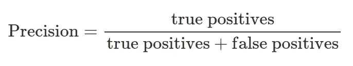

因此，第一步是定义一个阈值，低于该阈值的示例被认为是损坏的。例如，让我们设置这个阈值`θ = -0.4`。从`T⁺`开始，第三个示例被归类为错误，从`T¯`开始，第六、第八和第九个示例被视为无效。因此，我们可以计算精度为`p = 3/4 = 0.75`。问题是`θ = -0.3`或`-0.2`会产生相同的结果。我们应该有办法唯一确定`θ`。为此，我们定义以下公式。

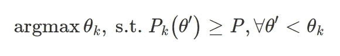

有了这个，我们可以为`θ`设置一个唯一的值，为固定的精度值`P`。因此，在上面的例子中，为了达到精度`p = 0.75`，我们设置了`θ = 0.5`。这是因为任何小于`0.5`的值在精度方面表现较差，而任何大于`0.4`或`0.3`的值违反了第二个约束。

以这种方式，我们可以确定哪些例子应该被标记为错误，给定它们的 NPMI 分数。然而，为了达到更好的覆盖率，我们应该选择一套泛化语言，因为每个人对不同类别的错误都很敏感。因此，下一步是要看看我们如何聚集由我们的语言选择引发的预测。

# 结果汇总

对于本节，让我们定义两种语言。第一个定义如下。

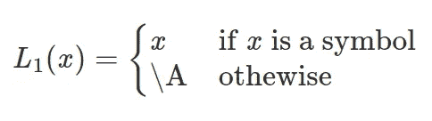

第二个的公式如下。

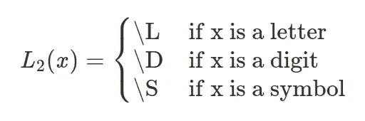

让我们考虑两个示例值:`03.17.2019`和`03-17-2019`；两个日期使用不同的模式。使用第一种语言，我们相应地将两个例子概括为`\A{2}.\A{2}.\A{4}`和`\A{2}-\A{2}-\A{4}`。对于第二种语言，我们得到同样的模式:`\D{2}\S\D{2}\S\D{4}`。正如我们所看到的，用语言`L₂`概括不会发现格式错误。因此，一个简单的获得平均 NPMI 分数的方法是行不通的，因为使用第二个推广计算的结果应该被完全忽略。

然而，考虑到这两种语言的互补性，我们应该选择这两种语言，因为`L₁`不会发现第一个示例值和像`03.MR.2020`这样的模式之间的差异。为了汇总结果，我们只需要一种语言就可以对它产生的分数有信心。因此，我们选择最低的 NPMI 分数。直觉上，因为每种语言对不同类型的错误敏感，如果一种语言对一个值`v`产生非常低的兼容性得分，我们信任它，因为它真的很自信。**因此，汇总不同泛化语言结果的一种方法是联合它们的预测。**例如，使用表 1，如果我们联合`L₁`和`L₃`预测的误差，我们检测到每个误差加上由`L₁`产生的一个假阳性。

下一节将介绍一种贪婪算法，根据内存预算和精度值来选择由特定泛化树导出的最终泛化语言集。然后，我们可以使用这个集合来概括我们的值，计算 NPMI 分数，并根据某个阈值来检测错误。

# 自动检测的贪婪算法

假设我们有一组三种候选泛化语言。每种语言都在内存中占据一个特定的空间，该空间与一个阈值`θ`相关联，并且根据使用该阈值做出的预测，还会有一个精度分数。表 2 总结了所有这些。第一组包含每种语言在`T¯`中指示为错误的示例，第二组包含每种语言在`T⁺`中预测为错误的示例。

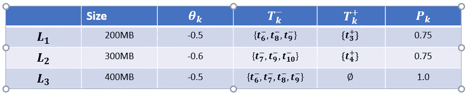

表 2:一组候选的泛化语言及其度量——作者图片

我们的目标是根据内存预算选择一个子集，其中包括我们拥有最佳错误覆盖率的语言`M = 500MB`。下面的算法返回这个集合。

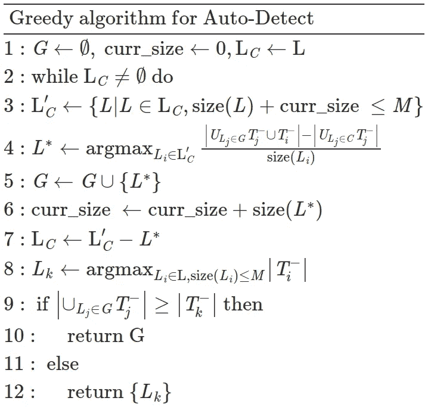

让我们一步一步来。作为输入，我们有一个集合`L`，它是候选泛化语言的集合。我们还初始化一个空集`G`和一个变量来计算使用的内存(即`curr_size = 0`)。首先，从候选集`L`中，我们只保留那些其内存占用在我们限制范围内的泛化语言`M`。因此，从表 2 中可以看出，所有语言都在`500MB`的限制范围内。接下来，我们寻找能提供最大增量收益的语言。这由下面的公式给出。

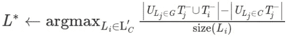

我们增加`curr_size`变量，并从我们保存的语言集中减去选择的语言。根据内存预算，我们不断迭代，直到选择了所有可能的语言。然后，我们也选择最好的单个语言，并将其与集合`G`的错误覆盖率进行比较。最后，我们返回检测到更多错误的内容。

为了使用上面的例子将其接地，首先，我们选择`L₁`，因为它具有最大的增量增益，并将其附加到 set `G`。

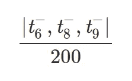

下一轮，我们只能选择`L₂`，因为选择`L₃`会违反我们的记忆限制(`200 + 400 > 500`)。然后，我们选择单一的最佳语言，即`L₃`，因为它具有最佳的错误覆盖率。最后，我们将集合`G` ( `5`错误)的错误覆盖率与语言`L₃` ( `4`错误)的覆盖率进行比较，并返回集合，因为它检测到更多的错误。

有了最佳的泛化语言集，我们就可以基于它们来泛化我们的值，计算 NPMI 分数，并预测可能的错误。

# 结论

在这个故事中，我们介绍了 [*【自动检测:表中数据驱动的错误检测】*](https://dl.acm.org/doi/abs/10.1145/3183713.3196889?casa_token=SAUDUyrv2lwAAAAA:Aao6vxthGuNfNSEJyUYX_CyjUyrn0LM6fXrRsUvpGfB8GiQBBSJ6ZFJS-Q2_SQ3u3dPDzGwTJmYSTw)*[【黄志鹏】](https://scholar.google.com/citations?user=WdEqRxEAAAAJ&hl=en&oi=sra)和何，以及他们自动检测结构化数据集中格式错误的方法。*

*我们提出了一种使用远程监督创建验证集的方法，一种为每种语言唯一确定阈值`θ`的方法，以及一种从候选集中找到泛化语言最佳组合的贪婪算法。*

# *关于作者*

*我叫[迪米特里斯·波罗普洛斯](https://www.dimpo.me/?utm_source=medium&utm_medium=article&utm_campaign=error_detection)，我是一名为[阿里克托](https://www.arrikto.com/)工作的机器学习工程师。我曾为欧洲委员会、欧盟统计局、国际货币基金组织、欧洲央行、经合组织和宜家等主要客户设计和实施过人工智能和软件解决方案。*

*如果你有兴趣阅读更多关于机器学习、深度学习、数据科学和数据运算的帖子，请在 Twitter 上关注我的 [Medium](https://towardsdatascience.com/medium.com/@dpoulopoulos/follow) 、 [LinkedIn](https://www.linkedin.com/in/dpoulopoulos/) 或 [@james2pl](https://twitter.com/james2pl) 。此外，请访问我的网站上的[资源](https://www.dimpo.me/resources/?utm_source=medium&utm_medium=article&utm_campaign=error_detection)页面，这里有很多好书和顶级课程，开始构建您自己的数据科学课程吧！*