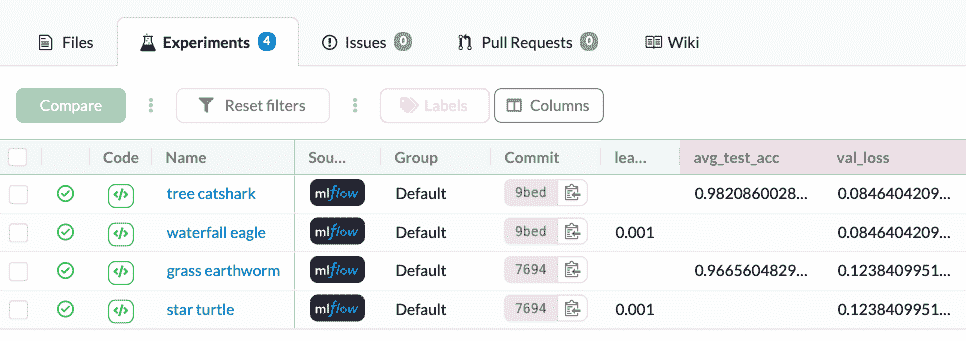
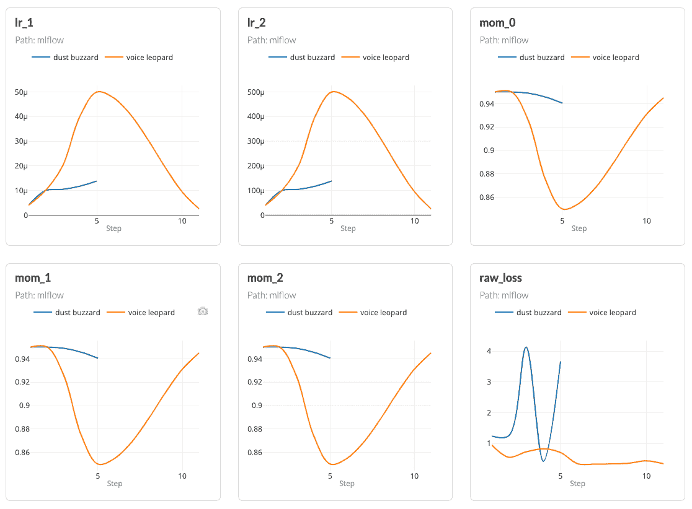
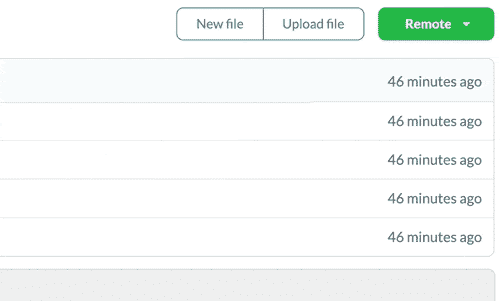

# 面向开源可复制机器学习的 MLflow 和 DVC

> 原文：<https://towardsdatascience.com/use-mlflow-and-dvc-for-open-source-reproducible-machine-learning-2ab8c0678a94?source=collection_archive---------4----------------------->

[DVC](https://dvc.org) 和 [MLflow](https://mlflow.org) 是两个被广泛采用的开源项目，各有所长。DVC 擅长数据版本控制，MLflow 是多种工具的结合体，但主要用于实验跟踪和工件记录功能。这两个工具都是开源的，但这并不意味着您可以轻松地拥有一个使用它们的开源项目。您无法将使用 DVC 版本化的数据与开放世界共享，也无法将为您生成的实验页面 MLflow 显示给所有人-这种情况已不复存在。

[DAGsHub](https://dagshub.com) 已经与 DVC 整合，你可以在[我之前讨论 DVC 和 DAGsHub 的文章](https://dagshub.com/blog/datasets-should-behave-like-git-repositories/)中了解更多。它现在也与 MLflow 集成在一起。这意味着 MLflow 用户现在可以在一致的环境中管理 MLflow 实验及其代码和数据集。

如果您只对集成细节感兴趣，您可以滚动到下面关于 MLflow with DAGsHub 的部分。否则，请继续阅读，以获得 MLflow 的概述、MLflow 的一些优势和差距，以及关于 DAGsHub 和 MLflow 集成的详细信息

# 什么是 MLflow

> MLflow 是一个管理 ML 生命周期的开源平台，包括实验、再现性、部署和中央模型注册

GitHub 上每天约有 60，000 次下载，8，000 次下载——ml flow 是一款开源工具，最初由 Databricks 推出，自 2018 年推出以来广受欢迎。它帮助数据科学家管理机器学习生命周期的多个阶段。其中一个阶段是“实验跟踪”——这是一个公认的术语，用来记录模型每次运行时得到的结果的变化。MLflow 提供的收集这些实验的解决方案被称为“MLflow Tracking”。其他工具也提供了很好的功能，我推荐阅读这个[实验跟踪工具对比](https://dagshub.com/blog/how-to-compare-ml-experiment-tracking-tools-to-fit-your-data-science-workflow/)来更深入地了解它们之间的区别。

# MLflow 有什么用途，为什么它是实验跟踪的首选解决方案

# 它有最大的社区

一个大型的机器学习从业者和公司社区已经采用 MLflow 作为解决方案。这通常是一个强有力的指标，表明某个工具正在做正确的事情。一个大的社区意味着更多的教程，更多的在线问答，或者针对用户遇到的常见问题在 GitHub 上的公开问题。MLflow 已经有 290 个贡献者，据报道有 200 多家公司在他们的工作流程中使用它，这对这类项目来说意义重大。这提供了一种安全感，MLflow 将在未来许多年继续开发和使用

# 简单且开源

开源工具是个人、研究人员和非营利组织的必需品。这为他们提供了免费的解决方案、社区支持和最大的灵活性。MLflow 无疑是当前实现这一承诺的先锋之一。跟踪 API 是精心设计的，具有全面而简单的客户端库，提供简单的手动日志记录功能，如:

```
# Start a run
mlflow.start_run()# Log an hyper-param
mlflow.log_param()# Log a metric
mlflow.log_metric()
```

它还为大多数常见的高级机器学习框架提供自动日志记录功能，包括 Scikit-learn、Tensorflow、Keras、XGBoost、FastAI、PyTorch 等。
以 Scikit-learn 为例:

```
# Automatic logging with mlflow
mlflow.sklearn.autolog()
```

设置起来相对容易——开始跟踪实验所需要的只是安装一个客户端库(即 python 库)并在代码中使用日志 API 调用。

要预览实验或比较结果，您需要通过在命令提示符下运行以下命令来启动一个基于 web 的本地用户界面:

```
# Start the mlflow web ui
mlflow ui
```

你可以在`[http://localhost:5000](http://localhost:5000.)` [的浏览器中找到它。](http://localhost:5000.)

# 实时跟踪

“实时”意味着您可以在代码运行时跟踪性能——或任何指标，这在您想要观察损失时特别有用，例如，如果没有收敛，就在中间停止训练。实时日志记录是一把双刃剑，因为它不能保证再现性。这将实验跟踪工具的领域一分为二。有些人——比如 ml flow——将跑步训练的开始视为基线。其他人——像[DVC](https://dagshub.com/blog/data-version-control-tools/)——在培训结束时将存储库的状态视为需要签入和访问的时间点。

# MLflow 缺少什么使其成为显而易见的选择

# 设置远程服务器很难

为一个小团队或开源项目设置一个持久的远程服务器在技术上是复杂的，并且可能是昂贵的。

首先，你需要建立一个在线机器，可以被外界访问，最好有一个可读的、持久的 URL。

其次，由于您不希望任何人能够查看或记录您的服务器上的实验，您需要管理访问控制。您可以通过支持身份验证的中间服务器来运行您的调用，然后将通信传递给服务器本身。如果您希望能够添加用户、删除用户并提供对项目的公共访问，您需要围绕它构建一个完整的系统。不幸的是，对许多人来说，这些复杂性将是交易的破坏者。如果你最终设法解决了这些问题，你仍然需要向云提供商支付运行机器的费用，你可能不会为你正在写的论文或你的开源人脸检测项目这样做。这就是为什么 MLflow 实验可能永远不会走出您的本地机器或内部网络。

# 用户界面缺乏灵活性

Mlflow 的用户界面有一个主菜单，您可以在其中选择和切换不同的实验。“实验”是一组“运行”,用户可以将其定义为一个层次结构。您可以决定是为每个项目创建一个实验，还是为同一个项目创建多个实验。您可以选择多个运行并在它们之间进行比较，但不能在不同实验的运行之间进行比较。

对于每次运行，您可以选择您记录的图形，并在单独的页面中显示它们，但是您不能在单个摘要页面中一次性预览它们。

# 缺乏背景和连通性

假设您已经安装了 MLflow 服务器，并使用它为多个项目记录实验。现在，您想与同事共享项目的状态。您需要给她发送一个指向存储库的链接，一个指向 MLflow 服务器的链接，并指定这个特定项目的实验内容。另一种常见的情况是，当您想要将您的研究结果发布到工作场所之外的社区时。您需要找到一种方法来应用如前所述的凭证管理，以便只有他们可以查看项目。此外，您的 MLflow UI 作为整个项目的一部分是不可发现的。您可以在存储库`Readme.md`文件中放置一个链接，但是前面提到的访问问题仍然适用。

# 带 DAGsHub 的 MLflow

# 连接到项目的其余部分

随着 MLflow tracking now [与 DAGsHub](https://dagshub.com/) 的集成，您最终可以以一种有意义的方式管理 MLflow 实验。项目的所有组件现在都已连接。换句话说，您的存储库主页现在将显示您的代码、您的数据管道和您的所有 MLflow 实验。



按作者

您可以比较实验，看到一个有趣的实验，并轻松地一键查看生成实验的代码和数据集。正如在谈论 MLflow 的用户界面时提到的，比较不同实验的运行需要打开两个不同的窗口。现在情况不再是这样了。现在可以比较不同实验的运行，当然，可以在一个地方看到所有的度量图。



按作者

# 最小设置

首先，你需要在[注册](https://dagshub.com/user/sign_up)，创建一个存储库，并向其中推送代码。然后，在您的存储库主页上，您将获得 MLflow 的跟踪 URI。



按作者

假设您已经熟悉如何使用 MLflow 的[，那么您现在要做的就是将这个 URI 设置为您的跟踪 URI，或者使用环境变量`MLFLOW_TRACKING_URI`或者在您的代码中添加以下代码行:](https://www.mlflow.org/docs/latest/quickstart.html)

```
# Set an mlflow remote server programatically 
mlflow.set_tracking_uri("https://dagshub.com/<DAGsHub-user-name>/<repository-name>.mlflow")
```

如果您想要记录参数和指标，您需要拥有对存储库的写权限——也就是成为贡献者。MLflow 客户端支持基本认证，为了指定您的凭证，您需要使用环境变量`MLFLOW_TRACKING_USERNAME`和`MLFLOW_TRACKING_PASSWORD`。

就是这样，你可以记录你的实验，并像这个例子项目一样与公众分享。如果你的知识库是私有的，那么实验当然也是私有的。

# 分发您的项目并与任何人共同创作

我们在 DAGsHub 的任务之一是降低开源机器学习生命周期工具的准入门槛。我们在 DVC 做到了这一点，现在我们正在与 MLflow 合作。我们让用户决定如何利用他们喜欢的每个方面。我认为，为社区提供一个专业管理工作的解决方案，而不需要 DevOps 知识，将使开源、可复制的数据科学不仅仅是一个幻想。

# 摘要

我们已经看到 MLflow 被广泛采用，它是开源的，并且简单明了，但是如果没有任何 DevOps 知识，免费使用它会有一些困难。现在，通过使用专用的 MLflow 远程服务器将 MLflow 连接到任何存储库，您可以从 DAGsHub 的实时日志记录中受益。这里有一个关于如何使用 MLflow 和 DAGsHub 的视频链接。如果您有任何问题，或者您希望我们支持更多 MLflow 功能，请随时通过我们的[社区聊天](https://discord.com/invite/9gU36Y6)联系我们。