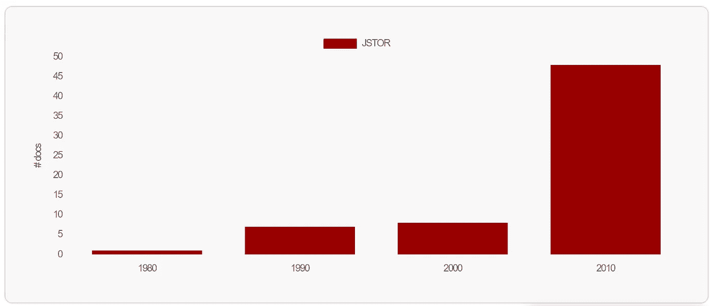

# 机器学习在经济研究中的应用:文献告诉我们什么

> 原文：<https://towardsdatascience.com/use-of-machine-learning-in-economic-research-what-the-literature-tells-us-28b473f26043?source=collection_archive---------5----------------------->

## 对过去四十年来发表在主要经济期刊上的 20 篇优秀文章的选择性综述。

克拉克·杨在 [Unsplash](https://unsplash.com?utm_source=medium&utm_medium=referral) 上的照片

M 机器学习主题在 20 世纪 80 年代开始大规模出现在经济文献中，当时主要概念如反向传播、递归神经网络(RNNs)和受限玻尔兹曼机器(RBM) 被发现，像计算机视觉这样的主题吸引了很多关注。在过去的几十年里，在四个主要的经济期刊上发表的关于机器学习的文章的频率增加的趋势是显而易见的(见下图)。

在这篇文章中，我分享了机器学习在经济学中应用的文献中的发现，并简要回顾了我认为在这一领域最有影响力的 20 篇文章。这是从经济期刊(基于文章影响力得分)中主观选择的论文，可能对计划深入这一令人兴奋的领域的应用研究人员或对人工智能溢出到其他领域感兴趣的任何人有用。

我确定了在经济文献中使用 ML 方法的四个主要领域:

*   **预测和预报**
*   **情感分析和自然语言处理(NLP)**
*   **图像处理和计算机视觉**
*   **流程自动化和优化**

最后，我参考了这位领先经济学家对未来的展望，并对经济学中的整个人工智能领域的发展方向做了一些评论。

经济学前 4 名期刊(QJE、计量经济学、AER、Restud)的 ML 文章，来源: [Constellate。](https://constellate.org/builder/?keyword=%22machine%20learning%22&provider=jstor&start=1980&end=2019&publication_title=The%20American%20Economic%20Review&publication_title=Econometrica&publication_title=The%20Quarterly%20Journal%20of%20Economics&publication_title=The%20Review%20of%20Economic%20Studies&doc_type=article)

## 将人工智能融入经济学的早期尝试

关于这个主题的第一篇文章是 1984 年美国经济评论(AER)的一篇文章，作者是 [Cohen 和 Axelrod](https://www.jstor.org/stable/1803306) ，该文章展示了一个将信念更新为新体验的模型，该模型依赖于一个相当古老的人工智能程序来玩跳棋。作者表明，该模型的性能优于其他国家的最先进的模型。

在一项令人兴奋的研究中，[亚瑟(AER，1991)](https://www.jstor.org/stable/2006884) 设计了一个参数化的学习自动机，一种“复制”人类行为的算法，并根据人类受试者对其进行校准。该论文的结论是，我们可以设计人工学习代理，并校准它们的“合理性”，以复制人类行为。

[霍兰德和米勒(AER，1991)](https://www.jstor.org/stable/2006886) 研究了复杂适应性人工智能系统和经济主体的行为。如今，存在广泛的基于计算机的自适应算法来探索这种系统，包括分类器系统、遗传算法、神经网络和强化学习机制。

## **过程自动化**

在任何领域中，ML 的理想用例是优化和过程自动化，从这个意义上讲，是节省劳动力成本和(或)提高生产率。例如， [Fernald 和 Jones (AER，2014)](https://www.jstor.org/stable/42920908) 提出，人工智能将允许机器取代工人，这在某种程度上可能导致未来更高的增长。新的研究技术可能会让计算机和机器人取代劳动力，从而极大地影响生产和经济增长。

## 预测和预言

监督最大似然法已经在许多应用中用于预测，在那里它达到极好的性能。与其他一些统计方法相比，超参数调整、训练验证测试分割和改进的优化算法(如 [ADAM](https://machinelearningmastery.com/adam-optimization-algorithm-for-deep-learning/) )有助于实现更好的 ML 性能。

[Kleinberg 等人(AER，2015)](https://www.cs.cornell.edu/home/kleinber/aer15-prediction.pdf) 和 [Kleinberg 等人(QJE，2017)](https://academic.oup.com/qje/article-abstract/133/1/237/4095198?redirectedFrom=fulltext) 强调了使用机器学习技术改进预测如何能够产生巨大的政策影响。用这种方法可以解决许多问题。例如，在刑事司法系统中，法官必须决定是拘留还是释放被捕者。依赖于对被捕者犯罪概率的预测的决定可以得到 ML 的支持。

其他例子包括:(1)在教育中，预测哪个老师会有最大的增值；(2)在劳动力市场政策中，预测失业持续时间以帮助工人决定储蓄率和求职策略；(3)在监管方面，有针对性地进行卫生检查；(4)在社会政策方面，预测高风险青年，以便有针对性地进行干预；以及(5)在金融领域，贷款人识别潜在借款人的潜在信用价值。，2015) 。

照片由 [Unsplash](https://unsplash.com?utm_source=medium&utm_medium=referral) 上的 [Clarisse Croset](https://unsplash.com/@herfrenchness?utm_source=medium&utm_medium=referral) 拍摄

同样， [Chalfin 等人(AER，2015)](https://www.hbs.edu/ris/Publication%20Files/PredictiveHiring_4a3d9f9f-62e9-4dad-ac58-e3c3571d3995.pdf) 证明了使用最大似然法提高工人生产率预测所带来的社会福利收益。他们在两个基本应用中说明了这种方法的价值——警察招聘决策和教师任期决策。

[Bajari 等人(AER，2015)](https://www.jstor.org/stable/43821932) 回顾并应用几种流行的 ML 方法进行需求估算。他们表明，与标准线性回归或 logit 模型相比，这些方法可以产生更高的预测准确性。

还有许多其他的例子，在这些例子中，ML 被用来预测对政策决策很重要的变量。在国际经济学中，[艾买提等(JIMF，2018)](https://www.sciencedirect.com/science/article/abs/pii/S0261560618303668) 利用序列岭回归对主要国际货币的汇率进行预测。这是一个为政策制定实施最大似然法的实际例子，因为他们得出结论，他们的最大似然法模型导致改进的预测和更低的均方根误差(RMSE)。

## 情感分析和自然语言处理

越来越多的带标签的训练数据集刺激研究人员在经济学的各种问题上使用情感分析。带有文本每个部分的标签的情感数据集(例如，1 =正面，0 =负面；1 : 25 是 1 最负，25 最正，等等。)帮助研究人员制作可以在自己的数据集中使用的分类器。

随着 2010 年代 NLP 和语言建模的巨大进步，一些优秀的论文出现在顶级期刊上。一些综述文章包括[阿尔加巴等人(JES，2020)](https://onlinelibrary.wiley.com/doi/full/10.1111/joes.12370) ，概述了在经济科学中使用文本、音频和视觉数据的语义分析方法。 [Gentzkow 等人(JEL，2019)](https://web.stanford.edu/~gentzkow/research/text-as-data.pdf) 纯粹关注文本数据，并审查适当的统计方法和对经济问题的各种应用。

在货币经济学中，[汉森等人(QJE，2017)](https://sekhansen.github.io/pdf_files/qje_2018.pdf) 利用计算语言学发现央行行长的沟通模式。文本数据的量化可以衡量央行行长声明的影响，并简化丰富的沟通措施的构建。 [Hansen 和 McMahon (JIE，2016)](https://www.sciencedirect.com/science/article/abs/pii/S0022199615001828) 用类似的基于文本的方法研究同一主题。

NLP 技术可能有助于提高标准统计方法的准确性。例如，在企业融资中， [Goberg 和 Maksimovic (RFS，2014)](https://academic.oup.com/rfs/article-abstract/28/5/1312/1867105) 改进了对金融约束(即企业获得融资的能力)的衡量。在预测不利经济冲击后的投资削减方面，基于文本的指标优于文献中使用的其他指标。

NLP 的商业经济学应用包括 [Bandiera (JPE，2020)](https://www.journals.uchicago.edu/doi/abs/10.1086/705331?mobileUi=0&af=R) 使用广泛使用的 NLP 算法(潜在的狄利克雷分配— LDA)构建 CEO 行为指数。除了良好的性能，它还允许减少数据的高维度。

## 图像处理和计算机视觉

图像处理和图形数据处理文章常用各种卷积神经网络(CNN)，并频繁使用大数据。许多数据集已经可以免费获得，研究人员可以为他们的应用程序使用预处理的数据或预训练的模型(为了完整性，这个过程被称为迁移学习)。

[Donaldson 和 Storeygard (JEP，2016)](https://www.aeaweb.org/articles?id=10.1257/jep.30.4.171) 使用卫星数据(来自轨道的遥感数据)审查文章的文献。小卫星在地球上空一定距离飞行，收集照片图像和其他数据，这些数据可用于研究地球上的过程。例如， [Henderson 等人(AER，2012)](https://www.aeaweb.org/articles?id=10.1257/aer.102.2.994) 使用卫星数据来衡量次国家和超国家地区的经济活动(GDP 增长)，这在当前的衡量标准下是不可能的。

[纳伊克等人(PNAS，2016)](https://www.pnas.org/content/114/29/7571) 使用街景的 360 度全景图像来预测美国五个城市的城市物理变化(街道的物理外观)的决定因素。[纳伊克等人(AER，2016)](https://www.aeaweb.org/articles?id=10.1257/aer.p20161030) 关注城镇的物理外观与其居民的行为和健康之间的实证联系。他们使用支持向量机从街道图像中量化城市外观。

## 我们要去哪里？

经济学中 AI 的研究向何处去，未来的研究有哪些方向？让我们从苏珊·艾希(斯坦福大学商学院)那里得到启发，她预测在不久的将来会有新的发明出现。

我在此引用了来自 [Athey (2019)](https://www.nber.org/system/files/chapters/c14009/c14009.pdf) 的确切内容:

1.  为预期任务(预测、分类和聚类，例如文本分析)采用现成的 ML 方法。
2.  对预测方法的扩展和修改，以考虑公平性、可操作性和可解释性等因素。
3.  开发基于机器学习的新计量经济学方法，旨在解决传统的社会科学评估任务。
4.  利用现代数据设置，包括大面板数据集和具有许多小实验的环境，对因果效应的识别和估计策略的渐进进展。
5.  更加强调模型的稳健性和其他辅助分析，以评估研究的可信度。
6.  经验主义者大规模采用新方法。
7.  生产力和测量研究的复兴和新路线。
8.  设计和分析大型管理数据的新方法，包括合并这些来源和隐私保护方法。
9.  跨学科研究的增加。
10.  经济研究的组织、传播和资助的变化。
11.  作为工程师的经济学家与公司、政府一起在数字环境中设计和实施政策。
12.  与企业和政府合作，设计和实施数字实验，包括一次性的和持续的过程，包括多臂 bandit 实验算法。
13.  研究开发可快速测量的高质量指标，以促进快速增量创新和实验。
14.  在各级经济学教学中更多地使用数据分析；跨学科数据科学项目的增加。
15.  人工智能和 ML 对经济影响的研究。

## 结论

我收录了 20 篇 A 级文章，展示了 ML 方法在经济学中的大量应用。在未来，我们可以期待在经济期刊上发表的文章快速增长，以及人工智能社区正在开发的新技术的实施。目前，最大似然法仍然是一种应用统计方法，但由于其独特的统计方法，它在许多情况下优于标准统计方法。特别是在预测方面，它在预测的准确性方面占主导地位。

我想提到的最后一篇论文是 [Mullainathan 和 Spiess (JEP，2017)](https://www.aeaweb.org/articles?id=10.1257/jep.31.2.87) 对这个主题做了很好的介绍。

*PS:你可以订阅我的* [*邮箱列表*](https://medium.com/subscribe/@petrkorab) *每次我写新文章都会收到通知。如果你还不是中等会员，你可以在这里加入*<https://medium.com/@petrkorab/membership>**。**

## *参考文献的完整列表(按出现的顺序):*

*[1]迈克尔·d·科恩和罗伯特·阿克塞尔罗德，1984 **:** 应对复杂性:改变效用的适应性价值，*《美国经济评论》*，第 74 卷，第 1 期(1984 年 3 月)，页 30-42。*

*[2 ] W. Brian Arthur，1991: 设计行为像人类代理人的经济代理人:有限理性的行为方法，*《美国经济评论》，*第 81 卷，第 2 期，论文与会议录。(1991 年 5 月)，第 353-359 页。*

*[3]约翰·h·霍兰德和约翰·h·米勒，1991:经济理论中的人工适应性主体，*《美国经济评论》*，第 81 卷，第 2 期，论文与会议录。(1991 年 5 月)，第 365-370 页。*

*[4] John G. Fernald 和 Charles I. Jones，2014:美国经济增长的未来，*《美国经济评论》*，[第 104 卷第 5 期，](https://www.jstor.org/stable/i40112127)论文和会议录。[(2014 年 5 月)](https://www.jstor.org/stable/i40112127)，第 44–49 页。*

*[5]乔恩·克莱因伯格、延斯·路德维希、森迪尔·穆莱纳坦和齐亚德·奥伯迈尔，2015:预测政策问题，*《美国经济评论》*，第 105 卷，第 5 期。，论文和会议录，第 491-495 页。*

*[6]乔恩·克莱因伯格，希马宾杜·拉卡拉朱，朱雷·莱斯科维奇，延斯·路德维希，森迪尔·穆莱纳坦，2017:人类决策与机器预测，*《经济学季刊》*，第 133 卷第 1 期，(2018 年 2 月)，第 237–293 页。*

*[7]亚伦·查尔芬、柳文欢·达尼埃里、安德鲁·希利斯、祖宾·杰尔维、迈克尔·卢卡、延斯·路德维希和森迪尔·穆莱纳坦，2015:机器学习的生产率和人力资本选择，*《美国经济评论》*，第 106 卷第 5 期，(2016 年 5 月)，第 124–27 页。*

*[8] Patrick Bajari，Denis Nekipelov，Stephen P. Ryan 和 Miaoyu Yang，2015: 需求估计的机器学习方法，*《美国经济评论》*，第 105 卷第 5 期，论文与会议录(2015 年 5 月)，第 481–485 页。*

*[9] Christophe Amat，Tomasz Michalski，Gilles Stoltz，2018:简单机器学习方法的基本面和汇率可预测性，J *国际货币与金融杂志*，第 88 卷，2018 年 11 月，第 1–24 页。*

*[10] Andres Algaba，David Ardia，Keven Bluteau，Samuel Borms，Kris Boudt，2020:计量经济学与情绪:方法和应用概述，*经济调查杂志*，第 34 卷，第 3 期，2020 年 7 月，第 512-547 页。*

*[11] Matthew Gentzkow，Bryan Kelly，和 Matt Taddy，2019:作为数据的文本，*经济文献杂志*，第 57 卷，第 3 期，第 535-574 页。*

*[12]Stephen Hansen Michael Mcmahon Andrea Prat，2018:Fomc 内部的透明度和审议:一种计算语言学方法，*经济学季刊*，第 133 卷第 2 期，2018 年 5 月，第 801–870 页。*

*[13] Gerard Hoberg，Vojislav Maksimovic，2017:重新定义金融约束:基于文本的分析，*《金融研究评论》*，第 28 卷第 5 期，2015 年 5 月，第 1312–1352 页。*

*[14] Oriana Bandiera，Andrea Prat，Stephen Hansen，Raffaella Sadun，2020: *政治经济学杂志*，第 128 卷第 4 期，2020 年 4 月。*

*[15]戴夫·唐纳森和亚当·斯托里加德，2016:从上面看:卫星数据在经济学中的应用，*《经济透视杂志》，*第 30 卷第 4 期，第 171–198 页。*

*[16] J. Vernon Henderson，Adam Storeygard，David N. Weil，2012:从外层空间衡量经济增长，*《美国经济评论》，第 102 卷第 2 期，第 994-1028 页。**

*[17] Nikhil 纳伊克、Scott Duke Kominers、Ramesh Raskar、Edward L. Glaeser 和 César A. Hidalgo，2017:计算机视觉揭示城市物理变化的预测器，*美国国家科学院学报，*7 月 18 日，第 114 卷，第 29 期，第 7571-7576 页。*

*[18]尼基尔·纳伊克，拉梅什·拉斯卡尔，塞萨尔·a·伊达尔戈，2016:城市也是物质的:使用计算机视觉来衡量城市外观的质量和影响，*《美国经济评论》*，第 106 卷第 5 期，2016 年 5 月，第 128-32 页。*

*[19] Susan Athey，2019:机器学习对经济学的影响，载于:*人工智能经济学:一个议程*，芝加哥大学出版社，2019 年 5 月，第 507–547 页。*

*[20] Sendhil Mullainathan 和 Jann Spiess，2017:机器学习:一种应用的计量经济学方法，*经济展望杂志，*第 31 卷第 2 期，2017 年春季，第 87–106 页。*