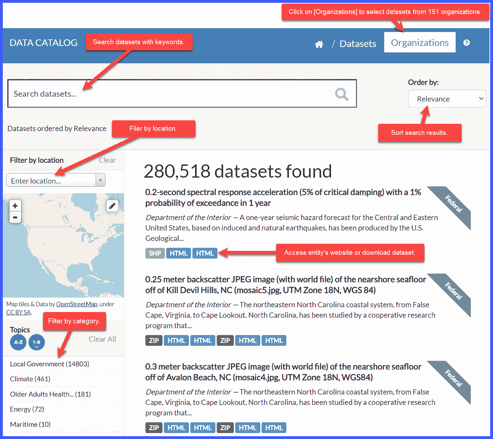
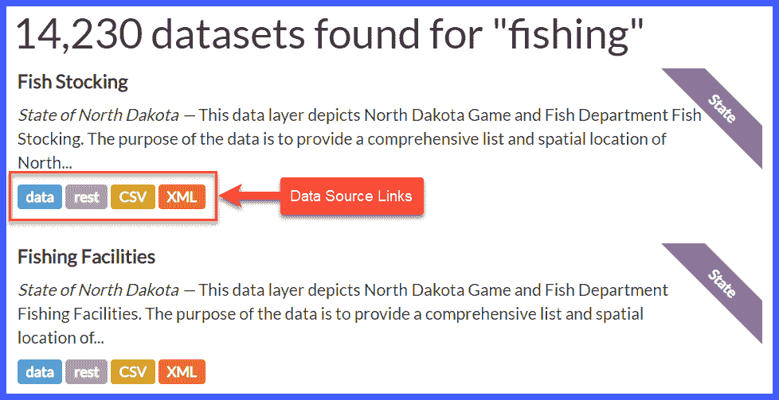
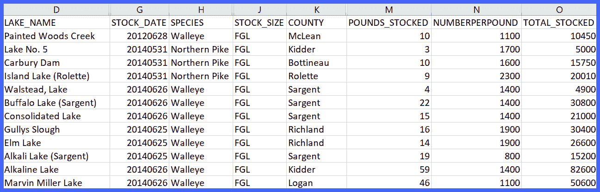
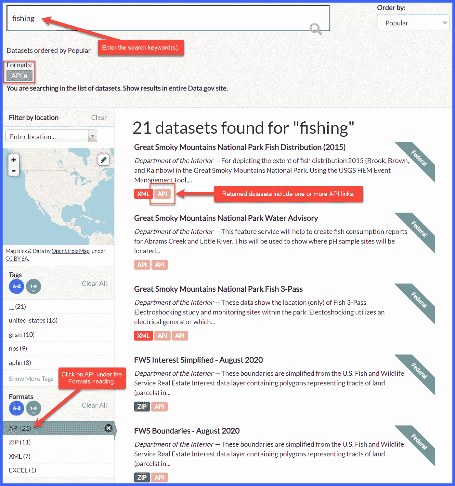
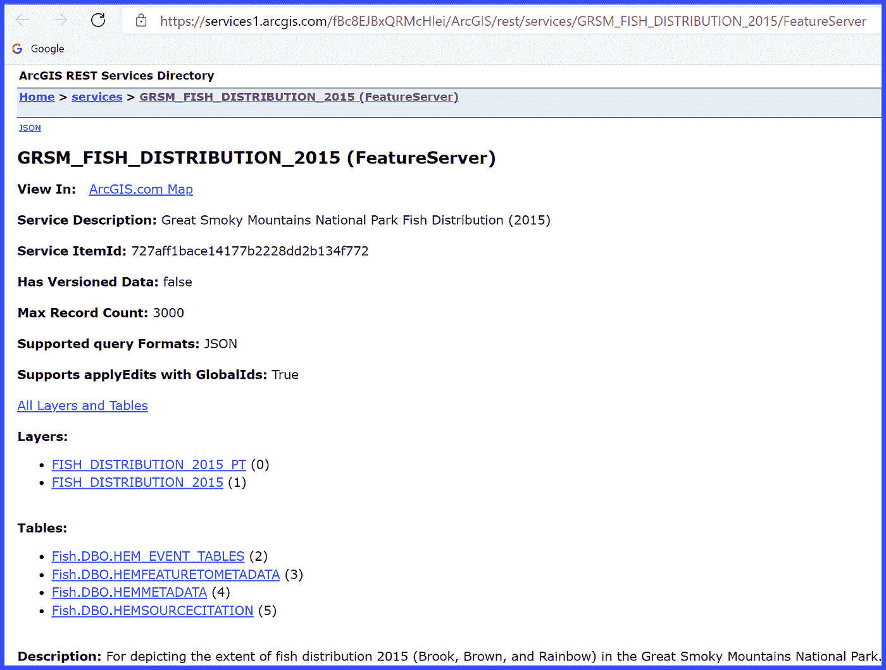

# 使用 Data.gov 上编目的公共数据集推动数据科学项目

> 原文：<https://towardsdatascience.com/use-public-datasets-cataloged-on-data-gov-to-power-data-science-projects-1a7d84e9212b?source=collection_archive---------24----------------------->

## Data.gov 存储了描述美国联邦、州和地方政府级别发布的超过 280，000 个免费和公共数据集的元数据。它简化了通过下载或 API 查找和获取数据的过程。

笔记本电脑上的图表照片。由 unsplash.com 的卢卡斯·布拉泽克提供。

# 介绍

最近，我发表了一篇关于[如何获取和分析 analytics.usa.gov](/acquiring-and-analyzing-data-from-analytics-usa-gov-with-python-and-tableau-b61870ea065c)上关于公众使用大约 57，000 个美国联邦政府网站的数据的文章。Data.gov，另一个政府网站，作为各种政府数据集的公共交换中心。

Data.gov 包含描述超过 280，000 个免费公共数据集的元数据。它对由美国联邦政府实体管理的丰富多样的数据集合进行了编目，在某些情况下，还包括州、地方和部落政府级别的数据。Data.gov 是一个向美国公众开放的政府数据交换中心。

本文介绍了什么是 Data.gov，政府实体如何在网站上发布关于其公共数据集的元数据，网站编目的数据类型，如何搜索数据，以及如何从其源实体下载数据集。

# 什么是 Data.gov？

美国总务管理局(GSA)内的[技术转化服务部](https://www.gsa.gov/about-us/organization/federal-acquisition-service/technology-transformation-services) (TTS)负责管理 Data.gov。它在 2009 年建立了这项服务。迄今为止，TTS 已经收集、记录和发布了 280，518 个数据集的元数据。

以下声明指导 Data.gov 的工作:

使命 : *为美国公众设计并交付一个数字政府。*

**愿景** : *全民可信的现代政府体验。*

TTS 用 [CKAN](https://ckan.org/) 和 [WordPress](https://wordpress.org/) 建造了 Data.gov。它在 GitHub 上公开开发代码。

在 data.gov 上索引的数据集遵循[DCAT-美国模式 v1.1](https://resources.data.gov/resources/dcat-us/) 指南。通过这种模式，一组一致的元数据(标题、描述、标签、发布者等)被应用于所有数据集，以使它们可被发现和理解。

# 政府实体如何向 Data.gov 添加数据集？

《开放政府数据法案》是美国国会循证决策法案的[基础的一部分，它要求联邦政府以开放和机器可读的形式向公众提供数据。同时，它必须保证隐私和安全。](https://www.congress.gov/115/plaws/publ435/PLAW-115publ435.pdf)

[操作指南](https://resources.data.gov/resources/data-gov-open-data-howto/)指导政府机构发布元数据来描述网站上的公共数据集。一致的元数据提高了可发现性和影响力。

Data.gov 主要是一个联邦政府网站和服务。但是州、地方和部落政府也可以在平台上发布元数据来描述他们的公共数据集。

# Data.gov 存储什么类型的数据？

如上所述，Data.gov 存储的元数据描述了存储在其他地方的成千上万个数据集中的数据。它不保存定义的数据，但存储和显示可下载文件和 API 的链接以获取数据。

超过 280，000 个数据集，Data.gov 上索引的数据太大了，无法简明地描述。以下是可用数据类型的一个小示例:

*   国内生产总值
*   气候和天气
*   税收、税率和退税
*   地理空间数据
*   住房统计
*   海洋
*   人口普查和人口
*   风能和太阳能
*   教育
*   出生率和死亡率

# 我怎样才能找到 Data.gov 的数据？

Data.gov 的[数据目录](https://catalog.data.gov/dataset)使得搜索数据集变得容易。下面的屏幕截图提供了使用数据目录搜索页面查找数据集的提示。

Data.gov 数据目录搜索屏幕。作者捕获的图像。

# 如何从 Data.gov 获取数据和 API 信息？

通过点击搜索结果中的数据源链接，可以访问数据和 API。

## 下载数据

如下图所示，在[数据目录搜索页面](https://catalog.data.gov/dataset)的搜索文本框中搜索关键字 *fishing* ，会返回 14230 个数据集。前两个数据集包含关于北达科他州鱼类资源和渔业设施的数据。

搜索“钓鱼”的数据集结果作者捕获的图像。

在本例中，当您单击数据源链接时，您将被转到北达科他州托管的网站或数据集文件。

点击 CSV 下载一个 CSV 文件。当在 Excel 中打开时，该文件显示该州在其湖泊中放养的鱼的数据。

北达科他州鱼群数据集的子集。作者捕获的图像。

## API 信息

**元数据 API**

Data.gov 管理数据集的元数据，而不是原始数据。虽然搜索工具可以很容易地找到感兴趣的数据集，但可以在程序中使用 [CKAN API](https://www.data.gov/developers/apis) 和 [CSW 端点](https://catalog.data.gov/csw#topic=developers_navigation)来查询数据集和检索元数据。更多信息参见[数据采集](https://catalog.data.gov/csw#topic=developers_navigation)。

**数据集 API**

大多数数据集都是可下载的文件。较少的数据集具有可用于访问数据的 API。要查找 API 或有关它们的信息，请使用在格式过滤器部分选择的 API 搜索[Data.gov 数据集目录](https://catalog.data.gov/dataset)。

“钓鱼”和包含“API”的格式的搜索结果作者捕获的图像。

单击*大烟雾山国家公园鱼类分布(2014)* 数据集的 API 链接将打开一个新的浏览器选项卡。它显示一个页面，其中包含有关访问数据的信息。

单击大烟山国家公园鱼类分布(2015)数据集的 API 链接时显示的 arcGIS 页面。作者捕获的图像。

# 关于 Data.gov 的新文章

关注即将发布的关于 Data.gov 的文章，例如:

*   编写一个使用 [CKAN API](https://docs.ckan.org/en/2.8/api/index.html) 访问数据集元数据的程序。
*   探索各种类型的数据集。
*   探索数据工具以支持数据从业者的工作。
*   有趣或不寻常的数据集。

# 结论

Data.gov 为美国各级政府管理的数据集提供易于查找的元数据。该平台简化了通过下载或 API 查找和获取数据的过程。

Data.gov 是政府做得好的一个例子。

# 关于作者

Randy Runtsch 是一名作家、数据工程师、数据分析师、程序员、摄影师、自行车手和冒险家。他和妻子住在美国明尼苏达州东南部。

关注 Randy 即将发表的关于公共数据集的文章，以推动数据分析见解和决策、编程、数据分析、摄影、自行车旅行等。你可以在 shootproof.com 和 shutterstock.com 看到他的一些照片。