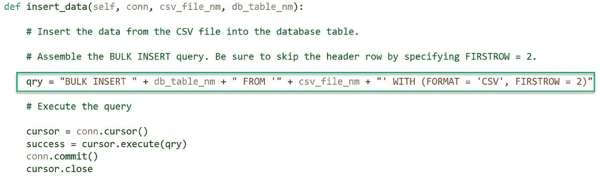
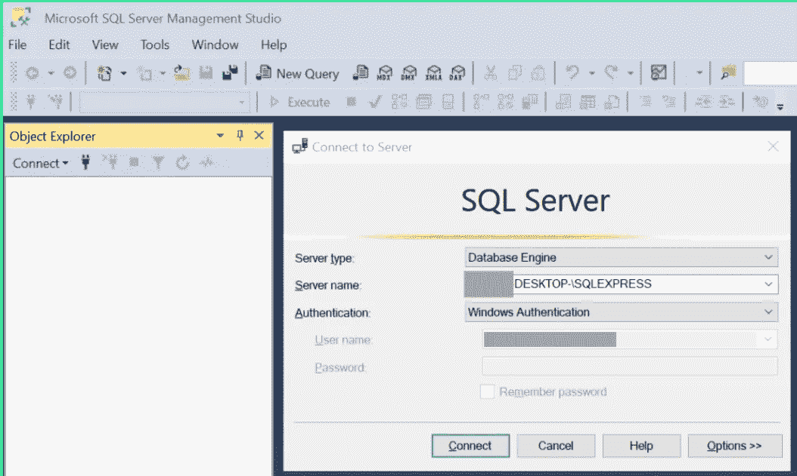
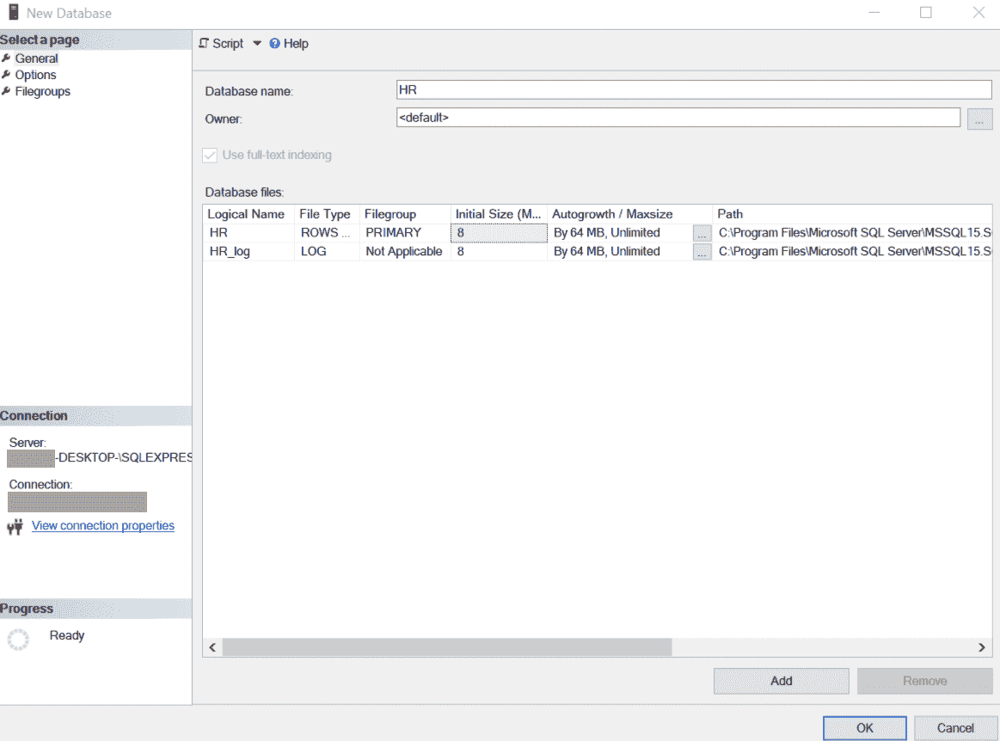
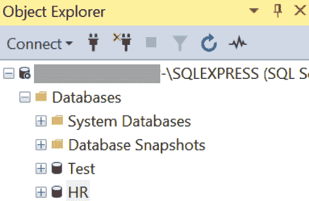
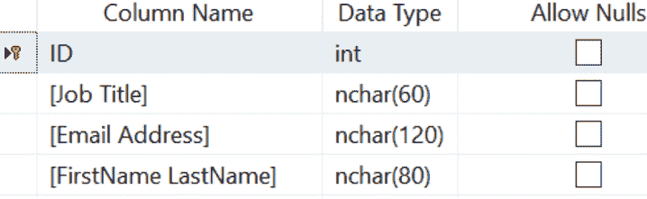
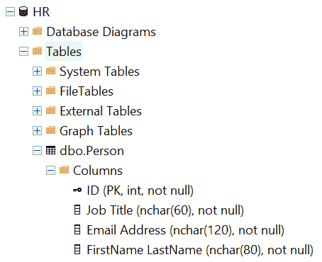
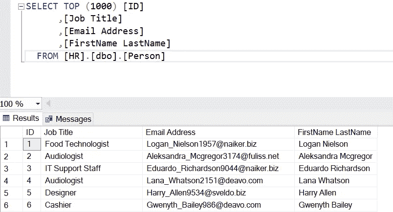

# 使用 Python 和 Bulk Insert 将数据从 CSV 文件快速加载到 SQL Server 表中

> 原文：<https://towardsdatascience.com/use-python-and-bulk-insert-to-quickly-load-data-from-csv-files-into-sql-server-tables-ba381670d376?source=collection_archive---------2----------------------->

## 了解如何编写 Python 代码来执行 SQL Server BULK INSERT 实用程序，以便将 CSV 文件中的数据高速加载到数据库表中

# 介绍

数据采集是许多数据分析项目和系统开发生命周期的重要组成部分。本文将向您展示如何编写一个简单的 Python 程序，该程序使用 BULK INSERT 实用程序将 CSV 文件中的数据快速插入到 SQL Server 数据库表中。



SQL Server 的批量插入实用程序可以直接从 Python 执行，以便将 CSV 文件中的数据快速插入到数据库表中。图片由作者提供。

# 为什么使用这种方法？

有许多方法可以将 CSV 文件中的数据加载到 SQL Server 表中。这里有几个方法:

*   从命令行运行大容量插入实用工具。
*   从 SQL Server Management Studio (SSMS)运行大容量插入实用工具。
*   使用 SQL Server Management Studio (SSMS)导入平面文件向导。
*   编写一个程序，打开 CSV 文件，逐个读取其记录，并调用 SQL INSERT 语句将行插入到数据库表中。

如果有这么多方法可以将数据从 CSV 导入 SQL Server 数据库，为什么还要编写一个 Python 程序来调用 BULK INSERT 实用程序将数据加载到表中呢？以下是为什么这可能是一个有用的方法的一些原因:

*   Python 程序可以在执行大容量插入之前执行流程步骤。
*   Python 程序可以确保不会将重复数据写入目标表。
*   该程序可以在大容量插入之后清理或转换数据。
*   它可以执行错误处理功能。
*   它可以通过电子邮件或其他方式发送有关其行动的通知。

# 本文中使用的软件

我使用 Windows 10 环境和各种微软工具及其他工具进行软件开发、数据库和数据分析工作。下面是我在这篇文章中使用的软件列表:

*   **Windows 10 Home** —虽然我使用 Windows，但其中一些工具可能在其他操作系统中也能工作。
*   **记事本** —记事本有助于查看原始格式的 CSV 文件数据。
*   **Microsoft Excel** — Excel 有助于查看列和行格式的 CSV 文件中的数据。
*   [**微软 SQL Server 2019 Express**](https://www.microsoft.com/en-us/Download/details.aspx?id=101064)—SQL Server 有很多版本。Express 和 [SQL Server Developer](https://www.microsoft.com/en-us/sql-server/sql-server-downloads) 都是免费版本。
*   [**微软 SQL Server Management Studio**](https://docs.microsoft.com/en-us/sql/ssms/download-sql-server-management-studio-ssms?view=sql-server-ver15)(SSMS)——使用这个前端工具管理和查询 SQL Server 数据库。它是免费的，运行良好。
*   [**微软 Visual Studio 社区版**](https://visualstudio.microsoft.com/vs/community/) —我试过[微软 Visual Studio 代码](https://code.visualstudio.com/) (VS 代码)集成开发环境(IDE)。尽管如此，我还是更喜欢用 Visual Studio 编码，因为我已经使用它很多年了，我发现它很容易配置和使用，除了它众多的深度菜单选项。
*   [**Python 3 . 9 . 2**](https://www.python.org/downloads/)—这是撰写本文时最新的 Python 版本，但任何最新版本都应该可以工作。

# 生成测试数据

对于本文给出的例子，我从免费的[在线数据生成器](https://www.onlinedatagenerator.com/)生成了一个包含 10，000 条虚构数据记录的 CSV 文件。该文件名为 c:\test_data_folder\person.csv。它包含列 ID、职务、电子邮件地址和姓氏。Python 程序将执行 SQL Server BULK INSERT 语句，将数据从文件加载到表中。


person.csv 文件的内容。图片由作者提供。

# 创建数据库和表

## 关于 SQL Server 版本的重要说明

微软在 SQL Server 2017 中引入了使用 BULK INSERT 从 CSV 文件插入数据的功能。因此，您需要该版本或更新版本才能使用此功能。

## 创建数据库

下面是创建名为 HR(人力资源)的数据库的步骤:

连接到 SQL Server

*   发射 SSMS。
*   连接到数据库服务器。在本例中，我使用 Windows 身份验证连接到本地安装的 SQL Server Express 实例。



连接到 SQL Server Management Studio (SSMS)中的 SQL Server 数据库引擎。图片由作者提供。

创建人力资源数据库

*   在对象资源管理器中展开[+数据库]节点。右键单击[+数据库]，然后单击[新建数据库…]。
*   在“新建数据库”对话框中，在“数据库名称”文本框中输入“HR”。保持所有设置不变。单击[确定]创建数据库。



与 SSMS 一起创建人力资源数据库。图片由作者提供。

验证 HR 数据库出现在对象资源管理器中。如果没有，右键单击数据库，然后单击[刷新]。它应该进入视野。



对象资源管理器列出数据库。图片由作者提供。

## 创建表格

此时，HR 数据库将不包含任何表或其他对象，如存储过程。虽然 BULK INSERT 可以在运行时创建表，但我发现提前创建表有好处。例如，我可以指定表的键列以及每列的类型和长度。再次查看 CSV 文件中的示例数据，让我们创建具有相同名称和以下数据类型的列:

*   **ID** — INT
*   **职位名称** — NCHAR(60)
*   **邮箱地址** — NCHAR(120)
*   **名字姓氏** — NCHAR(80)

因为所有行都有所有列的值，所以将每一列设置为 NOT NULL。此外，由于 ID 是每一行的唯一标识符，因此选择它作为键。

按照以下步骤创建表格:

*   在对象资源管理器中，单击[+ HR]查看数据库中的选择。
*   右键单击[+表格]，单击[新建]，然后单击[表格…]。
*   输入如下所示的数据。输入列名、数据类型和允许空值后，右键单击 ID 列名并单击[设置主键]。将 ID 设置为键将确保表中只有一行可以包含任何 ID 值。



Person 表的列信息。图片由作者提供。

*   单击功能区菜单中的保存图标，在“选择姓名”对话框中，输入姓名“Person”点击[确定]保存表格。
*   在对象资源管理器中，单击[+ Tables]展开节点。然后，右键单击[- Tables]并单击[Refresh]。现在应该可以看到 Person 表了。
*   点击[+ dbo。Person]然后点击[+ Columns]来检查表格的结构。它应该类似于下图。



对象资源管理器中显示的人员表列。图片由作者提供。

# Python 程序

现在 HR 数据库和 Person 表已经存在，让我们研究一个使用批量插入实用程序的简单 Python 程序。它只是将 CSV 文件中的所有记录插入到 Person 表中。

## 代码模块

这个 Python 程序由两个模块或文件组成:

*   **c_bulk_insert.py** 包含了 c_bulk_insert 类。它包括连接数据库、构建和执行 BULK INSERT 语句的函数，以便将 CSV 文件中的数据插入到数据库表中。
*   **SQL _ server _ bulk _ insert . py**简单地实例化 c_bulk_insert 类，并用完成其工作所需的信息调用它。

## 代码逻辑

当程序实例化类 c_bulk_insert 时，它执行以下步骤:

1.  连接到 SQL Server 数据库。
2.  使用目标表的名称、输入 CSV 文件和一些设置来构造大容量插入查询。
3.  打开数据库游标。
4.  执行查询。
5.  清理:提交批量插入事务，关闭游标，并关闭数据库连接。

## 代码

模块 c_bulk_insert.py 中的 Python 类 c_bulk_insert 执行上述代码逻辑部分中描述的逻辑。

```
""" 
    Name:           c_bulk_insert.py
    Author:         Randy Runtsch
    Date:           March 17, 2021
    Description:    This module contains the c_bulk_insert class that connect to a SQL Server database
                    and executes the BULK INSERT utility to insert data from a CSV file into a table.
    Prerequisites:  1\. Create the database data table.
                    2\. Create the database update_csv_log table.
"""import pyodbcclass c_bulk_insert:def __init__(self, csv_file_nm, sql_server_nm, db_nm, db_table_nm):# Connect to the database, perform the insert, and update the log table.conn = self.connect_db(sql_server_nm, db_nm)
        self.insert_data(conn, csv_file_nm, db_table_nm)
        conn.closedef connect_db(self, sql_server_nm, db_nm):# Connect to the server and database with Windows authentication.conn_string = 'DRIVER={ODBC Driver 17 for SQL Server};SERVER=' + sql_server_nm + ';DATABASE=' + db_nm + ';Trusted_Connection=yes;'
        conn = pyodbc.connect(conn_string)return conndef insert_data(self, conn, csv_file_nm, db_table_nm):# Insert the data from the CSV file into the database table.# Assemble the BULK INSERT query. Be sure to skip the header row by specifying FIRSTROW = 2.qry = "BULK INSERT " + db_table_nm + " FROM '" + csv_file_nm + "' WITH (FORMAT = 'CSV', FIRSTROW = 2)"# Execute the querycursor = conn.cursor()
        success = cursor.execute(qry)
        conn.commit()
        cursor.close
```

sql_server_bulk_insert.py 模块实例化 c_bulk_insert。它用以下方式调用它:

*   CSV 文件名
*   SQL Server 实例引擎名称
*   数据库名称
*   目标表名

```
""" 
    Name:           sql_server_bulk_insert.py
    Author:         Randy Runtsch
    Date:           March 17, 2021
    Description:    This program is the controller that uses the Microsoft Transact-SQL BULK INSERT
                    statement to quickly insert the rows from a CSV file into
                    a SQL Server table.
    Prerequisites:  1\. Create the database data table.
                    2\. Create the database update_csv_log table.
"""from c_bulk_insert import c_bulk_insertbulk_insert = c_bulk_insert(r'c:\\test_data\\person.csv', 'xxxxx-DESKTOP-\\SQLEXPRESS', 'HR', 'Person')
```

## 结果呢

程序运行后，在 SSMS 执行一个选择查询，显示它将 CSV 文件中的记录写到 Person 表中。



在 SSMS 运行 SELECT 查询显示，Python 程序成功执行了 BULK INSERT 实用程序，将 CSV 文件中的记录写入 Person 表。图片由作者提供。

# 从这里去哪里

可能有许多原因和方法来增强程序。这里有一些想法:

*   将**错误处理**添加到数据库连接、查询执行和程序的其他部分。例如，程序可以使用错误处理来正常关机，重试一定次数，并通过电子邮件通知相关方。
*   **自动化程序**在需要时将数据插入数据库。例如，使用 Windows 任务计划程序安排程序定期运行，以便从新的 CSV 文件中插入人员记录。
*   **创建并写入一个日志表**以捕获程序开始和结束时间以及其他重要事件。添加其他消息，如错误详细信息，以确定要解决的问题。

# 结论

正如您所看到的，使用 Python 调用 BULK INSERT 是一种自动化部分工作流的方式，可以快速地将数据从 CSV 文件插入到 SQL Server 数据库表中。这可能是一种添加到您的数据分析或软件开发工具包中的便捷技术。

# 关于作者

Randy Runtsch 是一名数据分析师、软件开发人员、作家、摄影师、自行车手和冒险家。他和妻子住在美国明尼苏达州东南部。

关注 Randy 即将发表的关于公共数据集的文章，以推动数据分析解决方案、编程、数据分析、摄影、自行车旅行、啤酒等。