# 使用 Python 自动更新 PowerPoint

> 原文：<https://towardsdatascience.com/use-python-to-automate-the-powerpoint-update-4a385acf1243?source=collection_archive---------0----------------------->

## 使用 Python 编辑 PowerPoint 幻灯片的分步教程

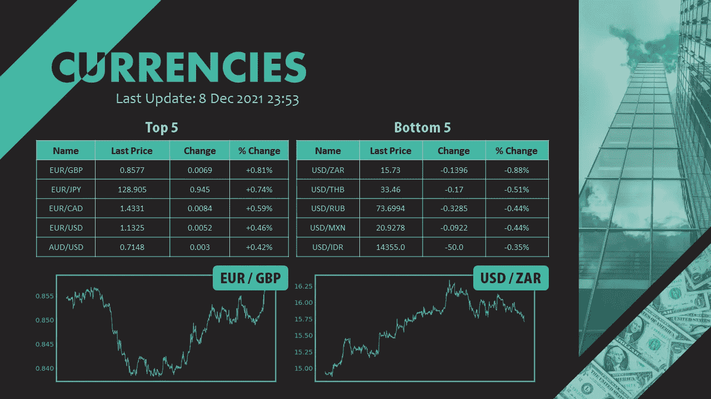

由 [cyda](https://blog.cyda.hk/) 编辑的 PowerPoint 幻灯片

# 目标

在两篇关于更智能地使用 Microsoft Excel 的文章之后，我收到了一些直接消息，说他们对这一领域感兴趣，并希望我能分享更多关于其他 office 产品的信息。它刺激我做一个与办公室小贴士相关的系列文章的收藏。第一个是**微软的 PowerPoint** 。在本文中，您将了解到

1.  如何**确定 PowerPoint 幻灯片中的形状**。
2.  修改幻灯片，如**插入图像**或**改变文字**。
3.  以不同格式输出幻灯片的方法，如 **PNG 或 PDF。**

另外，如果你还没有看过我写的关于微软 Excel 的文章，请随意查看下面的链接。

</use-python-to-stylize-the-excel-formatting-916e00e33302>  <https://medium.com/mlearning-ai/use-excel-to-scrape-data-no-codes-required-f13748587b0d>  

# 背景

在许多人的日常工作中，他们不得不频繁地定期更新 PowerPoint 幻灯片中的数字，如表格数字、日期、KPI 统计数据等。每天花 15-30 分钟来处理这些乏味的工作是很烦人的。

在下面的示例中，我们假设定期更新货币汇率，以弹出变化最大的货币汇率，我们需要显示变化百分比最大的货币汇率的价格趋势。

> 所有代码和资料都上传到我的 GitHub。你可以查一下民间的 [**和这种回购的**](https://github.com/cydalytics/Python_PowerPoint_Automation) **来进一步研究。=)**

# 步骤 1-定义相应的组件

首先，我们必须决定要更新的元素。以我的幻灯片为例，总共有 7 个地方需要更新。

1.  上次更新日期时间
2.  前 5 名表
3.  底部 5 表
4.  顶级数字标签
5.  底部图形标签
6.  最高数字
7.  底部图形

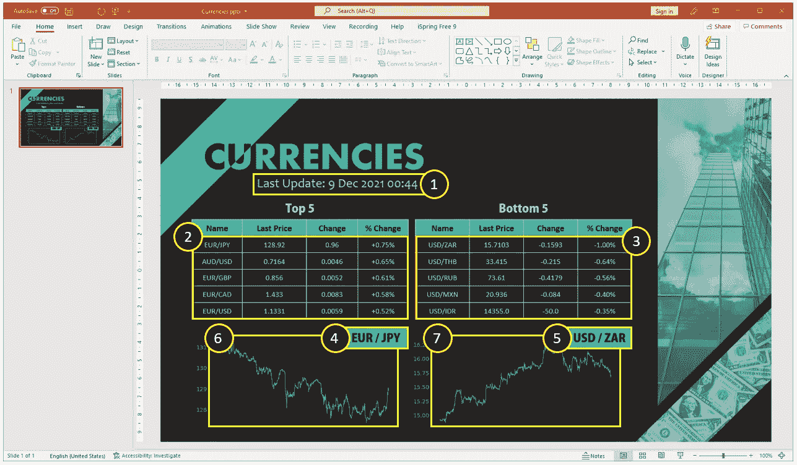

滑梯的 7 个部件(照片由 [cyda](https://blog.cyda.hk/) 拍摄)

# 步骤 2 —数据准备

在理解了要更新的组件之后，接下来是要用于更新的数据源。在一般的办公工作中，数据可以从 SQL server 中提取或从电子邮件中接收数据文件等。这里，我们将演示从互联网上抓取数据的情况。我们将使用雅虎财务数据作为例证。

```
[https://finance.yahoo.com/currencies](https://finance.yahoo.com/currencies)
```

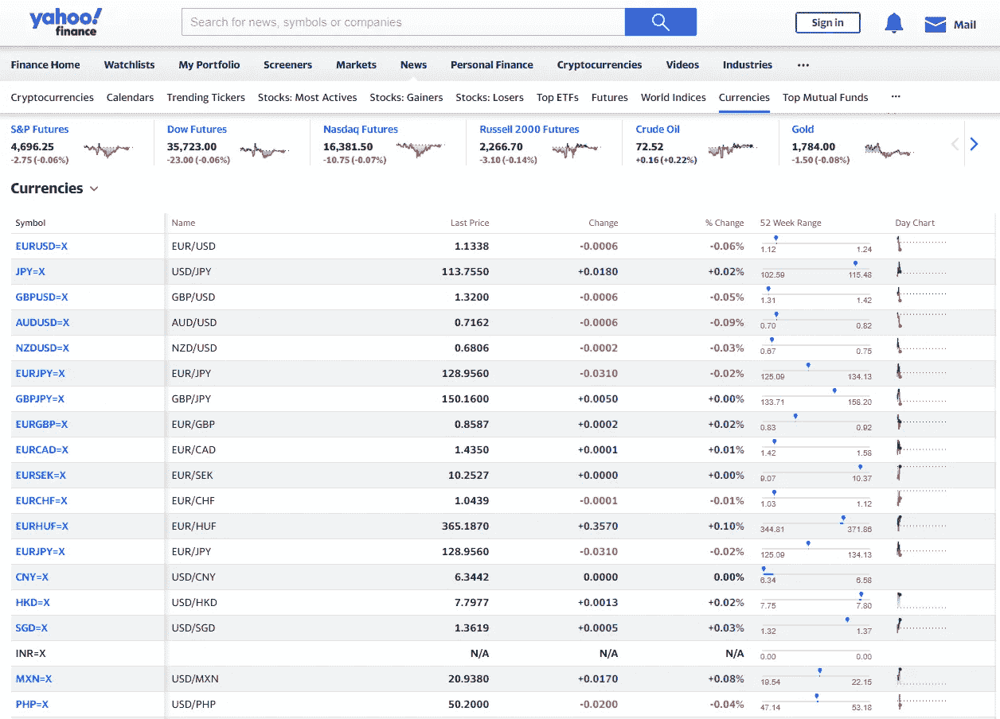

来自雅虎财经的货币(照片由 [cyda](https://blog.cyda.hk/) 拍摄)

我不会深入讨论数据是如何收集的，因为这不是本文的重点。基本上就是两行代码。首先，我们使用`requests`获取页面。然后，我们使用`pandas`提取表格。请注意，我们还记录了刮擦日期和时间，以备后用。

```
import requests
import pandas as pd
from datetime import datetimedatetime_now = datetime.now()
full_list_url='[https://finance.yahoo.com/currencies'](https://finance.yahoo.com/currencies')
full_list_page = requests.get(full_list_url)
df = pd.read_html(full_list_page.text)[0].drop_duplicates()
df['pct_change'] = df['% Change'].str.slice(stop=-1).astype(float)
```

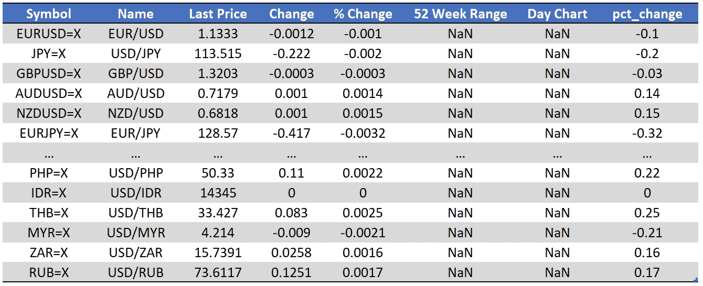

测向数据结构(cyda 拍摄

这张桌子看起来不错，包括了我们需要的所有东西。我们现在可以进入下一步，对表进行排序，并获得前 5 名和后 5 名货币的汇率。

```
top_df = df.sort_values(['pct_change'], ascending=False).reset_index(drop=True)[:5]
top_df = top_df[['Name', 'Last Price', 'Change', '% Change']]bottom_df = df.sort_values(['pct_change'], ascending=True).reset_index(drop=True)[:5]
bottom_df = bottom_df[['Name', 'Last Price', 'Change', '% Change']]
```

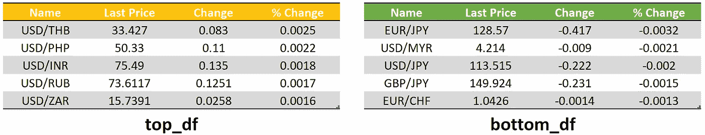

top_df 和 bottom_df 的数据结构(图片由 [cyda](https://blog.cyda.hk/) 提供)

数字都准备好了。唯一剩下的就是那两块地了。要生成绘图，您只需遵循以下代码。放心吧！我会一步一步地解释，这很容易理解。

1.  获取货币汇率的数据。
2.  提取收盘价并绘制成折线图。
3.  设置图表的格式，如颜色、字体大小或透明背景，以便与 PPT 主题保持一致。
4.  将绘图保存到 PNG 中。

```
import json
import matplotlib.pyplot as plttop_name = top_df['Name'][0].replace('/', '')
bottom_name = bottom_df['Name'][0].replace('/', '')for idx in range(2):

    name = [top_name, bottom_name][idx]
    file_path = ['top.png', 'bottom.png']

    url = '[https://query1.finance.yahoo.com/v8/finance/chart/'](https://query1.finance.yahoo.com/v8/finance/chart/') + name + '=X?region=US&lang=en-US&includePrePost=false&interval=30m&useYfid=true&range=1mo&corsDomain=finance.yahoo.com&.tsrc=finance'
    header = {'User-Agent': 'Mozilla/5.0 (Macintosh; Intel Mac OS X 10_11_5) AppleWebKit/537.36 (KHTML, like Gecko) Chrome/50.0.2661.102 Safari/537.36'}
    page = requests.get(url, headers=header)
    temp_json = json.loads(page.text)
    price_list = temp_json['chart']['result'][0]['indicators']['quote'][0]['close']
    price_list = [price for price in price_list if price != None]
    fig, ax = plt.subplots(figsize=(12, 6))
    ax.plot(price_list, color='#43B7A4')
    ax.set_xticks([])
    ax.tick_params(axis='y', colors='#43B7A4', labelsize=20)
    for axis in ['top','bottom','left','right']:
        ax.spines[axis].set_color('#43B7A4')
        ax.spines[axis].set_linewidth(4)
    plt.savefig(file_path[idx], transparent=True)
```

## 1.获取数据

特定货币汇率的价格系列数据可以在以下链接中找到。只有一个参数，那就是该货币汇率的`name`。

```
url = '[https://query1.finance.yahoo.com/v8/finance/chart/'](https://query1.finance.yahoo.com/v8/finance/chart/') + **name** + '=X?region=US&lang=en-US&includePrePost=false&interval=30m&useYfid=true&range=1mo&corsDomain=finance.yahoo.com&.tsrc=finance'
```

请注意，这次您需要指定一个`header`，以便成功获取页面数据。标题用于假装您正在通过浏览器访问页面。

```
header = {'User-Agent': 'Mozilla/5.0 (Macintosh; Intel Mac OS X 10_11_5) AppleWebKit/537.36 (KHTML, like Gecko) Chrome/50.0.2661.102 Safari/537.36'}
```

其余的应该很容易理解，这是获取页面数据并以 JSON 格式加载的常见过程。

```
page = requests.get(url, headers=header)
temp_json = json.loads(page.text)
```

## 2.绘制折线图

要得到价格表，我们只需检查数据的字典结构，就可以得到。有一点需要提醒的是，我在这里进行了一次检查，删除了价格表中的那些`None`数据，因为我发现价格表中有一些数据缺失。

```
price_list = temp_json['chart']['result'][0]['indicators']['quote'][0]['close']
price_list = [price for price in price_list if price != None]
```

我们使用`matplotlib`来绘制直线。

```
fig, ax = plt.subplots(figsize=(12, 6))
ax.plot(price_list, color='#43B7A4')
```

## 3.将图表风格化

我做了一些东西来润色剧情。

*   **删除日期的 x 轴刻度**

```
ax.set_xticks([])
```

*   **更改 y 轴刻度的字体大小和字体颜色**

```
ax.tick_params(axis='y', colors='#43B7A4', labelsize=20)
```

*   **改变边框颜色，使线条宽度变大**

```
for axis in ['top','bottom','left','right']:
    ax.spines[axis].set_color('#43B7A4')
    ax.spines[axis].set_linewidth(4)
```

## 4.保存情节

最后，我们将图形保存为 PNG 格式。请注意，要使背景透明，只需指定`transparent=True`。

```
plt.savefig(file_path[idx], transparent=True)
```

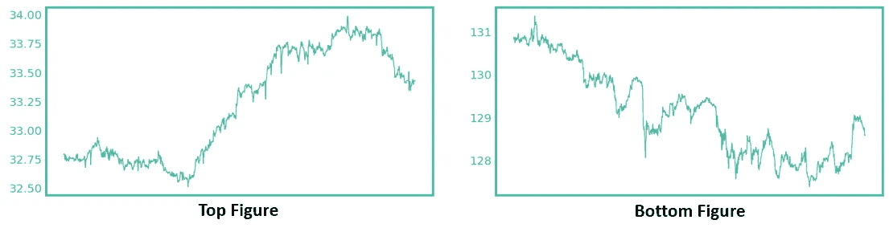

顶部和底部货币图(照片由 [cyda](https://blog.cyda.hk/) 拍摄)

# 步骤 3— PowerPoint 更新

这是我们今天的重点。在使用 Python 编辑 PowerPoint 之前，需要有`python-pptx`包。要安装它，您可以在终端中键入以下代码。

```
pip install python-pptx
```

按照我们通常的做法，我先给你看所有的代码，然后一步一步地教你。

```
from pptx import Presentation
from pptx.util import Inches
import win32com.client
import oscurrencies_ppt = Presentation('Currencies.pptx')
slide = currencies_ppt.slides[0]shapes = slide.shapes
for shape in shapes:
    if shape.shape_type == 13:
        shapes.element.remove(shape.element)
top_img_path = 'top.png'
bottom_img_path = 'bottom.png'
top_pic = slide.shapes.add_picture(top_img_path, Inches(0.40), Inches(4.85), width=Inches(5.30))
bottom_pic = slide.shapes.add_picture(bottom_img_path, Inches(5.25), Inches(4.85), width=Inches(5.30))
ref_element = slide.shapes[0]._element
ref_element.addprevious(top_pic._element)
ref_element.addprevious(bottom_pic._element)shapes = slide.shapes
text_box_list = []
auto_shape_list = []
table_list = []
for shape_idx in range(len(shapes)):
    shape = shapes[shape_idx]
    if shape.shape_type == 17:
        text_box_list.append(shape_idx)
    if shape.shape_type == 1:
        auto_shape_list.append(shape_idx)
    if shape.shape_type == 19:
        table_list.append(shape_idx)last_update_date_textbox_height = max([shapes[shape_idx].height for shape_idx in text_box_list])
last_update_date_idx = [shape_idx for shape_idx in text_box_list if shapes[shape_idx].height == last_update_date_textbox_height][0]
top_label_left = min([shapes[shape_idx].left for shape_idx in auto_shape_list])
top_label_idx = [shape_idx for shape_idx in auto_shape_list if shapes[shape_idx].left == top_label_left][0]
auto_shape_list.remove(top_label_idx)
bottom_label_idx = auto_shape_list[0]
top_table_left = min([shapes[shape_idx].left for shape_idx in table_list])
top_table_idx = [shape_idx for shape_idx in table_list if shapes[shape_idx].left == top_table_left][0]
table_list.remove(top_table_idx)
bottom_table_idx = table_list[0]paragraph = shapes[last_update_date_idx].text_frame.paragraphs[0]
paragraph.runs[4].text = datetime_now.strftime("%#d %b %Y %H:%M")
paragraph = shapes[top_label_idx].text_frame.paragraphs[0]
paragraph.runs[0].text = top_df['Name'][0].replace('/', ' / ')
paragraph = shapes[bottom_label_idx].text_frame.paragraphs[0]
paragraph.runs[0].text = bottom_df['Name'][0].replace('/', ' / ')
top_table = shapes[top_table_idx].table
for i in range(5):
    for j in range(4):
        cell = top_table.cell(i+1, j)
        paragraph = cell.text_frame.paragraphs[0]
        run = paragraph.runs[0]
        run.text = str(top_df.iloc[i, j])
bottom_table = shapes[bottom_table_idx].table
for i in range(5):
    for j in range(4):
        cell = bottom_table.cell(i+1, j)
        paragraph = cell.text_frame.paragraphs[0]
        run = paragraph.runs[0]
        run.text = str(bottom_df.iloc[i, j])currencies_ppt.save('New_Currencies.pptx')ppt_file_path = os.getcwd() + '\\New_Currencies.pptx'
powerpoint = win32com.client.Dispatch('Powerpoint.Application')
deck = powerpoint.Presentations.Open(ppt_file_path)
img_file_path = os.getcwd() + '\\Currencies.png'
powerpoint.ActivePresentation.Slides[0].Export(img_file_path, 'PNG')
pdf_file_path = os.getcwd() + '\\Currencies.pdf'
deck.SaveAs(pdf_file_path, 32)deck.Close()
powerpoint.Quit()
os.system('taskkill /F /IM POWERPNT.EXE')
```

代码看起来又长又复杂。不要惊慌。如果你理解了结构，你就能很容易地处理它。

1.  指定您正在处理的幻灯片。
2.  移除现有地块。
3.  添加新的地块。
4.  定义元件的形状指数。
5.  逐个更新组件。
6.  把 PPT 导出成我们想要的任何格式。

## 1.加载 PPT 并指定幻灯片

```
currencies_ppt = Presentation('Currencies.pptx')
slide = currencies_ppt.slides[0]
```

从上面的代码可以看到括号里的数字`0`。它指的是幻灯片编号。因为我正在制作第一张幻灯片，所以我将编号指定为`0`。例如，如果您的常规更新幻灯片在幻灯片 10 中，那么您必须将编号指定为`9`。

## 2.移除旧地块

在**步骤 1** 中，我们定义了 7 个组件，有两个图——组件 6 和组件 7。要替换它们，我们首先必须删除它们。否则，新图将与旧图重叠。但问题是‘我们如何指定幻灯片中的特定项目？’

在`python-pptx`中，不同的物体有不同的形状。要检查幻灯片中的形状，您可以执行以下代码。

```
for shape in slide.shapes:
    print(shape.shape_type)
```

以我的幻灯片为例，下面是我收到的输出。

```
PICTURE (13)
PICTURE (13)
TEXT_BOX (17)
TABLE (19)
TABLE (19)
TEXT_BOX (17)
TEXT_BOX (17)
AUTO_SHAPE (1)
AUTO_SHAPE (1)
```

然后我们就可以算出老剧情应该是`PICTURE (13)`。要删除它们，我们只需要检查形状类型是否等于 13。

```
shapes = slide.shapes
for shape in shapes:
    if shape.shape_type == 13:
        shapes.element.remove(shape.element)
```

## 3.添加新的地块

使用以下功能可以很容易地添加图表。

`add_picture(image_file, left, top, width=None, height=None)`

基本上，你要做的事情是设置图像文件路径和你要放的图像的 x-y 位置，就像下面这样。

```
top_img_path = 'top.png'
bottom_img_path = 'bottom.png'top_pic = slide.shapes.add_picture(top_img_path, Inches(0.40), Inches(4.85), width=Inches(5.30))
bottom_pic = slide.shapes.add_picture(bottom_img_path, Inches(5.25), Inches(4.85), width=Inches(5.30))
```

请注意，图形的另一个步骤是指定图像的放置顺序。通过这样做，你必须找到一个相对形状作为参考形状，并使用`addnext`和`addprevious`函数来指定它们的关系。这就好比 PowerPoint 中的`Bring Forward`和`Send Backward`的概念。

```
ref_element = slide.shapes[0]._element
ref_element.addprevious(top_pic._element)
ref_element.addprevious(bottom_pic._element)
```

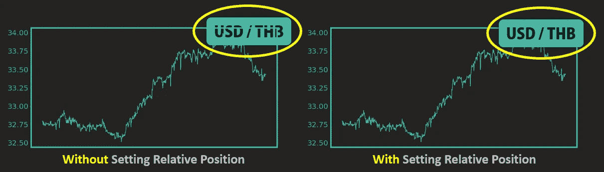

有无相对位置的区别(照片由 [cyda](https://blog.cyda.hk/) 拍摄)

## 4.查找形状索引

要编辑形状，我们必须确定它引用了哪个形状索引。简而言之，我们首先将形状分类到不同的列表中，并根据`x-coordinate (left)`和`y-coordinate (height)`确定相应的形状索引。

```
shapes = slide.shapes
text_box_list = []
auto_shape_list = []
table_list = []
for shape_idx in range(len(shapes)):
    shape = shapes[shape_idx]
    if shape.shape_type == 17:
        text_box_list.append(shape_idx)
    if shape.shape_type == 1:
        auto_shape_list.append(shape_idx)
    if shape.shape_type == 19:
        table_list.append(shape_idx)
```

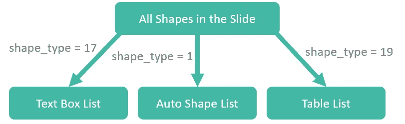

将形状分类成列表(照片由 [cyda](https://blog.cyda.hk/) 拍摄)

**文本框列表**

文本框有三种形状。为了识别最后更新日期时间形状，我们可以找到具有最大高度的形状。

```
last_update_date_textbox_height = max([shapes[shape_idx].height for shape_idx in text_box_list])
last_update_date_idx = [shape_idx for shape_idx in text_box_list if shapes[shape_idx].height == last_update_date_textbox_height][0]
```

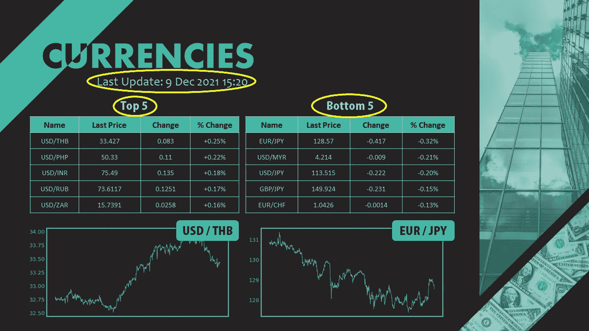

文本框(照片由 [cyda](https://blog.cyda.hk/) 拍摄)

**自动形状列表**

只有两种自动形状，即顶部标签和底部标签。它们具有相同的高度，但 x 坐标不同。在`left`中具有最小值的一个将是顶部标签，另一个将是底部标签。

```
top_label_left = min([shapes[shape_idx].left for shape_idx in auto_shape_list])
top_label_idx = [shape_idx for shape_idx in auto_shape_list if shapes[shape_idx].left == top_label_left][0]
auto_shape_list.remove(top_label_idx)bottom_label_idx = auto_shape_list[0]
```

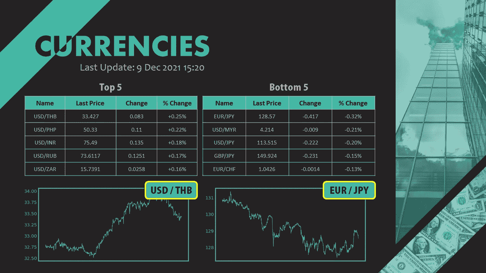

自动整形(照片由 [cyda](https://blog.cyda.hk/) 拍摄)

**表格列表**

由于也只有两个表格，我们可以简单地应用类似的技巧，就像我们在自动形状列表中所做的那样。

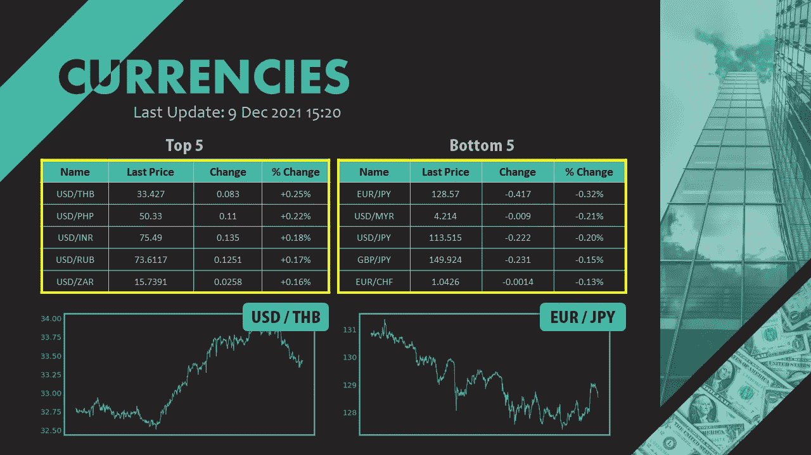

表(照片由 [cyda](https://blog.cyda.hk/) 拍摄)

```
top_table_left = min([shapes[shape_idx].left for shape_idx in table_list])
top_table_idx = [shape_idx for shape_idx in table_list if shapes[shape_idx].left == top_table_left][0]
table_list.remove(top_table_idx)bottom_table_idx = table_list[0]
```

## 5.更新组件

要更新组件，一个非常重要的规则是遵循形状内部的变化值，而不是格式。在下面，我用最后更新日期时间作为例子。

**纯文本(不要用这个)**

```
shapes[last_update_date_idx].text = 'Last Update: ' + datetime_now.strftime("%#d %b %Y %H:%M")
```

**带格式的文本(用这个)**

```
paragraph = shapes[last_update_date_idx].text_frame.paragraphs[0]
paragraph.runs[4].text = datetime_now.strftime("%#d %b %Y %H:%M")
```


纯文本和带格式文本的插图(照片由 [cyda](https://blog.cyda.hk/) 拍摄)

从上面的图像中，你可以看出区别。一个段落实际上不仅用于存储形状的值，还用于存储格式信息，如对齐、字体、超链接等。因此，请记住更改段落运行中的文本值，而不是形状值。

附图的标记实际上具有相同的结构，我将再次重复这个概念。让我们转到表值的更新。

```
top_table = shapes[top_table_idx].table
for i in range(5):
    for j in range(4):
        cell = top_table.cell(i+1, j)
        paragraph = cell.text_frame.paragraphs[0]
        run = paragraph.runs[0]
        run.text = str(top_df.iloc[i, j])
```

基本上，这很简单。我们找到感兴趣的表格，并为表格中的每个单元格更改段落运行中的值。请注意，`i`指的是行记录，`j`指的是列。

## 6.导出文件

教程差不多完成了，最后一步是将文件转换成我们想要的格式。基本上，让我分享人们会使用的最常见的文件结构。

**另存为 PPT**

```
currencies_ppt.save('New_Currencies.pptx')
```

**另存为 PNG**

```
import win32com.client
import osppt_file_path = os.getcwd() + '\\New_Currencies.pptx'
powerpoint = win32com.client.Dispatch('Powerpoint.Application')
deck = powerpoint.Presentations.Open(ppt_file_path)img_file_path = os.getcwd() + '\\Currencies.png'
powerpoint.ActivePresentation.Slides[0].Export(img_file_path, 'PNG')deck.Close()
powerpoint.Quit()
os.system('taskkill /F /IM POWERPNT.EXE')
```

**另存为 PDF**

```
import win32com.client
import osppt_file_path = os.getcwd() + '\\New_Currencies.pptx'
powerpoint = win32com.client.Dispatch('Powerpoint.Application')
deck = powerpoint.Presentations.Open(ppt_file_path)pdf_file_path = os.getcwd() + '\\Currencies.pdf'
deck.SaveAs(pdf_file_path, 32)deck.Close()
powerpoint.Quit()
os.system('taskkill /F /IM POWERPNT.EXE')
```

# 结论

关于使用 Python 在 PowerPoint 中自动化工作的 office 技巧到此结束。如果你有兴趣了解更多这类工作技巧，请给个赞并关注。请继续关注我的下一篇教程。=)

如果你觉得我的文章有用，请在[我的 LinkedIn 页面](https://www.linkedin.com/in/yeungwong/)上为我的技能背书，鼓励我写更多的文章。

<https://medium.com/mlearning-ai/use-python-to-send-outlook-emails-d673ce9e33e4>  <https://medium.com/mlearning-ai/use-python-to-process-pdf-work-7a9d77d718f4> 