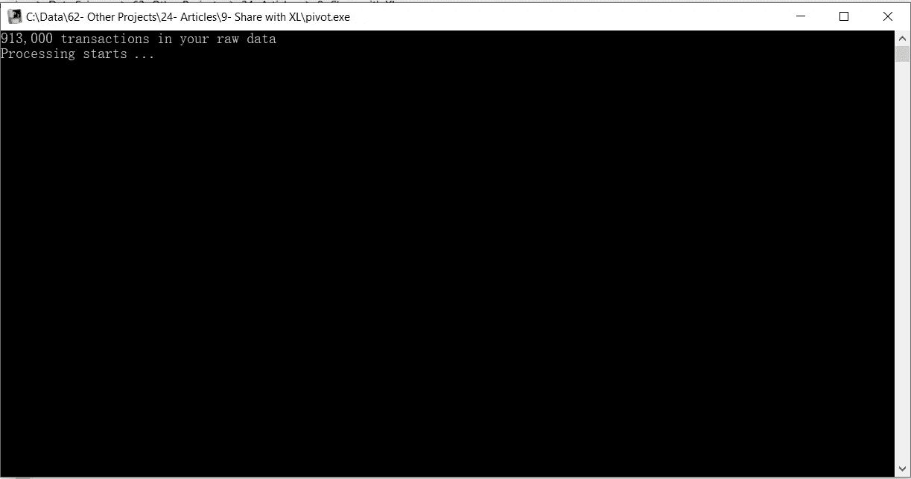

# 用 Python 构建 Excel 自动化工具

> 原文：<https://towardsdatascience.com/use-python-to-design-automation-tools-for-excel-users-e824b37c646d?source=collection_archive---------12----------------------->

## 用于销售分析的 Excel 自动化工具的设计可供您的同事在没有任何 Python 知识的情况下使用


Excel 自动化—(图片由作者提供)

你读过多少文章说“Excel 已死，Python 万岁”，“Python 是新的 Excel”或者“Excel 过时了”？

但是当你环顾四周，在你的团队或其他部门你几乎找不到其他同事使用 Python。

而当你提到它时，它被视为一个人们无法信任的黑匣子，因为“*它太复杂了”、“我们看不到公式”*或“*我无法在我的电脑上运行它”*。

推广它的第一步是让他们有可能在没有 python 知识的情况下在他们的计算机上运行您的脚本。

💌新文章免费直入你的收件箱:[时事通讯](https://www.samirsaci.com/#/portal/signup)

如果你喜欢看，看看这篇文章的视频版本

# 1.方案

你是一家大型零售公司的**数据科学家，供应链团队的同事请求你帮助**分析销售数据**。**

对于本例，我们将从 Kaggle 挑战:[商店商品需求预测挑战](https://www.kaggle.com/c/demand-forecasting-kernels-only/data)中获取一个数据集。我在另一篇文章([链接](/machine-learning-for-store-demand-forecasting-and-inventory-optimization-part-1-xgboost-vs-9952d8303b48))中使用这个数据集进行商店需求预测。

数据集

*   2013 年 1 月 1 日至 2017 年 12 月 31 日的交易
*   **913，000** 销售交易
*   **50** 独特的 SKU
*   **10** 店铺

**目标:**你的同事想要为每个商店建立一个按商品统计的月销售额数据透视表。

**问题:**拥有近 100 万条记录，您的同事正在接近 Excel 的极限。因此，他们请求数据科学家的支持，以找到神奇的解决方案。

[](http://samirsaci.com) [## 萨米尔 Samir 供应链组合的数据科学

### 🏭使用高级数学概念的供应链网络优化👨‍🏭仓储的持续改进…

samirsaci.com](http://samirsaci.com) 

# 2.解决办法

我们将设计一个 python 脚本来执行数据处理，创建数据透视表并将结果导出到 Excel 文件中。

您的脚本正在执行以下任务:

1.  从 Kaggle Challenge 导入初始原始数据(sales_data.csv)
2.  日期格式化
3.  每对商店、商品按月销售的数据透视表
4.  按商店和项目对记录进行排序
5.  将最终报告保存在 Excel 文件中

# 3.使用可执行文件(.exe)

**目标:**创建一个可执行文件(。exe)，它将运行您的脚本，并且可以在您的计算机上没有安装 python 的情况下使用。

## **工具箱中的新 Python 库:Pyinstaller**

> PyInstaller 将 Python 应用程序及其所有依赖项打包到一个包中。用户可以运行打包的应用程序，而无需安装 Python 解释器或任何模块。

## **第一步:安装 Pyinstaller**

```
pip install pyinstaller
```

## 步骤 2:将 python 脚本保存在当前目录中

将它保存在与销售记录初始文件(sales_data.csv)相同的目录中。将文件命名为:“pivot.py”

## 步骤 3:使用 Pyinstaller 创建可执行文件

在命令提示符下输入以下命令

```
pyinstaller --onefile pivot.py
```


Pyinstaller 处理日志—(图片由作者提供)

当该过程完成时，您将看到此消息“从 EXE-00.toc 成功构建 EXE”还有你的(。exe) fill 会弹出一个名为“Build”的文件夹。

## 步骤 4:使用你的可执行文件



您的新(。文件处理日志—(图片由作者提供)

请你的同事剪切并粘贴这个(。exe)文件，并单击以启动脚本。由于在脚本的每一步都放置了打印消息，他们可以跟踪这个过程。

**结果:**在流程结束时，他们可以找到保存在您文件夹中的销售报告(sales_report.xlsx)。

## 超越:自动化数据提取

在开始构建报告之前，您需要从 ERP 中收集数据。如果您正在使用 SAP，您可能会对这一系列关于 ERP 自动化的文章感兴趣

[](https://www.samirsaci.com/sap-automation-of-product-listing-for-retail/) [## 零售产品列表的 SAP 自动化

### 自动化和报告使用 Visual Basic 自动化产品，通过 SAP GUI 脚本工具在 SAP 中自动列出产品…

www.samirsaci.com](https://www.samirsaci.com/sap-automation-of-product-listing-for-retail/) [](https://www.samirsaci.com/sap-automation-for-retail/) [## 面向零售业的 SAP 自动化

### 自动化和报告设计 RPA 解决方案使用通过 SAP GUI 脚本工具构建的 Visual Basic 脚本设计 RPA…

www.samirsaci.com](https://www.samirsaci.com/sap-automation-for-retail/) 

# 4.结论

*关注我的 medium，了解更多与供应链数据科学相关的见解。*

您现在有了一个工具来与其他同事分享您的工作，并构建将影响您公司的生产力并支持人们自动完成枯燥任务的工具。

这可以与使用 seaborn 的酷可视化、获取数据的外部 API 的连接、预测未来销售的机器学习模型或任何可以为您的计算带来附加值的东西相结合。

# 关于我

让我们在 [Linkedin](https://www.linkedin.com/in/samir-saci/) 和 [Twitter](https://twitter.com/Samir_Saci_) 上连线，我是一名供应链工程师，正在使用数据分析来改善物流运营和降低成本。

如果你对数据分析和供应链感兴趣，可以看看我的网站

[](https://samirsaci.com) [## Samir Saci |数据科学与生产力

### 专注于数据科学、个人生产力、自动化、运筹学和可持续发展的技术博客

samirsaci.com](https://samirsaci.com) 

# 参考

[1] Kaggle 数据集，商店商品需求预测挑战，[链接](https://www.kaggle.com/c/demand-forecasting-kernels-only)