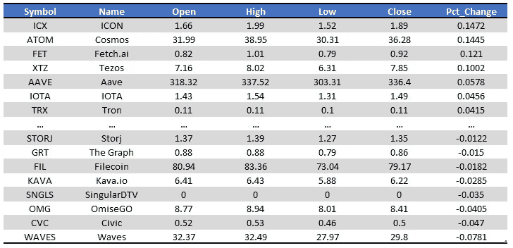

# 使用 Python 来格式化 Excel

> 原文：<https://towardsdatascience.com/use-python-to-stylize-the-excel-formatting-916e00e33302?source=collection_archive---------0----------------------->

## 使用 Python 格式化 Excel 电子表格的分步教程


自动生成风格化报告的步骤(照片由 [cyda](https://cydalytics.blogspot.com/) 拍摄)

# 目标

你必须每天定期更新报告吗？你有没有想过一种方法来自动化这些繁琐，无聊，机器人的工作？你可能会说“是的，但是我不能，因为有很多格式的东西需要我手动添加到 Excel 中”。今天，我将向您展示 Python 如何处理 Excel 电子表格格式并自动生成报告。

# 加密货币为例

我是一个加密货币爱好者，我会每天查看不同硬币的价格。然而，逐个检查所有硬币是非常耗时的，这就是为什么我想每天早上用一个程序自动为我生成总结报告。如果你有兴趣了解更多的金融数据分析，可以随时查看我的出版物。

<https://medium.com/financial-data-analysis>  

> 所有的代码和数据都上传到了我的 GitHub。你可以和民间的 [**这种回购**](https://github.com/cydalytics/Python_Excel_Formatting) **来进一步研究。=)**

# 数据抓取

首先，我们需要收集数据以显示在表格中。例如，您可以从公司数据库中查询数据。您可以从您的业务伙伴处获取数据。或者就像我这个案例，瞬间从网上刮数据。我在这里使用的数据源是 CoinDesk API。关于这个 API 如何工作和参数设置的更多细节，你可以查看我下面的文章。

<https://medium.com/financial-data-analysis/web-scraping-cryptocurrency-1-minute-price-data-python-471dd165d934>  

```
import json
from urllib import request
url = "[https://production.api.coindesk.com/v2/tb/price/ticker?assets=all](https://production.api.coindesk.com/v2/tb/price/ticker?assets=all)"
response = request.urlopen(url)
data = json.loads(response.read().decode())
```

通过上面的代码，我们可以很容易地获得不同硬币的最新加密货币定价。我在下面展示了数据应该是什么样子。

```
{'statusCode': 200,
 'message': 'OK',
 'data': {'BTC': {'iso': 'BTC',
   'name': 'Bitcoin',
   'slug': 'bitcoin',
   'change': {'percent': 0.6642429710971107, 'value': 298.538427},
   'ohlc': {'o': 44944.160494,
    'h': 46843.67,
    'l': 43480.540171,
    'c': 45242.698921},
   'circulatingSupply': 18814943.79249204,
   'marketCap': 851238837219.2552,
   'ts': 1631590859000,
   'src': 'tb'},
  'ETH': {...}}}
```

# 数据列表

然而，数据是 JSON 格式的，不容易阅读。因此，我们必须将数据预处理成表格格式。

```
def flatten_json(coin_dict):
    flatten_dict = {}
    def flatten(x, name=''):
        if type(x) is dict:
            for key in x:
                flatten(x[key], name + key + '_')
        else:
            flatten_dict[name[:-1]] = x
    flatten(coin_dict)
    return flatten_dictimport pandas as pd
master_df = pd.DataFrame()
for coin in data['data'].keys():
    temp_df = pd.json_normalize(flatten_json(data['data'][coin]))
    master_df = master_df.append(temp_df)
master_df = master_df[['iso', 'name', 'ohlc_o', 'ohlc_h', 'ohlc_l', 'ohlc_c', 'change_percent']].reset_index(drop=True)
master_df.columns = ['Symbol', 'Name', 'Open', 'High', 'Low', 'Close', 'Pct_Change']
master_df.iloc[:, 2:] = master_df.iloc[:, 2:].apply(lambda x: round(x, 2))
master_df['Pct_Change'] = master_df['Pct_Change'] / 100
master_df = master_df.sort_values('Pct_Change', ascending=False).reset_index(drop=True)
master_df.to_csv('master_df.csv', index=False)
master_df.head()
```

为了将 JSON 转换成表，您可以遵循以下步骤。

1.  *展平 JSON 中每一个硬币数据的字典*
2.  *将所有硬币数据帧添加到一个主数据帧中*
3.  *选择我们感兴趣的栏目*
4.  *重命名列以便于参考*
5.  *四舍五入以简化表格*
6.  *按百分比变化排序*



cyda 拍摄的照片

# Excel 格式

最后是主菜。只要记住一件事，在写代码之前，你应该先在头脑中有一个设计。例如，下面是我的模板草稿。有草稿的原因是因为它帮助你更好地定义列或索引来放置元素(标题、表格、备注等)。


照片由 [cyda](https://cydalytics.blogspot.com/)

> 1.将表格添加到 excel 中

```
file_name = "Cryptocurrency.xlsx"
sheet_name = "Summary"writer = pd.ExcelWriter(file_name, engine='xlsxwriter')
master_df.to_excel(writer, sheet_name=sheet_name, startrow = 2, index = False)
```

只需注意一点，您可能会看到有一个参数 *startrow* 设置为 2。这是因为我们希望保留前两行作为标题和间距，我们将在第 3 行开始写表(Python 计数值从 0 开始，所以基本上设置为 2 意味着第 3 行)


照片由 [cyda](https://cydalytics.blogspot.com/) 拍摄

> 2.将标题添加到 excel

```
from datetime import datetime
workbook  = writer.book
worksheet = writer.sheets[sheet_name]worksheet.write(0, 0, 'Cryptocurrency Pricing Summary on '+datetime.now().strftime('%d %b %Y'), workbook.add_format({'bold': True, 'color': '#E26B0A', 'size': 14}))
```

若要定义要写入文本的单元格，您可以从上到下然后从左到右计数。比如你在写 A1，那么它就是(0，0)。如果你写的是 C4，那么应该是(3，2)。


照片由 [cyda](https://cydalytics.blogspot.com/)

> 3.将备注添加到 excel 中

```
worksheet.write(len(master_df)+4, 0, 'Remark:', workbook.add_format({'bold': True}))
worksheet.write(len(master_df)+5, 0, 'The last update time is ' + datetime.now().strftime('%H:%M') + '.')
```

这里有一个技巧要记住。由于数据框在每次更新中可能具有不同的行数，因此在编写注释字符串时，您应该更好地考虑它的记录。例如，这里我将行索引设置为 *len(master_df)+4* ，这是表中的行数加上标题和间距。


照片由 [cyda](https://cydalytics.blogspot.com/)

> 4.给表格标题添加颜色

```
header_format = workbook.add_format({'bold': True, 'text_wrap': True, 'fg_color': '#FDE9D9', 'border': 1})
for col_num, value in enumerate(master_df.columns.values):
    worksheet.write(2, col_num, value, header_format)
```

对于表头，引入了两个参数。第一个是 *text_wrap* 。它被设置为 True，这样，如果空间不足以显示，页眉的文本将换行到下一行。第二个是 fg_color。它用于设置单元格的前景色。


照片由 [cyda](https://cydalytics.blogspot.com/)

> 5.向表格添加边框

```
row_idx, col_idx = master_df.shape
for r in range(row_idx):
    for c in range(col_idx):
        if c == 6:
            worksheet.write(r + 3, c, master_df.values[r, c], workbook.add_format({'border': 1, 'num_format': '0.00%'}))
        else:
            worksheet.write(r + 3, c, master_df.values[r, c], workbook.add_format({'border': 1, 'num_format': '0.00'}))
```

诀窍和以前的案例类似。只需记住将行索引设置为 *r+3* ，因为表中第一个值前面有三行。


照片由 [cyda](https://cydalytics.blogspot.com/)

> 6.设置列宽

```
worksheet.set_column(0, 6, 12)
worksheet.set_column(1, 1, 20)
```

供您参考，函数参数如下:
*(起始列索引、结束列索引、列宽)*


cyda 拍摄的照片

# 结论

希望这篇文章能帮助到那些不得不定期更新 Excel 电子表格的人。如果你想知道更多的编程技巧，你可以订阅我的媒体，我会更新和分享更多的技巧。=)

如果你觉得我的文章有用，请在我的 linkedIn 页面上为我的技能背书，鼓励我写更多的文章。

原载于 cydalytics.blogspot.com 的

<https://medium.com/mlearning-ai/use-excel-to-scrape-data-no-codes-required-f13748587b0d>  </use-python-to-automate-the-powerpoint-update-4a385acf1243>  <https://medium.com/mlearning-ai/use-python-to-send-outlook-emails-d673ce9e33e4>  <https://medium.com/mlearning-ai/use-python-to-process-pdf-work-7a9d77d718f4> 