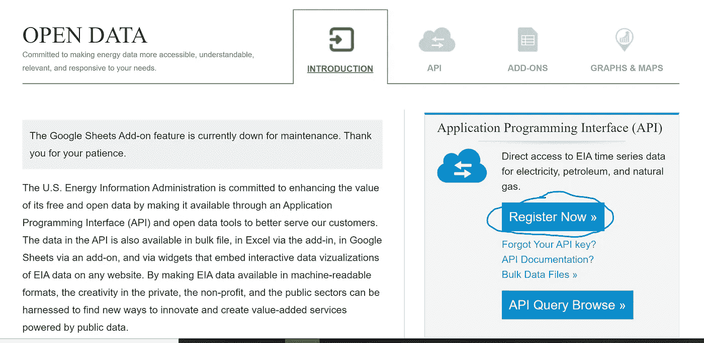
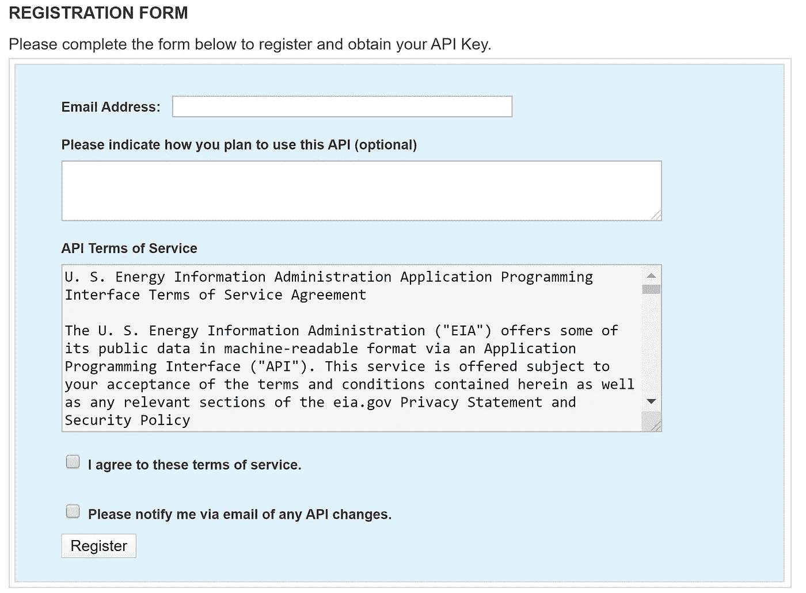
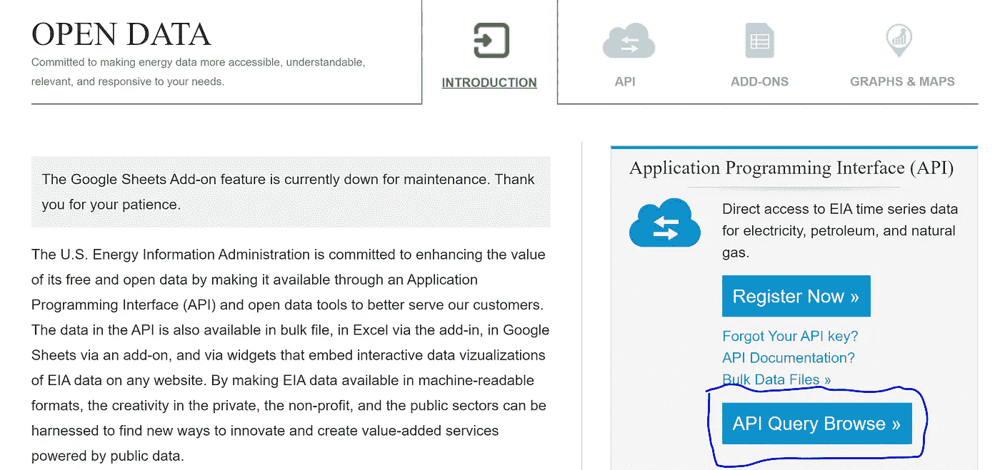
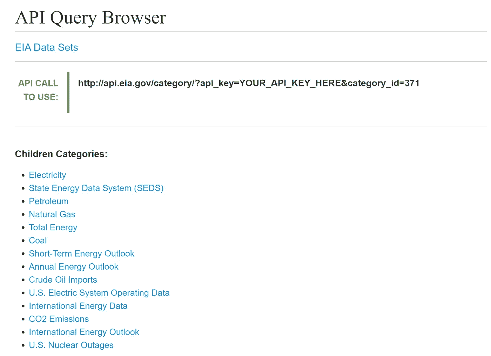
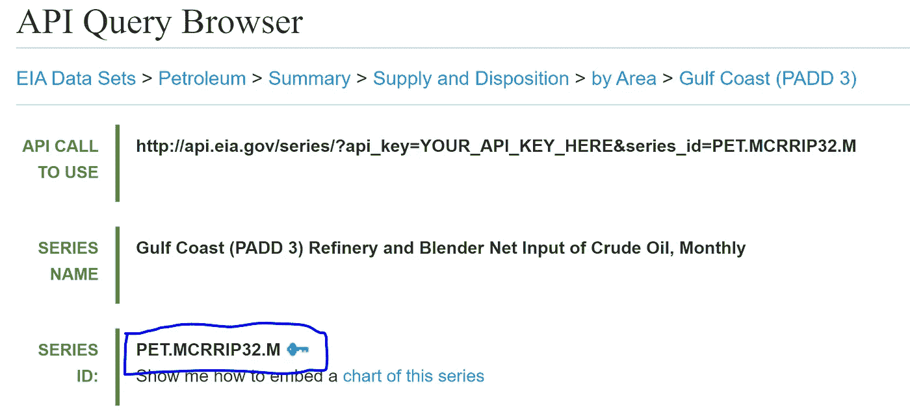
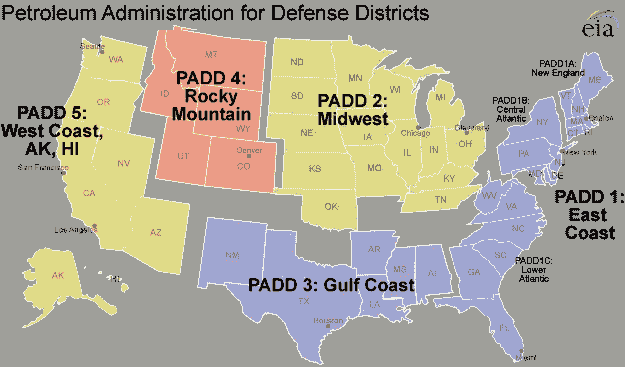
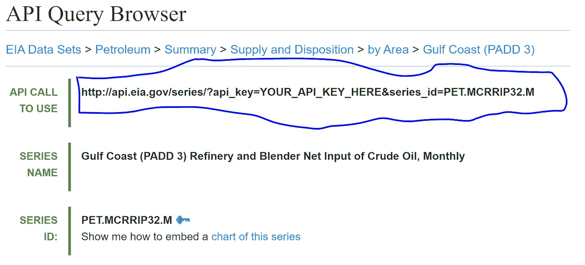
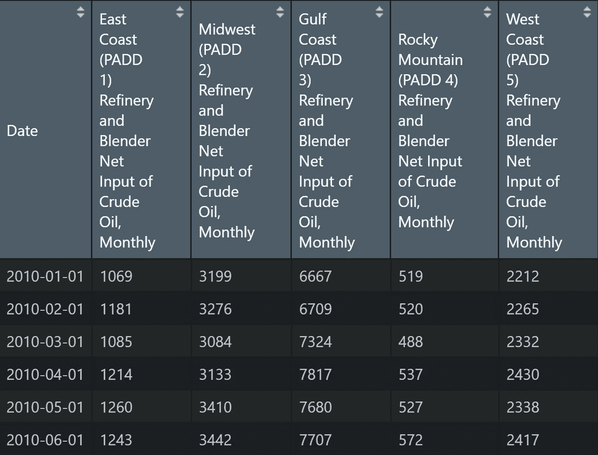

# 使用 R 从能源部的 EIA API 中提取能源数据

> 原文：<https://towardsdatascience.com/use-r-to-pull-energy-data-from-the-department-of-energys-eia-api-8c4512946a28?source=collection_archive---------31----------------------->


[马太·亨利](https://unsplash.com/@matthewhenry)上[下](https://unsplash.com/?utm_source=medium&utm_medium=referral)

注意:我写了一个 **Python** 版本的这篇文章， [**你可以在这里访问那篇文章。**](https://medium.com/analytics-vidhya/use-python-to-pull-energy-data-from-the-us-department-of-energys-api-11d6f724927e) 每篇文章的开头都一样。它将带您了解如何注册 EIA API 并获得 API 密钥。

能源信息署负责美国能源部的统计和数据。美国有大量与能源相关的数据和信息，包括可再生能源、核能、原油、汽油、喷气燃料、柴油、电力和天然气。

然而，在 EIA 的网站上导航和查找数据可能会很棘手。为了帮助解决这个问题，EIA 创建了一个易于访问的 API。你可以在[www.eia.com/opendata.](http://www.eia.com/opendata.)找到 API。根据不同类型的数据，EIA 每周、每月或每年发布新数据。该 API 对于在每周和每月数据发布时刷新它们非常有用。

# API 访问— API 密钥

首先，您需要从 EIA 获得一个 API 密钥。转到[www.eia.com/opendata](http://www.eia.com/opendata)并点击“立即注册”按钮。



[环评 API 门户](https://www.eia.gov/opendata/)截图

这将带你到一个注册表格，看起来像这样。输入您的信息，然后单击“注册”。您将收到一封包含新 API 密钥的电子邮件。它可能会被发送到您的垃圾文件夹，所以如果您在几分钟内没有收到 API 密钥，请务必检查那里。



[环评 API 门户](https://www.eia.gov/opendata/)截图

# 查找数据集

现在，您可以通过 API 搜索想要获取的数据集。您可以通过点击 [API 主页上的“API 查询浏览”来浏览数据集。](https://www.eia.gov/opendata/)



[环评 API 门户](https://www.eia.gov/opendata/)截图

在下一页，您可以点击“儿童类别”下的链接来搜索您需要的数据。



[EIA 的 API 查询浏览器截图](https://www.eia.gov/opendata/qb.php)

另一种搜索数据的方法是点击页面顶部的“来源和用途”并浏览网站。当您遇到想要的数据集时，EIA 通常会在 API 中发布一个指向该数据集的链接。

# 获取系列 ID

每个数据系列都有一个特定的系列 ID。您将使用这个系列 ID 和 API 键从数据库中提取数据集。例如，下图显示了 PADD 3(美国墨西哥湾沿岸)原油消费数据的系列 ID。该代码允许您一次获取多个系列。跟踪所有您想要使用的系列 id。



[环评 API 查询浏览器](https://www.eia.gov/opendata/qb.php)截图

**趣闻:** PADD 代表[石油管理局防区](https://en.wikipedia.org/wiki/Petroleum_Administration_for_Defense_Districts)。这些区域是在 1942 年第二次世界大战期间建立的，用来组织汽油和柴油等燃料的分配。今天，PADDs 仍然用于按地区组织数据。



[EIA 的 PADD 地图](https://www.eia.gov/petroleum/marketing/monthly/pdf/paddmap.pdf)

# 使用 R 拉入数据

现在我们有了 API 键和系列 id，我们可以编写 R 代码来访问数据。首先，导入必要的库。我们需要使用 httr 和 jsonlite 库。

```
#Import libraries
install.packages(c("httr", "jsonlite"))library(httr)
library(jsonlite)
```

现在，将您的 API 密钥粘贴到代码中。然后粘贴您想要提取的系列 id。用逗号分隔您的系列 id。您还可以使用“startdate”和“enddate”变量选择想要提取的日期范围。

```
# API Key from EIA
key <- 'PASTE YOUR API KEY HERE'# Paste your Series IDs in the list, separated by commas
padd_key <- list('PET.MCRRIP12.M','PET.MCRRIP22.M',
                 'PET.MCRRIP32.M','PET.MCRRIP42.M',
                 'PET.MCRRIP52.M')# Choose the start and end dates
startdate <- "2010-01-01" #YYYY-MM-DD
enddate <- "2020-01-01" #YYYY-MM-DD
```

最后，调用 API 以 json 格式提取数据。您的 url 链接可能会根据您正在获取的数据集而变化。要检查所需的确切 url，请查看 API 查询浏览器中的“要使用的 API 调用”链接。



[环评 API 查询浏览器截图](https://www.eia.gov/opendata/qb.php)

API 调用使用链接是您需要用来拉入 API 的链接。它可能与下面提供的代码不同。如有必要，用适当的 API 调用替换“url”变量中的链接以使用 link。

代码将遍历您选择的每个 Series ID，提取 json 格式的数据，然后将其转换成 R 数据帧。现在，您拥有了一个 R 数据框，可以根据您的需要轻松操作、分析和可视化。

[查看我的 GitHub 下载代码。](https://github.com/shuzlee/EIA-API-R/blob/main/EIA%20API%20Connection.R)

```
j = 0
for (i in padd_key) {url <- paste('[http://api.eia.gov/series/api_key=',key,'&series_id=',i,sep=](http://api.eia.gov/series/?api_key=',key,'&series_id=',i,sep=)"") # Make the call to the EIA's API
  res <- GET(url)
  json_data <- fromJSON(rawToChar(res$content))
  data <- data.frame(json_data$series$data)
  data$Year <- substr(data$X1,1,4)
  data$Month <- substr(data$X1,5,6)
  data$Day <- 1# Create date format
  data$Date <- as.Date(paste(data$Year, data$Month, data$Day,    sep='')) # Rename the column to its given name from the EIA
  colnames(data)[2]  <- json_data$series$name # Drop the unnecessary date columns
  data <- data[-c(1,3,4,5)]

  if (j == 0){
    data_final <- data
  }
  else{
    data_final <- merge(data_final,data,by="Date")
  }

  j = j + 1
}# Splice the data between the start and end dates
data_final <- subset(data_final, Date >= startdate & Date <= enddate)
```

最终的数据框将如下图所示。



EIA API 拉取中的数据帧