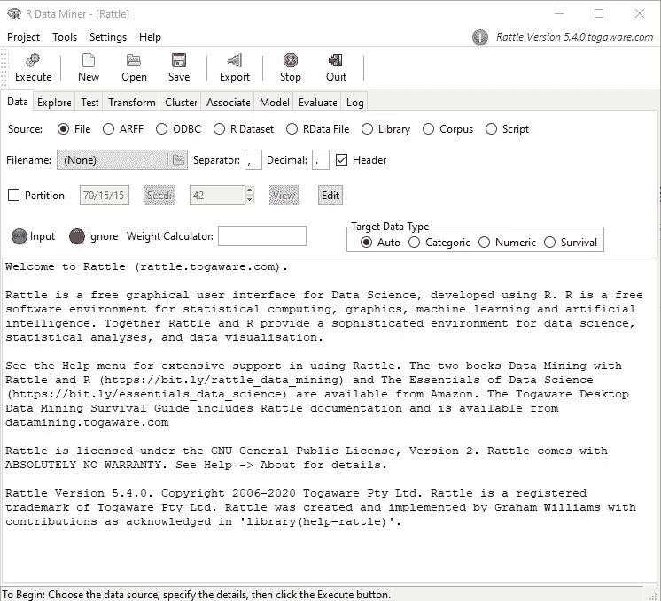
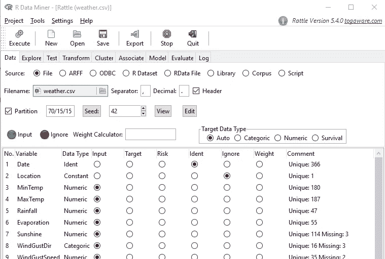
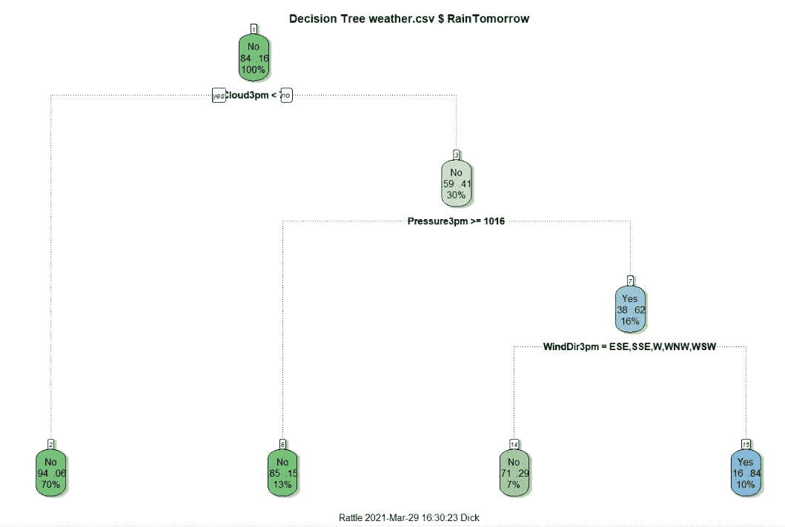
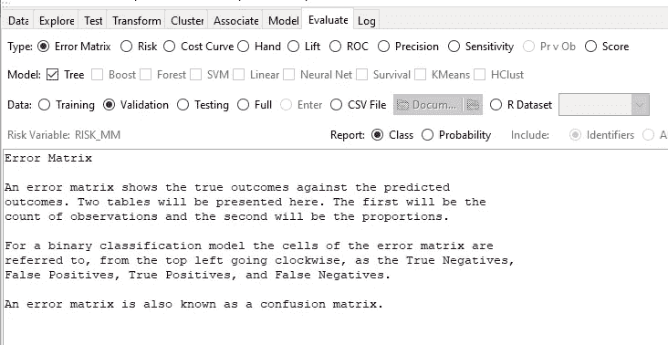
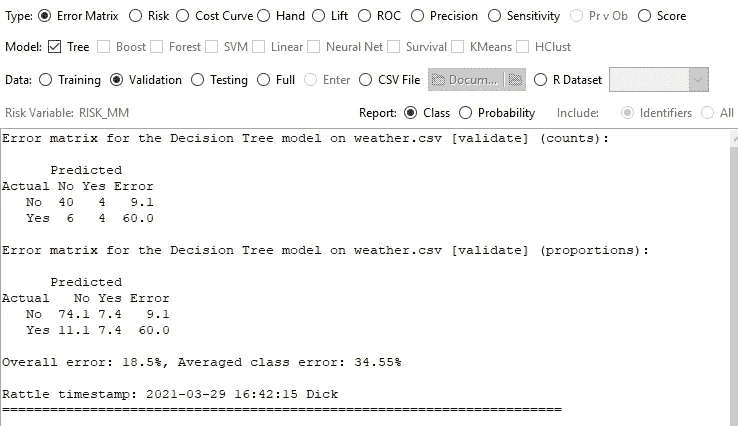
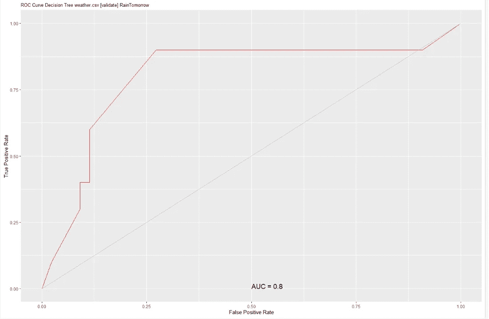

# 用拨浪鼓来帮助你学习 R

> 原文：<https://towardsdatascience.com/use-rattle-to-help-you-learn-r-d495c0cc517f?source=collection_archive---------17----------------------->

## 初学者指南

来自@ Giphy.com 的 thebossbaby

不，不是那种拨浪鼓——尽管有时你似乎需要一个。

“rattle”包为 R 功能提供了一个 GUI 界面——比 RStudio 提供的更多。下面是从 r 内部运行 rattle()时得到的结果。



作者的拨浪鼓截图

拨浪鼓对很多事情都有用。如果你想运行一个快速和肮脏的模型？太棒了。想看看你的数据是什么样的吗？这对那个也有好处。但是对于尝试学习 R 的 R 程序员新手来说，最有用的方面可能是“Log”选项卡。每次你告诉 Rattle 做某件事的时候，log 标签都会记录它用来做这件事的代码。有了这个特性，你可以使用 Rattle 在 R 中做一些事情，然后查看 Log 选项卡，看看它是如何做到的，这样你就可以学习做同样的事情。

## 装置

我假设此时您已经安装了 R——也许还有 RStudio。这个你不需要后者，但是不疼。要安装拨浪鼓，您需要拨浪鼓包。这将安装大多数依赖项。现在，您需要单独安装 RGtk2 软件包。然后加载库并运行 Rattle。

```
install.packages("rattle")
install.packages("RGtk2")
library(rattle)
rattle()
```

第一次运行 Rattle，它会问你要不要安装 GTK+(是的，再来一遍)。选择确定。当您尝试使用 Rattle 中的某些功能时，会出现类似的弹出窗口，告诉您需要安装相关的软件包才能继续。

(我听说有些人在 MAC 上使用 GTK+有问题。我用的是 PC，所以从来没出过问题，但是 YMMV。)

## 使用拨浪鼓

在你做任何事情之前，你需要载入一些数据。Rattle 带有几个内置的数据集。对于本文，我们将使用天气数据集。这是 Rattle 的默认数据集，如果你不告诉它加载其他东西，它就会加载这个数据集。要使用它，只需点击“执行”按钮(确保您仍在数据选项卡上)。Rattle 会注意到你没有指定数据集，所以它会问你是否要加载天气数据集。说“是”。

数据集的其他选项包括从文件加载、从 ODBC 数据库加载、从 R 加载您已经在处理的数据集(我最喜欢的选项)等。

顺便说一下，在 Rattle 中选择执行按钮是您需要习惯的事情。每次你做某件事时，你需要按下那个按钮来告诉 Rattle*实际上*去做。当你不这样做的时候，奇怪的事情就会发生。

加载数据集后，您将看到数据集中存在的变量的摘要，以及一些设置选项。这是天气数据集中变量的部分截图。



作者截图

请注意，对于每个变量，您将看到 Rattle 已经推断出数据类型、变量的用途(输入、目标等。)，以及变量的唯一值的数量和缺失值的数量的摘要。

数据类型字段经常错误地将类别变量归类为数字。这是因为许多数据集使用数字来表示类别。例如，一个收入变量可能有 10 个类别，等级为 1-10。如果您想将类型从数字更改为类别(或者进行其他更改)，您可以在 Transform 选项卡上完成。如果我有足够的兴趣，我会在另一篇文章中介绍。

目标变量的识别也可能是偶然的。浏览数据，确保所有东西都被正确分类。如果不是，请选择正确的单选按钮。如果您想同时更改一组变量，请选择它们(使用 ctrl-select 或 shift-select)，然后单击代表输入或忽略的红灯或绿灯。

除此之外，您可以决定是否要对数据进行分区(训练/验证/测试),并选择您想要使用的种子。我喜欢默认的 42。毕竟，它是对生命、宇宙和一切的终极问题的答案。(如果你不知道我在说什么，不要慌！去读读道格拉斯·亚当斯的《银河系漫游指南》。记住，永远带着你的毛巾。)

让我们继续对数据进行分区。使用默认的 70/15/15。然后单击执行。

在我们深入讨论日志选项卡之前，我应该指出格式可能有点复杂。Rattle 做的一些事情是为了 Rattle 自己的目的。我不知道它为什么会做一些事情。关键是看 Rattle 用的代码，试着理解它是做什么的，根据自己的目的修改它。R help()命令将是您的好朋友。

现在我们已经读入并准备好了数据集，让我们看看 Log 选项卡，看看 Rattle 为我们做了什么。往下跳一点，你会看到:

```
crv$seed <- 42
```

您将在整个日志中看到“crv$”和“crs$”。Rattle 创建一个环境变量，其中包含您将使用的所有单个变量。一般来说，如果你想复制代码，如果你把那部分去掉，就不会那么混乱。我会的，从现在开始。

有两个与种子相关的命令。第一个创建一个变量作为种子，而第二个(屏幕下方一点)实际上是*设置*种子。这样，如果您想要更改种子值，您只需要在一个地方修改代码。

```
seed <- 42
set.seed(seed)
```

在这两个命令之间，您将看到 Rattle 是如何加载数据集的。

```
fname <- system.file("csv", "weather.csv", package = "rattle")
dataset <- read.csv(fname, encoding = "UTF-8")
```

如您所见，代码对于我们的目的来说过于复杂。在 R 中加载嵌入的数据集时，使用 data()函数更容易:

```
data("weather")
```

这将创建名为“天气”的数据集。Rattle 方法是一个很好的内部过程，允许它使用变量名“dataset”来引用它正在处理的任何数据集。(这是和设置种子类似的概念，就在上面。)

接下来，我们可以看到 Rattle 用来对数据集进行分区的代码。

```
nobs <- nrow(dataset)
train <- sample(nobs, 0.7 * nobs) # the training set
nobs %>% 
    seq_len() %>%
    setdiff(train) %>%
    sample(0.15 * nobs) ->
  validate                        # the validation set
nobs %>%
    seq_len() %>%
    setdiff(train) %>%
    setdiff(validate) ->
  test                            # the testing set
```

同样，这有点不合常规。正常方法会将新变量放在第一位，如:

```
validate <- nobs %>%
    seq_len() %>%
    setdiff(train) %>%
    sample(0.15 * nobs)
```

顺便说一下，如果您还不理解这段代码，那么%>%是一个“管道”操作符(可以在 magrittr 和 dplyr 包中找到)，它使用管道前面的部分作为管道后面的函数的第一个参数。所以这相当于:

```
validate <- sample(setdiff(seq_len(nobs), train), 0.15* nobs)
```

使用管道可以使你的代码更容易阅读。R 中有很多括号需要正确放置。然而，这并不意味着是关于管道的教程。

这样做的目的是创建一个随机的数字列表，其中包含从 1 到 nobs (seq_len(nobs))的 15%的整数，而不包含已经是 train 的一部分的数字(setdiff)。然后，这可以用作数据帧的索引，如下所示:

```
weather[train,]
weather[validate,]
weather[test,]
```

“测试”索引是以同样的方式创建的，但是这一次，setdiff()使用了两次:一次用于删除训练索引，另一次用于删除验证索引。

此时日志文件的大部分内容实际上只供 Rattle 内部使用——定义输入变量和目标变量，以及数字变量和类别变量。

## 建模

让我们尝试一些建模。首先，我们要做一个决策树。转到模型选项卡，选择树，然后点击执行。Rattle 将创建一个具有标准参数集的决策树，根据数据集创建一组规则来预测明天是否会下雨。


Rattle 中的决策树模型(作者截图)

这里有很多信息，但是我将不得不在另一篇文章中讨论。决策树的关键部分就在中心上方。这些是决策树创建的规则。

1.  如果下午 3 点的云量小于 6.5，那么就不会下雨。
2.  否则，它仍然可能不会下雨，但检查气压。
3.  如果下午 3 点气压至少 1016 毫巴，就不会下雨。
4.  否则很可能会下雨，不过下午 3 点查一下风向
5.  如果风向是 ESE，SSE，W，WNW，或者 WSW，那么就不会下雨。
6.  否则，会下雨。

决策树的主要优点是它们创建的规则易于理解。

要查看这是如何编码的，我们可以转到 Log 选项卡并滚动到底部。这里我们看到下面的代码(为了清楚起见，我将决策树变量的名称从“rpart”改为“tree”):

```
library(rpart) # provides the code to create the decision treetree <- rpart(RainTomorrow ~ .,
    data = dataset[train, c(input, target)],
    method = "class",
    parms = list(split = "information"), 
    control = rpart.control(usesurrogate=0, maxsurrogate= 0),
    model = TRUE)print(tree)
printcp(tree) 
```

现在我们已经看到了代码，我们可以回到 R(或 RStudio)并找出所有这些参数的含义。

```
?rpart
```

您还可以使用 Rattle Model 选项卡上的参数来查看它如何影响代码。例如，在我为四个默认数字参数中的每一个选择了不同的值之后，Rattle 会生成以下代码:

```
tree <- rpart(RainTomorrow ~ .,
    data=dataset[train, c(input, target)],
    method="class",
    parms=list(split="information"),
      control=rpart.control(minsplit=15,
           minbucket=6,
           maxdepth=20,
           cp=0.001000,
        usesurrogate=0, 
        maxsurrogate=0),
    model=TRUE) 
```

我们还可以通过单击右边的两个按钮来获得决策树的规则以及树的图形表示。规则将显示在异响屏幕中(比之前显示的格式更好)。但是，Rattle 生成的所有图都将进入 RStudio Plots 窗口(如果使用 RStudio ),否则将进入 R 图形设备。

回到 Log 选项卡，我们可以找到用于创建绘图的代码。

```
fancyRpartPlot(tree, main = "Decision Tree weather.csv $ Raintomorrow")
```



Rattle 创建的决策树(作者截图)

现在我们知道了如何创建一个图形化的决策树，包括图形标题。底部的文本是 fancyRpartPlot 创建的默认副标题，但这也是可编辑的。查看 fancyRpartPlot()函数的文档以了解一些选项。请随意使用这些选项，看看它们能做些什么。

## 模型评估

最后，我们将评估我们刚刚创建的模型。转到评估选项卡:



Rattle 评估选项卡(作者截图)

首先，让我们为模型生成一个误差矩阵。已经选择了错误矩阵，所以点击执行。



天气决策树模型的误差矩阵(作者截图)

这个模型预测“无雨”相当准确，但“下雨”就不那么准确了。这并不奇怪，因为在这个模型中下雨是非常罕见的。如果我们更关心预测什么时候*下雨*而不是什么时候*不下雨*，那么我们可以调整模型上的损失矩阵参数，以有利于真正的正面而不是真正的负面。但那是以后的事了。

现在，回到 Log 选项卡，看看误差矩阵是如何创建的。

```
pr <- predict(tree, newdata = dataset[validate, c(input, target)],
    type = "class")# Generate error matrix with counts
rattle::errorMatrix(dataset[validate, c(input, target)$RainTomorrow, 
    pr, count = TRUE))# Generate error matrix with proportions
(per <- rattle::errorMatrix(dataset[validate, c(input,
      target)$RainTomorrow, pr))#Calculate and display errors
cat(100 - sum(diag(per), na.rm = TRUE)
cat(mean(per[,"Error"], na.rm = TRUE)
```

让我们画一个 ROC 曲线。在 Evaluate 选项卡上，选择 ROC 单选按钮，然后点击 Execute。同样，最终的情节不会显示在 Rattle 中，所以请返回 R 或 RStudio 查看。AUC(曲线下面积)值允许我们给模型分配一个“等级”。一个好的经验法则是使用 AUC 值，就像你在学校里用分数一样。超过 90%是 A，80–90%是 B，等等。



天气决策树的 ROC 曲线(作者截图)

并再次返回到 Log 选项卡，查看生成该图的代码。亲爱的读者，我将把这个留给你去解读。记住，help()命令是你的朋友。

```
# ROC Curve: requires the ROCR package.
library(ROCR)# ROC Curve: requires the ggplot2 package.
library(ggplot2, quietly=TRUE)# Generate an ROC Curve for the rpart model on weather.csv [validate].
pr <- predict(tree, newdata=dataset[validate, 
    c(input, target)])[,2]# Remove observations with missing target.
no.miss <- na.omit(dataset[validate, c(input, 
    target)]$RainTomorrow)
miss.list <- attr(no.miss, "na.action")
attributes(no.miss) <- NULLif (length(miss.list))
{
  pred <- prediction(pr[-miss.list], no.miss)
} else
{
  pred <- prediction(pr, no.miss)
}pe <- performance(pred, "tpr", "fpr")
au <- performance(pred, "auc")[@y](http://twitter.com/y).values[[1]]
pd <- data.frame(fpr=unlist(pe@x.values), tpr=unlist(pe@y.values))
p <- ggplot(pd, aes(x=fpr, y=tpr))
p <- p + geom_line(colour="red")
p <- p + xlab("False Positive Rate") + ylab("True Positive Rate")
p <- p + ggtitle("ROC Curve Decision Tree weather.csv [validate] 
    RainTomorrow")
p <- p + theme(plot.title=element_text(size=10))
p <- p + geom_line(data=data.frame(), aes(x=c(0,1), y=c(0,1)), 
    colour="grey")
p <- p + annotate("text", x=0.50, y=0.00, hjust=0, vjust=0, size=5,
                   label=paste("AUC =", round(au, 2)))
print(p)# Calculate the area under the curve for the plot.
# Remove observations with missing target.no.miss <- na.omit(dataset[validate, c(input,    
    target)]$RainTomorrow)
miss.list <- attr(no.miss, "na.action")
attributes(no.miss) <- NULLif (length(miss.list))
{
  pred <- prediction(pr[-miss.list], no.miss)
} else
{
  pred <- prediction(pr, no.miss)
}
performance(pred, "auc")
```

## 结论

正如我前面提到的，Rattle 日志中的许多代码更多地是为内部使用而设计的，而不是供用户复制供自己使用。因此，如果没有其他原因，您可能会希望修改代码以提高可读性。尽管如此，通过充分使用 R help，您应该能够使用 Rattle 的日志来帮助您编写自己的代码。

## 进一步阅读

**拨浪鼓**

[https://cran.r-project.org/web/packages/rattle/rattle.pdf](https://cran.r-project.org/web/packages/rattle/rattle.pdf)

  <https://www.amazon.com/gp/product/1441998896/ref=as_li_tl?ie=UTF8&camp=1789&creative=9325&creativeASIN=1441998896&linkCode=as2&tag=medium0074-20&linkId=a23f7684a456aed8c215fc0ca095ca83>  

(上面这本书的链接是附属链接。)

**管道**

[https://www . data camp . com/community/tutorials/pipe-r-tutorial](https://www.datacamp.com/community/tutorials/pipe-r-tutorial)