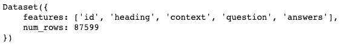
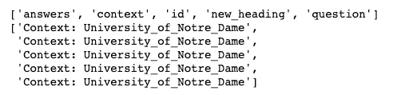

# 在你的下一个 NLP 项目中使用拥抱脸的数据集库

> 原文：<https://towardsdatascience.com/use-the-datasets-library-of-hugging-face-in-your-next-nlp-project-94e300cca850?source=collection_archive---------15----------------------->

## 拥抱脸的数据集库快速使用指南！


[马可](https://unsplash.com/@marcobian)在 [Unsplash](https://unsplash.com/photos/vzFTmxTl0DQ) 上的照片

数据科学就是关于数据的。网络上有各种来源可以为您的数据分析或机器学习项目获取数据。最受欢迎的来源之一是 Kaggle，我相信我们每个人在数据之旅中都用过它。

最近，我偶然发现了一个为我的 NLP 项目获取数据的新来源，我很乐意谈论它。这是拥抱脸的数据集库，一个快速高效的库，可以轻松地共享和加载数据集和评估指标。因此，如果你正在从事自然语言处理(NLP)工作，并且想为你的下一个项目获取数据，除了拥抱脸，别无他求。😍

**动机:** *拥抱脸提供的数据集格式与我们的熊猫数据框架不同，因此最初使用拥抱脸数据集可能会令人望而生畏。*😱拥抱脸有很好的文档，但是信息量太大了。我刚刚写了一些我们在处理数据集时的基本步骤。😄*本文绝非详尽无遗，如果您想对数据集做更多的事情，我强烈建议您查看他们的文档。*

让我们先了解一下 Hugging Face 和 datasets 库，然后举一个例子来了解如何使用这个库中的数据集。😎

[**抱紧脸**](https://huggingface.co/) 🤗是自然语言处理(NLP)技术的开源提供商。你可以使用拥抱脸最先进的模型(在变形金刚库下)来建立和训练你自己的模型。您可以使用拥抱脸数据集库来共享和加载数据集。您甚至可以使用这个库进行评估。

# 数据集库

根据[拥抱脸网站](https://huggingface.co/docs/datasets/)的说法，数据集库目前拥有超过 100 个公共数据集。😳这些数据集不仅有英语的，还有其他语言和方言的。👌它支持大多数数据集的一行数据加载器，这使得数据加载成为一项轻松的任务。🏄🏻根据网站上提供的信息，除了易于访问数据集之外，该图书馆还有以下有趣的特点:

*   在大型数据集上茁壮成长:数据集自然将用户从 RAM 限制中解放出来，所有数据集都使用高效的零序列化成本后端(Apache Arrow)进行内存映射。
*   智能缓存:永远不要等待你的数据处理几次。
*   轻量级和快速的透明和 pythonic API(多处理/缓存/内存映射)。
*   内置与 NumPy、pandas、PyTorch、Tensorflow 2 和 JAX 的互操作性。

哇！好处还挺多的。👏

在本文中，我将展示我们通常在数据科学或分析任务中所做的一些步骤，以理解我们的数据或将我们的数据转换成所需的格式。所以，让我们快速进入这个库，编写一些简单的 Python 代码。🐍请注意，本文只涉及数据集，不涉及指标。

**数据集版本:** 1.7.0

**使用 pip 安装**

```
!pip install datasets
```

**进口**

```
**from** datasets **import** list_datasets, load_dataset
**from** pprint **import** pprint
```

从数据集库中，我们可以导入 **list_datasets** 来查看该库中可用的数据集列表。 **pprint** 模块提供了“漂亮打印”的功能。你可以在这里了解这个模块[的更多信息。👈🏼](https://docs.python.org/3/library/pprint.html)

截至 2021 年 6 月 7 日，数据集库拥有 928 个数据集。🙌我们可以使用以下代码查看可用数据集的列表:

```
datasets = **list_datasets()**
**print**("Number of datasets in the Datasets library: ", **len**(datasets), "\n\n")#list of datasets in pretty-print format
**pprint**(datasets, **compact=True**)
```


数据集列表的片段

如果您想在下载数据集之前就知道它的属性，该怎么办？我们可以用一行代码做到这一点。☝️只需将索引设置为数据集的名称，就可以了！

```
#dataset attributes 
squad = **list_datasets**(**with_details=True**)[datasets.index('squad')]#calling the python dataclass **pprint**(squad.**__dict__**)
```


数据集属性

挺有意思的！😬

**加载数据集**

```
squad_dataset = **load_dataset**('squad')
```

引擎盖下发生了什么？🤔**datasets . load _ dataset()**执行了以下操作:

1.  从 Hugging Face GitHub repo 或 AWS bucket 下载并导入到库中的 SQuAD python 处理脚本(如果它尚未存储在库中)。
2.  运行小队脚本下载数据集。在缓存箭头表中处理和缓存小队。
3.  根据用户要求的拆分返回数据集。默认情况下，它返回整个数据集。

让我们来理解一下我们得到的数据集。

```
**print**(squad_dataset)
```


班数据集有两个部分——训练和验证。features 对象包含有关列的信息—列名和数据类型。我们还可以看到每次分割的行数(num_rows)。相当翔实！

我们还可以在加载数据集时指定拆分。

```
squad_train = **load_dataset**('squad', **split=**'train')
squad_valid = **load_dataset**('squad', **split=**'validation')
```

这将在 squad_train 中保存训练集，在 squad_valid 中保存验证集。

然而，您将意识到加载一些数据集会抛出一个错误，并且在检查错误时，您会意识到您需要第二个参数 config。

这里有一个例子:

```
amazon_us_reviews = **load_dataset**('amazon_us_reviews')
```

错误消息:


加载数据集时引发错误

一些数据集包括几个配置，这些配置定义了需要选择的数据集的子部分。

解决方案:

```
amazon_us_reviews = **load_dataset**('amazon_us_reviews', 'Watches_v1_00')
```

这将加载带有配置观察器的 amazon_us_reviews 数据集。

因此，如果加载任何数据集抛出一个错误，只需遵循追溯，因为拥抱脸已经给出了关于错误的好信息。👍

让我们继续我们的数据集。🏃🏻

我们看到了数据集信息中的行数。我们甚至可以使用标准的 **len** 函数来得到它。

```
**print**("Length of training set: ", **len**(squad_train))
```

训练集长度:87599

**检查数据集**

要查看数据集的示例:

```
**print**("First example from the dataset: \n")
**pprint**(squad_train[0])
```


小队训练数据集第一个例子

想用几个例子得到切片，代码和我们用熊猫数据框的一样。

```
**print**("Two examples from the dataset using slice operation: \n")
**pprint**(squad_train[14:16])
```


数据集中的示例切片

想要查看列中的值？用列名索引数据集。这是“问题”专栏的一个片段。

```
**print**("A column slice from the dataset: \n")
**pprint**(squad_train['question'][:5])
```


小队的纵队

您可以看到，行的切片给出了一个字典，而列的切片给出了一个列表。 **__getitem__** 方法根据查询的类型返回不同的格式。例如，像 dataset[0]这样的项将返回元素的字典，像 dataset[2:5]这样的片将返回元素列表的字典，而像 dataset['question']这样的列或列的片将返回元素列表。这看起来令人惊讶，但拥抱脸做到了这一点，因为它实际上更容易用于数据处理，而不是为每个视图返回相同的格式。

请看这个有趣的例子:

```
**print**(squad_train[‘question’][0])
**print**(squad_train[0][‘question’])
```

输出:

据说 1858 年圣母玛利亚在法国卢尔德向谁显现？据说 1858 年在法国卢尔德出现的圣母玛利亚是给谁看的？

两者都返回相同的输出。我们来验证一下！🕵

```
**print**(squad_train['question'][0] == squad_train[0]['question'])
```

输出将为**真**。不错！我们在使用熊猫数据框时犯的一个常见错误在这里并不算是错误。

**注:** *数据集由一个或几个 Apache 箭头表支持，这些表是键入的，允许快速检索和访问。您可以加载任意大小的数据集，而不必担心 RAM 限制，因为数据集不占用 RAM 中的空间，并且可以在需要时直接从驱动器中读取。*

让我们进一步检查数据集。

```
**print**("Features: ")
**pprint**(squad_train.features)**print**("Column names: ", squad_train.**column_names**)
```


数据集功能和列名

```
**print**("Number of rows: ", squad_train.**num_rows**)
**print**("Number of columns: ", squad_train.**num_columns**)
**print**("Shape: ", squad_train.**shape**)
```

输出:

行数:87599
列数:5
形状:(87599，5)

注意，您也可以使用 **len** 函数获得行数。

**添加/删除新列**

添加一个名为“new_column”的列，其中包含条目“foo”。

```
new_column = ["foo"] * **len**(squad_train)
squad_train = squad_train**.add_column**("new_column", new_column)
**print**(squad_train)
```


添加到数据集中的新列

现在让我们删除该列。

```
squad_train = squad_train.**remove_columns**("new_column")
```

**重命名列**

```
squad_train = squad_train.**rename_column**("title", "heading")
**print**(squad_train)
```



标题列重命名为标题

**修改/更新数据集**

要修改或更新数据集，我们可以使用 dataset.map. map()是一种受 tf.data.Dataset map 方法启发的强大方法。我们可以将该函数应用于一个示例，甚至一批示例，甚至生成新的行或列。

逐个示例地修改:

```
updated_squad_train = squad_train.**map**(**lambda** example: {'question': 'Question: ' + example['question']})
**pprint**(updated_squad_train['question'][:5])
```

输出:


使用映射将“问题”追加到列的每一行

让我们使用现有列添加一个新列，并删除旧列。

```
updated_squad_train = squad_train.**map**(**lambda** example: {'new_heading': "Context: " + example['heading']}, **remove_columns**=['heading'])
**pprint**(updated_squad_train.column_names)
**pprint**(updated_squad_train['new_heading'][:5])
```

输出:



使用“标题”列中的内容(和前缀)添加了“新标题”列，并从数据集中删除了“标题”列

您可以使用地图对数据集执行多项操作。一定要根据你的需求尝试新事物。🙃

除此之外，您还可以批量处理数据。

**展示熊猫数据框等示例**

我们总是喜欢将我们的数据集视为一个格式良好的表格，就像我们看到一个熊猫数据框一样。出于显示目的，我们可以将数据集转换为相同的格式。

```
**import** random
**import** pandas **as** pd
**from** IPython.display **import** display, HTML**def** display_random_examples(dataset=squad_train, num_examples=5):
    **assert** num_examples < len(dataset)

    random_picks = []
    **for** i **in** **range**(num_examples):
        random_pick = **random.randint**(0,**len**(dataset)-1)
        random_picks.**append**(random_pick)

    df = **pd.DataFrame**(dataset[random_picks])
    **display**(**HTML**(df.**to_html()**))

display_random_examples(squad_train, 3)
```

输出是一个格式良好的表格。👌


我们数据集的格式良好的表格

本文到此为止。从这里，您可以根据您的项目需求预处理您的数据，并构建您的模型或创建漂亮的可视化。不可能在一篇文章中涵盖所有内容。但是，通过阅读本文，您可以了解如何使用 datasets 库中可用的方法。如果你需要对数据集做更多的事情，请查看[文档](https://huggingface.co/docs/datasets/index.html)。还有很多很多方法，如排序，洗牌，分片，选择，过滤，连接数据集等。您还可以将数据集格式化为 PyTorch、Tensorflow、Numpy 和 Pandas。如果你想分享你自己的数据集，你也可以这样做。在这里阅读！

如果你想看代码，请参考这个[链接](https://github.com/chetnakhanna16/huggingface_datasets/blob/main/HuggingFace_Datatsets_Library_TDS.ipynb)到我的 Github repo。

**参考文献:**

1.  对于数据集:[https://huggingface.co/datasets](https://huggingface.co/datasets)
2.  对于数据集文档:[https://huggingface.co/docs/datasets/](https://huggingface.co/docs/datasets/)

感谢大家阅读这篇文章。请分享您宝贵的反馈或建议。快乐阅读！📗 🖌