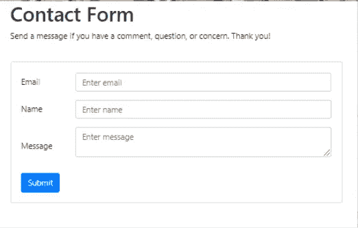

# 使用这些原则来设计出色的仪表板

> 原文：<https://towardsdatascience.com/use-these-principles-to-design-brilliant-dashboards-f3dc57a2743e?source=collection_archive---------13----------------------->

## 与 Dash 和 Plotly 一起使用的适用提示


法伊祖尔·拉赫曼在 [Unsplash](https://unsplash.com?utm_source=medium&utm_medium=referral) 上拍摄的照片

# 从事分析工作

作为一名从事数据科学的软件产品分析师，同时也是一名热爱数据的人，我经常创建仪表板来传达项目涉众感兴趣的关键性能指标和度量的信息。最近，在工作中，我一直在挖掘产品使用数据，并使用 Elasticsearch 和 Kibana 创建仪表板。那么，是什么使仪表板有效，为什么每个人都想使用它们？

# 为什么要构建仪表板？

仪表板最终是一种交流工具，并与技术交流领域的其他可交付成果共享许多设计原则。与基于快照的静态报告相比，仪表板通常会自动刷新，这使用户能够更轻松、更快速地获得一目了然的洞察力。一个设计良好的仪表板将让用户与它互动，并使用它进行数据驱动的决策。如果用户经常质疑仪表板上的度量和可视化背后的含义，本文中的原则将有助于缓解这种情况。

我最喜欢的免费仪表盘工具之一是 [Dash by Plotly](https://dash.plotly.com/) 。它允许您使用纯 Python 创建强大的仪表盘和 web 应用程序。除了这些原则之外，我还将介绍如何在使用 Dash 创建仪表板时应用这些原则。如果你对 Dash 完全陌生或者想学习它，可以在这里查看我的入门教程，或者我的网站[pythondashboards.com](http://pythondashboards.com)

[](https://levelup.gitconnected.com/how-to-create-powerful-web-apps-and-dashboards-using-dash-2-0-a05db174f20d) [## 如何使用 Dash 2.0 创建强大的 Web 应用和仪表盘

### 使用 Python 设计多页面 Web 应用程序

levelup.gitconnected.com](https://levelup.gitconnected.com/how-to-create-powerful-web-apps-and-dashboards-using-dash-2-0-a05db174f20d) 

# 仪表板设计原则

如果你遵循这些原则，用户不仅会使用你的仪表板，还会理解它并从中获得价值。

*   了解你的受众，为启示而设计
*   澄清模糊性，设计易访问性
*   美观大方，设计美观
*   验证用户接受度和长寿设计

# 了解你的受众

对于一个有效的仪表板，考虑谁将使用，他们需要知道什么。这可以称为仪表板的*启示*。总的来说，了解你的听众是技术交流 101。例如，侧重于商业智能和关键绩效指标(KPI)的仪表板，受众往往是管理层。然而，根据您的具体使用情况，仪表板可能适用于任何人，甚至是客户！无论他们是谁，在为您的仪表板整合需求时，都要让您的用户参与进来，以确保它与他们相关。

## 定义您的仪表板

让你的仪表板有一个清晰的焦点，确保定义它的目的。仪表板的用处取决于它上面显示的信息。如果你的仪表板包含太多的信息，用户通常会觉得难以承受而停止使用它。

## 原型布局

最后，确保仪表板的布局适合使用它的观众。例如，受众是否需要深入细节的数据表？或者他们需要显示宏观视图的简单图表？最终，您希望以一种向用户传达故事的方式来组织仪表板。这里有两个你应该知道的常见设计模式:


仪表板布局创意(图片由作者提供)

## 破折号提示

为了在 Dash 中设计响应性布局，我使用 Dash 引导组件库。**dash-Bootstrap-components**库允许您应用受引导 CSS 框架影响的引导前端组件。

```
pip install dash-bootstrap-componentsimport dash_bootstrap_components as dbc
```

利用行和列组件的响应式网格系统允许您轻松地组织仪表板布局。引导网格包含 12 列和 5 个响应层。

下面是一些示例代码，您可以将它们添加到 dash 布局中来测试网格系统。

```
body = html.Div([html.H1("Bootstrap Grid System Example")
, html.H4("no_gutters = False")
, dbc.Row([
    dbc.Col(html.Div(dbc.Alert("One of two columns")), width=3),
    dbc.Col(html.Div(dbc.Alert("One of two columns")), width=3),
    dbc.Col(html.Div(dbc.Alert("One of two columns")), width=3),
    dbc.Col(html.Div(dbc.Alert("One of two columns")), width=3)
])
, html.H4("no_gutters = True")
, dbc.Row([
    dbc.Col(html.Div(dbc.Alert("One of two columns")), width=3),
    dbc.Col(html.Div(dbc.Alert("One of two columns")), width=3),
    dbc.Col(html.Div(dbc.Alert("One of two columns")), width=3),
    dbc.Col(html.Div(dbc.Alert("One of two columns")), width=3)
], no_gutters = True)    
, html.H3("Examples of justify property")
, html.H4("start, center, end, between, around")
, dbc.Row([
    dbc.Col(html.Div(dbc.Alert("One of two columns")), width=4),
    dbc.Col(html.Div(dbc.Alert("One of two columns")), width=4),
],
justify="start")
, dbc.Row([
    dbc.Col(html.Div(dbc.Alert("One of two columns")), width=3),
    dbc.Col(html.Div(dbc.Alert("One of two columns")), width=3),
],
justify="center")
, dbc.Row([
    dbc.Col(html.Div(dbc.Alert("One of three columns")), width=3)
    , dbc.Col(html.Div(dbc.Alert("One of three columns")), width=3)
    , dbc.Col(html.Div(dbc.Alert("One of three columns")), width=3)
],
justify="end")
, dbc.Row([
    dbc.Col(html.Div(dbc.Alert("One of two columns")), width=3),
    dbc.Col(html.Div(dbc.Alert("One of two columns")), width=3)
    , dbc.Col(html.Div(dbc.Alert("One of three columns")), width=3)
],
justify="between")
, dbc.Row([
    dbc.Col(html.Div(dbc.Alert("One of two columns")), width=4),
    dbc.Col(html.Div(dbc.Alert("One of two columns")), width=4),
],
justify="around")
, html.H4("Container Example")
, dbc.Container([
    dbc.Row([
    dbc.Col(html.Div(dbc.Alert("One of two columns")), width=3),
    dbc.Col(html.Div(dbc.Alert("One of two columns")), width=3),
    dbc.Col(html.Div(dbc.Alert("One of two columns")), width=3),
    dbc.Col(html.Div(dbc.Alert("One of two columns")), width=3)
]), html.H4("no_gutters = True")
, dbc.Row([
    dbc.Col(html.Div(dbc.Alert("One of two columns")), width=3),
    dbc.Col(html.Div(dbc.Alert("One of two columns")), width=3),
    dbc.Col(html.Div(dbc.Alert("One of two columns")), width=3),
    dbc.Col(html.Div(dbc.Alert("One of two columns")), width=3)
], no_gutters = True)    
])
])
```

渲染时会是这个样子。请注意不同的选项如何影响组件在列和行中的行为。因为有 12 列，所以最大宽度是 12。


引导网格(图片由作者提供)

另外，我使用 **dbc。Card** 组件来包装我的仪表板部分，使它们看起来更好，并使最终用户更容易识别每个部分。查看我的完整教程，深入了解应用 Dash 引导组件。

# 澄清所有模糊之处

没有什么比打开仪表板，看到它充斥着复杂的术语和首字母缩写词，令人困惑的标题和不直观的颜色更糟糕的了。通过澄清模糊性，您可以让更多的用户访问仪表板。例如，公司或部门的新成员可能不知道所有用于度量和 KPI 的术语。永远不要假设用户会理解缩略语；拼出单词。作为沟通者，你有责任确保人们理解你输出的信息。

## 添加注释

在需要的地方添加注释。这里或那里的一些文本给用户一个关于统计数据的更深层次的解释会大有帮助。只要记住适当地利用空白，不要创建巨大的文本块。笔记应该简短而甜蜜。如果需要，链接到较长的文本，不要在仪表板中包含较长的文本。

## 使用清晰的标题

最后，确保你的可视化标题。我喜欢用问题的视觉答案来命名我的视觉化图像。例如，我可以将这种可视化称为“**所选单元与平均 BM 单元(尺寸 1-4)相比如何？**


[普罗特利的散点图](https://plotly.com/python/reference/scatterpolar/#scatterpolar)(图片由作者提供)

## 破折号提示

Dash 包含一个 ***Markdown*** 组件，允许您向仪表板添加 Markdown 部分。这非常适合添加简短注释或格式化文本，如项目符号列表。这是我的减价备忘单:

```
#use with dcc.Markdown component 
markdown = """ 
# This is the markdown example!
# Markdown H1
## Markdown H2
### Markdown H3Regular paragraph text:
Lorem ipsum dolor sit amet, consectetur adipiscing elit, sed do eiusmod tempor incididunt ut labore et dolore magna aliqua.** Double asterisk makes text bold **
*Single asterisk makes texts italics*create `inline code` with a back tick around the code
Create links like `[``links``]``([http://commonmark.org/help)`](http://commonmark.org/help)`) but remove the back ticksYou can make lists too!
* item 1
* item 2
* item 3
1\. item 1
2\. item 2
3\. item 3Follow this list for all the features [links]([http://commonmark.org/help](http://commonmark.org/help))""" # end markdown
```

[查看本教程，了解在 Dash](https://medium.com/swlh/how-to-start-a-business-in-an-afternoon-using-python-and-dash-adding-a-contact-form-and-blog-35aa48b673ba) 中使用降价组件的深入示例。

# 赏心悦目

为了让用户与你的仪表板互动，使用视觉元素是很重要的。注重仪表板的美观，使用直观的颜色和正确的视觉效果。做得好的话，你的用户会更容易使用仪表板并从中获得意义。

## 配色方案

使用直观的颜色可能意味着几件不同的事情。例如，通常以绿色显示积极的财务变化，以红色显示消极的财务变化，就像您在股票图表上看到的那样。


市场低迷的一天(图片由作者提供)

但除此之外，直观的颜色也意味着品牌和主题。如果仪表板面向客户，使用品牌颜色可能非常重要。确保您使用的颜色不会使数据更难理解。

## 图表选择

至于选择正确的可视化，有几个有用的流程图可以帮助你根据你想从数据中得到什么来决定使用哪种可视化。例如，如果您想要显示单个变量的分布，您可以选择一个[列或线形直方图](https://plotly.com/python/histograms/)。或者，如果您想要显示三个变量之间的关系，气泡图可能是最合适的。

## 破折号提示

使用 Dash Bootstrap 组件网格可以帮助您在整个仪表板中留出适当的*空白区域*。如果组件看起来靠得太近，使用 **html 在它们之间添加一个分隔符。Br()** 组件。

将 [Plotly](https://plotly.com/) 可视化添加到 Dash 应用程序超级容易，我推荐学习 [***Plotly Express 库***](https://plotly.com/python/plotly-express/) ，因为这是用 Dash 生成动态和交互式图表的最快方法。

```
pip install plotlyimport plotly.express as px
```

[Plotly Express 目前包括以下图表和更多内容](https://plotly.com/python/plotly-express/):

*   **基础知识** : `[scatter](https://plotly.com/python/line-and-scatter/)`、`[line](https://plotly.com/python/line-charts/)`、`[area](https://plotly.com/python/filled-area-plots/)`、`[bar](https://plotly.com/python/bar-charts/)`、`[funnel](https://plotly.com/python/funnel-charts/)`、`[timeline](https://plotly.com/python/gantt/)`
*   **三维** : `[scatter_3d](https://plotly.com/python/3d-scatter-plots/)`，`[line_3d](https://plotly.com/python/3d-line-plots/)`
*   **1D 分布** : `[histogram](https://plotly.com/python/histograms/)`、`[box](https://plotly.com/python/box-plots/)`、`[violin](https://plotly.com/python/violin/)`、`[strip](https://plotly.com/python/strip-charts/)`、`[ecdf](https://plotly.com/python/ecdf-charts/)`
*   **2D 分布** : `[density_heatmap](https://plotly.com/python/2D-Histogram/)`，`[density_contour](https://plotly.com/python/2d-histogram-contour/)`
*   **整体的一部分/层次** : `[pie](https://plotly.com/python/pie-charts/)`，`[sunburst](https://plotly.com/python/sunburst-charts/)`，`[treemap](https://plotly.com/python/treemaps/)`，`[icicle](https://plotly.com/python/icicle-charts/)`，`[funnel_area](https://plotly.com/python/funnel-charts/)`
*   **多维** : `[scatter_matrix](https://plotly.com/python/splom/)`，`[parallel_coordinates](https://plotly.com/python/parallel-coordinates-plot/)`，`[parallel_categories](https://plotly.com/python/parallel-categories-diagram/)`

# 验证用户接受度

最终的设计原则围绕着与用户合作。由于仪表板的目标是交流信息，用户经常会有关于如何改变或改进的问题或建议。如果用户知道他们的反馈被听到了，他们更有可能长期使用仪表板。当您向用户展示仪表板时，请务必询问他们对仪表板的反馈。


约翰·施诺布里奇在 [Unsplash](https://unsplash.com?utm_source=medium&utm_medium=referral) 上的照片

## 有计划

此外，与您的最终用户交流维护计划，如果可能的话，为他们提供直接向您或您的团队提交问题和反馈的方法。例如，在我的工作中，我们使用[吉拉软件](https://www.atlassian.com/software/jira)来管理开发项目。允许内部涉众查看即将到来的增强的进展也是很好的。

## 破折号提示

如果仪表板是外部的或面向客户的，则向其添加一个联系人表单，以便用户可以提交反馈。将这段代码添加到您的 Dash 应用程序布局中，开始使用 Dash Bootstrap 组件创建联系人表单。

```
**email_input** = dbc.FormGroup([dbc.Label("Email", html_for="example-email-row", width=2)
                   , dbc.Col(dbc.Input(type="email"
                               , id="example-email-row"
                               , placeholder="Enter email") #end input
                               , width=10) #end col
                        ], row=True)#end formgroup
**user_input** = dbc.FormGroup([dbc.Label("Name", html_for="example-name-row", width=2)
                   ,dbc.Col(dbc.Input(type="text"
                               , id="example-name-row"
                               , placeholder="Enter Name"
                               , maxLength = 80)#end input
                            , width=10) #end column
                    ],row=True)#end form group
**message** = dbc.FormGroup([dbc.Label("Message", html_for="example-message-row", width=2)
                   ,dbc.Col(dbc.Textarea(id = "example-message-row"
                                , className="mb-3"
                                , placeholder="Enter message"
                                , required = True)
                            , width=10)
                ], row=True)
```



联系人表单输出(图片由作者提供)

[查看本教程，深入了解如何在 Dash 应用程序中创建功能联系人表单](https://medium.com/swlh/how-to-start-a-business-in-an-afternoon-using-python-and-dash-adding-a-contact-form-and-blog-35aa48b673ba)。

# 关于仪表板的最终想法

永远记住，仪表板是一种沟通工具。为了使沟通有效，它必须清晰和引人入胜。遵循这些原则，你就有更好的机会创造出用户认为有价值的东西:

*   了解你的受众，为启示而设计。
*   澄清模糊性，设计易访问性。
*   赏心悦目，设计美观。
*   验证用户接受度和长寿设计。

# 谢谢大家！

*   *如果你喜欢这个，* [*关注我的 Medium*](https://medium.com/@erickleppen) *了解更多*
*   [*通过订阅*](https://erickleppen.medium.com/membership) 获得完全访问权限并帮助支持我的内容
*   *让我们连线上*[*LinkedIn*](https://www.linkedin.com/in/erickleppen01/)
*   *用 Python 分析数据？查看我的* [*网站*](https://pythondashboards.com/)

[**—埃里克·克莱本**](http://pythondashboards.com/)

[](https://erickleppen.medium.com/the-ultimate-guide-to-erics-articles-d32df8241353) [## 埃里克文章的终极指南

### 我的所有内容按主题组织…

erickleppen.medium.com](https://erickleppen.medium.com/the-ultimate-guide-to-erics-articles-d32df8241353)