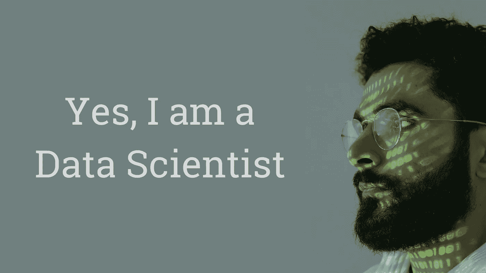
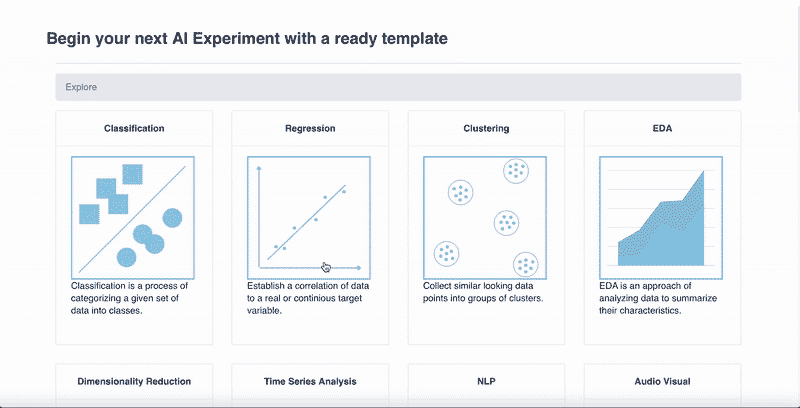

# 使用这些工具更快地学习数据科学

> 原文：<https://towardsdatascience.com/use-these-tools-to-learn-data-science-faster-8f3bb22371ba?source=collection_archive---------1----------------------->

## ***准备用 1000+ AI/ML 代码模板给专业数据科学家***

照片由 [**cottonbro**](https://www.pexels.com/@cottonbro?utm_content=attributionCopyText&utm_medium=referral&utm_source=pexels) 发自 [**Pexels**](https://www.pexels.com/photo/man-with-binary-code-projected-on-his-face-5474040/?utm_content=attributionCopyText&utm_medium=referral&utm_source=pexels)

> 我将从计算机科学专业毕业。我没有得到工作机会。我想在一个月内成为一名数据科学家。我不愿意花钱去上那些昂贵的课程。你能帮我吗？

这是成千上万即将毕业的学生表达的观点。他们在获取成为数据科学家的技能方面缺乏明确的方向。数据科学是一个非常热门的领域，它提供了丰厚的薪水，尤其是在家工作的能力。所以，以上的期望还是挺可以接受的。现在，需要有人引导他们成为数据科学家，这也是一个快速发展的过程。凭借数十年的学术和行业经验，我将提供一个快速的解决方案，帮助所有这些有志之士实现这些目标。

首先，让我们试着从商业人士的角度理解对数据科学家的需求，然后你就会明白什么是当今世界的数据科学。

# 需要一名数据科学家

对于一个商人来说，最大的抱负是如何发展我的生意？他们是这样说的:

> 过去，我有成千上万的客户。我已经收集了他们购买的大量数据。有人能帮助我了解他们的购买习惯、偏好、购买模式，从而为我提供他们下一步将购买什么的高级信息吗？然后，我将管理我的产品库存，并计划广告。

这就是数据科学家发挥作用的地方。现在，让我们试着理解数据科学家如何帮助商人满足他们的需求。

现在，让我们先试着了解一下一个数据科学家的工作要求是什么？

# 数据科学家的工作

数据科学家开发了一个机器学习模型，他根据历史数据进行训练，然后使用它来进行未来预测。听起来很简单，不是吗？是的，就是这么简单。在过去，许多人认为这是一项非常复杂的任务，需要大量的技能。告诉我；开车，需要学汽车工程吗？数据科学也是如此。你只需要了解一个机器学习模型是如何开发出来的。

# 机器学习模型是如何开发的？

整个机器学习模型开发过程是琐碎的。这些是模型开发的标准步骤。

*   数据清理
*   数据预处理
*   创建训练/验证数据集
*   算法选择
*   模特培训
*   模型检验
*   对未知数据的推断

不管您试图解决的是什么问题，上述步骤都是一样的——回归、分类、聚类。这些步骤也独立于学习类型——有监督的 v/s 无监督的。我说的是经典的 ML，它已经在过去几年里通过大量的案例研究证明了它的价值。还有其他进步，如神经网络、DNN、预训练模型，当然，还有强化学习。我改天再处理这些。让我们目前把重点放在传统的 ML 上，那里有大量的工作机会。

如果你看看这些步骤，你可以很容易地得出结论，最令人担忧的步骤是算法选择。其余的步骤看起来像标准程序，事实上也的确如此。为这些步骤编写的代码在您的所有模型中保持不变。如果有人给我一个模型开发的模板怎么办？事实上，有人已经投入了大量的资源来创建市场上数百种 ML 算法的模板，这些算法由顶尖的数据科学家验证和开发。我们只是要重复利用他们的工作。提供这些模板的公司是 BlobCity ( *我还在谷歌搜索其他类似的网站。*)

# 快速浏览 BlobCity 人工智能云

BlobCity AI Cloud 是一个开源项目，它为机器学习算法提供了 1000 多个现成的代码模板，这些算法被很好地分类成组。这些都是开源的，免费用于学习和商业用途。

[BlobCity AI Cloud](https://pix.blobcity.com/pgMuJMLv)

他们把所有这些算法分成不同的组。比如你想学习不同分类算法的工作原理，选择分类组。你会发现一堆算法，像 SVM，决策树，kNN，朴素贝叶斯，以及更多。不仅如此，你会发现每一种都有不同的版本。要使用模板，只需插入数据集，选择要素和目标，然后执行笔记本中的所有命令。它将在您的数据集上训练模型，并为您提供评估结果。就这么简单。

您可以试验一下数据预处理和模型参数，看看它们如何影响模型的预测准确性。您可以对您选择的其他算法重复此过程，并研究它们相对于其他算法在数据集上的执行情况。你还会发现一些 Cloudbooks，本质上是一个由 AI 社区在其网站上贡献的 Juypter 笔记本。

BlobCity 标记了分类、回归、聚类、EDA、降维、时序分析、自然语言处理、视听等几个组。最后一个是视听产品，可以帮助您在图像、视频和音频数据集上开发机器学习模型。我敢说这项工作非常详尽，他们试图涵盖这个星球上的大多数机器学习算法，同时考虑所有数据类型——二进制、文本、图像、音频和视频。

在我看来，BlobCity 通过提供精选的、经过技术审查的代码模板，让学习者可以非常容易地在一个地方学习数百种算法。专业的数据科学家根据他们的经验知道使用哪种算法，可以简单地在他们的数据集上应用所需的模板。

如果你感兴趣，他们在 Github 上接受开源贡献。

> 我没有见过任何其他网站为机器学习算法提供这种现成的 1000 多个代码模板(根据我的观察，还在增长——几天前是 600 个)。我将很高兴听到你们是否知道任何类似的网站。谢谢！

# 结束语

要快速学习数据科学家的技能，请关注市场上的数百种算法。研究它们在不同数据集上的表现。比较它们的输出。研究数据预处理如缩放、归一化、特征选择对其性能的影响。一旦你研究了不同算法的工作原理，考虑使用像 AutoML 这样的高级工具来发现性能最好的算法。请注意，您不必研究算法实现，scikit-learn 和其他几个库中提供的实现是由技术高超的开发人员完成的。不要想象你会比他们做得更好。简单地信任它们的实现并学习使用它们。像 BlobCity 这样的公司提供了几个围绕这些实现开发的代码模板，使您的工作更加容易。祝您快速学习数据科学！

# 信用

[**Pooja Gramopadhye**](https://medium.com/@poojagramo)—复制编辑