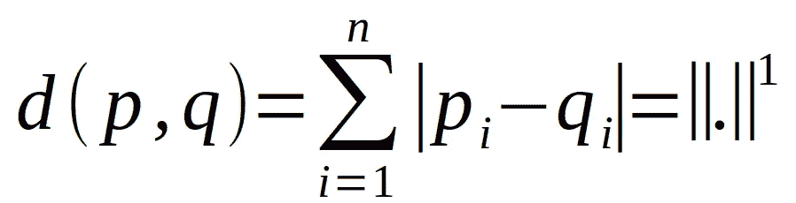
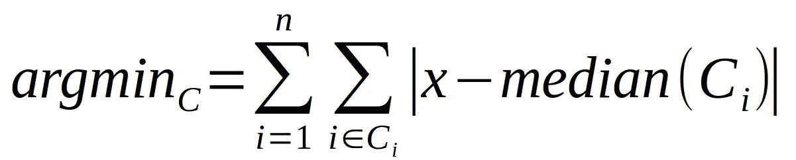
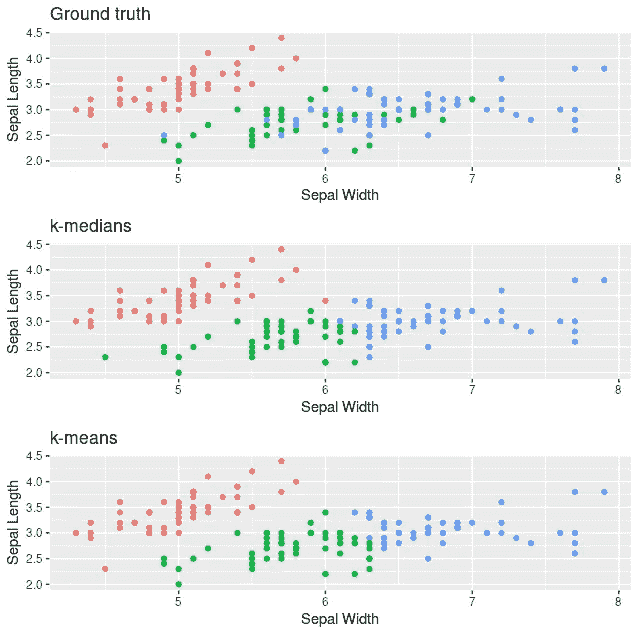
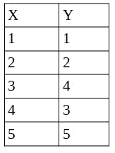

# 如果有许多异常值，请使用这种聚类方法

> 原文：<https://towardsdatascience.com/use-this-clustering-method-if-you-have-many-outliers-5c99b4cd380d?source=collection_archive---------12----------------------->

## 稳健结果的 k-中位数变化


照片由[法比奥](https://unsplash.com/@fabioha?utm_source=medium&utm_medium=referral)在 [Unsplash](https://unsplash.com?utm_source=medium&utm_medium=referral) 上拍摄

如果您曾经想要将数据分组，您可能已经尝试过著名的 k-means 算法。由于它非常简单，所以被广泛使用，但它的简单性也带来了一些缺点。其中之一是它对异常值的
敏感性，因为它使用经典的欧几里德距离作为相异度
度量。

不幸的是，现实世界中的数据集经常带有许多异常值，您可能无法在数据清理阶段将其完全删除。如果你遇到过这个问题，我想给你介绍一下 k-medians 算法。通过使用中值而不是平均值，并使用更健壮的相异度度量，它对异常值不太敏感。

在本文中，我将向您展示以下内容:

*   [k 线中线直觉](http://31f1)
*   [在 R 中从头实现](http://448b)

像往常一样，你也可以在我的 [GitHub](https://github.com/MSHelm/algorithms-from-scratch) 上找到这篇文章的所有代码。

# k-中位数直觉

k-medians 试图通过选择
不同的相异度度量来减轻 k-means 对异常值的敏感性。我们通常使用绝对差而不是欧几里德距离，这也称为 L1 范数或曼哈顿或出租车距离(因为您可以使用它来计算出租车到达矩形网格中的目标所需的转弯次数)。
这对异常值不太敏感，因为这些异常值只与
它们到中心的实际距离有关，而不是距离的平方，因为
是欧几里德距离的情况:



两点 p 和 q 之间的曼哈顿度量。对于每个维度，计算两点之间的绝对差值并求和。这也被称为 L1 规范。图片作者。

但是，如果更合适的话，我们也可以使用其他指标，例如 Kullback-Leibler 散度来比较分布。

为了更加可靠，我们还选择了中间值而不是中心的平均值。所以最后我们需要优化以下问题:



k-中位数优化问题的数学表述。尝试找到一组聚类 C，使每个点到其所属聚类中心 Ci 的绝对差最小。图片作者。

k-中值的方法与 k-均值非常相似，也是 Llodyd 的
算法。简单总结一下:

```
Input parameter k (number of clusters) and n_iter (number of iterations)
Randomly initialize k objects in the data set as centers
Do n_iter times:
  Assign each object to its closest center
   Calculate the new centers
```

你可以在我关于 k-means 的文章中找到关于劳埃德算法的更详细的解释:

</a-deep-dive-into-k-means-f9a1ef2490f8> [## 对 k-means 的深入探究

towardsdatascience.com](/a-deep-dive-into-k-means-f9a1ef2490f8) 

# 在 R 中从头开始实现

如果我们看看编程实现，我们会发现它不像 k-means 那样无处不在。例如在 R 中，stats 包中没有 k-medians
函数。所以让我们自己编码:

# 在虹膜数据集上进行测试

接下来，让我们看看我们的函数如何在公共虹膜数据集上执行。我们将
将它与基本的 R k-means 实现进行比较，看看它们可能有什么不同:



k-中间值与真实值和 k-均值的比较。两种聚类算法都倾向于找到正确的聚类，只需要观察最小的距离。

对于这个数据集，我们只观察到 k-中位数和 k-均值之间的微小差异，但它也不包含太多的离群值。

# 摘要

如你所见，它与 k-means 非常相似，我们只是使用了不同的
距离函数，并使用了中值。

关于 k-中位数的一个常见误解是，作为中心返回的中位数总是数据集中的实际点。很容易看出这不是真的。考虑以下由 5 个点组成的示例集群:



为什么聚类的中心不需要成为 k-中位数的实际数据点的示例。考虑由上述 5 个点组成的集群。因为中位数是在 k-中位数中为每个维度单独计算的，所以中位数将是 x = 3，y = 3。但是在数据集中不存在点(3，3)。

因为中位数是在 k-中位数中为每个维度单独计算的，所以中位数将是 x = 3，y = 3。但是在数据集中不存在点(3，3)。

最后，当然您可以将 k-medians 与改进的
初始化结合在一起，比如 kmeans++，使其更加健壮。你可以在我的文章中找到关于如何做的细节:

</try-this-simple-trick-to-improve-your-clustering-b2d5d502039b>  

下次见，届时我们将讨论 k-means 的最高级变体，围绕 medoids 进行划分，结束这个迷你系列。