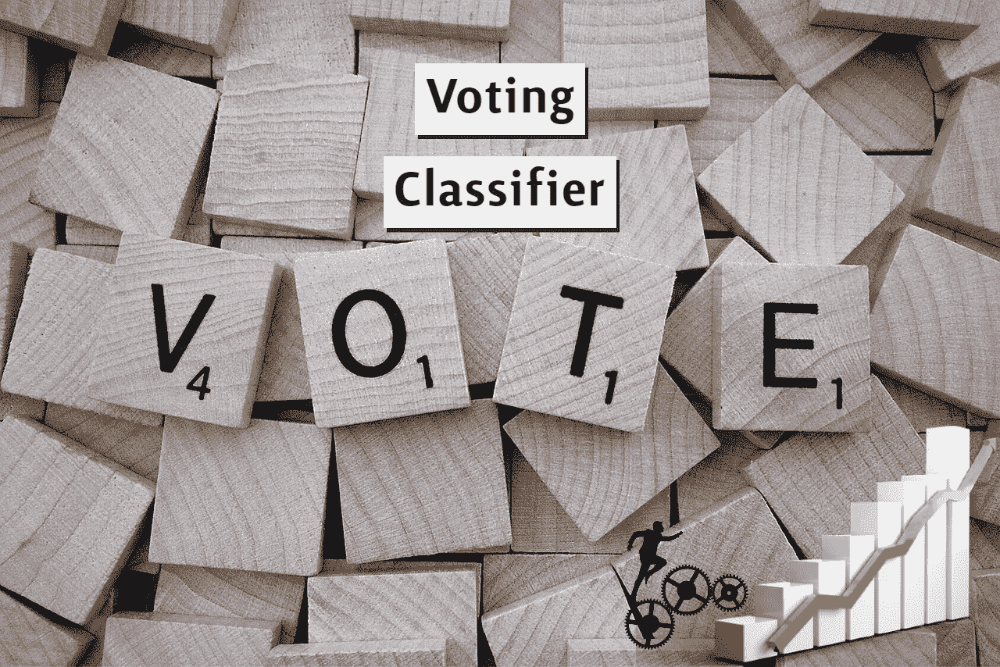
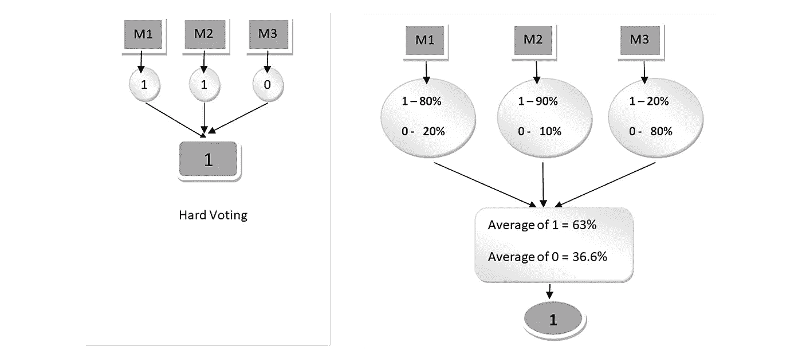
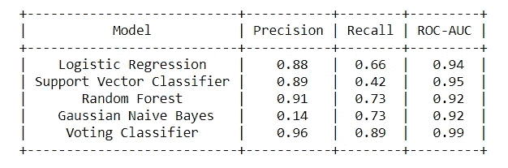

# 使用投票分类器来提高你的 ML 模型的性能

> 原文：<https://towardsdatascience.com/use-voting-classifier-to-improve-the-performance-of-your-ml-model-805345f9de0e?source=collection_archive---------6----------------------->

## 投票分类器集成基本指南

图片由 [Wokandapix](https://pixabay.com/users/wokandapix-614097/?utm_source=link-attribution&amp;utm_medium=referral&amp;utm_campaign=image&amp;utm_content=1804596) 来自 [Pixabay](https://pixabay.com/?utm_source=link-attribution&amp;utm_medium=referral&amp;utm_campaign=image&amp;utm_content=1804596)

你永远不知道你的模型是否有用，除非你评估机器学习模型的性能。数据科学家的目标是训练一个健壮且高性能的模型。有各种各样的技术或方法可以提高模型的性能，模型的集成就是其中之一。

集成是一种强大的技术，它通过组合各种基础模型来提高模型的性能，从而产生一个最优的、健壮的模型。[组装技术的种类包括](https://scikit-learn.org/stable/modules/ensemble.html):

*   *打包或引导汇总*
*   *助推*
*   *堆积分级机*
*   *投票分类器*

> 阅读我以前的一篇文章来更好地理解 bagging ensemble 技术:

 [## 使用 Bagging 提高机器学习模型的性能

### 了解 Bootstrap Aggregation (Bagging)集成学习的工作原理，并实现随机森林 Bagging 模型…

towardsdatascience.com](/improving-the-performance-of-machine-learning-model-using-bagging-534cf4a076a7) 

在本文中，我们将讨论投票分类器的实现，并进一步讨论如何使用它来提高模型的性能。

# 投票分类器:

投票分类器是一种机器学习估计器，它训练各种基本模型或估计器，并在汇总每个基本估计器的发现的基础上进行预测。聚集标准可以是针对每个估计器输出的投票的组合决策。投票标准可以有两种类型:

*   硬投票:投票是在预测的输出类上计算的。
*   软投票:投票是根据输出类的预测概率来计算的。

## 投票分类器如何提高性能？

投票分类器在硬投票或软投票的基础上聚集预测的类别或预测的概率。因此，如果我们向投票分类器提供各种基础模型，它可以确保通过任何模型来解决错误。

(图片由作者提供)，**左:**硬投票，**右:**软投票

## 实施:

Scikit-learn 包用几行 Python 代码实现了投票分类器。

对于我们的样本分类数据集，我们正在训练逻辑回归、随机森林、高斯朴素贝叶斯和支持向量分类器的 4 个基本估计器。

参数`voting=‘soft’`或`voting=‘hard’`使开发者能够在硬投票或软投票聚合器之间切换。参数`weight`可以根据用户进行调整，以掩盖一些性能良好的基本估计器。在对软投票进行平均之前，对硬投票的预测类别标签的出现或类别概率进行加权的权重序列。

我们使用软投票分类器和权重分布[1，2，1，1]，其中两倍的权重分配给随机森林模型。现在让我们观察每个基本估计器相对于投票分类器的基准性能。

(图片由作者提供)，基准性能

从上表可以看出，投票分类器比其基本估计器性能提高了性能。

# 结论:

投票分类器是一种机器学习算法，经常被 Kagglers 用来提高他们模型的性能和爬上等级阶梯。投票分类器也可以用于现实世界的数据集来提高性能，但它有一些限制。模型的可解释性降低，因为人们不能使用 [shap](https://github.com/slundberg/shap) 或 [lime](https://github.com/marcotcr/lime) 包来解释模型。

与其他模型不同，Scikit-learn 不提供计算投票分类器最高性能特征的实现，但我有一个计算相同特征的黑客。您可以通过基于权重组合每个估计值的重要性分数来计算要素的重要性。跟随[我的前一篇文章](/custom-implementation-of-feature-importance-for-your-voting-classifier-model-859b573ce0e0)来更好地理解这一点:

 [## 投票分类器模型的特征重要性的自定义实现

### 与其他模型不同，Scikit-learn 包缺少投票分类器的功能重要性实现

towardsdatascience.com](/custom-implementation-of-feature-importance-for-your-voting-classifier-model-859b573ce0e0) 

# 参考资料:

[1] Scikit-learn 文档:[https://sci kit-learn . org/stable/modules/generated/sk learn . ensemble . voting classifier . html](https://scikit-learn.org/stable/modules/generated/sklearn.ensemble.VotingClassifier.html)

*喜欢这篇文章吗？成为* [*中等会员*](https://satyam-kumar.medium.com/membership) *继续无限制学习。如果你使用下面的链接，我会收到你的一小部分会员费，不需要你额外付费。*

 [## 加入我的推荐链接-萨蒂扬库马尔媒体

### 作为一个媒体会员，你的会员费的一部分会给你阅读的作家，你可以完全接触到每一个故事…

satyam-kumar.medium.com](https://satyam-kumar.medium.com/membership) 

> 感谢您的阅读