# 使用纽约市自行车共享出行数据的天气历史记录

> 原文：<https://towardsdatascience.com/use-weather-history-with-nyc-bike-share-trip-data-51fcb89297d?source=collection_archive---------43----------------------->

## 通过可视交叉网络服务了解花旗自行车使用情况和每日天气历史

由于外部事件，尤其是恶劣天气，自行车共享的使用情况可能会有所不同。通过获取天气数据来扩充 Citi Bike 提供的出行数据文件，我们可以更好地了解该系统的使用情况。

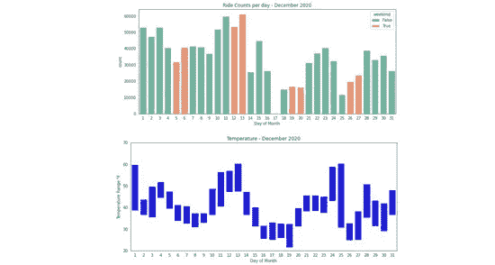

每日乘车和温度-2020 年 12 月-所有图片由作者提供

花旗自行车提供出行数据文件，以便任何感兴趣的人都可以分析该系统是如何使用的。[花旗自行车系统数据](https://www.citibikenyc.com/system-data)页面描述了所提供的信息。在我之前的文章[探索纽约自行车共享数据](/exploring-bike-share-data-3e3b2f28760c)中，我展示了如何通过首先准备数据来使这些数据变得更有用。

## 下载花旗自行车旅行数据

在我的上一篇文章中，我使用了 2020 年 3 月的数据，当时纽约因疫情而基本关闭。对于本文，我使用 2020 年 9 月的旅行数据文件。数据显示，该系统已经从 3 月份的急剧下降中恢复过来，9 月份是有史以来乘坐次数最多的一个月。

在命令提示符下创建一个`bikeshare`目录，下载行程数据文件，将其解压缩，然后删除 zip 文件。

```
mkdir bikeshare && cd bikeshare
wget [https://s3.amazonaws.com/tripdata/202009-citibike-tripdata.csv.zip](https://s3.amazonaws.com/tripdata/202003-citibike-tripdata.csv.zip)
unzip 202009-citibike-tripdata.csv.zip
rm 2020009-citibike-tripdata.csv.zip
```

## 导入库和数据

启动 Jupyter，从浏览器窗口在您的`bikeshare`目录中创建一个新的笔记本。本文中使用的带有 Python 代码的 Jupyter 笔记本在 GitHub 上的名称是 [weather.ipynb](https://github.com/ckran/bikeshare/blob/main/weather.ipynb) 。

首先导入常用的库:用于分析的 **Pandas** 和用于图表的 **Seaborn** 。此外，对于这个分析，import **Requests** 提供了一种从调用 RESTful web 服务的 HTTP 请求中获取结果的简单方法。关于这个库的详细信息，请参见 [Requests: HTTP for Humans](https://requests.readthedocs.io/en/master/) 。

```
import pandas as pd
from pandas import to_datetime
import seaborn as sns
import matplotlib.pyplot as plt
import requests 
```

首先将 Citi Bike trip 数据文件读入 Pandas 数据框，并使用`info()`方法获取数据类型和列名。

```
df = pd.read_csv('202009-citibike-tripdata.csv')
df.info()
```

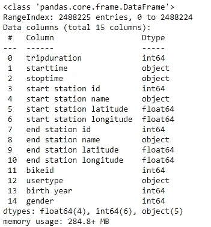

tripdata 的信息

这个范围告诉我们表中有多少行，因此九月份有多少次乘坐:将近 200 万次！

## 准备数据

作为初始数据准备步骤，将对象的`starttime`转换为日期时间值，然后提取`start hour`和`start day`列。另外创建一个布尔列`weekend`，即周末的`True`和工作日的`False`。更多解释见我之前的文章。

```
df['starttime'] = pd.to_datetime(df['starttime'])
df['start hour']=df['starttime'].dt.hour.astype('category')
df['start day']=df['starttime'].dt.day.astype('category')
df['weekday']=df['starttime'].dt.weekday.astype('category')
df['weekend'] = [ d >=5 for d in df['weekday']]
```

## 按小时乘车

从查看一天中乘车次数的分布开始。出于这个目的，我认为把工作日和周末放在一起很有说明性，所以我使用了支线剧情。

```
fig, ax = plt.subplots(1,2, figsize=(14,5))
sns.countplot(data=df[~df['weekend']],x="start hour",\
  ax=ax[0]).set_title("Weekdays")
sns.countplot(data=df[df['weekend']],x="start hour",\
  ax=ax[1]).set_title("Weekends") ;
```

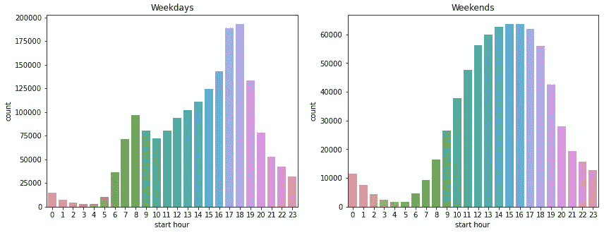

工作日和周末按小时计算乘车次数

这个月，我看到工作日乘车显示早晚高峰时间，而周末乘车显示更均匀的分布。请注意，两个图表中的比例不同。周末每小时的骑行从来没有达到工作日的高峰时间。

## 白天乘车

但是总体来说什么时候乘坐次数比较多呢？工作日还是周末？

我可以使用`countplot`来查看白天的游乐设施，使用`hue`来给条形着色以突出周末，并设置`dodge`以便有一个条形而不管其值。我还添加了更多描述性的轴标签和标题。

```
plt.figure(figsize=(12,5))
sns.set_palette("Set2")
sns.countplot(data=df,x="start day", hue='weekend', dodge=False  ) 
ax=sns.countplot(data=df,x="start day", hue='weekend', dodge=False ) 
ax.set(xlabel="Day of Month", ylabel="Ride Count",\
  title='September 2020') ;
```

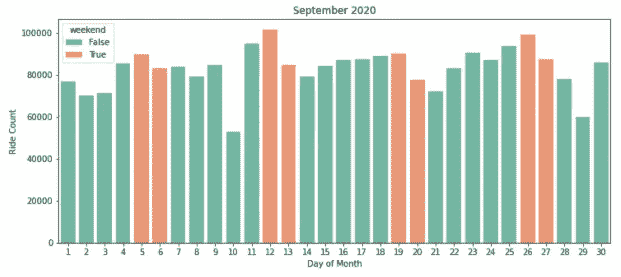

显示周末的 2020 年 9 月每天的乘车次数

我发现周末的乘车次数通常比临近的工作日要高一些。乘客量在 9 月 12 日达到顶峰，是该系统历史上最多的一次。

然而，我确实注意到乘车日计数中的一个异常现象:乘车人数在 9 月 10 日显著下降，在 29 日几乎下降了同样多。这是为什么呢？会不会是天气的原因？

# 天气

为了进一步探索这个问题，我需要一个气象数据源。我发现**到**的视觉交叉是众多此类来源中比较容易使用的一种。你可以在他们的[天气数据服务](https://www.visualcrossing.com/weather/weather-data-services#/login)登录页面注册一个免费的“永久”账户。这给了你每天 1，000 条结果记录的免费配额。对于今年 9 月的数据，我们只需要其中的 30 个。

从他们的网站上，你可以很容易地下载一个 CSV 文件，并把它读入熊猫的数据帧。如果你只打算使用一个月的数据，那就没问题了。然而，如果你想自动化这个过程，你需要使用 API。

1.  登录。如果提示“输入位置”,请使用 10001
2.  点击**天气 API** ，打开“时间线天气 API”页面
3.  单击日期或日期范围的单选按钮
4.  选择日期 2020 年 9 月 1 日至 2020 年 9 月 30 日
5.  点击单选按钮 **obs** 查看历史观察
6.  点击按钮**复制查询**将 URL 复制到您的剪贴板

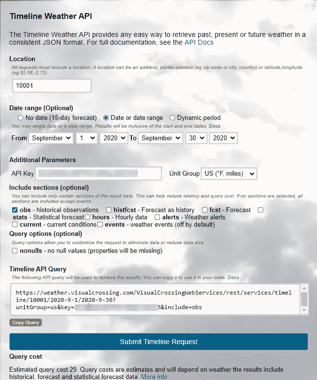

时间线天气 API 条目页面

然后将 URL 粘贴在引号中，如下所示。注意，它是用*您的* API 密钥生成的。您可以看到邮政编码和日期范围是如何包含在 URL 中的。

```
url='https://weather.visualcrossing.com/VisualCrossingWebServices/rest/services/timeline/10001/2020-9-1/2020-9-30?unitGroup=us&key=__YOUR_API_KEY_GOES_HERE_&include=obs'
```

然后用`requests`取回结果，检查状态码，应该是 200。

```
response=requests.get(url)
response.status_code
```

API 返回一个 JSON 文档，我可以使用`keys`方法获得元素列表:

```
response.json().keys()
```

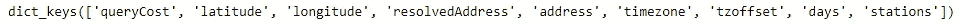

关键名称

我发现`days`包含一个字典列表，每个月的每一天都有一个字典，所以让我们看第一个。

```
response.json()['days'][0]
```

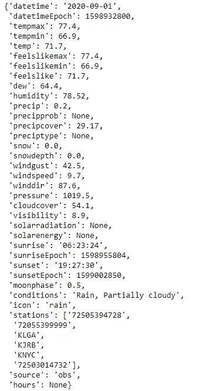

2020 年 9 月 1 日的天气数据字典

这看起来不错，所以我将把所有日期的列表转换成数据帧，并检查列名和数据类型。

```
dfweather=pd.DataFrame(response.json()['days'])
dfweather.info()
```

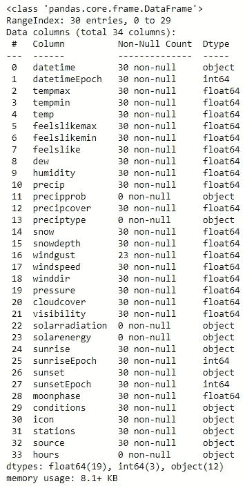

然后我看一下数据。这里有很多信息，所以为了便于阅读，我将选择我最感兴趣的列。

```
dfweather[['datetime','tempmax','tempmin','temp','humidity',\
'precip','snow','windgust','windspeed','visibility']].head(10)
```

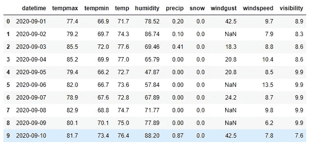

九月天气—精选栏目

我看到列`datetime`是一个对象(字符串),尽管它的名字是，但它只包含一个日期。我可以使用带有参数`format`的熊猫`to_datetime()`方法将其转换为实际的日期时间值，然后提取一个月中的某一天作为`day`。

```
dfweather['datetime'] = pd.to_datetime(dfweather['datetime'],\ format='%Y-%m-%d') 
dfweather['day'] = dfweather['datetime'].dt.day
```

## 沉淀

由于大多数骑自行车的人不喜欢在雨中骑车，这可以解释为什么在某些日子里骑自行车的人较少。我将使用 seaborn `barplot`来看看:

```
sns.set_style("whitegrid")
plt.figure(figsize=(12,5))
ax = sns.barplot(data=dfweather,y="precip", x='day', color="green" ) 
ax.set(xlabel="Day of Month", ylabel="Precipitation in inches"\
  title="Precipitation") ;
```

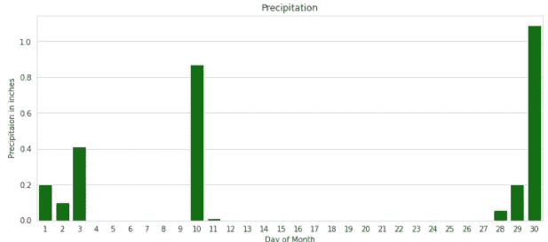

白天降水量

事实上，10 号那天下了将近一英寸的雨，这就解释了为什么。然而，降雨量并不能解释 29 日客流量的下降；雨直到第二天才下。

## 风

骑自行车的人不喜欢顶风骑车。这是一个因素吗？天气数据包括风速和阵风的值。我可以在 Seaborn `barplot`中显示这两者，用叠加图创建一个堆叠条形图，阵风高于风速。

```
plt.figure(figsize=(12,5))
sns.barplot (data=dfweather, y="windgust", x='day',\
  color="paleturquoise") 
overlay=sns.barplot(data=dfweather, x='day', y='windwpeed',\
  color = "darkturquoise")
overlay.set(ylabel="Wind Speed and Gusts MPH",\
  xlabel="Day of Month", title='September 2020 - Wind');
```

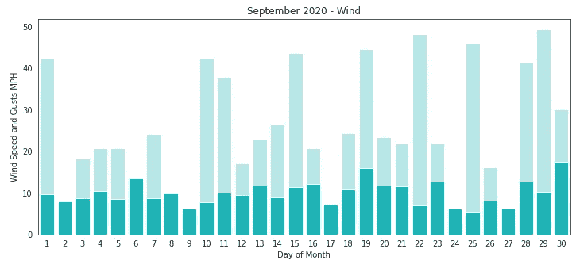

风速和阵风—2020 年 9 月

虽然这张图表显示 10 日和 29 日是大风天，但也有其他大风天。

## 温度

温度呢？我不认为一天的平均温度是一个有意义的指标，可以表明一天的骑行程度。更有意义的是看到一天中温度的*范围*。在下面的图表中，我把最低温度的条看不见了(因为条和背景都是白色的)。

最后，我设置了一个标题和轴标签(要获得度数符号，请按住 Alt 键并在数字键盘上键入 0176)。然后，我限制显示的温度范围，以获得我想要的视觉效果。

```
sns.set_style("white")
plt.figure(figsize=(12,5))# Main plot - Maximum Temperature 
sns.barplot(data=dfw, x='day',  y='tempmax' , color="coral" ) 
# overlay - Mininum Temperature - whiteout 
overlay = sns.barplot(data=dfw, x='day', y='Tempmin' , color = "white")overlay.set(ylabel="Temperature Range °F",\
  xlabel="Day of Month", title='Septemeber 2020 - Temperature');
overlay.set_ylim(40,90) ; # show temperature range 40° to 90°
```

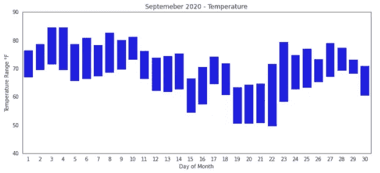

白天的温度范围

但是对于九月来说，气温似乎没有太大的影响。

# 十二月

十二月呢？为了查看更多月份的数据，我将上面的探索性代码转换成了函数。参见 GitHub 上的 [weather.ipynb](https://github.com/ckran/bikeshare/blob/main/weather.ipynb) 。

我下载了 12 月的旅行数据文件，运行了温度图表，并添加了一个积雪。

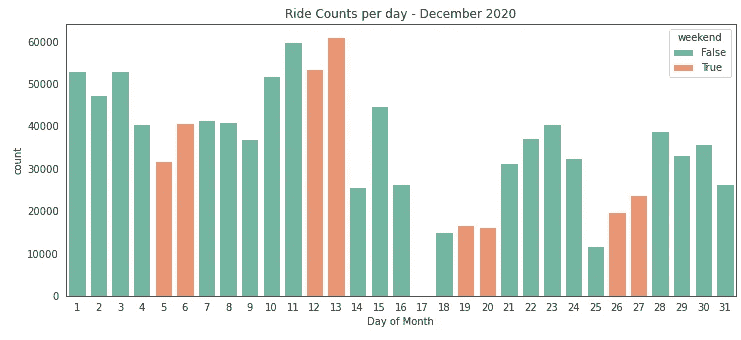

看起来系统在 12 月 17 日被关闭了。温度表显示那天气温在零度以下。

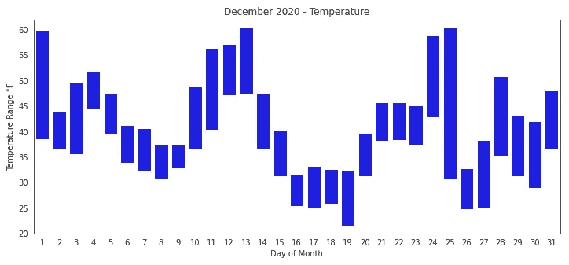

2020 年 12 月每天的温度范围

通过绘制降雪图，我们可以看出为什么:16 日下了 5 英寸的雪，17 日又下了 3 英寸。

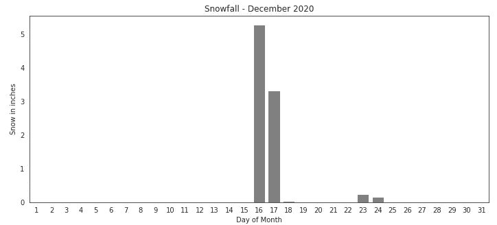

十二月的日间降雪量

# 结论

使用 **requests** 库可以轻松获得来自可视交叉网络服务的天气数据，并用于增强对花旗自行车出行数据的分析。

暴雨和暴风雪影响自行车共享使用并不奇怪，但用图表来看这种影响很有启发性。