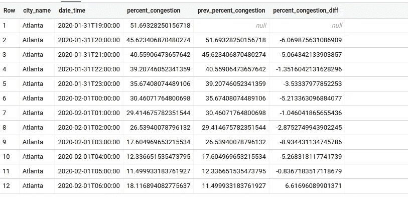

# 你应该学习的有用的大查询分析函数

> 原文：<https://towardsdatascience.com/useful-big-query-analytic-functions-that-you-should-learn-19270e866a37?source=collection_archive---------17----------------------->

## 熟悉它们，对你的数据探索和准备任务会有很大帮助。

艾萨克·史密斯在 [Unsplash](https://unsplash.com?utm_source=medium&utm_medium=referral) 上拍摄的照片

在本文中，我将提供 BigQuery 分析函数，我发现这些函数在日常数据探索和准备工作中非常有用。另外，我会分享在使用它们时可能出现的情况，这样你会有更好的理解。

我假设你在阅读这篇文章之前已经熟悉了 SQL 和 BigQuery。如果没有，下面是基于 BigQuery 文档的概述:

> BigQuery 是一个企业数据仓库，它通过使用 Google 基础设施的处理能力实现超快速的 SQL 查询来解决这个问题。

你可以在这里阅读更多:【https://cloud.google.com/bigquery/docs/introduction】T4

本职位面向(不限于):

1.  完全初学者，希望为您的数据科学之旅添加更多知识和武器。
2.  已经在使用 BigQuery，但想提高使用该工具的技能和效率。
3.  已经知道这个概念，但仍然不能掌握它在现实生活中如何工作的学生/新兵训练营成员。

享受…

# 什么是大查询分析函数？

基于大查询标准的 SQL [文档](https://cloud.google.com/bigquery/docs/reference/standard-sql/analytic-function-concepts):

> 分析函数计算一组行的值，并为每一个行的*返回一个结果。这不同于聚合函数，聚合函数为一组*行的*返回单个结果。*

简而言之，它不需要 **GROUP BY** 子句，并且它为每一行返回一个**单值**。分析函数的其他特征是，它们在子句上使用**，并增加了**窗口**的规格和范围。**

我不会在这里讨论细节，你可以在文档中仔细阅读。另一方面，通过使用我将在下一节中提供的示例，您可以看到这些子句是如何工作的。

# 示例和使用案例

请注意，我会过度简化用例，但我希望我仍然可以反映现实生活中的用例。

## 1.行号

[https://cloud . Google . com/big query/docs/reference/standard-SQL/numbering _ functions # row _ number](https://cloud.google.com/bigquery/docs/reference/standard-sql/numbering_functions#row_number)

**用例:**

> 您有一个包含从主应用程序数据库(MongoDB、MySQL 等)中提取的数据的表。提取每天在**的基础上运行**，并将当前值的**每日快照**存储在数据库中，唯一的标识符是**最后更新**字段，它指示最后摄取时间。
> 
> 您希望获得只包含每个 unique_id 的最新状态的数据，并将其包含在您的分析中。那么你会怎么做呢？

**示例数据:**

对于这个用例，让我们以 BigQuery 公共数据***FCC _ political _ ads***中的数据为例。

示例数据(图片由作者提供)

如您所见，对于每个唯一标识符，我们都有一些 *latest_status* 值。在我们的分析中，我们只对最近的感兴趣。

**解决方案:**

通过使用分析函数**行号**，我们可以根据它们的 *unique_id 给每一行一个基于新近度的排名。*

将 row_number 作为辅助对象的示例数据(图片由作者提供)

请注意，现在您有了这个新的标识符字段，您可以使用它来只过滤包含最近更新的行。

最终结果(图片由作者提供)

## 2.滞后和超前

[https://cloud . Google . com/big query/docs/reference/standard-SQL/navigation _ functions # lag](https://cloud.google.com/bigquery/docs/reference/standard-sql/navigation_functions#lag)

**用例:**

> 你有一个每日跟踪器，跟踪一定数量的事件。你要计算该数字与昨天的数字的**差。你会怎么做？**

**示例数据:**

示例数据(图片由作者提供)

**解决方案:**

首先，我们可以使用 **LAG** 函数来创建一个帮助字段*prev _ percent _ congestion*

使用滞后函数后的结果(图片由作者提供)

最后，我们可以用昨天的数字来计算今天的数字。

使用滞后函数后的最终结果(图片由作者提供)

请注意，每个 city_name 的第一个数据将具有空值，因为一开始就没有以前的数据。

你也可以使用一个类似的函数，即 **LEAD** 函数。它执行与**滞后**功能相反的操作，不是取前一个值，而是取下一个值。

## 3.首值和末值

[https://cloud . Google . com/big query/docs/reference/standard-SQL/navigation _ functions # last _ value](https://cloud.google.com/bigquery/docs/reference/standard-sql/navigation_functions#last_value)

**用例:**

> 我们将使用一个类似的用例，如上面的例子，关于城市中的拥堵，但现在让我们说**拥堵并不是每次都发生**(为了举例)。
> 
> 与前面的用例类似，我们想计算每个城市的当前拥堵与**上次记录的拥堵***之间的差异。*

**示例数据:**

对于这个用例，我们将使用与上一个例子相同的数据，但是我将删除一些值来反映我们的用例。

包含一些空值的返工数据(图片由作者提供)

**解决方案:**

使用最后一个值函数后的结果(图片由作者提供)

然后，我们可以像在第二个用例中一样执行简单的减法。如果您对获取第一个值感兴趣，您可以只使用**第一个值**函数。

# 结束语

您已经学习了 Bigquery 中的一些有用的分析函数，可以应用到您的特定用例中。让自己适应它们需要一些时间，但是一旦你有了足够的实践，你会发现自己在使用查询准备、探索和分析数据方面做得更有效率。

最后，快乐学习！！🚀