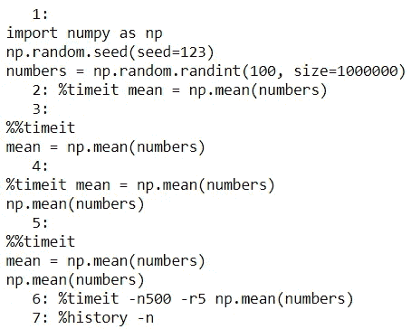

# 有用的 IPython 魔术命令

> 原文：<https://towardsdatascience.com/useful-ipython-magic-commands-245e6c024711?source=collection_archive---------12----------------------->

## 成为 Jupyter 笔记本超级用户

使用带有 IPython 内核的 Jupyter Notebook 时，IPython 神奇的命令就派上了用场。这些神奇的命令使得完成某些任务变得更加容易。您可以将它们视为 Python 语法之外的一组额外的有用语法。在本帖中，我们将熟悉一些你可以在 Jupyter 笔记本中使用的有用的魔法命令。


照片由[拉蒙·萨利内罗](https://unsplash.com/@donramxn?utm_source=medium&utm_medium=referral)在 [Unsplash](https://unsplash.com?utm_source=medium&utm_medium=referral) 上拍摄

# IPython 魔法命令💫

如果你不熟悉魔法命令，很可能你在不知不觉中使用了一些。这个语法:`%matplotlib inline`你看着眼熟吗？大概是吧？`%matplotlib`是一个 IPython 魔法命令。你看这个命令是如何以`%`开头的？这是魔法命令的一个共同特征:它们以`%`开始。有两种魔法命令:

*   线魔法命令(从`%`开始)
*   单元格魔术命令(从`%%`开始)

对于行魔术命令，在同一行中的命令之后提供输入。对于单元魔术命令，整个单元中的内容成为其输入。如果您不太确定我们这样说的意思，第 3 节中的一个例子将有望澄清。

现在我们对它们有了一点了解，是时候探索一些有用的魔法命令并熟悉它们的示例用法了！✨

## 📍 1.使用 [%load](https://ipython.readthedocs.io/en/stable/interactive/magics.html#magic-load) 导入代码

我们可以使用这个神奇的命令将代码从外部资源加载到 Jupyter Notebook 的一个单元格中。这里有一个有用的应用:

对于大多数数据科学项目，您可能会发现自己在不同的笔记本上一遍又一遍地导入同一套库。为了使这个过程更快，我们可以为 Jupyter 笔记本准备一个标准的设置脚本，并在每个笔记本的开头导入这个脚本，以减少重复输入。让我们看一个例子来说明这是什么意思。


假设我们正在位于*项目 1* 文件夹中的 *magic_commands.ipynb* 中工作，并且 *setup.py* 包含以下设置脚本:

```
# Contents in setup.py
# Data manipulation
import numpy as np
import pandas as pd
pd.options.display.max_columns=None
pd.options.display.float_format='{:.2f}'.format# Visualisation
import matplotlib.pyplot as plt
import seaborn as sns
sns.set(style='whitegrid', context='talk', palette='rainbow')
```

我们可以在不离开笔记本的情况下，使用以下一个命令行导入 setup.py 中的内容:

```
%load setup.py
```


按 Ctrl + Shift 运行单元格

从这个例子中我们可以看到，当我们运行这个命令时，它会插入来自 *setup.py* 的代码，并对自己进行注释。由于标准导入可以在大多数项目中使用，您可能更喜欢将脚本保存在桌面(父目录)中，并仅在需要时在项目文件夹中有一个项目特定的设置(例如，NLP 项目将需要一组额外的导入)。


如果我们想从同一个笔记本的父文件夹中加载 *setup.py* ，我们可以更新文件路径以反映这一变化:

```
%load ..\setup.py
```

虽然这个例子可能看起来微不足道，但这是一个可以开始实践的小变化，并且有望启发其他应用程序。

在我们进入下一个命令之前，值得一提的是，从*导入代码时。py* 文件是常用的，你也可以从其他文件如*导入内容。txt* 和*。md* 。此外，您还可以从 URL 导入代码，如下所示:

```
%load [https://gist.githubusercontent.com/zluvsand/74a6d88e401c4e3f76c2ae783a18689b/raw/5c9fd80a7bed839ba555bf4636e47572bd5c7e6d/pickle.py](https://gist.githubusercontent.com/zluvsand/74a6d88e401c4e3f76c2ae783a18689b/raw/5c9fd80a7bed839ba555bf4636e47572bd5c7e6d/pickle.py)
```

## 📍 2.用 [%%writefile](https://ipython.readthedocs.io/en/stable/interactive/magics.html#cellmagic-writefile) 保存代码

这个命令让我们执行与上一个命令相反的操作。我们可以使用这个神奇的命令将代码从 Jupyter Notebook 中的一个单元格保存到外部源代码中。如果我们想象自己仍然在 *magic_commands.ipynb* 中，这就是我们如何在不离开笔记本的情况下创建 *setup.py* 到桌面:

```
%%writefile ..\setup.py
# Data manipulation
import numpy as np
import pandas as pd
pd.options.display.max_columns=None
pd.options.display.float_format='{:.2f}'.format# Visualisation
import matplotlib.pyplot as plt
import seaborn as sns
sns.set(style='whitegrid', context='talk', palette='rainbow')
```

如果不存在，这将创建一个 *setup.py* 文件。否则，它将覆盖现有文件中的内容。

## 📍 3.带有 [%timeit 或%%timeit](https://ipython.readthedocs.io/en/stable/interactive/magics.html#cellmagic-writefile) 的时间代码

通常有多种方法来完成同一项任务。在选择这些选项时，一个重要的考虑因素是速度。或者有时您只想对代码计时以了解其性能。无论您的用例是什么，知道如何为代码计时都是很有用的。幸运的是，用`%[%]timeit`计时编码很容易。

首先，我们将准备一些虚拟数据:

```
import numpy as np
np.random.seed(seed=123)
numbers = np.random.randint(100, size=1000000)
```

让我们假设我们想要对这个代码进行计时:`mean = np.mean(numbers)`。我们可以用下面的一个 liner 来实现:

```
%timeit mean = np.mean(numbers)
```


输出显示了多次运行和循环中速度的平均值和标准偏差。与基于单次运行的计时相比，这是一种更为严格的计时方式。

现在让我们来理解一下`%timeit`和`%%timeit`的区别(下面的指导方针适用于大多数行和单元魔术命令):
◼ ️️To 使用`%timeit`，一个行魔术命令，你想要计时的代码应该由一个*单行*组成，并被写入跟在魔术命令后面的*同一行*。尽管这是一个很好的通用规则，但根据文档的调整，多行是可能的(详情见[文档](https://ipython.readthedocs.io/en/stable/interactive/magics.html#magic-timeit))。
◼使用`%%timeit`，一个单元魔术命令，你想要时间的代码可以由*任意数量的行*和写在*下一行*跟随魔术命令。

下面是使用`%%timeit`的前一段代码的等效代码:

```
%%timeit
mean = np.mean(numbers)
```


很可能您想要计时的代码将由多行组成，在这种情况下`%%timeit`将会派上用场。

这里有一个快速测验来测试你的理解能力。你认为下面两个细胞的输出有什么不同？继续之前，试着想想答案。💭

```
##### Cell A start #####
%timeit mean = np.mean(numbers)
np.mean(numbers)
##### Cell A end ########## Cell B start #####
%%timeit 
mean = np.mean(numbers)
np.mean(numbers)
##### Cell B start #####
```

答案来了。在单元格 A 中，首先我们计算第一行代码的时间:`mean = np.mean(numbers)`然后我们求出平均值，而在单元格 B 中，我们计算两行代码的时间:


你可以看到小区 B 的平均速度大约是小区 A 的两倍。这是有意义的，因为我们实际上是在单元格 b 中对相同的代码计时两次(一次有赋值，一次没有赋值)。

`%[%]timeit`根据执行代码所需的时间自动调整循环次数。这意味着运行时间越长，重复的次数就越少，反之亦然，所以不管代码有多复杂，它总是花费相同的时间。但是，您可以通过调整可选参数来控制运行和循环的次数。这里有一个例子:

```
%timeit -n500 -r5 np.mean(numbers)
```


这里，我们指定了 5 次运行和 500 次循环。

## 📍 4.使用[%历史记录](https://ipython.readthedocs.io/en/stable/interactive/magics.html#magic-history)、[%笔记本](https://ipython.readthedocs.io/en/stable/interactive/magics.html#magic-notebook)、[%回忆](https://ipython.readthedocs.io/en/stable/interactive/magics.html#magic-recall)检查会话历史记录

如果你试验了一堆东西，并且已经开始变得混乱，所以很难确切地记得你做了什么，这些命令组是非常有用的。我们可以用`%history`检查我们在当前会话中运行的命令的历史。值得注意的是，`%hist`可以用来代替`%history.`

假设我们在第 3 部分开始了一个新的会话。我们可以通过以下内容查看会话历史:

```
%history
```


这很好，但是很难看出一个命令在哪里结束，另一个命令在哪里开始。以下是如何检查每个命令的历史记录:

```
%history -n
```



这更容易处理。现在，让我们学习如何导出历史。如果我们想将历史记录写到与笔记本在同一个目录下的名为 *history.py* 的文件中，那么我们可以使用:

```
%history -f history.py
```

如果我们想将历史记录写入到一个名为 *history.ipynb* 的 Jupyter 笔记本中，该笔记本与当前笔记本在同一个目录中，那么我们使用`%notebook`:

```
%notebook history.ipynb
```

这将把每个命令插入到一个单独的单元格中。相当方便不是吗？

有时，我们可能想从历史中调用一段命令来调整它或重新运行它。在这种情况下，我们可以使用`%recall`。使用`%recall`时，我们需要从历史中为命令段传递相应的编号，如下例所示:

```
%recall 1-2
```


上面的代码将历史中的前两个命令插入到下一个单元格中。

## 📍 5.其他魔法命令

在这篇文章中，我们只讨论了一小部分命令。所以在这一节，我想提供一个简单的指南，告诉你如何自己探索更多的神奇命令。
◼️要查看所有可用的魔法命令，运行`%lsmagic`。
◼️要访问所有命令的文档，查看[文档页面](https://ipython.readthedocs.io/en/stable/interactive/magics.html)或运行`%magic`。
◼️要访问一个魔术命令的文档，你可以运行这个魔术命令后跟`?`。比如:`%load?`。

最后，尝试在您的 Jupyter 笔记本中运行以下一个程序:

```
%config MagicsManager
```


如果你得到相同的输出，即使我们没有在一个魔术命令的开头写`%`或`%%`，它仍然会被识别。例如，如果您尝试运行以下语法，您将看到与之前相同的输出:

```
config MagicsManager
```

虽然我认为这是一个方便的特性，但是编写前缀会使代码更具可读性，因为很容易通过前缀看出这是一个神奇的命令。

Voila❕，我们已经介绍了一些有用的魔法命令，你可以自己探索更多。✨曾经说过“学习而不做真的是不学习。知而不做真的是不知”，希望大家练习一下这些神奇的命令，巩固今天所学的知识。


照片由[帕特里克·亨德利](https://unsplash.com/@worldsbetweenlines?utm_source=medium&utm_medium=referral)在 [Unsplash](https://unsplash.com?utm_source=medium&utm_medium=referral) 上拍摄

*您想访问更多这样的内容吗？媒体会员可以无限制地访问媒体上的任何文章。如果您使用* [*我的推荐链接*](https://zluvsand.medium.com/membership) ，*成为会员，您的一部分会费将直接用于支持我。*

谢谢你看我的帖子。如果你感兴趣，这里有我的一些帖子的链接:
◼️ [数据科学的 Python 虚拟环境简介](/introduction-to-python-virtual-environment-for-data-science-3c216929f1a7)
◼️ [数据科学的 Git 简介](/introduction-to-git-for-data-science-ca5ffd1cebbe?source=your_stories_page-------------------------------------)
◼️ [用这些技巧组织你的 Jupyter 笔记本](/organise-your-jupyter-notebook-with-these-tips-d164d5dcd51f)
◼️[python 中的简单数据可视化，你会发现有用的](/simple-data-visualisations-in-python-that-you-will-find-useful-5e42c92df51e)
◼️ [关于在 Seaborn (Python)](/6-simple-tips-for-prettier-and-customised-plots-in-seaborn-python-22f02ecc2393)
中更漂亮和定制的情节的 6 个简单技巧

再见🏃💨