# 对数据科学有用的 pip 命令

> 原文：<https://towardsdatascience.com/useful-pip-commands-in-data-science-6632c7fd2d0a?source=collection_archive---------20----------------------->

## 看看 Python 中最常用的包管理系统


作者图片

[**塞巴斯蒂安·拉什卡**](https://sciprofiles.com/profile/741791) **等人**在 2020 年 2 月发表了一篇深入的文章，研究了 Python 在机器学习生态系统中的角色和重要性。题为[**Python 中的机器学习:数据科学、机器学习和人工智能的主要发展和技术趋势**](https://www.mdpi.com/2078-2489/11/4/193/htm) 的论文提出了一个有趣的观察，我想在这里引用一下:

> 历史上，广泛的不同编程语言和环境已被用于实现机器学习研究和应用程序开发。然而，随着通用 Python 语言在过去十年中在科学计算社区中的流行程度大幅增长，大多数最新的机器学习和深度学习库现在都是基于 Python 的。

Python 真正改变了数据科学的面貌，并成为当今数据科学中使用最多的库之一。这一点从创建和使用的 python 包的数量上也很明显。截至 2020 年 7 月，超过 [235，000 个 Python 包](https://en.wikipedia.org/wiki/Python_Package_Index#:~:text=Over%20235%2C000%20Python%20packages%20can,)%20or%20precompiled%20%22wheels.%22)可以通过 PyPI 访问。那么 PyPI 是什么呢？

[Python 包索引](https://pypi.org/) (PyPI)是 Python 编程语言的软件仓库。这个存储库包含了由不断增长的 Python 社区创建和共享的包。您可以使用 pip 从 Pypi 安装任何包，pip 是 Python 的[包安装程序](https://packaging.python.org/guides/tool-recommendations/)。每个 Python 程序员，不管是新的还是老的，都会多次使用`pip install <package name>`。但是，还有其他有用的 pip 命令，尤其是从数据科学的角度来看，可能非常有用。本文试图解释一些常用的 **pip** 命令及其常用选项。

# 入门指南

首先，我们将创建一个虚拟环境。这样，更容易显示各种 pip 命令的运行情况。让我们使用`venv`来创建这个新的虚拟环境，并将其命名为`**env.**`。python 的 [**venv**](https://docs.python.org/3/library/venv.html) 模块用于创建轻量级的“虚拟环境”

```
# Creating virtual environment in Mac/Linux
 python3 -m venv env# Creating virtual environment in Windows
py -m venv env
```

一旦创建了 env 环境，我们将激活它，然后就可以开始工作了。

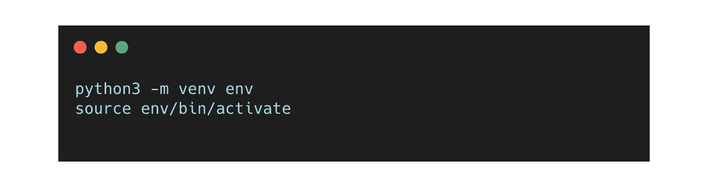

让我们从检查我们的环境中是否安装了 pip 开始。从技术上来说，如果你使用`Python 2 >=2.7.9`或`Python 3 >=3.4,` pip 应该已经安装。`pip --version`命令返回安装的 pip 的位置和版本。

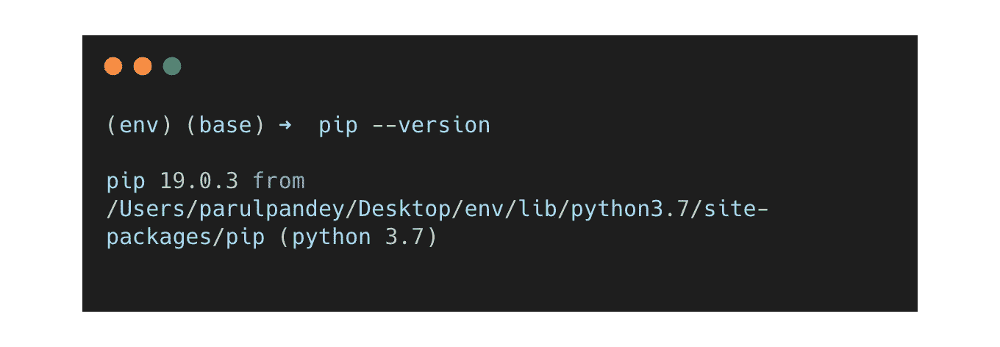

既然一切就绪，现在让我们一个接一个地看看几个重要的和最常用的 pip 命令。

# 1.pip 帮助

如果你在终端中输入`pip help`，你将得到一个单页可滚动的文档。

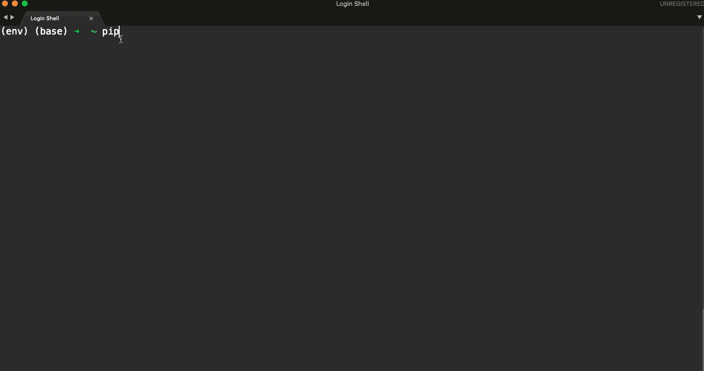

作者图片

它显示了可用于 pip 的各种命令，以及如何使用这些命令。此外，如果您希望查看有关单个 pip 命令的详细信息，您可以:

```
pip help <command_name>
example: pip help <install>
```

这将显示您感兴趣的单个命令的详细信息。

# 2.pip 列表

如果想要查看所有已安装的软件包，您可以执行`pip list`，它将输出环境中当前安装的所有软件包。

## 语法:

```
pip list
```

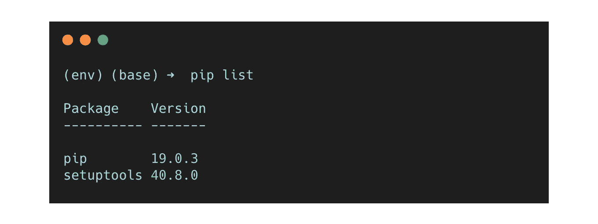

上面的输出显示，目前，我们只安装了两个包，其中，pip 本身属于一个过时的版本。

## 选择

`pip list`可与一系列选项一起使用，例如:

*   `--outdated/ -o`用于列出所有过期的包

```
pip list --outdated or 
pip list -o
```

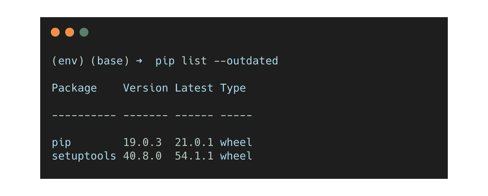

看起来两个安装的包都过时了。

*   -update/-u 用于列出所有最新的软件包

```
pip list --uptodate or 
pip list -u
```

*   `--format`选择在屏幕上显示已安装软件包的输出格式。可用选项包括-列(默认)、冻结或 JSON。

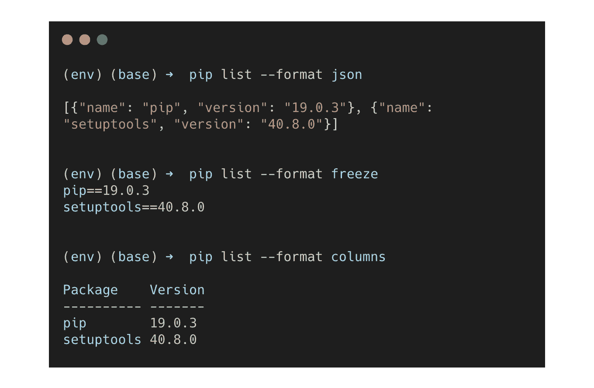

# 3.pip 安装

pip install 命令用于安装新的软件包。让我们在我们的虚拟环境中安装`pandas`，数据科学的面包和黄油包。

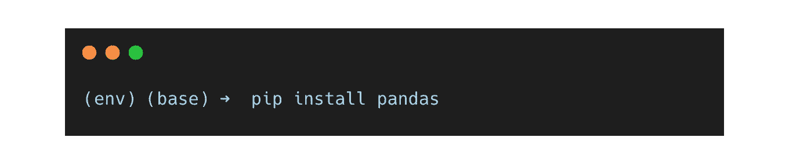

为了检查熊猫的包是否已经安装，我们可以做一个快速的`pip list`来查看所有已安装的包。

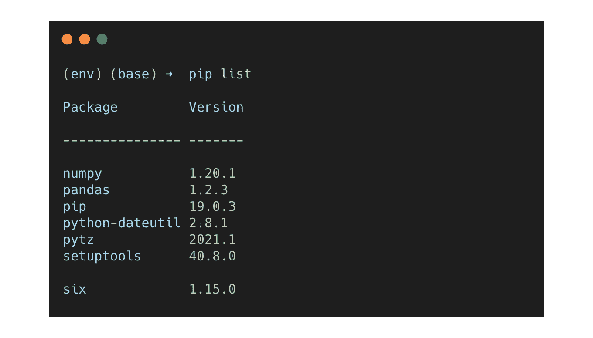

我们可以看到，`pandas`及其其他依赖项已经很好地安装在虚拟环境中。

## 选择

pip 安装也没有什么有用的选项。

*   `--upgrade/ -U`用于将所有指定的软件包升级到最新的可用版本。


*   `**--requirement** <file>/ -r`用于从给定的需求文件中安装。一个**需求文件**是一个项目所有依赖项的列表。这个文本文件包含所有必需的包，包括每个依赖项的特定版本。需求文件通常看起来是这样的:

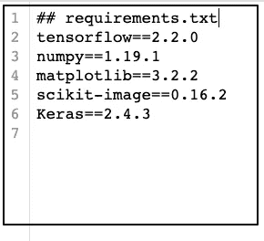

requiremnts.txt 文件的快照|按作者排序的图像

要安装 requirements.txt 文件中提到的所有包，您只需:

```
pip install -r requirements.txt
```

# 4.皮普秀

该命令显示关于已安装软件包的信息。人们可以选择在屏幕上显示的信息量。假设我们想知道关于`pandas`包的细节，我们知道这个包安装在我们的环境中。为了展示有限的细节，我们可以做`pip show`熊猫:

```
pip show pandas
```

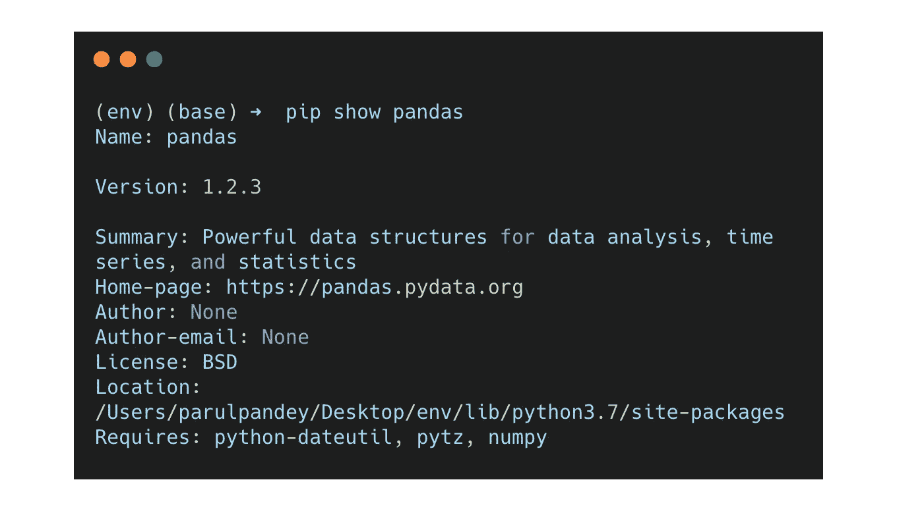

如果你想要完整的细节，你可以使用`pip show`命令的`verbose`选项，

```
pip show --verbose pandas
```

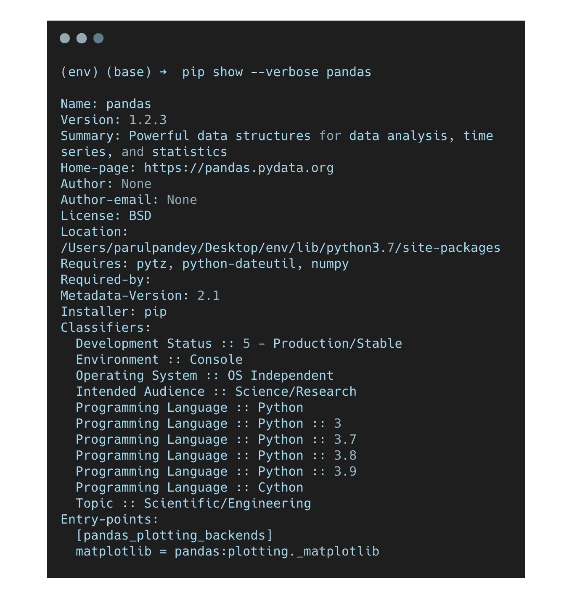

# 5.pip 卸载

顾名思义，`pip uninstall`会卸载想要的包。根据[文档](https://pip.pypa.io/en/stable/reference/pip_uninstall/)，很少有无法卸载的异常。它们是:

*   用`python setup.py install`安装的纯 distutils 包，以及
*   由`python setup.py develop`安装的脚本包装器。

我们现在将卸载最近安装的熊猫包。这个过程非常简单，如下所示:

```
pip uninstall pandas
```

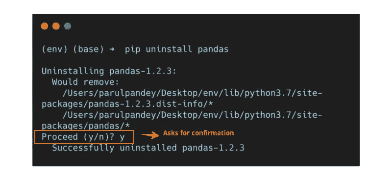

## 选择

pip 卸载有两个选项，即:

*   `--requirement <file>/ -r`用于从需求文件中卸载软件包。
*   `--yes / -y`。如果选择此选项，在卸载软件包时不会要求确认。

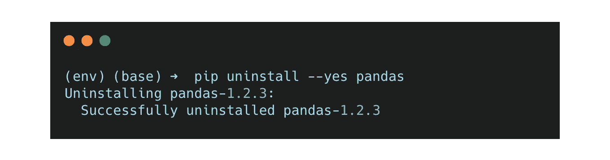

# 6.pip 冻结

在第 3 节中，我们提到了项目中对`requirements file`的需求。嗯，pip freeze 可以让你轻松地创建一个。它以需求格式输出所有已安装的包及其版本号。

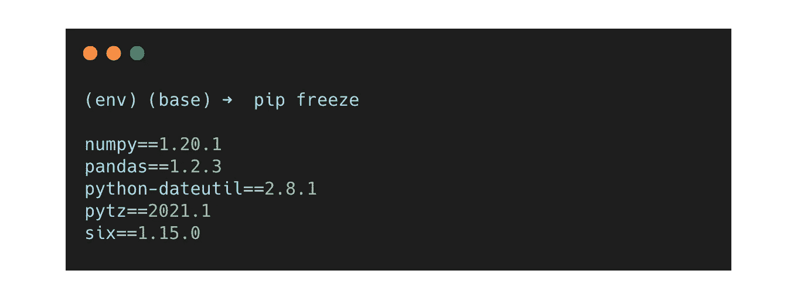

然后，freeze 命令的输出可以通过管道传输到需求文件中，如下所示:

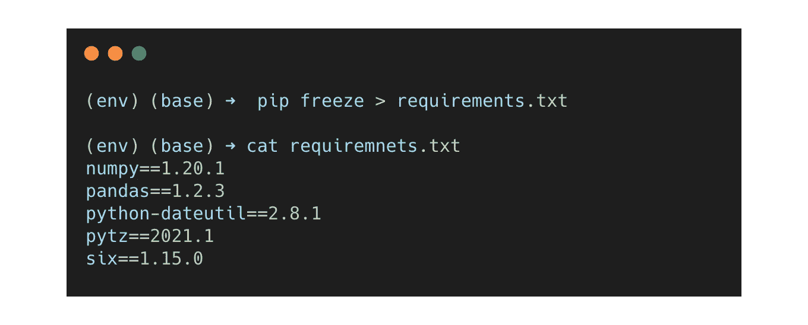

# 结论和额外资源

这些是 Python 中一些有用的 pip 命令，我在日常活动中使用它们。这可以作为了解 pip 的便利资源。还有其他一些命令没有在本文中介绍。如果你想更深入地了解细节，官方文档是一个极好的资源。